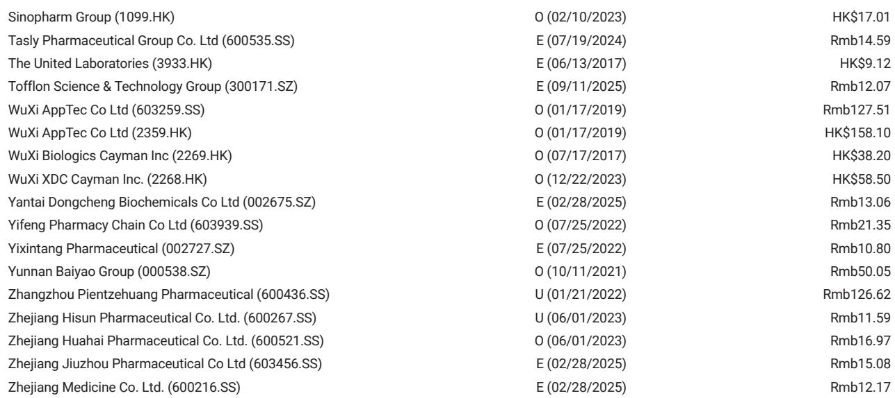
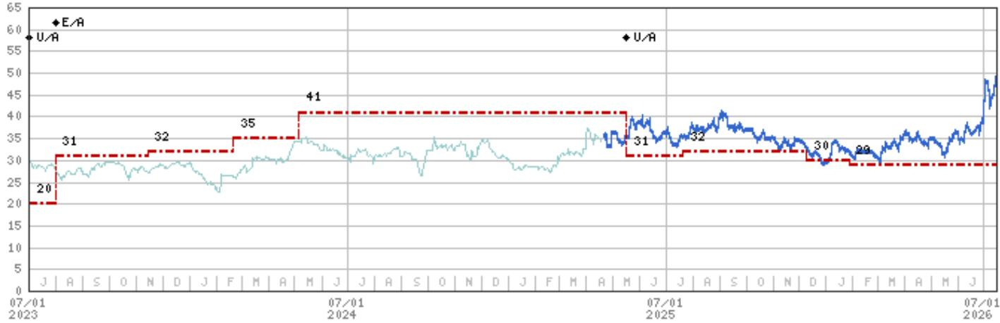
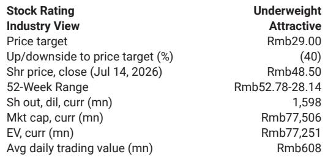

# sac-TMT’s Latest Phase 3 Win in PD-L1 Negative NSCLC Is Not Just Another Data Point — It Is the Pivotal Validation That Unlocks a $4-6 Billion Global Opportunity

The gap between consensus revenue expectations and the most rigorous risk-adjusted forecasts for sac-TMT now stands at roughly $1.8 billion. Visible Alpha consensus projects $5.9 billion in 2035 risk-adjusted sales for the asset, while a major global investment bank’s estimate sits at $4.1 billion, reflecting a 55% probability of success. That gap has persisted because the asset’s most critical unresolved question was whether it could demonstrate efficacy in the hardest-to-treat first-line non-small cell lung cancer population: patients with PD-L1 tumor proportion score below 1%. On July 15, 2026, that question received an answer. The OptiTROP-Lung06 Phase 3 study met its primary endpoint of progression-free survival at interim analysis, with a positive trend in overall survival, in the very population that represents both the highest unmet need and the largest commercial prize in frontline NSCLC.

This is not merely another clinical success for Kelun-Biotech and its partner Merck. It is the moment that transforms sac-TMT from a promising but unproven asset into a therapy with a differentiated global label potential. The trial’s design — sac-TMT combined with Keytruda versus chemotherapy plus Keytruda in PD-L1 TPS < 1% nonsquamous NSCLC — directly addresses the population that derives the least benefit from checkpoint inhibitor monotherapy. In doing so, it creates a clear commercial and clinical wedge that no competitor has yet sealed. The data will be presented at ESMO 2026, but the strategic implications are already crystallizing for investors, partnering executives, and oncology strategy teams.

The timing matters as much as the result. With Merck already running 17 global Phase 3 trials for sac-TMT, the asset is being positioned for a broad, multi-indication launch. The OptiTROP-Lung06 win provides the strongest signal yet that sac-TMT can succeed where other antibody-drug conjugates have struggled: in combination with immunotherapy as a first-line standard-of-care backbone. For any stakeholder evaluating the asset’s true addressable market, this single trial outcome changes the base case.

## The PD-L1 Negative Population Is the Strategic Prize That Differentiates sac-TMT from the ADC Field

The NSCLC market is not monolithic, and the most valuable segment is the one where existing therapies have the largest efficacy gap. Approximately 25-30% of NSCLC patients have PD-L1 TPS < 1%, a group that derives minimal benefit from PD-1/PD-L1 monotherapy. The current standard of care for these patients is chemotherapy combined with a checkpoint inhibitor — a regimen that improves outcomes over chemotherapy alone but still leaves substantial room for innovation. sac-TMT, as a TROP2-directed ADC with a topoisomerase I inhibitor payload, has a mechanism that is complementary to pembrolizumab: it induces immunogenic cell death, potentially converting a cold tumor microenvironment into a hot one.

The OptiTROP-Lung05 trial had already shown that sac-TMT plus Keytruda improved PFS in PD-L1 TPS ≥ 1% patients. That was a necessary proof point, but it was not sufficient to claim differentiation. The ≥ 1% population already derives significant benefit from Keytruda alone, so the incremental value of adding an ADC, while real, is harder to isolate. The < 1% population is where the combination effect can be most clearly observed and most commercially leveraged. By meeting its primary endpoint in this harder-to-treat group, sac-TMT has demonstrated that its mechanism works precisely where the current standard is weakest.

The commercial implication is direct. In China alone, the company plans to discuss a BLA filing with the NMPA soon. In the United States, Merck may pursue a BLA filing using a National Priority Voucher for the first indication of second-line-plus endometrial cancer, which would unlock registration milestones and sales royalties to Kelun. But the lung cancer indication is the volume driver. A label that includes PD-L1 negative NSCLC would give sac-TMT a significantly broader addressable population than any ADC currently approved or in late-stage development for lung cancer. This is not a marginal improvement; it is a market structure shift for the asset’s peak revenue potential.

## The Interim Analysis Design and OS Trend Create a Regulatory and Commercial Acceleration Pathway

The OptiTROP-Lung06 trial met its primary endpoint of PFS as assessed by blinded independent central review at interim analysis. That is not just a statistical win — it is a design choice that signals confidence in the magnitude of effect. Interim analyses are typically triggered when the data monitoring committee observes a prespecified boundary of efficacy. The fact that the study crossed that boundary early, with a positive trend in overall survival already observed, suggests the hazard ratio is clinically meaningful. While full data remain under embargo until ESMO 2026, the interim result is sufficient to support regulatory discussions in both China and the US.

The OS trend is particularly important for two reasons. First, in PD-L1 negative NSCLC, OS is the gold standard endpoint for regulatory approval in many jurisdictions. A positive PFS with an OS trend that is already favorable at interim increases the probability that the final OS analysis will be positive. Second, the OS trend reduces the risk that the PFS benefit is driven solely by tumor shrinkage without translating into durable survival advantage — a criticism that has dogged some earlier ADC combinations. If sac-TMT can show both PFS and OS benefit in this population, it would clear the highest bar for clinical differentiation.

For Merck, this accelerates the timeline for global regulatory submissions. The company is running 17 global Phase 3 trials, and a positive readout in the most challenging lung cancer subgroup strengthens the case for simultaneous filings across indications. For Kelun, the milestone payments tied to regulatory filings and approvals in the US are now more likely to materialize within the next 12 to 18 months. The OptiTROP-Lung06 result effectively reduces the timeline uncertainty that had been priced into the asset’s net present value.

## The Safety Profile Consistency Removes a Key Overhang That Limited Consensus Upside

One of the persistent concerns around TROP2 ADCs has been the safety profile, particularly the risk of interstitial lung disease, stomatitis, and hematologic toxicities. The OptiTROP-Lung06 interim analysis reported that the safety profile is consistent with previous studies, with no new safety signals. That statement, while brief, carries significant weight. In a combination trial with a checkpoint inhibitor, any unexpected toxicity could derail the entire development program. The fact that no new signals emerged in a population that is inherently more fragile — PD-L1 negative patients often have higher tumor burden and worse performance status — is a strong signal that the combination is tolerable at the doses tested.

This safety consistency is what allows the commercial model to scale. If sac-TMT required dose reductions, treatment interruptions, or intensive monitoring that limited its use in community oncology settings, the peak revenue estimates would be capped regardless of efficacy. The absence of new safety signals suggests that the regimen can be administered in a manner similar to standard chemo-immunotherapy, which is the relevant comparator for adoption. For a global investment bank that currently estimates $4.1 billion in risk-adjusted 2035 sales at a 55% probability of success, the safety data reduce the downside tail risk. The probability of success for the lung indication specifically is now materially higher than the blended 55% figure, which includes earlier-stage and less certain indications.

## A Decision Framework for Stakeholders: Three Convexities That Reshape the Asset’s Value

The OptiTROP-Lung06 result creates three distinct convexities that stakeholders should evaluate independently, because each has a different timing and trigger.

First, the regulatory convexity in China. The company plans to discuss BLA filing with the NMPA soon. Given that the OptiTROP-Lung06 trial is a China-only Phase 3 study, the regulatory pathway in China is the most immediate. Approval in PD-L1 negative NSCLC would give sac-TMT a first-mover advantage in a market where domestic ADC competition is intensifying but no TROP2 ADC has yet secured a frontline lung label. The trigger for this convexity is the NMPA meeting outcome, which could occur within the next one to two quarters.

Second, the partnership convexity with Merck. The 17 global Phase 3 trials are already underway, but the OptiTROP-Lung06 result provides Merck with a stronger negotiating position for global pricing and access discussions. It also increases the probability that Merck will prioritize sac-TMT over internal pipeline assets in the lung cancer space. The trigger here is the ESMO 2026 data presentation, which will provide the full hazard ratios, subgroup analyses, and safety details that inform Merck’s launch sequencing.

Third, the consensus revision convexity. The gap between the investment bank’s $4.1 billion estimate and consensus $5.9 billion reflects disagreement about both probability of success and peak sales assumptions. The OptiTROP-Lung06 result directly addresses the probability of success for the lung indication, which accounts for a large share of the asset’s total value. If the investment bank revises its probability of success upward for lung, the risk-adjusted estimate would move toward the consensus range. The trigger for this convexity is the ESMO data and any subsequent regulatory filings.

Each of these convexities is independent but mutually reinforcing. A positive NMPA filing would increase confidence in the US regulatory pathway. A strong ESMO presentation would support Chinese pricing and reimbursement negotiations. Stakeholders should track each trigger separately, because the timing of value realization differs.

## The Global Competitive Landscape Now Has a New Reference Point for ADC-IO Combinations

The OptiTROP-Lung06 result does not exist in a vacuum. Several other TROP2 ADCs are in development, and the broader ADC field is racing to establish first-line combinations in NSCLC. But sac-TMT now has the only positive Phase 3 data in PD-L1 negative NSCLC with a checkpoint inhibitor combination. That is a structural advantage that cannot be easily replicated, because it requires running a dedicated trial in a subpopulation that many competitors have chosen to address only in exploratory or subset analyses.

For competitors, the implication is clear: any TROP2 ADC that seeks a frontline NSCLC label will now need to demonstrate efficacy in the PD-L1 negative subgroup, either through a dedicated trial or through a sufficiently large and well-powered subset in a broader study. That raises the development cost and timeline for followers. For sac-TMT, the result creates a window of exclusivity in the label that can be extended through combination studies in earlier stages of NSCLC and in other tumor types where PD-L1 negativity is a negative prognostic factor.

The strategic lesson is that differentiation in oncology is not achieved through marginal improvements in broad populations. It is achieved by solving the hardest problem first. OptiTROP-Lung06 did exactly that. The asset’s value is no longer a function of consensus versus bank estimates. It is a function of how quickly Merck and Kelun can convert this clinical win into regulatory approvals, label expansions, and commercial execution. The data from ESMO 2026 will provide the fine print. But the headline is already written: sac-TMT has cleared its most important hurdle.

*For informational purposes only. Portions may be generated, translated, summarized, or edited with AI assistance based on source materials and may contain omissions or errors. Please verify independently. This is not investment, legal, tax, accounting, or other professional advice.*

For informational purposes only. Portions may be generated, translated, summarized, or edited with AI assistance based on source materials and may contain omissions or errors. Please verify independently. This is not investment, legal, tax, accounting, or other professional advice.

