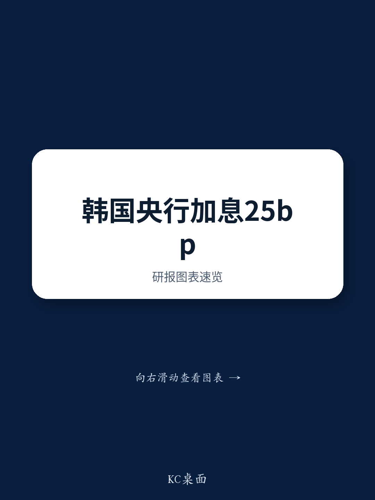

# 韩国央行一致加息：审慎而非恐慌的紧缩周期

韩国央行以一致决议将基准利率上调25个基点至2.75%，这是自2023年1月以来的首次加息。但真正的看点并非加息本身，而是这一决定所揭示的，在经济经历结构性收入转型的背景下，央行货币政策框架的演变。韩国央行目前正面临一个局面：半导体驱动的贸易条件改善，正在导致GDP增长与国内收入之间的差距不断扩大，这种差距对通胀动态、市场稳定以及未来加息步伐具有深远影响。央行的鹰派方向是明确的，但其审慎的执行方式表明，在利率向国内需求的传导仍不确定的环境中，央行有意避免过度紧缩。

这不是一家对单一数据点或突然的通胀恐慌做出反应的央行。这是一家正在根据经济收入生成机制的结构性转变，重新校准其政策立场的央行。韩国央行的担忧在于，半导体出口价格上涨带来的收入红利，可能会溢出到国内需求、工资和服务业通胀，形成一个自我强化的循环，可能将通胀持续推高至2%目标之上。此次加息是遏制这一风险的预防性举措，但央行同时表示将谨慎行事，通过监测后续数据来校准进一步紧缩的时机和步伐。

对于市场观察者和企业战略制定者而言，决策框架是清晰的：韩国央行致力于一个紧缩周期，但路径取决于数据，且很可能是渐进的。需要关注的关键变量不仅是整体通胀或GDP增长，而是收入红利向国内消费、工资和房价的传导。这一框架对资产配置、货币定位和行业层面的决策具有直接影响。

## 韩国央行一致决定反映三重紧缩理由，而非单一触发因素

韩国央行的加息决定基于三个不同的支柱，每个支柱都强化了采取行动的理由。首先，在半导体出口及相关投资的带动下，经济增长显著增强。央行现在认为其5月GDP预测（2.6%）存在显著的上行风险，这明确表明增长前景已实质性改善。其次，预计通胀将在较长时间内保持在2%目标之上。尽管油价已有所缓和，但央行担心早前的能源价格上涨将继续维持价格压力，且收入状况的改善可能产生额外的需求侧通胀。第三，市场稳定风险仍然较高。韩元波动剧烈，首尔房价加速上涨，住房相关及其他贷款领域的家庭借贷大幅增加。

决议的一致性意义重大。这表明货币政策委员会所有七名成员在紧缩必要性上达成一致，减少了可能削弱政策轨迹可信度的内部分歧可能性。这种团结加强了央行的沟通，并强化了这样一个信息：即使步伐仍不确定，但政策方向是明确的。

## 行长强调数据依赖，排除了8月再次加息的预先承诺，但保留了可能性

新闻发布会最重要的信号是，行长拒绝预先承诺在8月连续加息。他明确表示，政策利率路径并非预先确定，委员会将密切关注后续数据，特别是定于7月23日发布的第二季度GDP初值，以及8月4日发布的7月CPI通胀数据。这种措辞经过精心校准，旨在管理市场预期，同时不关闭任何选项。

对数据依赖的强调表明，8月加息并非央行的基准情形。暂停加息将使央行有时间评估当前举措的效果，并判断通胀压力是否正在超出最初的能源和汇率冲击范围。这是一种审慎的做法，尤其是在收入红利向国内需求传导存在不确定性的情况下。央行发出的信号是，除非数据明确证明有必要，否则不会仓促连续加息。

行长还反驳了关于央行在5月维持利率不变是落后于形势的说法。他认为，围绕中东冲突的不确定性，以及缺乏关于潜在通胀的充分信息，都证明了等待更多数据是合理的。这一辩护与央行更广泛的谨慎行事策略一致，即优先考虑数据质量和分析严谨性，而非预防性的紧缩周期。

## GDP与国民总收入之间日益扩大的差距，是影响韩国央行通胀前景的最重要结构性因素

行长发言中分析意义最重大的点之一，是实际GDP增长与实际国民总收入之间的差距。第一季度，实际GDP同比增长3.8%，而实际国民总收入增长了13.2%。这一差距在很大程度上可以解释为，与半导体出口价格上涨相关的贸易条件显著改善。

央行担心，这种收入红利将越来越多地溢出到国内需求、工资和服务业通胀。行长警告称，不应忽视更强劲收入增长带来的需求侧后果。这是理解央行思路的关键见解。央行正在超越油价和韩元汇率的直接通胀效应，关注收入红利的第二轮效应，这可能会产生更持久、更广泛的通胀动态。

对于市场观察者和企业战略制定者而言，这意味着紧缩周期的持续性将取决于半导体驱动的收入增长是否转化为更高的家庭消费、工资增长和更广泛的国内价格压力。如果收入红利大部分被储蓄或用于偿还债务，通胀冲击可能会减弱，央行或许能够放慢紧缩步伐。如果它溢出到消费和工资领域，紧缩周期可能比目前预期的更深、更长。

## 韩国央行审慎的步伐为市场观察者创造了决策框架：两次额外加息25个基点仍是基准情形，但风险倾向于更早行动

韩国央行的鹰派方向与其审慎的执行方式相结合，为市场观察者创造了一个清晰的决策框架。基准情形是分别在2026年10月和2027年1月再进行两次25个基点的加息，使终端政策利率达到3.25%。这一预测假设未来几个月增长和通胀将有所缓和，从而支持渐进式的季度紧缩步伐。

然而，风险倾向于更早行动。如果首尔房价继续上涨，7月通胀数据意外上行，或韩元进一步走弱，8月加息仍是一种明显的可能性。8月加息的可能性估计为25%，反映了风险的平衡。相反，如果能源价格驱动的通胀有所缓解，将降低连续加息的紧迫性，但考虑到增长持续强劲和市场稳定担忧，这不会结束更广泛的紧缩周期。

这一框架对利率策略具有直接影响。建议维持对9月五年期韩国掉期相对于台湾的接收头寸，反映了这样一种观点：鉴于央行更为审慎的步伐以及对国内需求的持续担忧，韩国利率可能相对于台湾表现。中等程度的信心水平（五分之三）承认了轨迹的不确定性，特别是更早加息的风险。

对于市场观察者而言，关键要点是关注将影响央行决策的后续数据：第二季度GDP、7月通胀、首尔房价和韩元汇率。这些变量将决定央行是维持其渐进的季度步伐，还是加速进入更激进的紧缩周期。央行的框架是清晰的，但结果并非预先确定，市场观察者必须保持灵活，以应对不断变化的数据。

*仅供参考。部分内容可能基于源材料通过AI辅助生成、翻译、总结或编辑，可能存在遗漏或错误。请独立核实。本文不构成专业建议。*

仅供参考。部分内容可能基于源材料通过AI辅助生成、翻译、总结或编辑，可能存在遗漏或错误。请独立核实。本文不构成专业建议。

