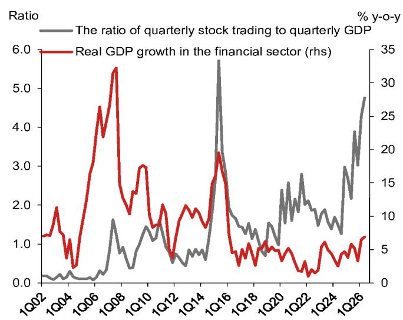
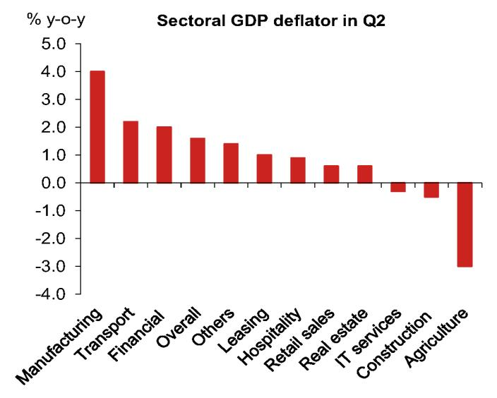
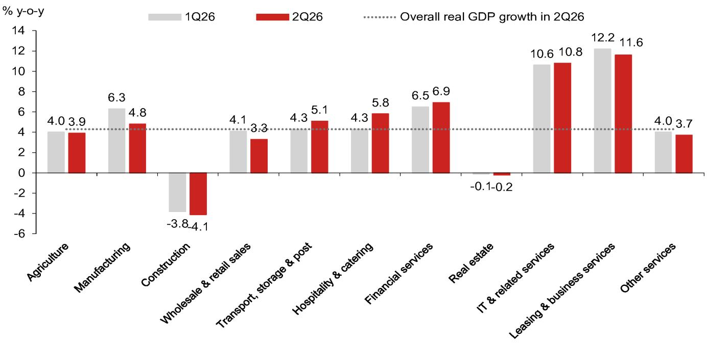

# 宏观观察

## 中国：第二季度GDP行业结构分析

GDP的行业结构数据进一步印证了我们对经济呈现分化格局的判断，尤其是在名义增速方面。第二季度，制造业和金融服务业的同比名义增速均接近9.0%，而房地产和建筑行业仍处于明显调整阶段。较高的名义增速主要受价格因素推动，各行业的实际增速普遍放缓，制造业也不例外。此外，尽管市场交易活跃，但考虑到经纪佣金率显著下降、信贷增速明显放缓以及银行利润空间收窄，我们对金融服务业的高增速持审慎态度。从需求端看，尽管固定资产投资增速明显回落，但资本形成对GDP的同比贡献仅从第一季度的1.9个百分点微降至第二季度的1.5个百分点，这再次引发了对投资数据质量的关注。第二季度增速放缓进一步印证了我们的观点：市场和决策者都不能假设新的人工智能经济能解决当前面临的所有挑战。我们预计，在年中相关会议中可能会宣布新一轮支持措施，但规模可能较为温和。

## 制造业名义与实际GDP增速出现显著分化

制造业实际GDP增速在第二季度明显放缓至同比4.8%，为2023年第四季度以来最低，较第一季度的6.3%显著回落。与此形成鲜明对比的是，制造业名义GDP增速在第二季度升至同比8.8%，为2022年第一季度以来最高，较第一季度的6.2%有所上升，主要原因是其平减指数从-0.1%跃升至1.4%。这一显著分化源于石油相关行业的供应扰动以及石油和芯片价格的大幅上涨。制造业实际增速明显放缓的同时，以美元计价的出口名义增速从第一季度的14.7%升至第二季度的20.2%，表明出口的强劲表现主要由价格因素驱动。

## 市场交易活跃继续支撑金融服务业

金融服务业实际增速在第二季度进一步升至同比6.9%，创下2016年第一季度以来的新高，较第一季度的6.5%有所上升。得益于正值的平减指数，金融业名义增速从第一季度的7.5%显著升至第二季度的8.9%。金融服务业占GDP的8%，对第二季度名义GDP增长的贡献为0.66个百分点，是第二大增长贡献行业。

尽管市场交易活跃似乎是金融服务业强劲增长的主要因素，但我们认为实际提振作用可能小得多，原因有二。首先，在价格竞争加剧的背景下，市场交易的平均经纪佣金率已从2014年左右的0.08%显著下降至目前的0.02%左右。其次，高频交易占比上升可能导致佣金进一步折扣。此外，中国的金融体系仍以银行业为主导。金融服务业较高的GDP增速与信贷增速明显放缓和银行利润空间收窄似乎并不一致。

- 关于市场交易：第二季度日均交易量从第一季度的2.6万亿元人民币跃升至2.9万亿元人民币的新高，同比增速从67.9%飙升至132.3%。交易量占GDP的比重从第一季度的4.3倍升至第二季度的4.8倍，为有记录以来第二高，接近2015年第二季度5.7%的峰值。
- 关于信贷增速：截至第二季度末，社会融资规模和人民币贷款增速分别从第一季度末的7.9%和5.7%降至7.4%和5.2%。
- 关于银行盈利能力：根据国家金融监督管理总局的最新数据，商业银行加权平均净息差从2025年第四季度的1.42%降至2026年第一季度的1.40%的新低。我们预计银行盈利能力在2026年第二季度仍将面临一定压力。

## 研究分析师

王靖 - NIHK
jing.wang@NOM.com
+852 2252 1011

hannah.liu@NOM.com +852 2252 1082

陆挺 - NIHK
ting.lu@NOM.com
+852 2252 1306

## 房地产和建筑行业收缩幅度再次加大

建筑业实际GDP增速从第一季度的-3.8%进一步恶化至第二季度的-4.1%，而房地产业增速从-0.1%微降至-0.2%。由于与房地产相关的建筑活动是建筑业的一部分，我们将建筑业和房地产业合并评估房地产调整的影响。具体来看，两者合并后的实际GDP增速为-2.3%，较第一季度的-1.6%有所恶化。尽管如此，我们认为实际恶化程度可能比GDP数据所显示的更为严重。根据国家统计局的月度数据，新房销售（按面积）、新开工和竣工面积在第二季度仍处于深度调整区间，同比分别为-12.7%、-25.7%和-21.9%，而第一季度的增速分别为-10.4%、-20.3%和-25.0%。

与此同时，建筑业和房地产业合并后的名义GDP增速为-2.3%，较第一季度的-4.2%有所回升。相比之下，基础设施和房地产投资的固定资产投资增速从第一季度的9.2%和-11.2%分别骤降至第二季度的-8.6%和-23.0%。这种显著差异引发了对投资数据质量的质疑。

图1：金融业增速为近十年最快

来源：国家统计局、Wind、NOM全球经济学。

图2：GDP平减指数普遍转正

来源：国家统计局、Wind、NOM全球经济学

## 商品消费表现弱于服务消费

批发零售业实际增速从第一季度的4.1%降至第二季度的3.3%，主要受以旧换新政策力度减弱带来的回补效应，以及持续的房地产调整背景下消费者信心偏弱的影响，尽管市场在人工智能热潮推动下表现尚可。

批发零售业名义增速从第一季度的5.0%微降至第二季度的4.9%。国家统计局的月度数据显示增速更弱，月均商品零售额增速从第一季度的2.2%降至第二季度的0.0%。考虑到短期刺激政策空间有限，我们将下半年零售额增速预测从3.6%下调至3.0%，全年预测从3.2%下调至2.2%。因此，我们预计批发零售业仍将对整体经济增长形成拖累。

住宿餐饮业实际增速从第一季度的4.3%升至第二季度的5.1%，名义增速从5.7%升至6.7%。这似乎与国家统计局公布的餐饮零售额数据相矛盾，后者显示餐饮名义增速从第一季度的4.2%显著降至第二季度的1.3%。此外，服务业零售额累计增速从3月的5.5%降至6月的5.3%。尽管供给侧行业增速与月度零售数据存在差异，但我们认为今年服务消费表现优于商品消费（参见《中国：零售额再审视》，2026年7月2日）。

总体而言，消费相关行业仍将对整体GDP增长形成拖累，因为住宿餐饮业占GDP的比重（4.6%）远小于批发零售业（10.3%）。

## 物流业增速因出口繁荣而上升

交通运输、仓储和邮政业实际增速从第一季度的4.3%升至第二季度的5.1%，名义增速也从5.7%升至7.3%。这可能是受出口激增和运输燃料价格上涨的共同推动。以美元计价的出口增速从第一季度的17.3%升至第二季度的20.2%。随着原油价格通胀率从第一季度的7.5%跃升至第二季度的55.3%，运输费用也可能大幅上涨。另一方面，在国内需求偏弱的背景下，国内电子商务和邮政服务的实际活动可能仍较为低迷。

## 信息技术和租赁相关服务业增速保持高位

在所有子行业中，信息技术及相关服务业实际增速在第二季度录得10.8%，为第二高，与第一季度的10.6%基本持平。这一较高增速可能受到人工智能相关计算和软件需求的强劲支撑。信息技术及相关服务业名义增速从第一季度的10.3%升至第二季度的10.5%，改善可能源于芯片价格上涨推动科技相关产品价格上升。增速最高的行业是租赁和商务服务业，包括机械设备租赁、广告、咨询和法律服务。该行业实际和名义增速从第一季度的12.2%和13.1%仅微降至第二季度的11.6%和12.6%。

## 多数行业录得正GDP平减指数

整体GDP平减指数自2023年第一季度以来首次转正，从第一季度的-0.1%显著升至第二季度的1.6%。行业细分数据显示，制造业（4.0%）、交通运输、仓储和邮政业（2.2%）、金融服务业（2.0%）、租赁服务业（1.0%）、住宿餐饮业（0.9%）、批发零售业（0.6%）和房地产业（0.6%）录得正平减指数，而信息技术服务业（-0.3%）、建筑业（-0.5%）和农业（-3.0%）录得负平减指数。我们认为正GDP平减指数主要受外部因素驱动，尤其是石油和芯片价格上涨，而非国内需求。建筑业的负平减指数反映了建筑需求仍在走弱，受房地产调整拖累。

图3：行业增长细分：实际GDP

注：“其他服务业”包括七个行业：科学研究和技术服务业；水利、环境和公共设施管理业；居民服务、修理和其他服务业；教育；卫生和社会工作；文化、体育和娱乐业；公共管理、社会保障和社会组织。
来源：Wind、NOM全球经济学。

图4：行业增长细分：名义GDP

来源：Wind、NOM全球经济学。

## 附录A-1

本报告由NOM International (Hong Kong) Ltd. (NIHK) 编制。有关NOM集团实体的详细信息，请参阅免责声明。

## 分析师认证

我们，王靖、刘汉娜和陆挺，特此证明：(1) 本研究报告中所表达的观点准确反映了我们对本研究报告所涉及的任何或所有标的证券或发行人的个人观点；(2) 我们的薪酬中没有任何部分直接或间接与本研究报告中所表达的具体建议或观点相关；(3) 我们的薪酬中没有任何部分与NOM Securities International, Inc.、NOM International plc或任何其他NOM集团公司执行的任何特定投资银行业务交易挂钩。

## 重要披露

## 研究报告在线获取及利益冲突披露

NOM集团研究报告可在www.NOMnow.com/research、Bloomberg、Capital IQ、Factset、LSEG上获取。

重要披露信息可访问 http://go.NOMnow.com/research/m/Disclosures 阅读，或向NOM Securities International, Inc.索取。如果您在访问网站时遇到任何困难，请发送电子邮件至 grpsupport@NOM.com 寻求帮助。

编制本报告的分析师获得的薪酬基于多种因素，包括公司的总收入，其中一部分来自投资银行业务。除非另有说明，本报告首页列出的非美国分析师未在FINRA规则下注册/具备研究分析师资格，可能不是NSI的关联人员，并且可能不受FINRA规则2241关于与所覆盖公司沟通、公开露面以及研究分析师账户持有证券交易的限制。

NOM Global Financial Products Inc. (NGFP)、NOM Derivative Products Inc. (NDP) 和 NOM International plc. (NIplc) 已在美国商品期货交易委员会和美国国家期货协会注册为掉期交易商。NGFP、NDPI 和 NIplc 主要从事掉期及其他衍生品交易，其中任何一项都可能成为本报告的主题。

## 免责声明

本出版物包含由第1页确定的NOM集团实体编制，并且（如适用）包含一名或多名NOM集团实体员工的贡献，其各自隶属关系在第1页或本出版物其他地方注明。本文中使用的术语"NOM集团"指NOM Holdings, Inc.及其关联公司和子公司，包括：(a) NOM Securities Co., Ltd. ('NSC')，日本东京；(b) NOM Financial Products Europe GmbH ('NFPE')，德国；(c) NOM International plc ('NIplc')，英国；(d) NOM Securities International, Inc. ('NSI')，美国纽约；(e) NOM International (Hong Kong) Ltd. ('NIHK')，香港；(f) NOM Financial Investment (Korea) Co., Ltd. ('NFIK')，韩国（在韩国金融投资协会注册的NOM分析师信息可在KOFIA内部网 http://dis.kofia.or.kr 上查询）；(g) NOM Singapore Ltd. ('NSL')，新加坡（注册号197201440E，受新加坡金融管理局监管）；(h) NOM Australia Ltd. ('NAL')，澳大利亚（ABN 48 003 032 513），受澳大利亚证券和投资委员会监管，持有澳大利亚金融服务牌照号246412；(i) NOM Securities Malaysia Sdn. Bhd. ('NSM')，马来西亚；(j) NIHK, Taipei Branch ('NITB')，台湾；(k) NOM Financial Advisory and Securities (India) Private Limited ('NFASL')，印度孟买（注册地址：Ceejay House, Level 11, Plot F, Shivsagar Estate, Dr. Annie Besant Road, Worli, Mumbai- 400 018, India；电话：91 22 4037 4037，传真：91 22 4037 4111；CIN号：U74140MH2007PTC169116，SEBI股票经纪业务注册号：INZ000255633；SEBI投资银行业务注册号：INM000011419；SEBI研究业务注册号：INH000001014 - 合规官：Pratiksha Tondwalkar女士，91 22 40374904，投诉邮箱：investorgrievancesra@NOM.com 网页：链接

对于涉及印度上市公司或由印度NFASL研究分析师撰写的报告：(i) 证券市场投资存在市场风险。投资前请仔细阅读所有相关文件。(ii) SEBI的注册和NISM的认证绝不保证中介机构的业绩或向读者提供任何回报保证。(iii) NFASL提供研究服务的条款和条件已在NFASL网页上披露。

(l) NOM Fiduciary Research & Consulting Co., Ltd. ('NFRC')，日本东京。(m) NOM Orient International Securities Co., Ltd ("NOI")，是NOM集团、东方国际（集团）有限公司和上海黄浦投资控股（集团）有限公司共同控股的合资企业。根据中华人民共和国法律（为本文件目的，不包括香港、澳门和台湾），NOI在中国境内获准提供证券研究和研究交流，并独立于NOM集团其他成员运营；特别是，NOI在中国证券中的权益不会向任何其他NOM集团实体披露或与其持仓合并，其他NOM集团实体在中国证券中的权益也不会向NOI披露或与其持仓合并。研究报告首页上NOI旁边的个人姓名表示该个人受雇于NOI，根据研究合作协议为NIHK提供研究协助。研究报告首页上员工姓名旁边的'NSFSPL'表示该个人受雇于NOM Structured Finance Services Private Limited，根据公司间协议为某些NOM实体提供协助。研究报告首页上个人姓名旁边的'Verdhana'表示该个人受雇于PT Verdhana Sekuritas Indonesia ('Verdhana')，根据研究合作协议为NIHK提供研究协助，Verdhana和该个人均未在印度尼西亚境外获得许可。

本材料：(I) 仅供您个人参考，我们不寻求基于此材料采取任何行动；(II) 不应被解释为在任何司法管辖区出售或招揽购买任何证券的要约，在该等司法管辖区此类要约或招揽将是非法的；(III) 除与NOM集团相关的披露外，基于我们认为可靠的来源信息，但未经NOM集团独立核实。

除与NOM集团相关的披露外，NOM集团不保证、陈述或承诺（明示或暗示）本文件的公平性、准确性、完整性、正确性、可靠性或适用于任何特定目的或适销性，并且在法律/法规允许的最大范围内，不承担因使用本文件及相关数据而产生的任何行为（或决定不作为）的责任（无论是过失或其他责任，以及全部或部分责任）。在法律/法规允许的最大范围内，NOM集团的所有保证和其他承诺特此排除，NOM集团对因使用、误用或分发本材料或其中包含的信息或以其他方式与之相关而产生的任何损失（无论是过失或其他责任，以及全部或部分责任）不承担任何责任。

本材料中表达的意见或估计是截至原始发布日期当前的意见，本材料中包含的信息（包括意见和估计）如有变更，恕不另行通知。然而，NOM集团明确表示不承担任何更新或修订本文件的义务。本文中的任何评论或陈述均为作者本人的观点，可能与NOM集团内部其他方的观点不同。客户应考虑本报告中的任何建议或推荐是否适合其特定情况，并在适当时寻求专业建议，包括税务建议。NOM集团不提供税务建议。

在适用法律/法规允许的范围内，NOM集团及其高级职员、董事、员工和关联方可能作为委托人、代理人或其他身份进行交易，或持有发行人证券的多头或空头头寸，或买卖本报告提及的证券、商品或工具，或基于此的期权或其他衍生工具。NOM集团公司也可能担任发行人金融工具的市场做市商或流动性提供者（根据英国适用法规的定义）。如果市场做市商活动符合美国或其他司法管辖区特定法律法规的定义，将在特定发行人披露中单独说明。

对于从第三方获得的信息，第三方内容提供者不承担因使用或误用其内容而产生的任何直接、间接、附带、示范性、补偿性、惩罚性、特殊或后果性损害、成本、费用、法律费用或损失（包括收入或利润损失和机会成本），无论是否因过失或其他原因造成。禁止以任何形式复制和分发第三方内容，除非事先获得相关第三方的书面许可。第三方内容提供者不保证（明示或暗示）任何信息（包括评级）的公平性、准确性、完整性、正确性、及时性或可用性，并且不对因使用或误用此类内容而产生的任何错误或遗漏（无论是否因过失或其他原因造成）或结果负责。第三方内容提供者不提供任何明示或暗示的保证，包括但不限于适销性或适用于特定目的或用途的任何保证。第三方内容提供者不承担因使用或误用其内容（包括评级）而产生的任何直接、间接、附带、示范性、补偿性、惩罚性、特殊或后果性损害、成本、费用、法律费用或损失（包括收入或利润损失和机会成本）的责任（无论是过失或其他责任，以及全部或部分责任）。信用评级是意见陈述，而非事实陈述或购买、持有或出售证券的建议。它们不涉及证券的适用性或证券的投资目的适用性，不应作为研究交流依赖。本文件中的任何MSCI来源信息均为MSCI Inc.的专有财产。未经MSCI事先书面许可，不得为任何目的复制、转载、重新传播、重新分发或使用本信息及任何其他MSCI知识产权，包括创建任何金融产品和任何指数。本信息按"原样"提供。用户承担使用本信息的全部风险。MSCI、其关联方以及任何参与计算或编制信息的第三方特此明确否认对本材料或其中包含的信息或以其他方式与之相关的任何材料的原创性、公平性、准确性、完整性、正确性、适销性或适用于特定目的的所有陈述、保证或承诺。在不限制前述规定的前提下，MSCI、其任何关联方或任何参与计算或编制信息的第三方在任何情况下均不承担任何形式的任何损害责任（无论是过失或其他责任，以及全部或部分责任）。MSCI和MSCI指数是MSCI及其关联方的服务标志。

Russell/NOM日本股票指数的知识产权和其他权利属于NOM Fiduciary Research & Consulting Co., Ltd. ("NFRC") 和 FTSE Russell ("Russell")。NFRC和Russell不保证该指数的公平性、准确性、完整性、正确性、可靠性、有用性、适销性、适销性或适用于任何特定目的，并且不考虑任何指数用户和/或其关联方使用该指数进行的业务活动或服务。

读者应将本文件视为其投资决策的单一因素，因此，本报告不应被视为识别或暗示与任何投资决策相关的所有风险（直接或间接）。NOM集团制作多种不同类型的研究产品，包括基本面分析和定量分析等；一种研究产品中包含的建议可能与其他类型研究产品中的建议不同，无论是由于不同的时间范围、方法论或其他原因。NOM集团以多种不同方式发布研究产品，包括在NOM集团门户网站上发布和/或直接分发给客户。不同的客户群体可能根据其个人需求从研究部门获得不同的产品和服务。

本文中呈现的数字可能涉及过去的表现或基于过去表现的模拟，这些并非未来或可能表现的可靠指标。如果信息包含对未来表现和业务前景的预期、预测或指示，此类预测可能不是未来或可能表现的可靠指标。此外，模拟基于模型和简化假设，可能过度简化且不能反映未来的回报分布。本文件内为说明目的创建和发布的任何数字、策略或指数，均不旨在作为欧洲基准法规定义的"基准"使用。某些证券受汇率波动影响，可能对投资的价值、价格或收入产生不利影响。

关于固定收益研究：建议分为两类：战术性建议，通常持续最多三个月；或战略性建议，通常持续6-12个月。然而，交易建议可能随时根据情况变化进行审查。交易还提供"止损"水平，一旦触及，将自动关闭交易建议。建议中显示的价格和回报表现是在提交发布时获取的，基于当时Bloomberg、LSEG或NOM的指示性价格和回报表现。显示的价格和回报表现不一定是可以执行交易建议的价格和回报表现。

本文所述的证券可能未根据美国1933年证券法（"1933年法案"）注册，在这种情况下，除非已根据1933年法案注册，或符合1933年法案注册要求的豁免条件，否则不得在美国或向美国人士发行或出售。除非管辖法律另有规定，任何交易应通过您所在司法管辖区的NOM实体执行。

本文件已获批准在英国作为投资研究由NIplc分发。NIplc由审慎监管局授权，并受金融行为监管局和审慎监管局监管。NIplc是伦敦证券交易所成员。本文件不构成英国适用法规意义上的个人建议，也不考虑个人读者的特定投资目标、财务状况或需求。本文件仅适用于英国适用法规意义上的"合格对手方"或"专业客户"，因此不得重新分发给"零售客户"。

本文件已获批准在欧洲经济区作为投资研究由NOM Financial Products Europe GmbH ("NFPE") 分发。NFPE是一家根据德国法律注册成立的有限责任公司，在法兰克福/美因河畔法院商业登记处注册，编号HRB 110223。NFPE由德国联邦金融监管局授权和监管。

本文件已由NIHK批准，NIHK受香港证券及期货事务监察委员会监管，在香港由NIHK分发。本文件仅适用于香港适用法规意义上的"专业读者"，因此不得重新分发给非"专业读者"的人士。

本文件已获批准在澳大利亚由NAL分发，NAL在澳大利亚由ASIC授权和监管。本文件也已获批准在马来西亚由NSM分发。

在新加坡，本文件由NSL分发，NSL是《财务顾问法》（第110章）定义的豁免财务顾问，并受新加坡金融管理局监管。NSL可根据《财务顾问条例》第32C条的规定，分发其外国关联公司制作的此文件。本文件适用于《证券及期货法》（第289章）定义的认可、专家或机构读者。如果本文件的接收者不是认可、专家或机构读者，NSL仅在法律要求的范围内对此类接收者承担本文件内容的法律责任。新加坡的接收者应就本文件引起或与之相关的事项联系NSL。本文件旨在广泛分发。它未考虑任何特定个人的具体投资目标、财务状况或特殊需求。接收者在承诺购买任何证券之前，应考虑其具体的投资目标、财务状况或特殊需求，包括在单独委托下，根据其认为合适的方式，寻求独立财务顾问关于投资适宜性的建议。除非1933年法案S条例的规定禁止，本材料在美国由NSI（一家美国注册经纪交易商）分发，NSI根据1934年美国证券交易法规则15a-6的规定对其内容承担责任。编制本文件的实体允许NOM集团内独立运营的关联公司向其客户提供此类文件的副本。

本文件未获批准分发给沙特阿拉伯王国"授权人员"、"豁免人员"或"机构"（由资本市场管理局定义）以外的人员，或阿拉伯联合酋长国"市场对手方"或"专业客户"（由迪拜金融服务局定义）以外的人员，或卡塔尔国"市场对手方"或"商业客户"（由卡塔尔金融中心监管局定义）以外的人员，由NOM沙特阿拉伯、NIplc或NOM集团任何其他成员（视情况而定）分发。除非获得授权，任何人不得将本文件或其任何副本直接或间接带入、传输或分发到沙特阿拉伯、阿联酋或卡塔尔，或分发给沙特阿拉伯境内的"授权人员"、"豁免人员"或"机构"、阿联酋的"市场对手方"或"专业客户"、卡塔尔的"市场对手方"或"商业客户"以外的人员。未能遵守这些限制可能构成违反阿联酋、沙特阿拉伯或卡塔尔法律。

对于涉及台湾上市公司或由台湾研究分析师撰写的报告：

本文件仅供参考。您应独立评估投资风险，并自行承担投资决策的责任。未经NOM集团书面授权，不得复制或引用本报告的任何部分。根据台湾《证券商受托买卖有价证券管理规则》和/或其他适用法律法规，您不得向他人（包括但不限于关联方、关联公司和任何其他第三方）提供本报告，或从事任何可能涉及利益冲突的与本报告相关的活动。NOM International (Hong Kong) Ltd., Taipei Branch不可执行的证券/工具信息仅供参考，不应被解释为建议或招揽交易此类证券/工具。

本材料不得在印度尼西亚境内分发，或传递给印度尼西亚共和国境内的个人，或传递给印度尼西亚公民（无论其居住地或所在地）或印度尼西亚实体或居民，以构成印度尼西亚共和国法律下的公开发售。本文件中提及的证券不得在印度尼西亚向印度尼西亚公民（无论其居住地或所在地）或印度尼西亚实体或居民发行或出售，以构成印度尼西亚共和国法律下的公开发售。

研究报告首页上NOI旁边的个人姓名表示本文件是NOI在中国发布的研究报告的翻译版本。在所有其他情况下，本文件由未在中国获得证券研究许可的NOM集团或其子公司或关联公司（统称"离岸发行人"）编制。本研究报告未获批准或旨在在中国境内分发。任何A股相关分析（如有）并非为位于或注册于中国的个人制作。接收者不应依赖本研究报告中包含的任何信息做出投资决策，离岸发行人不对此承担任何责任。未经NOM集团成员事先书面同意，不得以任何形式（通过任何方式）复制、影印、复制或翻印本材料的任何部分，或重新传播、重新发布或重新分发本材料。如果本文件通过电子传输方式分发，例如电子邮件，则无法保证此类传输安全或无错误，因为信息可能被拦截、损坏、丢失、销毁、延迟到达或不完整，或包含病毒。因此，发送方不对本文件内容中可能因电子传输而产生的任何错误或遗漏承担责任（无论是过失或其他责任，以及全部或部分责任）。如需验证，请索取纸质版本。

## NOM Securities Co., Ltd.

在关东财务局注册的金融工具公司（注册号第142号）

会员协会：日本证券业协会；日本投资管理协会；日本金融期货协会；第二类金融工具公司协会；日本证券型代币发行协会。

NOM集团通过其合规政策和程序（包括但不限于利益冲突、中国墙和保密政策）以及维护中国墙和员工培训来管理与研究报告制作相关的利益冲突。

有关本文件中所含任何研究交流所使用方法或模型的更多信息，可联系首页列出的NOM研究分析师索取。披露信息可应要求提供，披露信息可在NOM披露网页获取：

http://go.NOMnow.com/research/m/Disclosures

版权所有 © 2026 NOM International (Hong Kong) Ltd., Hong Kong。保留所有权利。
