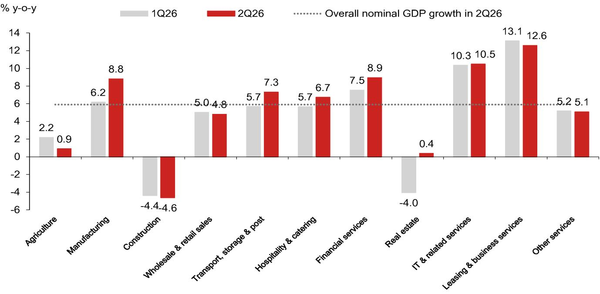

# 中国宏观环境的结构性分化：表象之下的真实图景

中国第二季度宏观数据揭示了一个正在结构性分化的经济图景。整体数字背后隐藏着日益显著的分化趋势：制造业和部分服务领域的名义增长在第二季度达到较高水平，而房地产和建筑相关领域则持续调整。然而，关键洞察在于，这种分化很大程度上是一种价格层面的现象。几乎所有领域的实际增长都出现了不同程度的放缓，包括制造业。名义上的增长主要受到外部价格因素——如能源和芯片价格——的推动，而非国内需求的实质性回暖。对于研究者和企业战略制定者而言，这意味着：中国的宏观轨迹不能仅从表面数字解读。需要区分实际与名义、外部驱动与内生动力、政策支持与结构性问题。

这一分化的时机值得关注。市场此前受到人工智能叙事和公司报价回升的提振，一些人认为新一轮技术驱动的增长周期正在带动整体经济。但数据呈现了不同的图景。例如，部分服务领域的名义增长达到了近年来的较高水平，但这与背后的信贷和盈利现实存在不一致。制造业的实际增长降至近期低点，而其名义增长却创下阶段新高。这并非复苏，而是一种结构性扭曲。政策制定者不能假设新的人工智能经济能解决所有结构性问题，研究者也应保持审慎。

对当前数据最危险的误读，是认为中国经济正在重新加速。证据指向一个更缓慢、更脆弱、内部矛盾更突出的增长格局。以下部分将解析构成这一分化格局的关键领域动态，并提供分析框架。

## 制造业的表象与现实：实际增长放缓，名义增长受外部价格影响

制造业是当前中国经济中感知与现实差距最明显的领域。第二季度制造业实际GDP同比增长放缓至4.8%，低于第一季度的6.3%，为近期最低水平。与此形成鲜明对比的是，同一领域的名义GDP增长加速至8.8%，为阶段新高。这一分化完全由该领域价格指数的跳升驱动。这并非产出增长的故事，而是价格上涨的故事，特别是能源和芯片价格。

价格压力的来源是外部的。能源相关领域的供应扰动和全球芯片价格上涨，推高了制造业产出的价值，但并未伴随相应的产量增长。出口数据也印证了这一点：以美元计价的出口名义增长在第二季度有所上升，但制造业的实际放缓表明，出口的强劲表现很大程度上是价格效应，而非数量效应。对于在中国制造业供应链中运营或受其影响的企业而言，这一区分至关重要。由价格上涨驱动的收入增长不可持续。它并不代表需求上升，而是供应受限环境下的成本传导。当外部价格冲击正常化时，制造业实际活动的潜在疲软将显现。

## 服务领域的增长：账面数字与底层信贷和盈利数据的矛盾

服务领域对第二季度名义GDP增长的贡献较为显著，成为第二大增长贡献来源。该领域的实际增长达到一定水平，名义增长也有所提升。直接原因看似简单：第二季度日均股票交易量创下新高，同比增长显著。股票交易量与GDP的比率也接近历史峰值。

然而，进一步审视会发现三个结构性因素，显著削弱了这一增长的可持续性。首先，平均经纪佣金率已从多年前的水平大幅下降，价格竞争激烈。更高的交易量带来的单位收入远低于十年前。其次，高频交易占比上升导致进一步的佣金折扣，即使交易量上升，利润率也在压缩。第三，最重要的是，金融体系仍以银行为主导，而银行业正面临压力。信贷增长明显放缓：社会融资总量增速下降，人民币贷款增速也有所回落。银行净息差降至新低。服务领域GDP的高增长与这些底层现实并不一致。依赖该领域GDP贡献作为金融体系健康信号的研究者，可能误读了数据。

## 房地产与建筑领域：调整幅度比GDP数字显示的更深

房地产和建筑领域的实际GDP增长在第二季度继续为负，且降幅较第一季度有所扩大。然而，这些数字可能低估了调整的严重程度。月度数据显示出更清晰的图景：新房销售面积、新开工面积和竣工面积均出现两位数下降。GDP数据受到统计效应的平滑，并未完全反映实际活动。

GDP数据与固定资产投资数据之间的差异，进一步引发了对投资统计质量的疑问。基础设施固定资产投资增长在第二季度明显下滑，房地产投资降幅扩大。然而，房地产和建筑的名义GDP却有所改善。这种显著的不一致性表明，GDP数据捕捉的内容与月度活动数据报告的内容有所不同。对于任何分析中国房地产相关风险的研究者，月度数据应比季度GDP数据给予更多权重。调整正在深化，而非稳定。

## 消费的分化：商品消费放缓快于服务消费，但两者均对增长形成拖累

批发和零售业占GDP比重较大，其实际增长在第二季度有所放缓。月度商品零售额增长平均接近零，低于第一季度。此前提供暂时提振的以旧换新计划正在缩减，消费者信心在持续的房地产调整中依然偏弱。市场回升和人工智能叙事并未转化为广泛的消费改善。下半年零售额增长预测已被下调。

服务消费，特别是住宿和餐饮，表现相对较好。该领域实际增长在第二季度有所改善。但该领域占GDP比重较小，不到批发和零售业的一半。此外，供应侧的GDP数据与月度餐饮零售数据之间存在差异，后者显示名义增长在第二季度明显下降。整体图景清晰：消费相关领域将继续对GDP增长形成拖累。商品端放缓更快，服务端虽更具韧性，但规模太小，难以弥补。

## 研究者的分析框架

第二季度的数据提供了一个实用的分析框架，围绕三个问题展开。

第一，你观察到的增长是由数量驱动还是由价格驱动？如果答案是价格，如制造业和出口领域，那么增长可能是暂时的，容易受到全球商品和芯片价格正常化的影响。不要简单外推收入趋势，应关注数量指标。

第二，服务领域的增长是由可持续的收入扩张驱动，还是由无利润的交易量驱动？创纪录的交易量与不断下降的佣金率相结合，暗示后者。任何涉及相关领域收入的研究，都应针对交易量正常化和利润率继续压缩的情景进行压力测试。

第三，房地产和建筑领域的调整是否在GDP数据中得到准确反映？证据表明并非如此。月度活动数据显示了更深入和更持续的调整。任何涉及房地产相关资产、建筑材料或地方融资的研究，都应使用月度数据而非季度GDP数据来评估。

总体战略含义是，中国经济并非单一故事。它是一个由多个领域叙事组成的集合，这些叙事正朝着不同方向发展，名义数字掩盖了实际疲软。人工智能驱动的市场回升和外部价格冲击创造了一种稳定表象，并未反映底层需求环境。政策制定者可能会在年中会议后推出新一轮支持措施，但规模预计适中。结构性问题——房地产库存、消费者信心不足、银行利润率压缩、对外部价格效应的依赖——无法通过温和刺激解决。它们需要尚未开始的根本性再平衡。

*仅供参考。部分内容可能基于源材料通过AI辅助生成、翻译、总结或编辑，可能存在遗漏或错误。请独立核实。本文不构成任何专业建议。*
