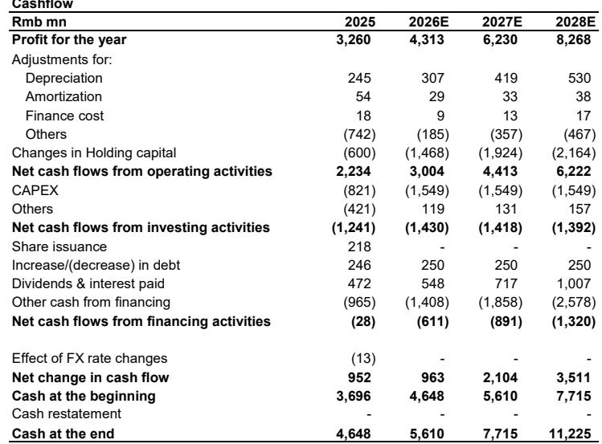
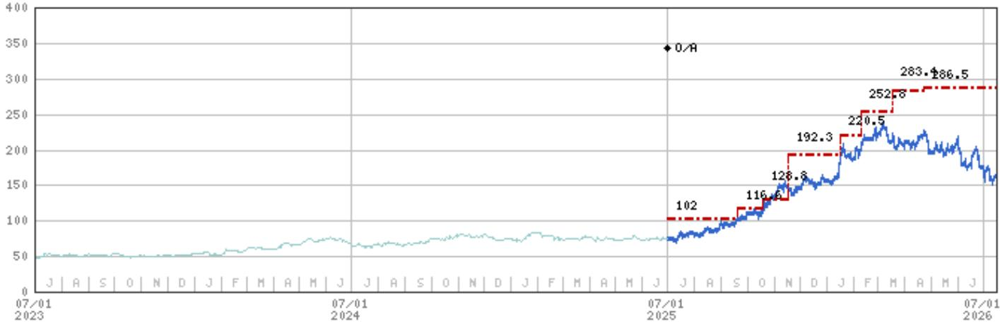
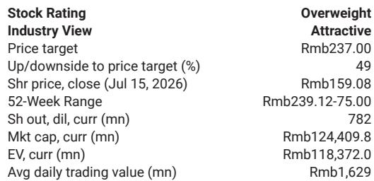

# 思源电气上半年利润表现背后的结构性强化趋势

思源电气公布了2026年上半年初步业绩，表面上看有些令人意外：营收同比增长27%，但净利润仅增长15%，低于预期。然而，这一表面现象掩盖了更重要的信息。利润差额主要源于非经营性因素——人民币升值带来的汇兑损失以及东芝合资企业少数股东权益增加——而非公司核心业务动能的任何变化。在这些干扰因素之下，基本面的积极信号正在为2026年下半年及更长远的发展奠定基础。

上半年真正的信号来自订单。国内订单同比增长超过25%，海外订单增幅在50%至100%之间。这并非单季度脉冲，而是反映了电力变压器需求的结构性转变，背后是全球供应短缺且未见缓解迹象。思源电气凭借其产品组合向利润率更高的发达市场客户倾斜，以及产能投资恰好在短缺预计达到峰值时投产，具备了独特的优势来捕捉这一需求。

关注2026-2028年净利润预期下调8-10%的观察者可能忽略了重点。这一调整包含了一次性汇兑损失、支持新产品开发的研发支出增加，以及东芝合作带来的永久性但可控的少数股东权益增加。2026-2028年的营收预测基本保持不变，公司预计仅在2026年下半年就将实现42%的净利润增长。当前公司报价对应2027年预期收益的21.5倍，PEG为0.7倍——较全球同行折价约30%——而其收益增长轨迹正在加速。

## 全球电力变压器短缺为思源电气创造多年窗口期以拓展发达市场份额

思源电气最重要的结构性驱动因素并非中国国内电网建设——这已被市场充分理解——而是全球电力变压器的持续短缺，尤其在北美地区。老化的电网基础设施、可再生能源发电的建设以及数据中心扩张，共同创造了超出传统西方制造商供应能力的需求。思源电气是少数具备制造规模、成本结构和认证路径来填补这一空白的公司之一。

数据清晰可见。海外变压器订单在2026年上半年估计增长了50-100%。报告预计，海外变压器订单将从2025年的大约40亿元人民币，增长至2026年的超过60亿元和2027年的超过100亿元。这并非周期性上升，而是公司可触达市场的阶跃式变化。客户地区结构正向发达市场转移，这些市场具有更高的平均售价和更好的利润率。随着产品组合向北美和欧洲客户倾斜，即使单位经济性没有改善，毛利率也应有所扩大。

产能扩张时间线进一步强化了这一论点。思源电气正在加速产能建设，目标在2027年第四季度投产。这一时间点与变压器短缺周期可能达到峰值的时间相吻合，届时买家将最愿意为可靠供应支付溢价。公司承接更多高价值海外订单的能力，将仅受限于其新产能上线的速度。对于北美和欧洲的竞争对手而言，挑战并非需求不足，而是无法快速扩大制造规模。思源电气面临相反的问题：它拥有制造能力，现在正在建设产能以大规模部署。

## 新产品开发创造市场尚未充分认识的第二增长引擎

思源电气在过去十年中系统性地扩展了其产品组合，但市场尚未完全定价其最新产品带来的营收增长潜力。三个产品类别尤其具有前景，可能在未来五年显著提升营收。

首先，在中国国内，思源电气正在进入1000kV气体绝缘开关设备（GIS）和35kV开关设备领域。这些是更高电压、更高价值的产品，服务于中国正在建设的超高压（UHV）输电走廊，以连接偏远可再生能源基地与负荷中心。国内UHV市场历来由国有企业主导，但思源电气在较低电压开关设备领域的业绩记录为其在这一细分市场赢得份额提供了可信路径。这些产品的营收贡献将在后期显现，但随着国家电网加速UHV招标，其规模可能相当可观。

其次，更具战略意义的是思源电气向UHV直流（DC）产品的推进，特别是换流阀。这些是将交流电转换为直流电以进行远距离传输的关键组件。技术复杂，进入壁垒高，市场一直由少数全球参与者主导。思源电气预计在2026年获得小规模订单，并在2027年取得进一步突破。即使在换流阀领域获得较小的市场份额，也将代表显著的营收提升，因为单位价值高且竞争领域狭窄。

第三，超级电容器代表了一种市场基本忽略的期权价值。报告指出，在当前假设下，超级电容器可能为思源电气的营收贡献低个位数百分比。但如果800VDC成为数据中心供电标准，其上行潜力可能变得更大。数据中心消耗的全球电力份额不断增加，向更高电压直流架构的转变将为超级电容器作为备用电源和电能质量组件创造一个大且不断增长的市场。这目前并非基准情景驱动因素，但这是一个合理且未被共识预期反映的上行情景。

## 下半年盈利拐点是验证论点的近期催化剂

对思源电气研究逻辑最直接的检验将来自2026年下半年。报告预计2026年全年营收增长36%，净利润增长31%，毛利率基本持平于30.7%。计算很简单：如果全年增长31%而上半年仅增长15%，那么下半年必须实现约42%的净利润增长。这并非激进的假设。它反映了产品组合向更高利润率项目的刻意转变，特别是750kV GIS和海外变压器，这些将在下半年随着交付赶上订单而确认。

利润率回升的故事很重要，因为它回应了质疑者对思源电气的主要担忧：营收增长是以牺牲盈利能力为代价的。数据并不支持这一担忧。毛利率一直稳定在30-31%区间，报告预计到2028年将逐步改善至31.8%。改善来自产品组合，而非定价能力或成本削减，这使得改善更具可持续性。随着海外订单份额增加以及更高电压产品获得牵引力，营收结构自然向更高利润率项目转移。公司无需提价或削减成本来改善利润率；它只需执行现有订单。

下半年的催化剂还得到潜在香港IPO的强化，这将提供估值重估机制并接触更广泛的读者群体。香港上市还将为公司提供一种货币，用于进行战略收购或合作，尤其是在本地存在是竞争优势的海外市场。

## 评估思源电气风险回报的决策框架

对于考虑思源电气的观察者而言，关键问题不是公司是否会增长——订单簿已明确表明这一点——而是哪些风险可能偏离轨迹，以及如何权衡这些风险与上行潜力。一个结构化的决策框架有助于厘清权衡。

主要上行驱动因素是全球变压器短缺。这是一个由电网现代化、可再生能源整合和数据中心需求驱动的多年结构性现象。风险在于短缺比预期更快解决，要么是因为发达市场的新制造产能上线，要么是因为需求增长放缓。未来12-18个月内发生这种情况的可能性较低，因为变压器制造产能需要数年才能建成，且新工厂的监管审批缓慢。更可能的风险是短缺持续但竞争加剧，压缩利润率。思源电气的成本优势和产能扩张计划缓解了这一风险，但不能完全排除。

第二个上行驱动因素是新产品开发，特别是UHV直流产品和超级电容器。这里的风险在于执行：这些是技术复杂的产品，思源电气在换流阀方面经验有限。报告承认2026年仅预期小规模订单，2027年取得突破。观察者应监控初始订单的时间和规模，作为验证信号。如果思源电气到2027年中期未能获得有意义的订单，新产品论点将需要重新评估。

第三个因素是估值。思源电气对应2027年预期收益的21.5倍，较全球同行折价30%。0.7倍的PEG比率意味着市场并未完全定价公司的增长轨迹。基于2027年收益35倍的上行情景估值为311.20元人民币，意味着96%的上行空间。基于2027年收益20倍且增长假设更为保守的下行情景估值为120.90元人民币，意味着24%的下行空间。不对称性是有利的，但这取决于公司能否实现下半年盈利拐点并保持订单动能。

需要监控的最重要风险是汇兑风险敞口。上半年利润差额部分归因于人民币升值，报告明确将2026年的汇兑损失纳入考量。如果人民币相对于思源电气海外客户的货币继续走强，以人民币计价的报告收益将低于实际运营表现。这是一个换算问题，而非业务问题，但它可能在报告结果中造成波动，短期内可能影响公司报价。

东芝合资企业的少数股东权益拖累是永久性但可控的成本。东芝将其持股比例从10%提高至30%，这意味着合资企业利润的更大份额流向少数股东。这使思源电气的报告净利润减少几个百分点，但也加强了合作关系，使思源电气能够获得东芝的技术和市场准入。只要合资企业本身增长，这一权衡是可以接受的。

总而言之，思源电气上半年利润表现不佳是一个干扰因素，掩盖了其业务基本面正在强化的趋势。全球变压器短缺、向发达市场客户的转变、新产品管线以及产能扩张计划，共同创造了当前估值尚未完全反映的多年增长轨迹。下半年的盈利拐点将是迫使市场重新审视其假设的近期催化剂。能够透过噪音看到订单和产品组合的观察者，将有望从这一可能持续的超出趋势的收益增长期中受益。

*仅供参考。部分内容可能基于源材料通过AI辅助生成、翻译、总结或编辑，可能存在遗漏或错误。请独立核实。本文不构成任何专业建议。*
