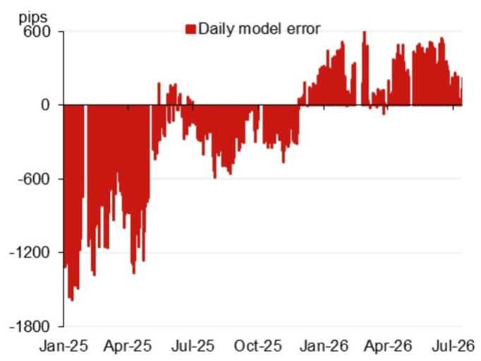
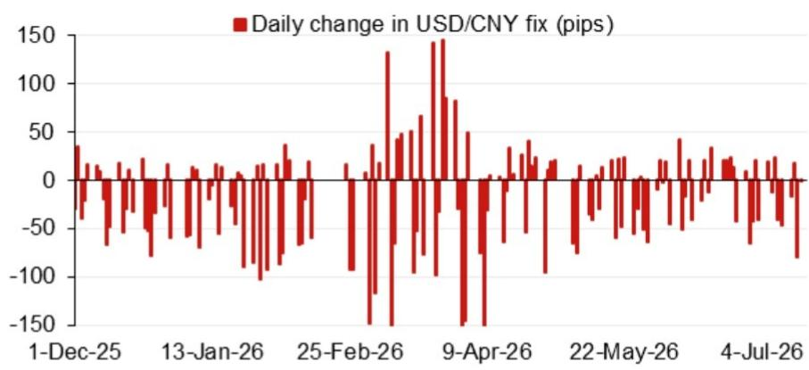

# 宏观观察 - 亚洲（除日本外）

参考数值：6.7739

模型参考数值：6.7739，此前为6.7909（较前次官方收盘价有所变化）。

含逆周期因子的模型参考数值：6.7814（较前次参考值有所变化）。

## 研究分析师

亚洲汇率研究
Craig Chan - NSL
craig.chan@NOM.com

Wee Choon Teo - NSL
weechoon.teo@NOM.com

Vicky Chen - NSL  
vicky.chen1@NOM.com

Manthan Shingala - NSL
manthan.shingala1@NOM.com

图1：隔夜贡献权重前四（不含逆周期因子）  
  
来源：NOM

图2：近期模型误差（不含逆周期因子调整）  
  
来源：Bloomberg, NOM

图3：USD/CNY参考值每日变化  
  
来源：Bloomberg, NOM

图4：事件日历

| 日期 | 事件 | 地点 | 备注 |
|------|------|------|------|
| 2026年7月17-20日 | 2026世界人工智能大会 | 中国上海 | 据中国外交部消息，中国国家主席习近平将出席开幕式并发表主旨演讲。 |
| 2026年7月下旬 | 政治局经济工作会议 | 中国 | 政治局通常每月召开一次会议，7月会议内容通常包含经济工作部署。 |
| 2026年8月中旬 | 央行2026年第二季度货币政策报告 | | |
| 2026年9月24日 | 习近平主席对美国进行国事访问 | 美国华盛顿特区 | |
| 2026年9月下旬 | 央行货币政策委员会会议 | | |
| 2026年10月1-7日 | 国庆黄金周假期 | 中国 | |

来源：Bloomberg, NOM

## 附录A-1

本报告由NOM Singapore Ltd. (NSL) 编制。

免责声明详见NOM集团实体详情。

## 分析师声明

我们，Craig Chan, Wee Choon Teo, Vicky Chen 和 Manthan Shingala，特此声明：(1) 本研究报告中所表达的观点准确反映了我们个人对相关标的的看法；(2) 我们的报酬从未、也不会直接或间接与本研究报告中表达的具体建议或观点相关；(3) 我们的报酬与任何特定交易活动无关。

## 重要披露

## 研究报告在线获取及利益冲突披露

NOM集团研究报告可通过 www.NOMnow.com/research, Bloomberg, Capital IQ, Factset, LSEG 获取。

重要披露信息可访问 http://go.NOMnow.com/research/m/Disclosures 或向NOM Securities International, Inc.索取。

编制本报告的分析师的报酬基于多种因素，包括公司总收入。除非另有说明，本报告所列的非美国分析师未在FINRA规则下注册/取得研究分析师资格。

NOM Global Financial Products Inc. (NGFP)、NOM Derivative Products Inc. (NDP) 和 NOM International plc. (NIplc) 已在美国商品期货交易委员会和国家期货协会注册为掉期交易商。

## 美国要求的额外披露

主要交易：NOM Securities International, Inc.及其关联公司通常作为固定收益证券（或相关衍生品）的主要交易方。

## 估值方法 - 固定收益

NOM的固定收益策略师通过提供交易建议来表达对证券价格和市场的看法。这些建议可以是相对价值建议、方向性交易建议、资产配置建议或三者的结合。分析内容包括但不限于：

- 基本面分析：判断证券价格是否偏离其宏观或微观经济基本面。
- 价格变动的量化分析。
- 技术因素：如监管变化、市场风险偏好变化、评级行动、一级市场活动及供需考量。

交易建议的时间框架可变。战术性建议时间较短，通常不超过三个月。战略性建议时间较长，通常超过三个月。

根据欧盟市场滥用条例，NOM全球固定收益研究发布的评级分布如下：

52% 被给予买入（或同等）评级；其中50%的发行人曾接受NOM集团提供的实质性服务。
0% 被给予中性（或同等）评级。
48% 被给予卖出（或同等）评级；其中50%的发行人曾接受NOM集团提供的实质性服务。
截至2026年6月30日。

## 免责声明

本出版物包含由第1页所列NOM集团实体编制的材料。术语"NOM集团"指NOM Holdings, Inc.及其关联公司和子公司。

本材料：(I) 仅供您私人参考，我们不以此为基础寻求任何行动；(II) 不构成在任何司法管辖区出售或购买任何证券的要约或邀请；(III) 除与NOM集团相关的披露外，基于我们认为可靠的来源，但未经NOM集团独立核实。

除与NOM集团相关的披露外，NOM集团不对本文件的公平性、准确性、完整性、正确性、可靠性或适用于任何特定目的作出任何明示或暗示的保证。

所表达的意见或估计为截至原始发布日期的最新意见，信息（包括其中包含的意见和估计）如有变更，恕不另行通知。

NOM集团及其高级职员、董事、员工和关联公司，在适用法律和法规允许的范围内，可能作为主体、代理人或以其他方式交易，或持有相关证券的多头或空头头寸。

本文件可能包含从第三方获得的信息。NOM集团特此明确否认对第三方信息的任何陈述、保证或承诺。

读者应将本文件视为其决策的单一因素，本报告不应被视为识别或建议所有可能的风险。

本文中呈现的数字可能涉及过往表现或基于过往表现的模拟，这些并非未来或可能表现的可靠指标。

关于固定收益研究：建议分为两类：战术性（通常持续最多三个月）或战略性（通常持续6-12个月）。交易建议可能随时根据情况变化进行审查。

本文所述的证券可能未根据1933年美国证券法注册。

本文件已在英国获准作为投资研究由NIplc分发。NIplc由审慎监管局授权，并由金融行为监管局和审慎监管局监管。

本文件已在欧洲经济区获准作为投资研究由NOM Financial Products Europe GmbH ("NFPE")分发。

本文件已由NIHK批准，在香港由NIHK分发。

本文件已获准在澳大利亚由NAL分发。

本文件也已获准在马来西亚由NSM分发。

在新加坡，本文件由NSL分发。

除非1933年美国证券法S条例禁止，本材料在美国由NSI分发。

本文件未获准在沙特阿拉伯、阿联酋或卡塔尔向特定人士以外的其他人分发。

本材料不得在印度尼西亚分发。

本材料任何部分未经NOM集团成员事先书面同意，不得复制、转载或重新分发。

NOM集团通过其合规政策和程序管理研究生产中的利益冲突。

如需获取本文件所含任何建议所使用的方法或模型的更多信息，请联系第1页所列的NOM研究分析师。

版权 © 2026 NOM Singapore Ltd., Singapore。保留所有权利。
