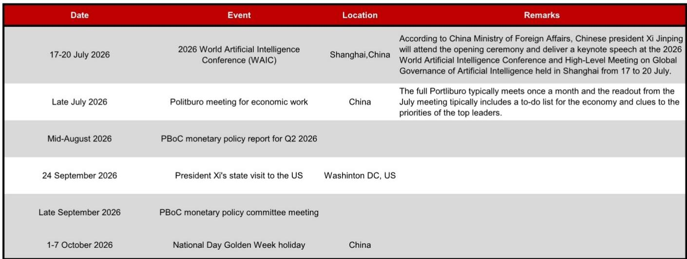
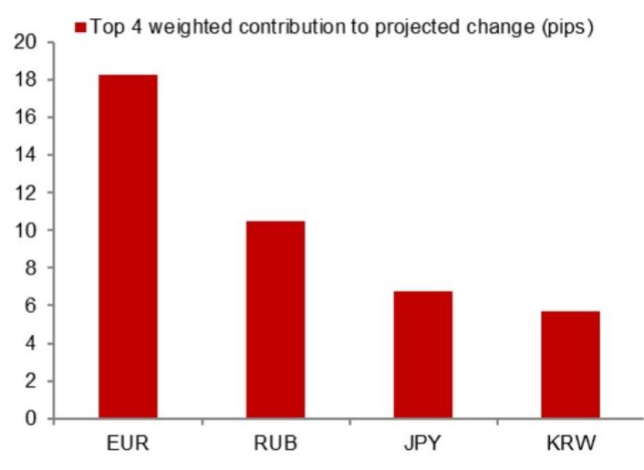

# The PBOC's Counter-Cyclical Factor Is a Strategic Signal, Not a Mechanical Adjustment

The People's Bank of China's daily USD/CNY fixing has become one of the most closely watched data points in global currency markets, and for good reason. On a single day captured in a recent analysis, the model-projected fixing stood at 6.7739, while the adjustment incorporating the counter-cyclical factor produced a fixing of 6.7814. That 95-pip difference, roughly one-third of the total daily adjustment from the prior official close, is not a rounding error. It is a deliberate policy signal, and it reveals a critical shift in how the PBOC is managing the yuan's trajectory through a period of heightened external uncertainty.

This is not a story about a single day's fixing. It is a story about the PBOC's evolving toolkit and what the size and direction of the counter-cyclical factor reveal about the central bank's tolerance for depreciation, its sensitivity to capital flows, and its broader strategic calculus ahead of a series of consequential political and economic events. The counter-cyclical factor is not a passive smoothing mechanism; it is an active policy lever that tells market participants exactly how much the authorities are willing to lean against market pressure at any given moment.

The timing of this signal is particularly instructive. With the 2026 World Artificial Intelligence Conference in Shanghai scheduled for mid-July, a Politburo economic work meeting expected in late July, and President Xi's state visit to the US in late September, the PBOC is navigating a narrow channel. It must manage depreciation expectations without triggering destabilizing capital outflows, while also preserving export competitiveness and avoiding the appearance of currency manipulation ahead of high-stakes diplomatic engagements. The counter-cyclical factor is the instrument through which these competing objectives are calibrated in real time.

## The Counter-Cyclical Factor Has Shifted from a Passive Filter to an Active Policy Signal, and Its Magnitude Now Carries More Information Than the Fixing Level Itself

The model projection without the counter-cyclical factor stood at 6.7739, while the actual fixing was set at 6.7814. The 95-basis-point difference is not large in absolute terms, but its direction is what matters. The counter-cyclical factor was used to push the fixing higher, meaning the PBOC allowed the yuan to weaken more than the model would have suggested based purely on overnight market movements. This is a deliberate choice, and it tells us that the authorities are comfortable with a measured depreciation, at least for now.

The critical insight is that the counter-cyclical factor is no longer being used primarily to stabilize the fixing against short-term volatility. Instead, it is being deployed as a forward-looking tool to manage expectations around a gradual depreciation path. The PBOC is signaling that it will not defend any particular level of the yuan with aggressive intervention. Rather, it will use the fixing mechanism to guide the currency lower in a controlled, predictable manner that minimizes the risk of a disorderly selloff.

This interpretation is supported by the fact that the model projection itself shifted by 170 pips from the previous projection, while the counter-cyclical adjustment added only 95 pips. The majority of the daily change came from market-driven factors, not from PBOC intervention. The authorities are allowing market forces to play a larger role in determining the fixing, while using the counter-cyclical factor to fine-tune the pace and magnitude of the adjustment. This is a more sophisticated approach than the binary on-off use of the factor seen in previous episodes of yuan pressure.

## The Calendar of Upcoming Events Creates a Series of Decision Points That Will Force the PBOC to Choose Between Stability and Flexibility

The next three months are densely packed with events that have direct implications for the yuan's trajectory. The 2026 World Artificial Intelligence Conference in Shanghai, with President Xi in attendance, creates a political imperative for stability. No Chinese leader wants to see currency volatility dominate headlines during a major international event designed to showcase China's technological ambitions. During this period, the counter-cyclical factor is likely to be used more aggressively to lean against any sharp depreciation, even if the underlying market pressure is building.

The Politburo meeting in late July presents a different dynamic. This is where the leadership sets economic priorities for the second half of the year. If the meeting signals a shift toward more aggressive stimulus or a greater tolerance for a weaker currency to support exports, the market will interpret that as a green light for further yuan depreciation. The PBOC's fixing behavior in the days immediately following the Politburo readout will be the most important signal to watch. A widening of the counter-cyclical adjustment in the direction of weakness, combined with a lower fixing, would confirm that the authorities are shifting to a more accommodative stance on the currency.

The mid-August release of the PBOC's Q2 monetary policy report provides the formal narrative framework for whatever stance the authorities have adopted. This is where the central bank will articulate its views on the exchange rate in official language, and any deviation from the standard "keep the yuan basically stable at a reasonable and equilibrium level" formulation would be a major signal. The counter-cyclical factor data from the weeks leading up to the report will serve as the leading indicator of what the report will say.

President Xi's state visit to the US in late September is the most consequential event on the calendar. Currency policy is almost certain to be a topic of discussion, and the PBOC will want to avoid any perception that China is engaging in competitive devaluation ahead of the visit. This creates a powerful incentive for the authorities to narrow or even reverse the counter-cyclical adjustment in the weeks leading up to the trip, signaling a commitment to stability. The market should expect the fixing mechanism to become more symmetric during this period, with the PBOC potentially using the factor to strengthen the yuan if depreciation pressures intensify.

## The Pattern of Model Errors Reveals That the PBOC's Fixing Strategy Has Become More Predictable, Which Creates Both Opportunities and Risks for Market Participants

The recent model errors, shown in the analysis as deviations between the model projection and the actual fixing, exhibit a clear pattern. The errors are not random; they cluster in a narrow range and show a consistent directional bias. This is not a bug in the model. It is a feature of the PBOC's communication strategy. By making the fixing process more predictable, the authorities are reducing uncertainty and allowing market participants to form more stable expectations about the future path of the currency.

For market participants, this predictability is a double-edged sword. On one hand, it reduces the risk of sudden, unexpected fixing adjustments that can trigger sharp moves in offshore yuan and related derivatives. Traders can incorporate the likely size and direction of the counter-cyclical factor into their positioning with greater confidence. This lowers the volatility premium embedded in yuan options and makes hedging less expensive.

On the other hand, predictability also means that the market can more easily anticipate when the PBOC is likely to shift its stance. If the pattern of model errors suddenly changes direction or widens significantly, that is a clear signal that the authorities have altered their strategy. The risk is that market participants become too complacent, assuming that the current pattern will persist indefinitely. When the PBOC does decide to change course, the adjustment could be sharp and disruptive precisely because the market has become so comfortable with the existing regime.

The key variable to monitor is not the absolute level of the fixing, but the relationship between the model projection and the actual fixing over a rolling window. A sustained increase in the size of the counter-cyclical adjustment, particularly if it is in the direction of weakness, would indicate that the PBOC is preparing for a more extended period of yuan depreciation. Conversely, a narrowing or reversal of the adjustment would signal that the authorities are becoming concerned about the pace of depreciation and are preparing to defend a particular level.

## A Decision Framework for Interpreting PBOC Fixing Signals Through the Counter-Cyclical Factor Lens

Market participants need a systematic framework for translating the daily fixing data into actionable signals. The following approach is designed to cut through the noise and focus on the information that actually matters for positioning and risk management.

First, track the three-day moving average of the counter-cyclical adjustment, defined as the difference between the actual fixing and the model projection without the factor. A moving average smooths out day-to-day volatility and reveals the underlying trend. If the moving average is consistently positive and widening, the PBOC is actively leaning toward a weaker fixing. If it is narrowing or turning negative, the authorities are pushing back against depreciation.

Second, compare the size of the counter-cyclical adjustment to the total change in the fixing from the previous day. This ratio tells you how much of the daily move is driven by policy versus market forces. A ratio above 30 percent indicates that the PBOC is the dominant driver of the fixing on that day. A ratio below 10 percent suggests that market forces are in control, and the PBOC is merely smoothing the adjustment.

Third, monitor the behavior of the counter-cyclical factor around known event dates. In the week before the Politburo meeting, look for a narrowing of the adjustment as the authorities signal stability. In the week after the meeting, look for a widening if the readout is perceived as accommodative. During the US state visit, the adjustment should narrow to near zero as the PBOC seeks to avoid any appearance of manipulation.

Fourth, use the model error data to assess the PBOC's tolerance for deviation from its own framework. If the errors are small and consistent, the authorities are in a steady state. If the errors suddenly widen or become erratic, the PBOC is either testing a new strategy or reacting to unexpected capital flow pressures. This is the moment to reduce risk and wait for clarity.

Finally, never interpret a single day's fixing in isolation. The PBOC is playing a multi-week game, and the daily fixing is just one move on the board. The signal is in the sequence, not the snapshot. A pattern of three to five consecutive fixings with a consistent counter-cyclical bias is far more informative than any single observation.

## The PBOC's Fixing Strategy Is Ultimately a Political Instrument, and the Coming Months Will Test the Limits of Its Effectiveness

The counter-cyclical factor is a technical tool, but its use is governed by political considerations. The PBOC must balance the competing demands of export competitiveness, capital flow stability, and diplomatic optics. The coming months will test whether the current approach can withstand the pressures that are building.

The risk is that the PBOC's strategy of managed depreciation becomes self-defeating. If market participants interpret the widening of the counter-cyclical adjustment as a signal that the authorities are preparing for a much weaker yuan, they may front-run that move by selling the currency aggressively. This would force the PBOC to either accelerate the pace of depreciation or intervene more directly in the spot market, both of which carry significant costs.

The counter-cyclical factor works only as long as the market believes that the PBOC is willing and able to defend its fixing. If that credibility erodes, the fixing mechanism becomes a source of instability rather than a tool for stability. The pattern of model errors and the size of the counter-cyclical adjustment are the best indicators of whether that credibility remains intact.

For now, the data suggests that the PBOC is managing the process effectively. The adjustments have been measured, the signals have been consistent, and the market has largely accepted the trajectory. But the calendar of upcoming events introduces new variables that could disrupt this equilibrium. The PBOC's response to those events, as revealed through the daily fixing data, will determine whether the current strategy continues to serve its purpose or whether a more fundamental shift in policy becomes necessary.

*For informational purposes only. Portions may be generated, translated, summarized, or edited with AI assistance based on source materials and may contain omissions or errors. Please verify independently. This is not investment, legal, tax, accounting, or other professional advice.*

For informational purposes only. Portions may be generated, translated, summarized, or edited with AI assistance based on source materials and may contain omissions or errors. Please verify independently. This is not investment, legal, tax, accounting, or other professional advice.

