# 宏观环境专题报告

## 季节性观察：8月日元表现值得关注

8月是外汇市场中季节性特征较为明显的月份之一，基于每日收盘价数据，超过20个货币对呈现出显著的季节性规律。

与12月由资金流动驱动的季节性不同，8月的特征似乎更多与风险偏好变化和信息敏感型交易行为相关。

- 日元在8月呈现较为广泛的强势表现，对G10和新兴市场货币均有所升值，且整体表现优于美元。日元升值的时段主要集中在伦敦与纽约交易时段的重叠期，这提示读者持仓调整、预期变化以及持续的价格发现过程在其中发挥作用。

高贝塔、商品和套息货币（如ZAR、MXN、AUD和NZD）表现相对偏弱，尤其是对日元。NZD是一个值得注意的例外，其在8月的持续偏弱走势主要由亚洲交易时段驱动，可能也与季节性出口动态有关。

总体而言，在发达市场和新兴市场货币中，日元在8月的强势表现是较为稳健和持续的季节性特征。当前市场对日本资金回流的关注，为这一历史上日元偏强的时期提供了有趣的背景。

图1：USD/JPY在8月呈现较强季节性  
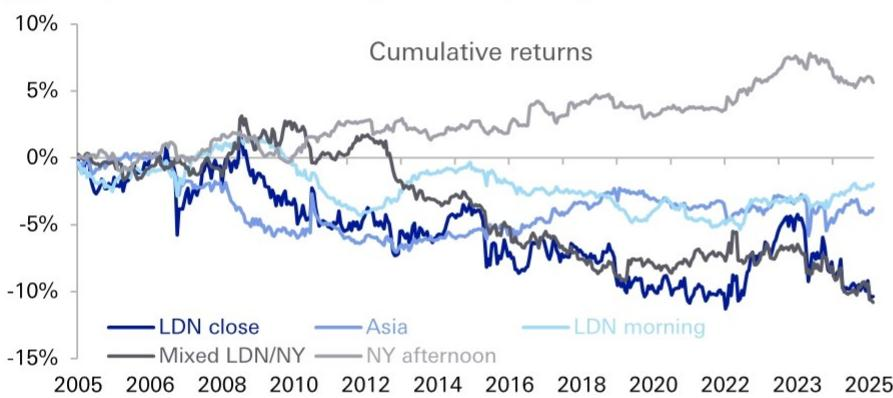  
来源：DB, Bloomberg Finance LP, Refinitiv Tick History。每条线显示按交易时段计算的8月累计回报。时段（伦敦时间）：亚洲 00:00–07:00，伦敦上午 (LDN) 07:00–12:00，伦敦/纽约重叠 (LDN/NY) 12:00–16:00，纽约下午 (NY) 16:00–20:00。

## 引言

本报告考察8月外汇市场中反复出现的季节性模式。为识别季节性，我们检验8月的回报是否在统计上与其他月份存在系统性差异。具体而言，对于每个货币对，我们将回报对8月虚拟变量进行回归。统计显著的系数表明，8月的回报在历史上持续高于或低于其他月份。我们将此框架应用于以伦敦收盘价、各交易时段回报以及日内回报衡量的数据，从而评估季节性是否存在，以及它在交易日中何时出现。

分析分三步进行。首先，我们确定8月季节性在收盘价和日内交易时段中的广泛程度。其次，我们展示较强且最持续的模式是日元对多数货币的强势，尤其是对高贝塔和套息货币。第三，我们考察主要的货币特定例外情况，包括ZAR和NZD，以区分8月整体风险偏好变化效应与更局部或资金流动相关的季节性模式。

## 8月季节性特征：哪些值得关注？

历史模式表明，季节性在8月的外汇回报中是一个重要因素，尤其是在使用每日收盘价而非日内波动衡量时。图2显示，在我们样本中的60个货币对中，超过20个基于每日收盘价表现出统计显著的8月季节性，而按跨时区回报衡量时约为15个（图3）。虽然8月每日价格季节性的广度与12月相似，但日内效应不那么明显：超过30个货币对在12月表现出日内季节性，而8月约为15个。

8月在历史上与风险偏好下降的市场行为相关。与此模式一致，我们发现日元倾向于对G10和新兴市场货币升值。这些收盘价变动主要由伦敦-纽约重叠时段（伦敦时间12:00–16:00）的价格行为驱动。我们还观察到一些新兴市场货币对美元偏弱，尤其是ZAR和MXN，这些变动主要发生在纽约下午时段（伦敦时间16:00–20:00）。

日元模式以及非重叠时段季节性货币对较少的事实表明，8月季节性并非仅由流动性条件驱动。在我们之前的研究中，我们认为外汇季节性可能源于与流动性相关的交易失衡，反映了读者倾向于在当地市场时段进行交易。然而，一些季节性模式可能由信息相关因素而非仅流动性需求驱动。8月价格变动集中在伦敦-纽约重叠时段，这与这一解释一致，因为该时段通常是全球交易日中信息最丰富的时期。就日元升值而言，我们发现伦敦上午时段的价格变动倾向于持续到伦敦-纽约重叠时段。与我们之前的发现一致，这种回报持续性可能反映了市场参与者之间的信息不对称，或随着信息逐步纳入价格，价格发现过程在不同交易时段中的延续。8月较低的市场流动性可能进一步放大这些信息驱动资金流的影响。

这有助于区分8月和12月，尽管这两个月在每日收盘价上都表现出较强的季节性。在12月，外汇季节性模式似乎与年末报告、资产负债表管理和投资组合再平衡相关的日历驱动流动性及对冲资金流联系更紧密；相比之下，8月的证据更多指向信息敏感的风险偏好变化动态，且被夏季较薄的流动性放大。

图2：基于伦敦收盘价的季节性广度在8月最高  
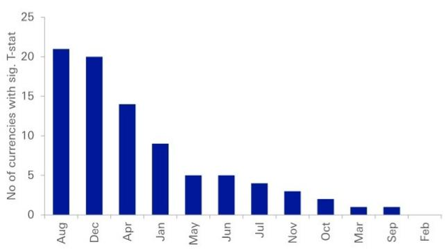  
来源：DB  
图3：基于日内价格的季节性广度在8月适中

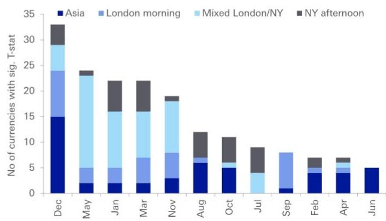  
来源：DB
时段（伦敦时间）：亚洲 00:00–07:00，伦敦上午 (LDN) 07:00–12:00，伦敦-纽约重叠 (LDN/NY) 12:00–16:00，纽约下午 (NY) 16:00–20:00。

## 对日元偏弱的货币季节性更强于对美元

8月呈现出外汇市场中最清晰的风险偏好变化季节性模式之一。虽然美元对许多货币倾向于走强，但主导特征是日元对多数货币的广泛强势。对于日元，其强势表现似乎由伦敦/纽约混合时段的变动驱动，而美元走强则似乎由纽约下午时段驱动。

美元与日元表现之间的对比在不同货币组中尤为明显。虽然新兴市场货币在8月对美元的偏弱程度通常超过G10货币，但对外汇整体而言，对日元的偏弱更为广泛和显著。这表明8月季节性不仅仅是美元强势现象，也反映了对防御性货币的更广泛偏好，其中日元成为主要受益者（图4-图8）。

图4：8月风险偏好变化 - G10和新兴市场货币对美元和日元偏弱  
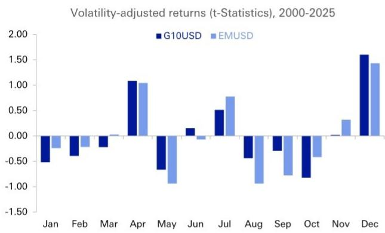  
来源：DB

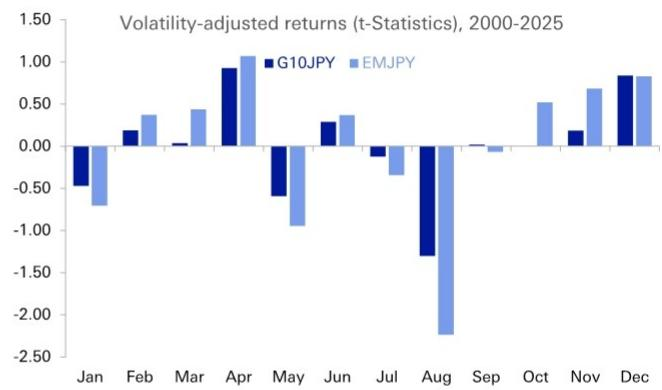  
图5：对日元偏弱的货币由伦敦/纽约混合时段驱动

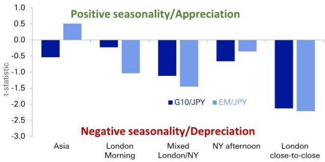  
来源：DB

图6：对美元偏弱的货币由纽约下午时段驱动  
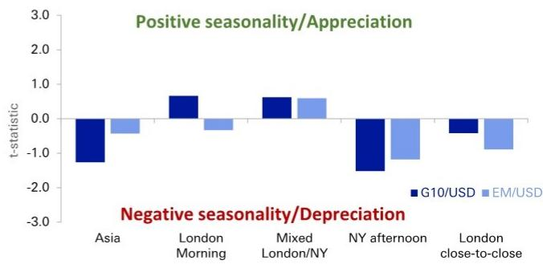  
来源：DB

图7：G10货币对日元的偏弱比对美元更一致  
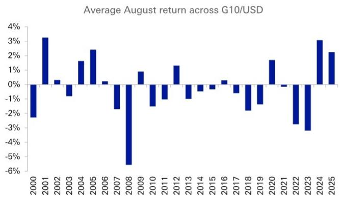  
来源：DB

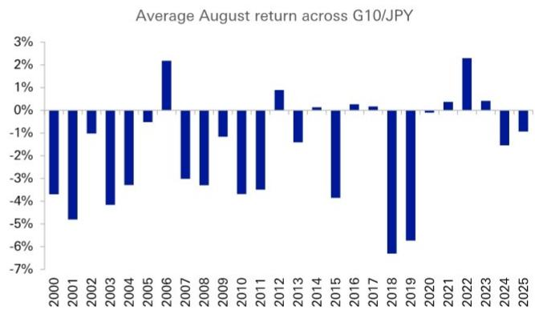

图8：新兴市场货币对日元的偏弱比对美元更一致  
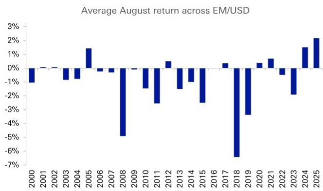  
来源：DB

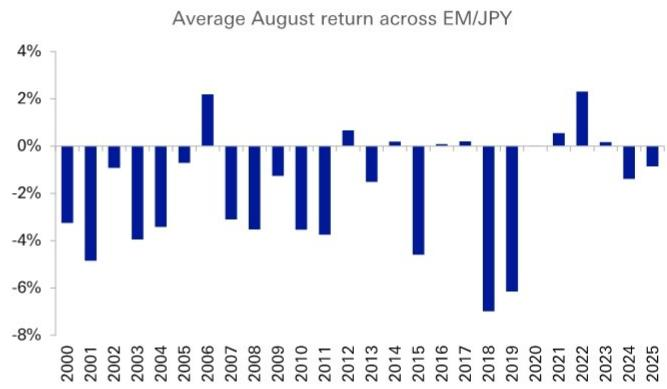

图9：货币倾向于对美元偏弱  
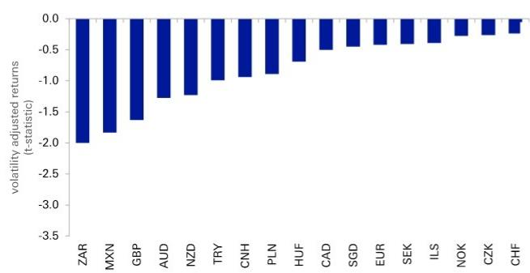  
来源：DB

图10：对日元偏弱更为明显  
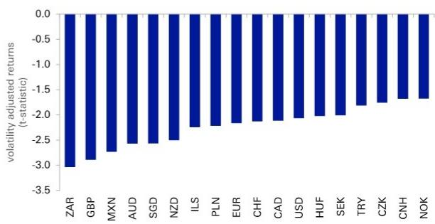  
来源：DB

高贝塔、商品和套息货币如ZAR、MXN、AUD和NZD经历了最大幅度的偏弱，表明夏季流动性降低和季节性风险降低共同促成了反复出现的避险动态。这一模式相当广泛，G10和新兴市场货币均对美元偏弱，且对日元偏弱更为显著，使得日元多头成为8月较强的季节性主题（图9和图10）。

新兴市场货币的偏弱也可能反映了重大宏观和地缘政治事件在夏季期间往往产生更大影响，此时市场流动性通常较薄。例如，8月曾发生多起重大风险事件，包括2011年欧洲主权债务危机升级和美国主权信用评级下调、2015年人民币汇率调整、以及2018年土耳其里拉波动。同样，2019年8月随着中美贸易关系紧张加剧，新兴市场货币也面临显著压力。这些事件表明，8月季节性可能不仅受流动性条件影响，也受信息相关因素影响，不确定性上升的时期会强化对日元等防御性货币的需求。

## ZAR对美元和日元偏弱

ZAR是我们样本中8月表现最弱的货币。对美元，其波动率调整后的回报（t统计量）约为-2.0，表明在统计上存在显著的贬值倾向。对日元的效果更为明显，t统计量降至约-3.1，是G10和新兴市场货币中最弱的读数。

8月在历史上对兰特而言是较为困难的月份。过去十年中，ZAR在约60%的8月对美元贬值，对日元贬值比例为70%。这一模式在更长的时间跨度上也很明显，过去20年中，兰特在13个8月对这两种货币均贬值。这种偏弱表现与8月整体风险偏好变化环境一致，在此期间读者倾向于青睐避险货币，尤其是日元。

尽管历史样本显示ZAR在8月对美元和日元均持续偏弱，但近期趋势并不一致。2024年对美元以及2025年对美元和日元，该模式并未出现，这与有利的商品价格动态、有吸引力的套息以及读者对南非资产情绪改善的时期相吻合（图11-图14）。

图11：ZAR通常对美元偏弱  
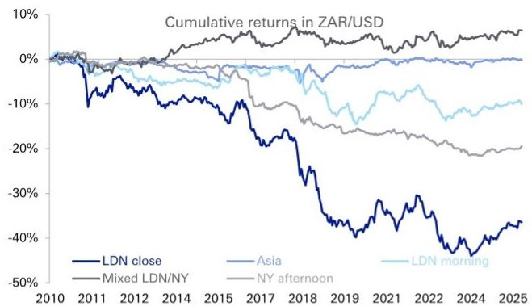  
来源：DB
时段（伦敦时间）：亚洲 00:00–07:00，伦敦上午 (LDN) 07:00–12:00，伦敦-纽约重叠 (LDN/NY) 12:00–16:00，纽约下午 (NY) 16:00–20:00。LDN close 表示伦敦收盘价回报。

图12：然而，2024-2025年ZAR对美元呈现更多买盘而非卖盘  
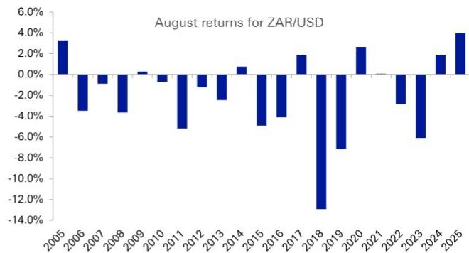  
来源：DB

图13：ZAR通常对日元偏弱  
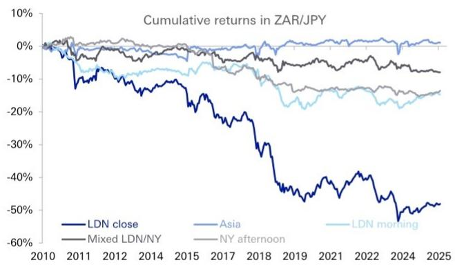  
来源：DB
时段（伦敦时间）：亚洲 00:00–07:00，伦敦上午 (LDN) 07:00–12:00，伦敦-纽约重叠 (LDN/NY) 12:00–16:00，纽约下午 (NY) 16:00–20:00。LDN close 表示伦敦收盘价回报。

图14：去年对日元的季节性偏弱，但强于对美元  
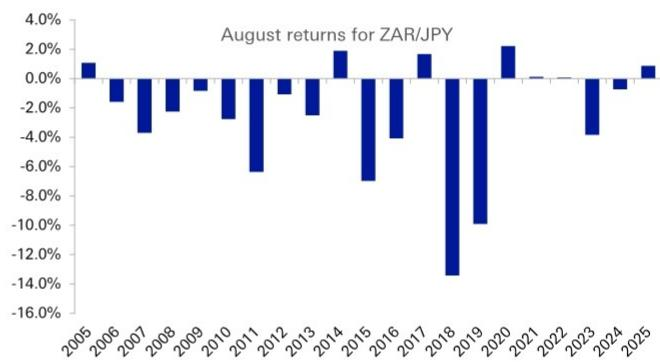  
来源：DB

## 日元交叉盘观察

在流动性较强的日元交叉盘中，日元在8月对所有G10货币均走强。对英镑的统计显著性最高，对挪威克朗最低。聚焦USD/JPY，日元在过去20个8月中有13个对美元升值，这一模式在2024年和2025年仍然较强（图15和图16）。在更细粒度上，美元和英镑对日元的最大跌幅通常出现在伦敦时间12:00至13:00之间（图17）。

图15：USD/JPY在8月偏弱  
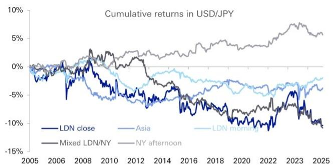  
时段（伦敦时间）：亚洲 00:00–07:00，伦敦上午 (LDN) 07:00–12:00，伦敦-纽约重叠 (LDN/NY) 12:00–16:00，纽约下午 (NY) 16:00–20:00。LDN close 表示伦敦收盘价回报。

图16：近期趋势对日元有利  
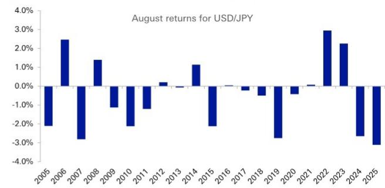  
来源：DB

图17：小时回报观察  
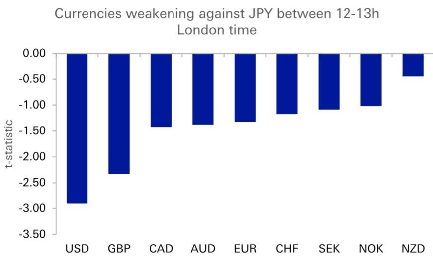  
来源：DB

## NZD收盘价偏弱由亚洲时段驱动

除日元和新兴市场货币外，NZD在8月对美元、欧元、加元和日元也呈现持续偏弱，尤其是在亚洲交易时段。从伦敦收盘价来看，这使得NZD对日元偏弱最为明显，其次是对欧元、美元和加元。这一模式可能不仅仅是风险情绪的函数。季节性贸易动态也可能发挥作用：8月通常是新西兰乳制品出口最弱的月份，反映了南半球冬季牛奶产量的季节性低谷。鉴于乳制品行业对新西兰经济的重要性，这些季节性贸易模式可能对NZD在8月反复出现的偏弱走势有所贡献。

图18：NZD在8月偏弱 – 波动率调整后回报（t统计量）  
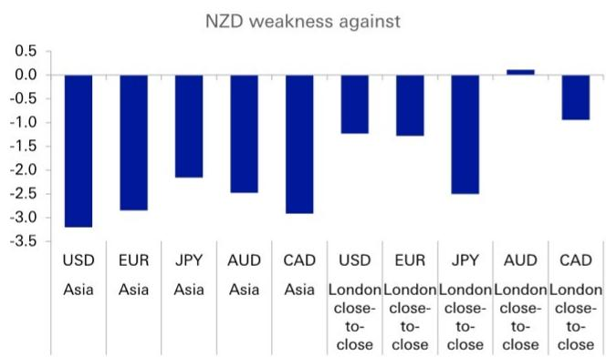  
来源：DB

图19：新西兰乳制品出口在8月最弱  
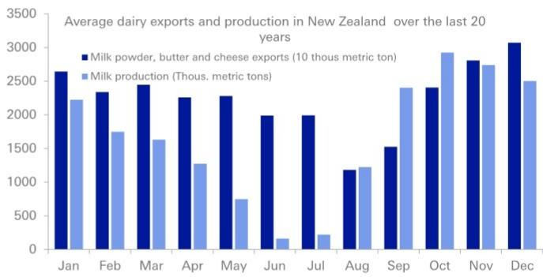  
来源：DB

## 附录：详细表格

## 图20：8月季节性 - T统计量

<table><tr><td></td><td>亚洲</td><td>伦敦上午</td><td>伦敦/纽约混合</td><td>纽约下午</td><td>伦敦收盘价</td><td></td><td>亚洲</td><td>伦敦上午</td><td>伦敦/纽约混合</td><td>纽约下午</td><td>伦敦收盘价</td><td></td><td>亚洲</td><td>伦敦上午</td><td>伦敦/纽约混合</td><td>纽约下午</td><td>伦敦收盘价</td><td></td><td>亚洲</td><td>伦敦上午</td><td>伦敦/纽约混合</td><td>纽约下午</td><td>伦敦收盘价</td></tr><tr><td></td><td colspan="5">G10/美元</td><td></td><td colspan="5">G10/欧元</td><td></td><td colspan="5">G10/日元</td><td></td><td colspan="5">G10交叉盘</td></tr><tr><td>欧元</td><td></td><td></td><td></td><td></td><td></td><td>美元</td><td></td><td></td><td></td><td></td><td></td><td>美元</td><td></td><td></td><td>-1.8</td><td></td><td>-2.1</td><td>英镑/瑞郎</td><td></td><td></td><td></td><td></td><td></td></tr><tr><td>日元</td><td></td><td></td><td>1.8</td><td></td><td>2.1</td><td>日元</td><td></td><td></td><td></td><td></td><td>2.2</td><td>欧元</td><td></td><td></td><td></td><td></td><td>-2.2</td><td>挪威克朗/瑞典克朗</td><td></td><td></td><td></td><td></td><td></td></tr><tr><td>英镑</td><td></td><td></td><td></td><td>-1.8</td><td></td><td>英镑</td><td></td><td></td><td></td><td></td><td></td><td>英镑</td><td></td><td></td><td></td><td></td><td>-2.9</td><td>澳元/新西兰元</td><td>2.5</td><td></td><td></td><td></td><td></td></tr><tr><td>加元</td><td>-2.1</td><td></td><td></td><td></td><td></td><td>加元</td><td></td><td></td><td></td><td></td><td></td><td>加元</td><td></td><td></td><td></td><td></td><td>-2.1</td><td>加元/挪威克朗</td><td></td><td></td><td></td><td></td><td></td></tr><tr><td>新西兰元</td><td>-3.2</td><td></td><td></td><td></td><td></td><td>新西兰元</td><td>-2.8</td><td></td><td></td><td></td><td></td><td>新西兰元</td><td>-2.2</td><td></td><td></td><td></td><td>-2.5</td><td>澳元/加元</td><td></td><td></td><td></td><td></td><td></td></tr><tr><td>澳元</td><td></td><td></td><td></td><td></td><td></td><td>澳元</td><td></td><td></td><td></td><td></td><td></td><td>澳元</td><td></td><td></td><td></td><td></td><td>-2.6</td><td>新西兰元/加元</td><td>-2.9</td><td></td><td></td><td></td><td></td></tr><tr><td>瑞郎</td><td>-1.8</td><td></td><td></td><td></td><td></td><td>瑞郎</td><td></td><td></td><td></td><td></td><td></td><td>瑞郎</td><td></td><td></td><td></td><td></td><td>-2.1</td><td>XAUUSD</td><td></td><td></td><td>1.8</td><td></td><td></td></tr><tr><td>瑞典克朗</td><td></td><td></td><td></td><td></td><td></td><td>瑞典克朗</td><td></td><td></td><td></td><td></td><td></td><td>瑞典克朗</td><td></td><td></td><td></td><td></td><td>-2.0</td><td></td><td></td><td></td><td></td><td></td><td></td></tr><tr><td>挪威克朗</td><td></td><td></td><td></td><td>-1.7</td><td></td><td>挪威克朗</td><td></td><td></td><td></td><td></td><td></td><td>挪威克朗</td><td></td><td></td><td></td><td></td><td>-1.7</td><td></td><td></td><td></td><td></td><td></td><td></td></tr><tr><td></td><td colspan="5">新兴市场/美元</td><td></td><td colspan="5">新兴市场/欧元</td><td></td><td colspan="5">新兴市场/日元</td><td></td><td colspan="5">新兴市场交叉盘</td></tr><tr><td>墨西哥比索</td><td></td><td></td><td></td><td>-2.4</td><td>-1.8</td><td>墨西哥比索</td><td></td><td></td><td></td><td></td><td></td><td>墨西哥比索</td><td></td><td></td><td></td><td></td><td>-2.7</td><td>加元/墨西哥比索</td><td></td><td></td><td></td><td>2.3</td><td></td></tr><tr><td>南非兰特</td><td></td><td></td><td></td><td>-2.7</td><td>-2.0</td><td>南非兰特</td><td></td><td></td><td></td><td>-2.5</td><td>-1.9</td><td>南非兰特</td><td></td><td></td><td></td><td>-2.0</td><td>-3.0</td><td>波兰兹罗提/以色列谢克尔</td><td></td><td></td><td></td><td></td><td></td></tr><tr><td>土耳其里拉</td><td></td><td></td><td></td><td></td><td></td><td>土耳其里拉</td><td></td><td></td><td></td><td></td><td></td><td>土耳其里拉</td><td></td><td></td><td>-1.8</td><td></td><td>-1.8</td><td>土耳其里拉/南非兰特</td><td></td><td></td><td></td><td>1.8</td><td></td></tr><tr><td>以色列谢克尔</td><td></td><td></td><td></td><td></td><td></td><td>以色列谢克尔</td><td></td><td></td><td></td><td></td><td></td><td>以色列谢克尔</td><td></td><td></td><td></td><td></td><td>-2.2</td><td></td><td></td><td></td><td></td><td></td><td></td></tr><tr><td>波兰兹罗提</td><td></td><td></td><td></td><td></td><td></td><td>波兰兹罗提</td><td></td><td></td><td></td><td></td><td></td><td>波兰兹罗提</td><td></td><td></td><td>-1.7</td><td></td><td>-2.2</td><td></td><td></td><td></td><td></td><td></td><td></td></tr><tr><td>匈牙利福林</td><td></td><td></td><td></td><td></td><td></td><td>匈牙利福林</td><td></td><td></td><td></td><td></td><td></td><td>匈牙利福林</td><td></td><td></td><td></td><td></td><td>-2.0</td><td></td><td></td><td></td><td></td><td></td><td></td></tr><tr><td>捷克克朗</td><td></td><td></td><td></td><td></td><td></td><td>捷克克朗</td><td></td><td></td><td></td><td></td><td></td><td>捷克克朗</td><td></td><td></td><td></td><td></td><td>-1.8</td><td></td><td></td><td></td><td></td><td></td><td></td></tr><tr><td>新加坡元</td><td></td><td></td><td></td><td>-1.7</td><td></td><td>新加坡元</td><td></td><td></td><td></td><td></td><td></td><td>新加坡元</td><td></td><td></td><td>-2.1</td><td></td><td>-2.6</td><td></td><td></td><td></td><td></td><td></td><td></td></tr><tr><td>离岸人民币</td><td></td><td></td><td>1.9</td><td>-3.8</td><td></td><td>离岸人民币</td><td></td><td></td><td></td><td></td><td></td><td>离岸人民币</td><td></td><td></td><td></td><td></td><td>-1.7</td><td></td><td></td><td></td><td></td><td></td><td></td></tr></table>

货币升值  
来源：DB, Refinitiv Tick History Database。亚洲：00-07，伦敦上午 (LDN)：7-12，伦敦/纽约混合 (LDN/NY)：12-16，纽约下午 (NY)：16-20。时区为伦敦时间。我们显示相对T统计量 ≥ 1.96，在95%置信水平下统计显著。

图21：8月季节性 - 命中率（%）

<table><tr><td></td><td>亚洲</td><td>伦敦上午</td><td>伦敦/纽约混合</td><td>纽约下午</td><td>伦敦收盘价</td><td></td><td>亚洲</td><td>伦敦上午</td><td>伦敦/纽约混合</td><td>纽约下午</td><td>伦敦收盘价</td><td></td><td>亚洲</td><td>伦敦上午</td><td>伦敦/纽约混合</td><td>纽约下午</td><td>伦敦收盘价</td><td></td><td>亚洲</td><td>伦敦上午</td><td>伦敦/纽约混合</td><td>纽约下午</td><td>伦敦收盘价</td></tr><tr><td></td><td colspan="5">G10/美元</td><td></td><td colspan="5">G10/欧元</td><td></td><td colspan="5">G10/日元</td><td></td><td colspan="5">G10交叉盘</td></tr><tr><td>欧元</td><td></td><td></td><td></td><td></td><td></td><td>美元</td><td></td><td></td><td></td><td></td><td></td><td>美元</td><td></td><td></td><td>52</td><td></td><td>69</td><td>英镑/瑞郎</td><td></td><td></td><td></td><td></td><td></td></tr><tr><td>日元</td><td></td><td></td><td>52</td><td></td><td>69</td><td>日元</td><td></td><td></td><td></td><td></td><td>73</td><td>欧元</td><td></td><td></td><td></td><td></td><td>73</td><td>挪威克朗/瑞典克朗</td><td></td><td></td><td></td><td></td><td></td></tr><tr><td>英镑</td><td></td><td></td><td></td><td>54</td><td></td><td>英镑</td><td></td><td></td><td></td><td></td><td></td><td>英镑</td><td></td><td></td><td></td><td></td><td>77</td><td>澳元/新西兰元</td><td>53</td><td></td><td></td><td></td><td></td></tr><tr><td>加元</td><td>52</td><td></td><td></td><td></td><td></td><td>加元</td><td></td><td></td><td></td><td></td><td></td><td>加元</td><td></td><td></td><td></td><td></td><td>73</td><td>加元/挪威克朗</td><td></td><td></td><td></td><td></td><td></td></tr><tr><td>新西兰元</td><td>52</td><td></td><td></td><td></td><td></td><td>新西兰元</td><td>51</td><td></td><td></td><td></td><td></td><td>新西兰元</td><td>47</td><td></td><td></td><td></td><td>62</td><td>澳元/加元</td><td></td><td></td><td></td><td></td><td></td></tr><tr><td>澳元</td><td></td><td></td><td></td><td></td><td></td><td>澳元</td><td></td><td></td><td></td><td></td><td></td><td>澳元</td><td></td><td></td><td></td><td></td><td>77</td><td>新西兰元/加元</td><td>51</td><td></td><td></td><td></td><td></td></tr><tr><td>瑞郎</td><td>56</td><td></td><td></td><td></td><td></td><td>瑞郎</td><td></td><td></td><td></td><td></td><td></td><td>瑞郎</td><td></td><td></td><td></td><td></td><td>58</td><td>XAUUSD</td><td></td><td></td><td>53</td><td></td><td></td></tr><tr><td>瑞典克朗</td><td></td><td></td><td></td><td></td><td></td><td>瑞典克朗</td><td></td><td></td><td></td><td></td><td></td><td>瑞典克朗</td><td></td><td></td><td></td><td></td><td>62</td><td></td><td rowspan="2" colspan="5"></td></tr><tr><td>挪威克朗</td><td></td><td></td><td></td><td>52</td><td></td><td>挪威克朗</td><td></td><td></td><td></td><td></td><td></td><td>挪威克朗</td><td></td><td></td><td></td><td></td><td>65</td><td></td></tr><tr><td></td><td colspan="5">新兴市场/美元</td><td></td><td colspan="5">新兴市场/欧元</td><td></td><td colspan="5">新兴市场/日元</td><td></td><td colspan="5">新兴市场交叉盘</td></tr><tr><td>墨西哥比索</td><td></td><td></td><td></td><td>53</td><td>65</td><td>墨西哥比索</td><td></td><td></td><td></td><td></td><td></td><td>墨西哥比索</td><td></td><td></td><td></td><td></td><td>69</td><td>加元/墨西哥比索</td><td></td><td></td><td></td><td>56</td><td></td></tr><tr><td>南非兰特</td><td></td><td></td><td></td><td>50</td><td>62</td><td>南非兰特</td><td></td><td></td><td></td><td>53</td><td>62</td><td>南非兰特</td><td></td><td></td><td></td><td>52</td><td>73</td><td>波兰兹罗提/以色列谢克尔</td><td></td><td></td><td></td><td></td><td></td></tr><tr><td>土耳其里拉</td><td></td><td></td><td></td><td></td><td></td><td>土耳其里拉</td><td></td><td></td><td></td><td></td><td></td><td>土耳其里拉</td><td></td><td></td><td>52</td><td></td><td>69</td><td>土耳其里拉/南非兰特</td><td></td><td></td><td></td><td>54</td><td></td></tr><tr><td>以色列谢克尔</td><td></td><td></td><td></td><td></td><td></td><td>以色列谢克尔</td><td></td><td></td><td></td><td></td><td></td><td>以色列谢克尔</td><td></td><td></td><td></td><td></td><td>69</td><td></td><td rowspan="6" colspan="5"></td></tr><tr><td>波兰兹罗提</td><td></td><td></td><td></td><td></td><td></td><td>波兰兹罗提</td><td></td><td></td><td></td><td></td><td></td><td>波兰兹罗提</td><td></td><td></td><td>51</td><td></td><td>58</td><td rowspan="5"></td></tr><tr><td>匈牙利福林</td><td></td><td></td><td></td><td></td><td></td><td>匈牙利福林</td><td></td><td></td><td></td><td></td><td></td><td>匈牙利福林</td><td></td><td></td><td></td><td></td><td>65</td></tr><tr><td>捷克克朗</td><td></td><td></td><td></td><td></td><td></td><td>捷克克朗</td><td></td><td></td><td></td><td></td><td></td><td>捷克克朗</td><td></td><td></td><td></td><td></td><td>54</td></tr><tr><td>新加坡元</td><td></td><td></td><td></td><td>52</td><td></td><td>新加坡元</td><td></td><td></td><td></td><td></td><td></td><td>新加坡元</td><td></
