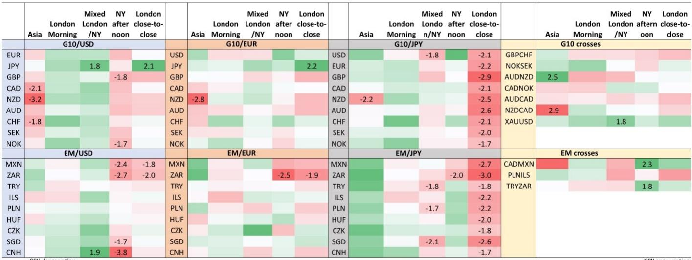
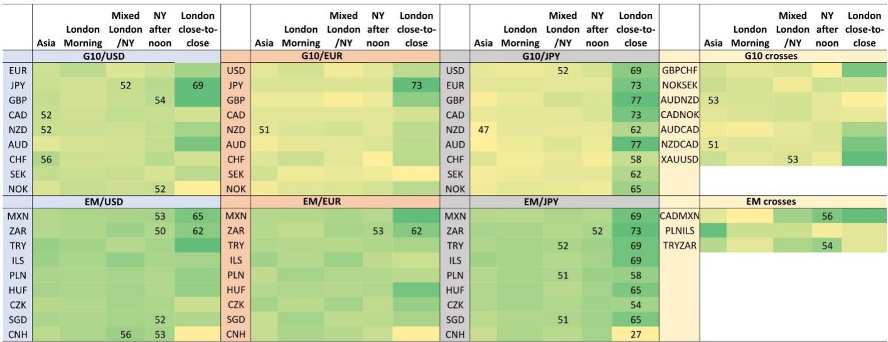

# 八月外汇季节性观察：日元走势与市场关注点

八月是外汇市场季节性特征较为明显的月份之一。一份基于60个货币对、跨越二十余年日收盘价和交易时段数据的研究发现，超过20个货币对在八月表现出统计显著的季节性走势。该研究的核心发现并非“八月美元走强”这类泛泛之谈，而是一个更具体、更值得关注的信号：八月的季节性主线是日元全面走强，而非美元单向升值。

研究通过将日收盘价拆解为亚洲、伦敦早盘、伦敦-纽约重叠时段和纽约午后四个交易时段，揭示了一个关键差异：十二月的外汇季节性主要由年末流动性驱动的对冲和再平衡资金流主导，而八月的季节性更接近信息敏感型的避险行为。日元升值的价格发现主要集中在伦敦-纽约重叠时段——全球信息密度最高的交易窗口，而非流动性充裕的本地交易时段。

这意味着，八月的外汇季节性并非简单的“夏季流动性稀薄导致波动放大”，而是市场在低流动性环境下对增量信息做出更集中、更持续的反应。对于关注宏观环境和汇率不确定性管理的读者而言，理解这一驱动机制的差异，比记住“八月日元走强”这个结论更有价值。

## 1. 日元走强的广度超过美元，高贝塔和利差货币承压最重

研究将货币对分为G10/美元、G10/欧元、G10/日元三组，分别检验八月回报的统计显著性。结果清晰：G10货币对日元普遍贬值，且统计显著性高于对美元的贬值。英镑对日元的t统计量达到-2.9，澳元为-2.6，新西兰元为-2.5，加元和瑞郎也超过-2.0。相比之下，G10货币对美元仅有挪威克朗和新西兰元表现出统计显著的贬值，且t值在-1.7至-1.8之间。

新兴市场货币的对比更为悬殊。南非兰特对日元的t统计量低至-3.0，墨西哥比索为-2.7，土耳其里拉为-1.8；而对美元，仅有兰特和比索表现出统计显著的贬值，t值分别为-2.0和-1.8。研究指出，高贝塔、商品和利差货币——兰特、比索、澳元、新西兰元——是八月跌幅最大的群体，这与夏季流动性降低和季节性不确定性削减引发的避险资金流向一致。

> **观察：** 这份研究最有用的分析框架不是“八月关注日元”，而是区分“对美元贬值”和“对日元贬值”的广度差异。如果只盯着美元指数，可能会错过日元交叉盘上更一致、更强烈的季节性信号。对于持有新兴市场或商品货币敞口的机构，八月日元交叉盘的对冲价值可能高于美元直盘。

## 2. 新西兰元走弱有独立于不确定性情绪的贸易面支撑

在新兴市场和G10货币普遍承压的背景下，新西兰元是一个值得单独讨论的例外。研究显示，新西兰元在八月对美元、欧元、加元和日元均表现出统计显著的贬值，且这一弱势主要由亚洲交易时段驱动——这与日元升值的伦敦-纽约重叠时段形成鲜明对比。

研究提出了一个超越不确定性情绪的补充解释：八月是新西兰乳制品出口的季节性低谷，对应南半球冬季产奶量的周期性下降。考虑到乳制品行业在新西兰宏观环境中的权重，这些季节性贸易流变化可能对新西兰元形成额外的节奏变化不确定性。研究将新西兰元对加元、新西兰元对澳元等交叉盘的八月走势纳入检验，发现新西兰元对加元的t统计量达到-2.9，进一步印证了这一贸易渠道的独立影响。

这一发现提醒读者：外汇季节性并非单一不确定性因子可以解释，特定地区的产业结构、贸易周期和资金流特征可能产生叠加或抵消效应。新西兰元的八月弱势，是不确定性情绪和贸易基本面共同作用的结果。

## 3. 季节性信号在2024-2025年出现局部偏离，但日元主线未变

研究没有回避历史模式与近期走势的差异。南非兰特在2024年和2025年八月并未延续对美元的贬值趋势，甚至在2025年对日元也出现升值。研究将其归因于大宗商品价格有利、利差吸引力和读者对南非资产情绪改善的共同作用。这是一个重要的限定条件：历史季节性不是预测，而是概率框架。

相比之下，美元对日元在2024年和2025年八月均延续了日元升值的模式，过去20个八月中日元在13个八月对美元升值。研究进一步拆解小时级数据发现，美元和英镑对日元的最大跌幅集中在伦敦时间12:00至13:00——即伦敦-纽约重叠时段的起始窗口。这一发现与研究核心判断一致：八月日元走强的价格发现过程具有高度集中的时间特征，而非均匀分布在交易日内。

对于需要管理外汇敞口的机构而言，这份研究提供了一个可操作的观察框架：关注八月伦敦-纽约重叠时段的日元交叉盘走势，而非简单依赖月度收盘价的历史均值。季节性信号的价值不在于“八月关注日元”这一结论本身，而在于理解信号背后的驱动机制、时间分布和适用边界。

For informational purposes only. Portions may be generated,translated,summarized,or edited with AI assistance based on source materials and may contain omissions or errors. Please verify independently. This is not investment,legal,tax,accounting,or other professional advice.

