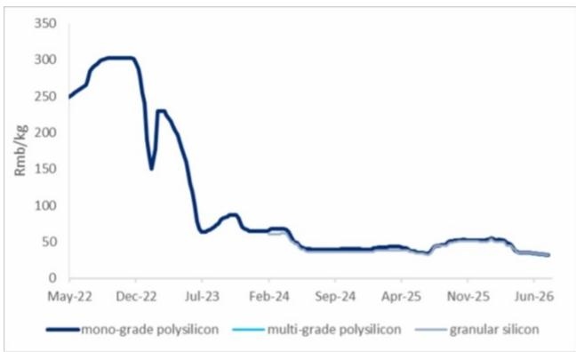
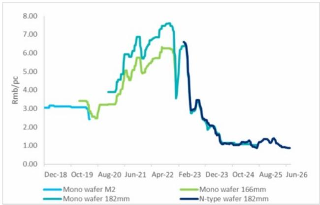
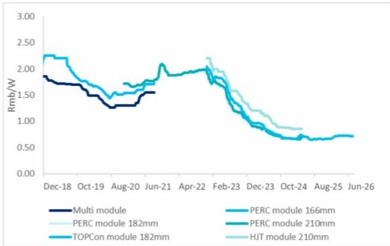
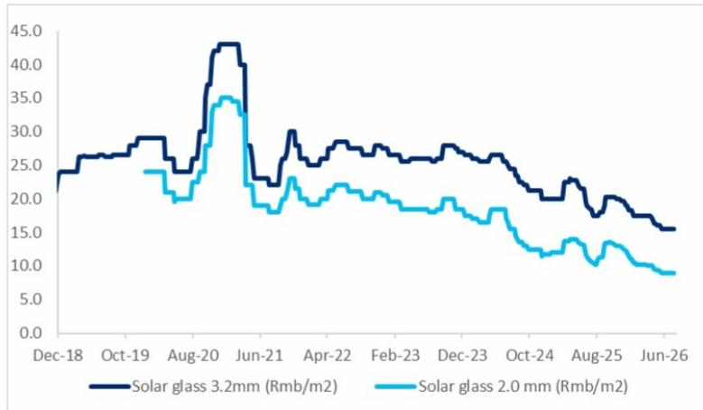

# 中国可再生能源行业观察

## 光伏产品价格变化；除逆变器和光伏薄膜企业外，多数公司处于亏损状态

## 研究观点

中国光伏供应链持续面临供应过剩导致的产品均价调整，包括多晶硅、硅片、电池片和组件价格周环比下降0.6-1.1%。受产品价格和需求变化影响，2026年上半年多数中国光伏设备供应商处于亏损状态，逆变器和光伏薄膜制造商除外。德业股份预计2026年第二季度净利润为14.8-15.4亿元（同比增长81-89%，环比增长25-30%），受益于储能需求强劲；杭州福斯特预计第二季度净利润为5.58亿元（同比增长489.3%，环比增长78.8%），得益于光伏薄膜价格上涨。组件制造商方面，隆基绿能2026年第二季度净亏损环比略有收窄，而晶澳科技亏损同比和环比均有所扩大。多晶硅制造商通威股份季度净亏损同比和环比基本稳定。在中国光伏和储能领域，我们关注出货量增长较高的储能制造商，如阳光电源和德业股份。

**多晶硅价格进一步下降**——截至2026年7月15日当周，n型棒状多晶硅平均市场价格下降0.8%至31.6元/公斤，颗粒硅价格持平于31.5元/公斤。据中国硅业协会数据，2026年7月中国月度多晶硅产量预计环比增长7.6%至超过10万吨，高于预期的月度需求9.1万吨。据SMM数据，截至7月15日，生产商工厂的多晶硅总库存为31万吨，周环比增长3.0%。

**硅片和电池片价格小幅周环比下降**——受需求影响，n型硅片市场价格周环比下降1.1%至0.86元/瓦（182mm产品），210mm产品周环比下降0.9%至1.16元/瓦。SMM估计，2026年7月中国硅片产量可能环比下降3.7%至52.3GW，截至7月9日库存水平周环比增长2.3%至27.9GW。据SMM数据，硅片环节已开始产能整合，二线和三线企业正在出租其产能。本周TOPCon电池片均价进一步下降0.9%至0.27元/瓦。

**光伏组件价格持续下降**——本周182mm光伏组件均价下降0.6%至0.71元/瓦。尽管大型地面电站项目的下游需求有所温和增长，但价格仍进一步下降。据SMM数据，2026年7月中国月度光伏组件产量预计环比增长11.0%至42.0GW。

**光伏玻璃价格持平**——光伏玻璃市场均价周环比持平，2.0mm产品为9.0元/平方米，3.2mm产品为15.5元/平方米。截至7月9日，行业平均库存天数为47.8天，周环比下降0.4%。据SCI99数据，截至7月9日，中国光伏玻璃在产日熔量周环比下降2.0%至79,750吨（同比下降15.2%），两条生产线停产。

**光伏企业2026年上半年业绩情况**——根据已发布的业绩预告，受产品价格影响，2026年上半年多数中国光伏企业仍处于亏损状态，逆变器和光伏薄膜制造商除外：

- 德业股份预计2026年上半年净利润同比增长75-79%至26.68-27.28亿元，其中第二季度净利润同比增长81-89%、环比增长25-30%至14.8-15.4亿元，受益于户用储能系统需求爆发式增长；
- 杭州福斯特预计2026年上半年初步净利润同比增长75.4%至8.69亿元，其中第二季度净利润同比增长489.3%、环比增长78.8%至5.58亿元，主要得益于光伏薄膜销售价格上涨；
- 福莱特预计2026年上半年净亏损3-4亿元，其中第二季度净亏损3.38-4.38亿元（对比2025年第二季度净利润1.55亿元和2026年第一季度净利润0.38亿元），受光伏玻璃价格大幅下降影响；
- 通威股份预计2026年上半年净亏损48-54亿元，其中第二季度净亏损24-30亿元（对比2025年第二季度亏损23.63亿元和2026年第一季度亏损24.44亿元）；
- 隆基绿能预计2026年上半年净亏损34-38亿元，其中第二季度净亏损15-19亿元（对比2025年第二季度亏损11.33亿元和2026年第一季度亏损19.20亿元）；
- 晶澳科技预计2026年上半年净亏损24-29亿元，其中第二季度净亏损13-18亿元（对比2025年第二季度亏损9.42亿元和2026年第一季度亏损10.67亿元）。

图1. 截至7月15日当周中国多晶硅价格

|  | 本周 | 周环比 | 月环比 | 同比 |
|---|---|---|---|---|
| 多晶硅（元/公斤） | 31.6 | -0.8% | -3.6% | -28.3% |
| 硅片（元/片） | 0.86 | -1.1% | -2.3% | -21.8% |
| 电池片（元/瓦） | 0.27 | -0.9% | -10.9% | 0.0% |
| 组件（元/瓦） | 0.71 | -0.6% | -1.3% | 7.9% |
| 玻璃-2.0mm（元/平方米） | 9.0 | 0.0% | 0.0% | -12.2% |

图2. 中国多晶硅周度价格

图3. 中国硅片周度价格

图4. 中国电池片周度价格

图5. 中国组件周度价格

图6. 中国光伏玻璃周度价格

## 提及公司：

福莱特（6865.HK）| 杭州福斯特（603806.SS）| 晶澳科技（002459.SZ）| 隆基绿能（601012.SS）| 德业股份（605117.SS）| 阳光电源（300274.SZ）| 通威股份（600438.SS）
