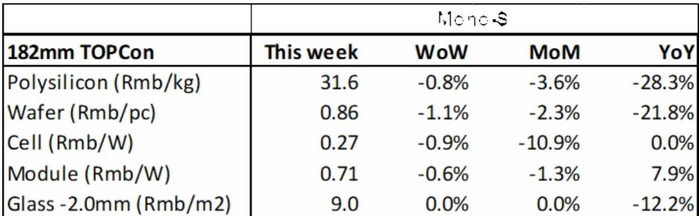
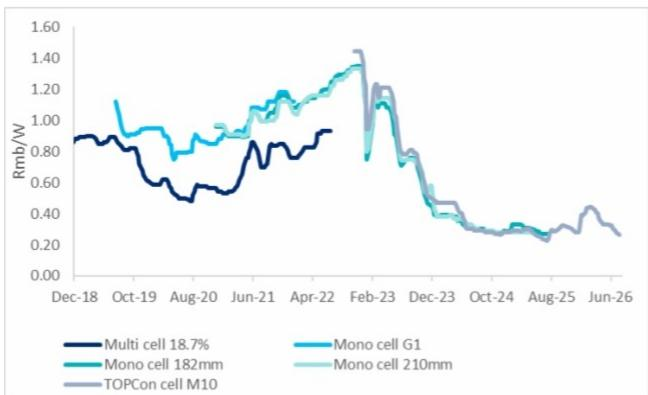

# 中国光伏供应链正分化为两种截然不同的利润模式——只有一侧值得研究

中国光伏产业已不再是一个所有参与者同涨同跌的单一同质化价值链。2026年上半年，逆变器制造商德业股份净利润同比增长75-79%，而多晶硅巨头通威股份同期净亏损48至54亿元人民币。这两个来自同一国家、同一行业、同一六个月的数据，揭示了一个多年来一直在积累的结构性裂痕。压垮组件、电池片、硅片和多晶硅价格的供应过剩，并非暂时的周期性低谷。这是一场价值从商品化制造向少数仍能凭借技术差异化和系统集成获得定价权的组件永久性重新分配。对于那些继续将整个中国可再生能源产业链视为一个交易的研究者来说，2026年中的数据显示，旧框架已不再适用。

截至2026年7月15日当周的价格数据，讲述了一个持续压缩的故事。多晶硅价格环比下跌0.8%，至每公斤31.6元人民币。182mm硅片价格下跌1.1%，210mm硅片价格下跌0.9%。太阳能电池片价格下跌0.9%，至每瓦0.27元人民币。组件价格下跌0.6%，至每瓦0.71元人民币。产业链中每一个主要的上游和中游环节都在同时失去定价权。整个周度表格中相对少见持平的是光伏玻璃，2.0mm产品维持在每平方米9.0元人民币——但即便如此，行业平均库存周期为47.8天，表明这种稳定更多是产能闲置的结果，而非真实需求的复苏。模式清晰：中国光伏的制造核心正处于一个任何单一公司都无法仅靠削减成本来打破的通缩螺旋中。

这次与以往低迷期的不同之处在于失衡的规模。2026年7月多晶硅月产量预计环比增长7.6%，超过10万吨，而月需求估计仅为9.1万吨。截至7月15日，生产商工厂的多晶硅总库存达到31万吨，环比增长3.0%。这大约是三个月的需求堆积在仓库中，且没有迹象表明需求会加速到足以吸收它。汛期提高了水电可用性，降低了多晶硅生产商的电力成本，并激励他们继续运行。但结果是，行业正在向一个已经无法消化现有库存的市场生产更多产品。当每个竞争对手都遵循相同的策略时，规模逻辑——建得更大、降低成本、赢得市场份额——已经走到了逻辑的尽头。

## 硅片层面的产能整合已经开始，但这是一个缓慢的失血，而非干净的复位

最明显的压力信号出现在硅片环节。根据SMM数据，二线和三线硅片生产商已开始出租其产能，而非关闭。这不是那种能恢复定价权的产能退出。租赁将运营风险转移给承租方，同时保持实体产能存活并可用。它阻止了市场再平衡所必需的供应减少。与此同时，中国7月硅片产量预计仅环比下降3.7%，至52.3吉瓦，而库存环比增长2.3%，至27.9吉瓦。产量与需求之间的差距仍然很大，租赁策略只是推迟了清算。对于研究者而言，这意味着硅片价格至少在几个季度内仍将面临压力，而最受此环节影响的公司——尤其是那些缺乏专有技术或下游内部需求的公司——将面临持续的利润率侵蚀。

同样的动态也适用于太阳能电池片和组件，尽管机制略有不同。TOPCon电池片价格环比下跌0.9%，至每瓦0.27元人民币，而182mm组件价格下跌0.6%，至每瓦0.71元人民币。7月组件产量预计环比增长11.0%，至42.0吉瓦，即便下游公用事业规模需求仅温和增长。行业正在向一个无法吸收的市场增加产量。从相对意义上讲，这不是需求问题——全球太阳能装机量持续增长——但这是一个结构性的供应过剩问题，需要数年才能解决。幸存下来的公司不会是那些名义产能最大的。它们将是那些能够最快退出商品化生产并将资本重新部署到仍存在定价权的环节的公司。

## 利润例外证明了规则：逆变器和光伏薄膜是仅存的定价权幸存环节

在全行业亏损的背景下，两个子行业脱颖而出。专注于住宅储能系统和逆变器的德业股份，预计2026年第二季度净利润为14.8至15.4亿元人民币，同比增长81%至89%，环比增长25%至30%。光伏薄膜制造商杭州福斯特，第二季度净利润为5.58亿元人民币，同比增长489.3%，环比增长78.8%，得益于其薄膜销售价格上涨。这些并非边际改善。在一个大多数同行都在亏损的行业中，这是爆炸性增长。

这种对比并非偶然。逆变器和光伏薄膜具有价值链其他环节所缺乏的两个特征。首先，它们不是纯商品。逆变器需要电力电子工程、软件集成以及日益重要的电网通信能力，这些都能区分不同产品。光伏薄膜虽然更接近材料业务，但仍涉及配方和质量一致性，从而形成进入壁垒。其次，这两个环节都受益于独立于组件定价的结构性需求驱动因素。欧洲和亚洲部分地区的住宅储能需求因零售电价和政策激励而增长，而非多晶硅成本。光伏薄膜需求与组件产量相关，但定价由数量更少、产能扩张更自律的供应商决定。

含义很明确：中国光伏行业并非处于统一的低迷期。它正在分化为一个损失是结构性的商品化环节和一个利润正在扩大的差异化环节。将整个行业视为单一主题的研究者将完全错过这种分化。

## 应对分化的决策框架

对于试图在中国可再生能源领域进行布局的机构研究者而言，2026年中的数据提出了一个三部分的资本配置框架。

首先，在组件层面而非收入层面筛选定价权。今天盈利的公司是那些其产品不易被竞争对手的相同产品替代的公司。逆变器、储能系统和特种薄膜符合这一标准。多晶硅、硅片、电池片和标准组件则不符合。上游环节的周度价格下跌并非随机波动；它们是市场对哪些产品已变得可互换的裁决。任何其主要产品是标准化太阳能商品的公司，都应基于以下假设进行评估：定价将持续恶化，直到大量产能退出市场——而这种退出尚未大规模发生。

其次，区分数量增长和利润率增长。像隆基绿能和晶澳科技这样的组件制造商仍在大量出货，但它们的净亏损正在扩大。隆基绿能第二季度净亏损为15至19亿元人民币，而2025年同期亏损为11.33亿元。晶澳科技第二季度亏损为13至18亿元人民币，而去年同期为9.42亿元。这些公司销售更多，但每次销售亏损更多。当单位经济为负时，数量是一种负担。商品化光伏制造的观察逻辑必须从“市场份额增长”转向“现金消耗率与资产负债表耐久性”。高债务负担和负经营现金流的公司，与持有净现金头寸的公司相比，面临不同的风险状况，即使两者都在报告亏损。

第三，将库存需求比作为复苏（或缺乏复苏）的领先指标。31万吨多晶硅库存对应9.1万吨月需求，意味着超过三个月的库存积压。27.9吉瓦的硅片库存对应52.3吉瓦的月产量，表明类似的不平衡。在这些比率开始有意义地下降之前，任何价格稳定都可能是暂时的。光伏玻璃环节（价格已持平数周）提供了一个警示性例子：当库存天数接近48天且产能闲置时，持平的价格并不意味着一个健康的市场。玻璃环节表面的稳定是减产的结果，而非需求强劲。同样的逻辑适用于上游。

## 二阶影响从太阳能延伸到储能和电网基础设施

商品化光伏制造与差异化组件之间的分化，其影响超出了周度价格数据直接涵盖的公司。储能是德业股份和阳光电源等逆变器公司的主要需求驱动力，它并非光伏行业的附属品。它正在成为一个独立的增长向量，拥有自己的经济性、政策驱动因素和技术周期。在光伏供应过剩时期，逆变器制造商的盈利能力表明，储能需求正在与光伏装机量脱钩。房主和商业用户购买储能是为了备用电源、峰谷套利和电网独立性——这些原因与太阳能组件是每瓦0.71元还是0.80元关系不大。

这种脱钩对于研究者应如何思考更广泛的清洁能源价值链具有战略意义。传统模式中，太阳能组件价格驱动整个系统的经济性，这一模式正在瓦解。储能的经济性越来越由电池成本、逆变器效率和软件优化决定——而非多晶硅价格。那些商业模式建立在太阳能和储能同步变动假设之上的公司，可能需要修正其预测。相反，那些将自己定位为纯储能或电力电子供应商的公司，可能比其行业分类所暗示的更少受到光伏供应链困境的影响。

同样的逻辑适用于电网基础设施。随着太阳能渗透率上升和储能部署加速，能源转型的瓶颈正从发电转向互联、电网稳定性和系统集成。解决这些瓶颈的公司——通过电力电子、控制软件或先进逆变器——正在捕获商品化制造商正在失去的价值。2026年7月的周度价格表不仅仅是一个困境行业的快照。它是一张价值流向的地图。

## 长远来看：产能纪律，而非技术突破，将决定下一个周期

光伏行业最持久的叙事之一是，下一次技术飞跃——无论是钙钛矿叠层电池、异质结还是背接触架构——将恢复定价权和盈利能力。2026年中的数据不支持这一观点。当前的困境不是技术问题。这是产能问题。代表当前主流技术的TOPCon电池片，其价格在一周内下跌了0.9%。问题不在于产品过时。问题在于太多公司同时为同一产品建造了太多产能。

技术转型可以暂时创造差异化，但在像中国这样快速发展的制造生态系统中，任何新技术都会迅速被复制和规模化。从这个周期中脱颖而出的公司，不一定是那些研发管线最好的。它们是那些有财务纪律停止建设无利可图产能、有战略清晰度退出商品化环节、以及有资产负债表实力承受多个季度负现金流的公司。二线和三线生产商出租硅片产能，表明一些参与者认识到了这一现实。多晶硅和组件产量的持续增长表明，其他参与者尚未认识到。

对整个行业而言，复苏之路在于产能关闭，而非需求加速。全球太阳能需求将继续增长，但增速不足以在短期内吸收当前的供应过剩。幸存的公司将是那些管理好现金、退出无利润生产线、并将资本重新部署到其产品不是价格接受者的环节的公司。失败的公司将是那些加倍押注规模、希望数量最终能恢复利润率的公司。2026年上半年的数据已经显示了哪种策略正在奏效。

*仅供参考。部分内容可能基于源材料通过AI辅助生成、翻译、总结或编辑，可能存在遗漏或错误。请独立核实。本文不构成研究、法律、税务、会计或其他专业建议。*

仅供参考。部分内容可能基于源材料通过AI辅助生成、翻译、总结或编辑，可能存在遗漏或错误。请独立核实。本文不构成研究、法律、税务、会计或其他专业建议。

