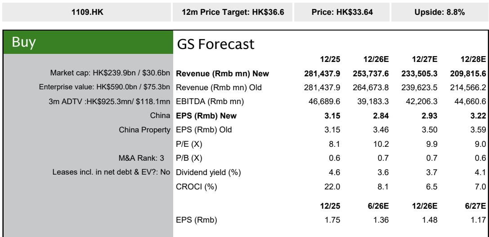
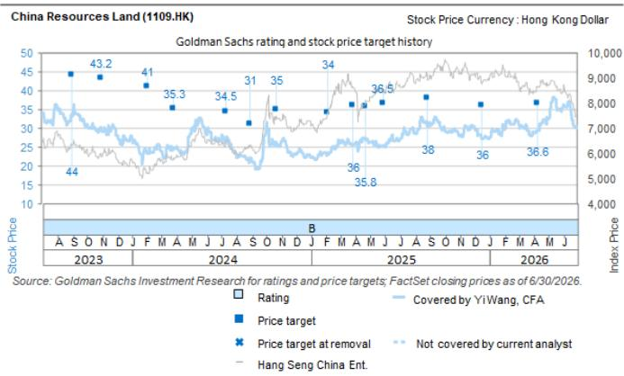

# GS：华润置地上半年预览，减值或超15.5亿元，处置收益与租金提供缓冲

这份GS研报的核心判断，与市场对头部国企开发商“安全且稳定”的普遍印象存在一个关键差异：华润置地2026年上半年净利润可能只是同比持平，而非增长。支撑这一判断的，不是开发业务回暖，而是一笔来自成都万象城REIT上市的处置收益，以及持续稳健的租金收入。换言之，如果没有资产标的化带来的非经常性收益，这家国企龙头的账面利润可能已经在承受来自低线城市房价变化的实质性影响。

报告将2026年开发业务毛利率预测下调了4个百分点至13.4%，并同步调降了2027至2028年的毛利率预期。这一调整的直接原因，是公司在一二线以外市场的老库存项目减值不确定性正在加大。GS估计，仅2026年上半年，这些项目的减值规模就可能超过15.5亿元，对利润表的影响“与较小的营收规模不成比例”。

但报告同时指出，华润置地的核心优势——购物中心运营——仍在提供稳定的对冲。2026年上半年，租金收入同比增长13%，明显好于同业个位数百分比的增速。成都万象城REIT上市募资约70亿元，对应评估价值超过100亿元，这笔处置收益为上半年利润提供了关键缓冲。

## 1. 开发业务仍在调整，但降幅可能好于同业

华润置地上半年合同销售额同比增长6%至1170亿元，表现优于GS覆盖的国企开发商平均持平的水平。土地购置金额约占合同销售的26%，与2025年全年相当，且新增项目的预计毛利率维持在约24%的稳健水平。报告特别提到，公司通过多元化渠道获取土地，包括从出险民企手中接手的地块。

但合同销售的好转并未直接转化为营收增长。GS预计，上半年开发业务营收将同比调整，主要原因是可结转项目规模与行业整体趋势一致，仍在下降通道中。毛利率可能跌破2024年上半年12.4%的历史低点，低线城市的定价环境仍在出现变化，老库存项目的盈利能力和减值计提不确定性都在上升。

> **KC评论：** 合同销售增长与营收下降并存，说明华润置地正在经历“卖得多、交得少”的阶段。市场更应关注的是毛利率何时见底，而非销售规模本身。报告认为，会计利润的底部可能在2027年出现，2028年才有望改善。

## 2. 租金收入和REIT化是利润的“双保险”

与开发业务的承压形成对比，华润置地的研究物业（购物中心）表现持续强劲。上半年租金收入同比增长13%，远超同业个位数增幅。公司还在积极推动更多购物中心资产通过C-REITs实现标的化，成都万象城REIT的上市只是一个开始。

这笔REIT上市带来的处置收益高达数十亿元级别，是上半年净利润能够同比持平的关键支撑。报告认为，未来新的C-REITs项目进展和潜在的处置收益，将是观察公司利润弹性的重要变量。

但报告也提出了一个值得关注的细节：万象城购物中心的租户成本率在2025年全年为11.5%。如果社会零售增速节奏变化或奢侈品消费趋势走弱，这一指标可能上升，进而影响租金收入的可持续性。

## 3. 估值折价收窄，但市场仍在等待盈利拐点

截至报告发布日，华润置地报价较2026年末预估净资产价值折让17%，对应2026年市净率1.1倍，2026至2028年平均股息率4.5%。作为对比，GS覆盖的国企开发商平均折让38%、市净率0.4倍、股息率2%。华润置地的估值溢价反映了市场对其资产质量和运营能力的认可。

但这份溢价能否维持，取决于几个关键变量：管理层对下半年减值规模和毛利率走势的指引；新C-REITs项目的推进速度；以及宏观政策能否有效提振就业预期和消费信心。报告特别提到，如果政策能从供给侧进一步支持市场，将是重要的催化剂。

> **KC评论：** 华润置地目前的估值已经隐含了“国企龙头+优质购物中心”的溢价，但市场尚未完全定价的是，开发业务毛利率的底部究竟在哪里。报告给出的答案是2027年，但前提是低线城市的房价不再出现超预期变化。

For informational purposes only. Portions may be generated,translated,summarized,or edited with AI assistance based on source materials and may contain omissions or errors. Please verify independently. This is not investment,legal,tax,accounting,or other professional advice.

For informational purposes only. Portions may be generated,translated,summarized,or edited with AI assistance based on source materials and may contain omissions or errors. Please verify independently. This is not investment,legal,tax,accounting,or other professional advice.

