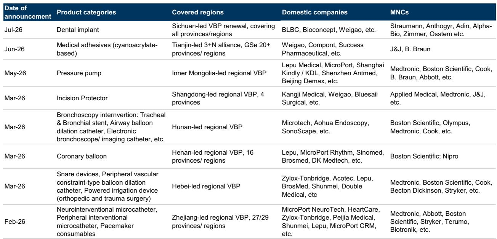

# 中国大型医疗设备集采：并非价格战，而是有利于具备全生命周期能力的现有企业的战略调整

7月14日，中国政府发布通知，将医疗设备集中采购的叙事从耗材转向大型设备，其截止日期令市场措手不及：每个省份必须在2026年底前完成至少一轮B类设备采购。这不仅仅是现有政策框架的扩展。这是一次有意的加速，表明北京方面有意对医院供应链中最昂贵、最不标准化的环节——单价在3000万至5000万元人民币之间的大型医疗设备——实施采购规范。

通知的措辞耐人寻味。它强调“优质优价”，而非最低采购成本。它指示采购评估方将全生命周期成本——包括耗材、维护和售后服务——纳入评分体系。这不是一个逐底竞争的机制。这是从交易型采购向价值导向采购的结构性转变，并对未来三年哪些公司将在中国的医院设备市场中胜出、哪些将失利具有深远影响。

那些关注中国耗材集采轨迹的观察者可能会认为，大型设备将遵循同样的模式：激进的价格削减、快速的市场份额整合，以及除最高效的国内领导者之外所有企业的利润率压缩。这种假设是错误的。大型设备集采至少在三个方面与耗材集采存在结构性差异：采购在省级层面分散进行，评估标准是多维度的，并且已安装的设备基础产生了耗材产品所不具备的转换成本。通知中对“技术适宜性”和“全生命周期成本”的强调，强化了这样一种论点：该政策旨在使定价合理化，而非摧毁定价。

B类设备——PET/MR、PET/CT、腹腔镜手术机器人和常规放射治疗系统——加速的时间表为省级政府和医院带来了近期的执行风险，它们现在必须在2026年底前设计采购框架、汇总需求并进行招标轮次。随着各省的准备工作，这一行政负担可能会暂时减缓招标活动，从而在未来几个季度对设备销售造成时间上的不利因素。但战略问题不在于未来六个月。而在于第一波省级集采轮次完成后，竞争格局将如何演变。

## 大型设备集采的省级结构创造了一个分散但可控的竞争环境，而非全国性的价格冲击

与在国家医疗保障局协调下进行的全国性耗材集采不同，大型设备集采被下放给省级政府。通知要求每个省份在2026年底前完成至少一轮B类设备采购，但并未规定统一价格或单一的全国招标框架。这并非疏忽。这是对大型设备采购本质上是分散的这一认识的体现。医院有不同的基础设施配置、临床需求和现有设备基础。适合一家医院平面布局和工作流程的PET/CT，在另一家医院可能需要进行重大改造。

这种分散化具有两个战略意义。首先，它限制了任何单一买方获取最大价格让步的能力。全国性的耗材集采可以汇总所有省份的需求，迫使供应商进入赢家通吃的拍卖。而省级的大型设备集采则是在每个省份内部汇总需求，这是一个更小的池子。供应商可以根据当地的竞争动态、现有设备基础关系和服务能力，在不同省份制定不同的价格。其次，分散化造成了有利于现有企业的行政复杂性。已经在各省拥有销售团队、服务工程师和备件分销网络的公司，可以同时应对多个省级招标流程。新进入者或较小的参与者则面临严峻的规模化挑战。

报告指出，要求在2026年底前完成采购的时间早于预期。这意味着省级政府需要在未来几个月内发布详细的实施细则。规则发布的速度因省而异，从而形成一个分阶段推出的局面，这有利于那些拥有广泛地理覆盖范围和强大地方政府关系的公司。对于像联影医疗这样的国内影像设备市场领导者而言，这种分散化是优势而非威胁。他们的省级销售基础设施已经到位。对于跨国公司而言，分散化增加了运营复杂性，但也使它们能够在服务质量与生命周期成本上竞争，而不仅仅是前期价格。

## 对生命周期成本和合理定价的重视，将竞争逻辑从单纯价格竞争转变为总拥有成本竞争

通知中最重要的句子，可能是指示采购评估方将“生命周期成本考量——包括耗材、维护和售后服务——纳入评估框架”的那一句。这与耗材集采模式直接不同，在耗材集采中，主要变量是单价。对于大型设备而言，在7-10年的设备生命周期内，前期购买价格通常仅占总拥有成本的30-40%。耗材、服务合同、零件更换和停机成本可能超过初始购买价格。

通过强制要求进行生命周期成本评估，该政策创建了一个框架，在此框架下，前期价格较高但服务成本较低、设备寿命较长的公司，可以战胜更便宜但可靠性较差的替代品。这对于那些在服务网络、远程监控能力和耗材集成方面进行了投资的公司来说，是一个结构性优势。而对于那些主要依靠前期价格竞争、不提供差异化服务或耗材套餐的公司来说，则是一个劣势。

报告明确指出，该政策旨在“消除不合理的价格虚高”，同时避免“逐底竞争的招标行为”。这种措辞表明，监管机构已经观察到了耗材集采的动态——在某些品类中价格降幅高达70-90%——并且不希望在大设备上复制这一结果。原因很简单：医院需要功能正常的设备，如果利润率被压缩到零，服务质量就无法维持。一家医院购买了一台便宜的核磁共振成像仪，但无法获得及时的服务或负担得起的替换零件，这并没有实现价值。该政策旨在防止这种情况发生。

对于观察者而言，这意味着大型设备集采的价格影响相对于耗材而言可能是温和的。报告没有提供具体的降价估计，但政策框架的逻辑表明，价格降幅可能在15-30%的范围内，而非50-70%。那些能够通过更长的设备寿命、更低的服务合同成本或集成的耗材来证明其卓越总拥有成本的公司，即使在集采框架下也将拥有定价权。

## A类设备面临全国性集采，但最复杂的系统暂时被排除在外，限制了价格压力的即时范围

该通知引入了一个在以往集采框架中不存在的两级结构。A类设备——先进的放射治疗系统，如MR-Linac和X射线立体定向放射手术系统（例如，射波刀），以及单价超过5000万元的设备——将由国家卫生健康委员会组织的全国性集采管理。B类设备将在省级层面处理。

关键的是，最复杂和定制化的A类系统——重离子和质子放射治疗系统——暂时被排除在当前集采框架之外。这些系统需要配套基础设施建设以及逐个设备的监管审批。它们不是可以汇总到采购池中的标准化产品。排除是务实的，但也表明监管机构认识到集采对于高度差异化、资本密集型、场地特定的设备的局限性。

对于制造A类设备的公司而言，全国性集采创建了一个单一的采购流程，可能导致比省级集采更激进的价格，因为需求是全国汇总的。然而，这些系统的市场规模很小——在中国每年只有几十台——因此即使价格降幅显著，收入影响也有限。真正的行动在B类，那里的数量更高，省级结构创造了更复杂的竞争动态。

报告指出，B类集采的范围将逐步扩大到其他具有高资本密集度和有限市场竞争特征的类别。这是一个前瞻性的声明，值得认真对待。一旦首轮省级集采在2026年底前完成，政府很可能会将更多设备类别添加到清单中。在第一轮中成功的公司将拥有后续轮次的模板。在第一轮中失去份额的公司可能难以恢复。

## 观察者的决策框架：评估哪些公司将从大型设备集采中受益的三个问题

大型设备集采框架很复杂，但可以归结为三个战略问题，观察者应该就每一家相关公司提出这些问题。

第一，公司是否拥有强大的省级销售和服务基础设施？省级集采要求公司同时应对多个采购流程，每个流程都有不同的评估标准、时间表和决策者。依赖集中销售模式或少数大型分销商的公司将难以覆盖所有省份。拥有省级销售团队、本地服务工程师和已建立的医院关系的公司将拥有竞争优势。

第二，公司能否证明其卓越的总拥有成本？在新的评估框架下，前期价格只是一个变量。能够量化更低服务成本、更长设备寿命或集成耗材套餐的公司，即使其前期价格更高，也能赢得投标。这有利于那些在服务网络和耗材业务上进行投资的公司。它不利于那些将设备视为一次性交易、没有持续服务收入的公司。

第三，公司是否有通过海外扩张来抵消国内价格压力的途径？报告明确指出，对于国内市场的领导者而言，价格影响可以通过集采下的市场份额增长和日益增长的海外扩张来部分抵消。这是一个关键点。那些能够利用集采获得国内市场份额——通过赢得省级投标和取代竞争对手——的公司，随后可以利用这种规模来投资于利润率更高的海外市场。对于赢家而言，集采成为了市场份额整合机制，而非利润率破坏机制。

对于手术机器人公司，报告增加了一个具体的细微差别：下一周期的配额发放仍然是比定价更重要的国内需求决定因素。在医院的采购仍受安装配额限制的情况下，较低的设备价格不太可能推动有意义的数量增长。这意味着集采对手术机器人数量的影响在短期内可能较为温和。这些公司的真正增长驱动力是海外市场，而非国内集采。

对于影像设备公司，报告确认PET-CT集采将保持在省级层面，没有全国性机制。这与先前的预期一致，并表明联影医疗在该细分市场的领先市场地位不太可能被颠覆。省级结构有利于具有广泛覆盖面的国内领导者。

## 分阶段推出造成近期招标放缓，将考验公司执行力，但结构性影响有利于具备生命周期能力的现有企业

报告警告称，设备集采的分阶段推出可能会减缓近期的招标活动，因为各省正在为新的采购框架做准备。这是一个观察者不应忽视的近期不利因素。计划在2026年下半年购买设备的医院可能会推迟决策，等待省级集采规则出台。公司可能会在未来几个季度看到订单量下降。

但中期前景则不同。一旦省级集采框架建立，采购流程将变得更加可预测，医院将有明确的采购决策指南。最有能力驾驭这一转型的公司是那些拥有强大省级关系、已证明的生命周期成本优势以及包括海外市场在内的多元化收入来源的公司。

该政策并非旨在摧毁大型设备行业。它旨在使定价合理化、消除低效，并奖励提供真正价值的公司。赢家将是那些能够在省级招标流程中证明这一价值的公司。输家将是那些依赖不透明定价、薄弱服务网络或缺乏生命周期成本优势的低前期价格的公司。

对于观察者而言，关键见解是大型设备集采与耗材集采根本不同。评估标准是多维度的。采购结构是分散的。价格压力可能是温和的。竞争动态有利于具有规模、服务能力和地理覆盖范围的现有企业。未来十二个月将揭示哪些公司已经建立了这些能力，哪些没有。

*仅供参考。部分内容可能基于源材料通过AI辅助生成、翻译、总结或编辑，可能存在遗漏或错误。请独立核实。这不构成任何专业建议。*

仅供参考。部分内容可能基于源材料通过AI辅助生成、翻译、总结或编辑，可能存在遗漏或错误。请独立核实。这不构成任何专业建议。

