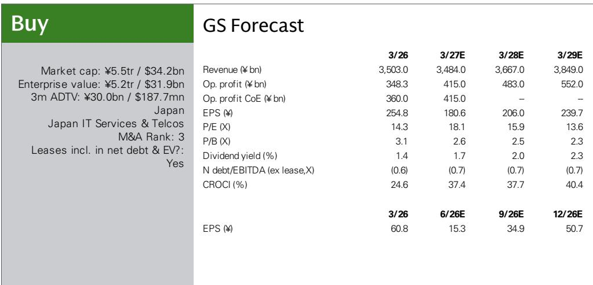
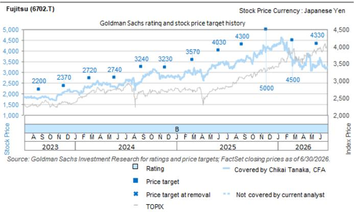

# GS：富士通与英伟达及多家公司合作推进物理AI

富士通在7月16日交易时段宣布，已与发那科、安川电机和川崎重工启动合作探索，目标是将基于英伟达技术的物理AI部署到工业机器人场景。这份GS研报的核心判断是：富士通正在从AI平台开发阶段，进入系统集成与商业化的实质阶段。但报告同时指出，市场当前更关心的是记忆体成本变化对短期盈利的影响，而非物理AI的长期故事。富士通报价近期弱于其他大型系统集成商，正是这一现象的体现。

富士通计划在2026年9月于石川县一家工厂启动测试，AI服务器生产预计在2027年1月至3月间开始，管理层预期物理AI业务将在FY3/28（2028年3月期）对盈利产生全面贡献。在其2035年中期经营计划中，物理AI被定位为新增3万亿日元业务的核心支柱。应用场景包括工厂机器人、零售与物流机器人以及医疗机器人。富士通的角色是提供核心控制系统——将AI服务器、AI平台、AI代理、物理OS和协同控制基础设施整合在一起，让AI决策能够直接驱动现实世界的设备。

> **KC评论：** 这份报告最有价值的细节不是合作本身，而是富士通对“协同控制基础设施”的定位——它计划与合作伙伴共同开发这一框架，并推动其成为开放的行业标准。如果成功，富士通在物理AI领域的角色将不仅是硬件供应商，而是类似于工业机器人领域的“操作系统”提供者。但报告没有完全展开的是，这一开放标准能否获得足够多的设备制造商支持，仍是未知数。

## 1. 物理AI的商业化路径已经清晰，但时间表仍有不确定性

富士通将物理AI业务分为四个技术层：AI服务器（富士通CPU+英伟达GPU）作为算力基础；AI平台和AI代理负责决策；物理OS负责设备级控制；协同控制基础设施负责多设备联网与自主协作。这一架构本身并不新鲜，新鲜的是富士通选择了与三家机器人制造商直接合作来开发协同控制层，而非自行研发所有组件。

报告给出的时间线是：2026年9月启动测试，2027年初开始AI服务器量产，FY3/28实现盈利贡献。这意味着从测试到规模化商用，至少需要18个月。对于一家以系统集成见长的公司，这个节奏并不算快，但考虑到物理AI涉及硬件、软件、通信协议和行业标准的协同，这一时间表已经相对务实。

## 2. 短期报价不确定性来自记忆体成本，而非业务基本面

报告明确指出，富士通报价近期弱于其他系统集成商，主要原因是市场对记忆体成本变化的关注。记忆体是AI服务器的重要组件，其价格波动直接影响硬件业务的毛利率。GS分析师认为，在即将公布的FY3/27第一财季（2026年4月至6月）业绩中，市场需要确认记忆体成本变化的幅度和持续时间。在此之前，报价可能持续承压。

但报告也暗示，一旦成本传导和组件采购不确定性得到缓解，读者将重新关注富士通的独特布局和增长潜力，包括物理AI业务的扩张。这一判断的逻辑是：记忆体成本是周期性因素，而物理AI是结构性增长故事，两者在时间维度上并不冲突。

## 3. 富士通在AI领域的差异化在于“系统集成”而非“硬件制造”

与许多日本科技公司不同，富士通在AI领域的定位并非芯片制造或算法开发，而是将AI能力嵌入到现有的大型系统集成业务中。报告提到，富士通在大型系统开发与集成、系统产品和基站领域拥有技术实力和know-how。物理AI业务本质上是对这一核心能力的延伸——从IT系统集成扩展到“IT+物理设备”的集成。

这一差异化的意义在于：富士通不需要与英伟达在AI芯片层面竞争，也不需要与发那科在机器人本体层面竞争。它的价值在于让这些技术能够在一个统一的控制框架下协同工作。如果这一框架能够成为行业标准，富士通将获得类似“平台税”的收益结构。但报告也指出，这一业务在FY3/28之前不会对盈利产生显著贡献，读者需要耐心。

## 4. 一个可复用的观察框架：如何评估“AI+传统产业”公司的研究价值

从这份报告可以提炼出一个评估框架：对于传统产业公司向AI转型的案例，需要同时关注三个维度——技术可行性（是否具备底层能力）、商业化路径（是否有明确的客户和场景）以及短期财务影响（转型成本是否可控）。富士通在技术可行性和商业化路径上得分较高，但短期财务影响（记忆体成本、AI服务器研究）仍是市场关注的焦点。

这一框架同样适用于其他正在向AI转型的日本系统集成商和工业自动化公司。报告没有直接比较，但隐含的逻辑是：富士通在物理AI领域的布局比竞争对手更早、更系统，但市场需要看到财务数据来验证这一布局的回报。

For informational purposes only. Portions may be generated,translated,summarized,or edited with AI assistance based on source materials and may contain omissions or errors. Please verify independently. This is not investment,legal,tax,accounting,or other professional advice.

For informational purposes only. Portions may be generated,translated,summarized,or edited with AI assistance based on source materials and may contain omissions or errors. Please verify independently. This is not investment,legal,tax,accounting,or other professional advice.

