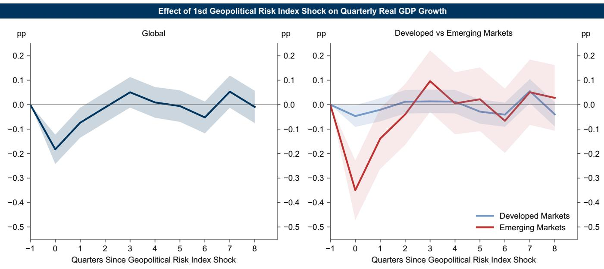
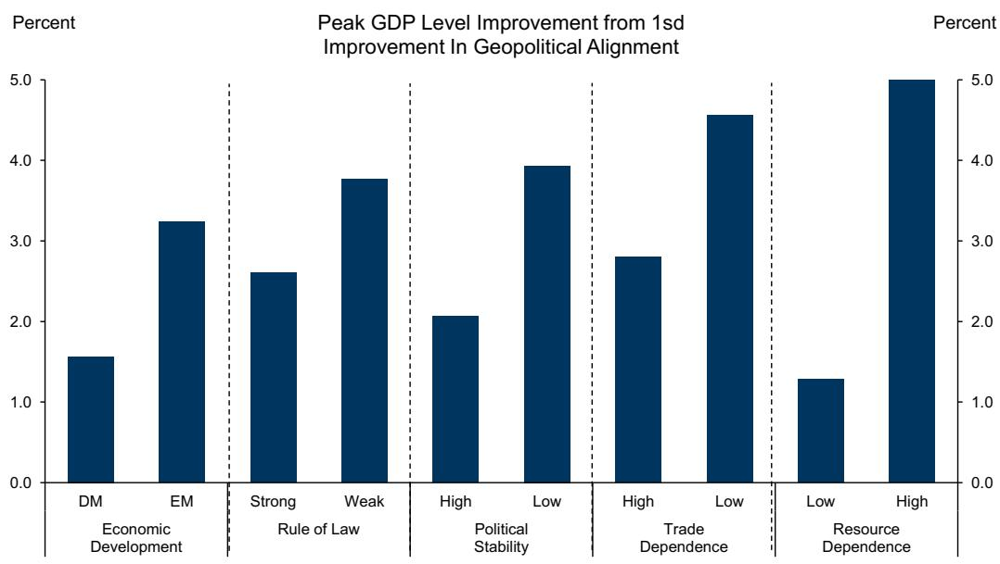
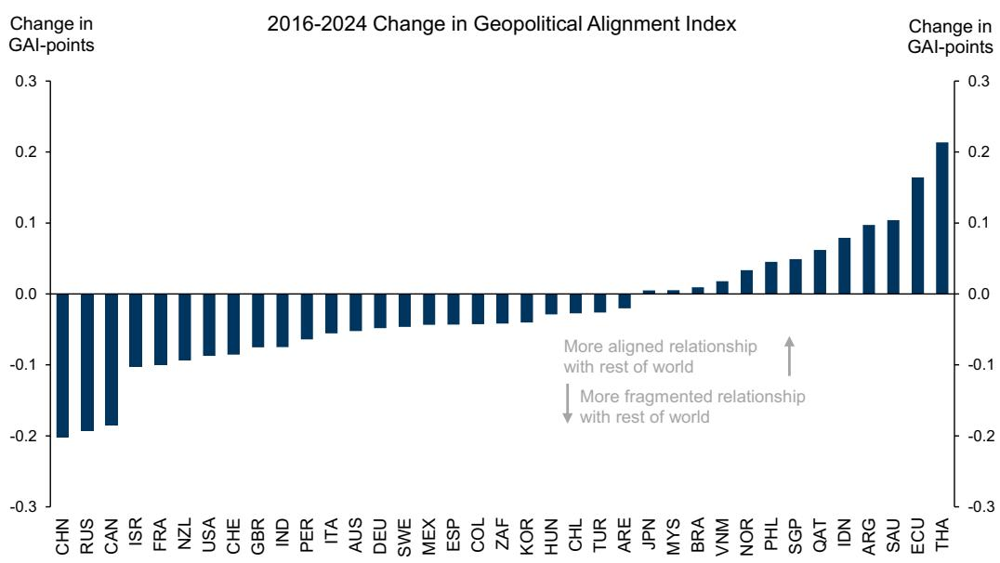

# 地缘关系调整，而非风险事件，是长期全球增长的主导驱动力

地缘风险事件占据头条，但它们并非中长期塑造全球经济的主要力量。根据一家全球性研究机构的分析，一个国家与世界其他地区的地缘关系发生一个标准差的变化，大约会在七年内为其GDP增加约3%。相比之下，即使是一场持续性的地缘危机（如伊朗战争），除了其商品价格影响外，也仅会在短期内使全球GDP增长减少约0.3个百分点。这种不对称性要求研究者和政策制定者从根本上重新评估如何衡量地缘风险。

地缘风险事件与地缘关系调整之间的区别并非仅仅是学术性的。风险事件——战争、恐怖袭击、外交危机——是急性的、显著的且短暂的。除了商品供应中断外，它们的经济影响是温和且暂时的。然而，关系调整是一种慢性状态：国家间关系的加强或恶化是在数十年间展开的，而非数日。一个单位的地缘关系冲击大约需要14年才能完全消退，而一个可比的地缘风险冲击则在两年内消散。这对资产组合构建、供应链策略以及主权风险评估具有深远影响。

这项分析基于两个新指数：一个衡量报纸中地缘事件报道强度的地缘风险指数，以及一个利用大型语言模型应用于全球事件数据库来量化国家间双边关系的地缘关系指数。自2010年代以来，这两个指数都显著恶化，并接近历史高位。然而，最新的关系数据早于2025年的关税公告和伊朗战争，这表明真正的分化程度可能被低估了。问题不在于分化是否重要，而在于如何衡量其经济后果，以及哪些国家会受益或受损最多。

## 短期地缘风险事件对增长的拖累，除商品渠道外，是温和且暂时的

传统观点认为地缘危机必然损害全球增长，这一观点需要大幅修正。除产油区外，大多数地缘风险事件与商品价格没有系统性关联。将地缘风险指数与全球月度油价变化进行散点图分析，并未发现有意义的相关性。福克兰群岛战争、北约轰炸南联盟以及2025年的美国关税公告都产生了重大的地缘头条新闻，但并未导致持续的油价飙升。

为了隔离非商品渠道，一个基于国家层面地缘风险指数对季度GDP增长的面板局部投影模型（控制油价因素）得出了清晰的结果。风险指数上升一个标准差——类似于某国在2025年关税公告后经历的增长——会使该国受影响季度的GDP增长降低0.2个百分点，并在下一季度再降低0.1个百分点。此后影响逐渐消退。这种拖累在新兴市场明显大于发达市场，这很可能反映了前者对风险规避型资本外流更为脆弱。但即使对新兴市场而言，其影响也是暂时的。

与2024年下半年相比，2025年上半年的全球地缘风险指数高出30%。这意味着，与没有发生伊朗战争的假设情况相比，前两个季度的全球增长大约低了0.3个百分点，预计下半年随着风险正常化会有所恢复。这并非微不足道，但其量级远小于关系调整的长期影响。对于研究者而言，其含义是明确的：通过商品敞口或避险资产来对冲地缘事件风险或许是合适的，但仅凭增长影响本身并不足以证明需要进行重大的资产组合调整。

## 地缘关系改善一个标准差，七年内GDP提升3%，由投资和贸易驱动

地缘关系调整的长期经济影响比事件风险更大且更持久。利用一个利用国家层面GDP加权平均双边地缘关系指数变化的局部投影框架，分析发现，一个国家与世界其他地区的关系改善一个标准差，会在七年内使其GDP水平提高约3%。这一幅度与日益增多的学术文献一致：范（2025）发现，关系永久性改善一个标准差会在25年内使人均GDP提高10%；而戈皮纳特、古林查斯、普雷斯特罗和托帕洛娃（2024）则记录到，自乌克兰局势变化以来，跨关系对立阵营的贸易和外国直接投资流量比同一阵营内的流量分别多下降了12%和20%。

关系改善提升GDP的渠道主要集中在投资和贸易。固定投资增长最为显著，因为关系的改善拓宽了进入全球资本市场的渠道，并降低了国内投资的风险溢价。随着关系降低贸易壁垒并深化双边商业往来，出口也显著增加。这种出口效应对较小经济体更为明显，它们从进入更大市场中获益更多。家庭和政府消费也有所增长，但增幅低于整体GDP，表明它们是投资和贸易增强的次级效应。

这些效应的持续性令人瞩目。GDP影响持续近十年，这反映了深化贸易关系、重新配置供应链以及调整资本存量所需的时间。这不是一个快速解决方案。但这意味着，当前正经历关系恶化的国家正在承受一种长期增长的代价，这种代价将在数年而非数季度内累积。

## 新兴市场从关系改善中获益更多，尤其是通过制度溢出效应

地缘关系改善带来的好处并非均匀分布。新兴市场获得的GDP增长显著高于发达市场，这基于三个不同的原因。首先，更紧密的关系有助于新兴市场摆脱资源开采型经济模式及其相关的波动性。其次，关系改善吸引了外国直接投资和资金流入，从而增强了资本形成和生产力。第三，也是最重要的一点，对于国内制度和治理较弱的国家，其效应更大。这表明，与其他国家更紧密的关系会通过直接经济渠道之外的方式产生积极的溢出效应，可能改善监管框架、合同执行和法治。

这一制度渠道具有重要的战略意义。对于新兴市场的政策制定者而言，改善与西方国家的地缘关系可能成为国内制度强化的补充改革策略。对于研究者而言，这意味着关系改善带来的增长红利，在起始制度最薄弱的国家——正是那些政治风险通常被认为最高的市场——可能最大。传统观点认为治理必须先于外国资本流入，这可能是不完整的；因果关系可能是双向的。

## 历史上，与西方国家改善关系带来的GDP增长大于与中国或俄罗斯改善关系

并非所有双边关系都具有同等价值。该分析将每个国家与特定伙伴的双边关系得分对该国GDP进行回归，并控制了国家和区域-时间固定效应。结果显示，与西方国家改善关系带来的GDP增长高于与中国或俄罗斯改善关系。有些出人意料的是，英国被视为改善双边关系最有价值的伙伴，甚至超过了美国。

这一发现反映了两种动态。首先，鉴于英国与美国之间紧密的历史关系，与英国双边关系的改善会导致与美国关系的内生性改善。英国指数可作为与美国关系的一个代理变量。其次，英国与欧洲大陆保持着紧密的经济和政治联系，因此与英国关系的改善可能同时捕捉到了与欧洲关系的改善。英国作为美欧之间桥梁的地位，使其成为与西方阵营整体关系最有效的代理变量。

对于正在考虑其地缘定位的国家而言，这一结果表明，与更广泛的西方经济和安全架构保持一致具有溢价。与一个西方国家改善关系的网络效应会溢出到其他国家，放大经济利益。相反，与西方国家关系的恶化则会带来不成比例的增长惩罚。

## 决策框架：如何在资产组合和策略构建中评估地缘风险

所呈现的证据支持一个结构化的框架，用于将地缘关系纳入研究和策略决策。该框架包含三个组成部分：衡量、情景分析和组合校准。

首先，衡量应侧重于关系趋势而非事件风险。地缘关系指数提供了一个可量化、可跨国家和跨时间比较的指标。研究者不仅应追踪其组合中国家关系的水平，还应追踪其轨迹。一个关系中等但正在改善的国家，可能比一个关系紧密但正在恶化的国家提供更好的风险回报特征。

其次，情景分析应考虑关系变化的长期GDP影响。假设地缘关系恢复到2010年代中期的水平，可能在本十年剩余时间内为全球GDP增加高达1%，其中新兴市场的收益尤为突出。相反，如果分化程度像2016年以来那样进一步加剧，长期来看将使全球GDP降低1%。这些并非尾部风险；它们是取决于未来几年政策选择和地缘发展的基准情景。

第三，组合校准应考虑地缘冲击的不对称持续时间。事件风险是短暂的，可以通过期权、商品敞口或避险资产进行对冲。关系风险是持久的，需要结构性调整：地域多元化、供应链冗余以及长期主权风险评估。对关系趋势判断错误的成本会随时间累积，而对事件风险判断错误的成本通常会在几个季度内得到解决。

对于企业策略制定者而言，该框架表明，供应链决策不仅应考虑关税成本和劳动力成本，还应考虑采购和制造所在地的地缘关系轨迹。一个在地缘上变得日益疏远的国家，可能提供短期成本优势，但同时也承担着贸易中断、资本流动逆转和制度恶化的长期风险。

*仅供参考。部分内容可能基于源材料通过AI辅助生成、翻译、总结或编辑，可能存在遗漏或错误。请独立核实。本文不构成专业建议。*

仅供参考。部分内容可能基于源材料通过AI辅助生成、翻译、总结或编辑，可能存在遗漏或错误。请独立核实。本文不构成专业建议。

