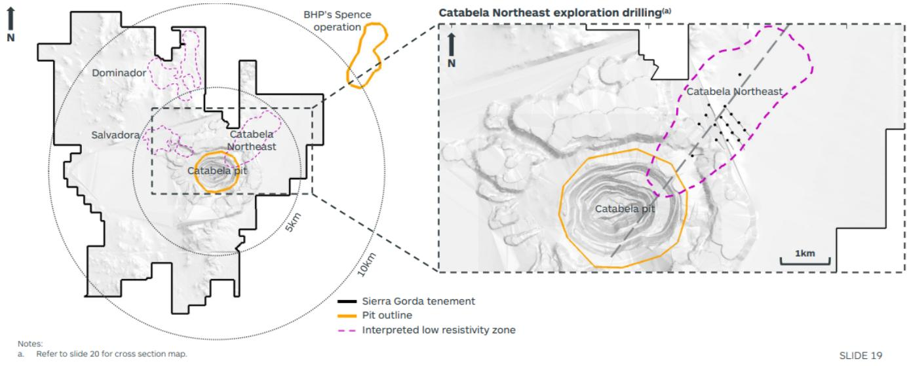
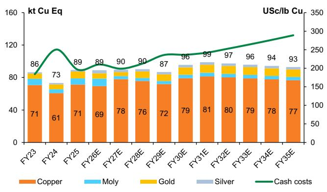
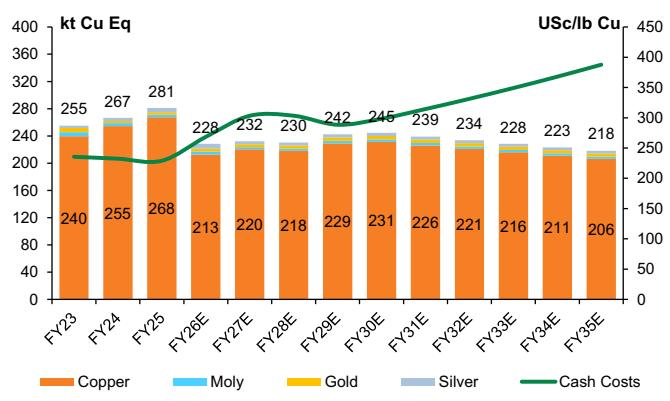
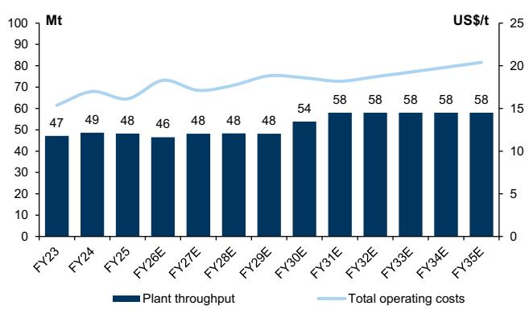
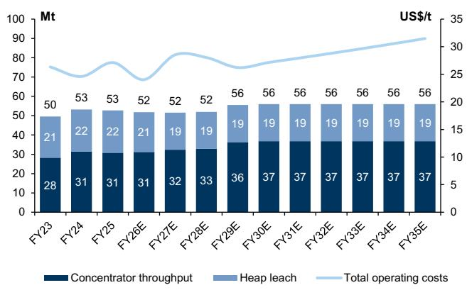
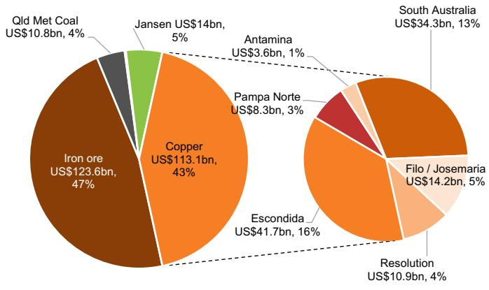

GLOBAL METALS & MINING

# BHP/S32 Copper; Spence and Sierra Gorda partnership could unlock US\$2-4bn in synergies

BHP's Spence copper mine and Sierra Gorda JV (55% KGHM/45% South32) recently signed a Memorandum of Understanding (MoU) to identify and evaluate opportunities for technical and commercial collaboration to improve productivity and unlock value between the two adjacent copper operations in Northern Chile, which are just 20km apart. We assessed potential synergies between the two mines and concluded that it could unlock US\$2-4bn in total value through collaboration on spare cathode and sulphide milling and mining capacity, as well as water, power, tailings, and procurement, which we detail below and summarize in Exhibit 2.

The MoU marks a first step in their collaboration, and any potential JV would take time to work through (commercial terms, permit amendments/approvals, etc.) and would, in our view, take 3-5 years to realize most benefits based on likely project analysis, development, and commercial time frames. At this stage, we do not include any benefit in our base case, and our analysis is a scenario only.

We estimate US\$2-4bn of key potential synergies: Our assessment of the two mines indicates there could be US\$1.0-1.7bn of potential synergy value for Spence, and US\$1.1-1.9bn for Sierra Gorda (both on a 100% basis) through collaboration on (outlined in the MOU but expanded by GS based on our analysis):

☐ Spare cathode capacity: Sierra Gorda (SG) has an oxide ore stockpile containing \~320kt of copper that could be trucked and processed at the Spence dynamic heap leach and cathode plant, which has \~130ktpa of spare cathode capacity. We think ore could be trucked and stacked at Spence over a 5-year period. The leaching/residence time period is \~3-6 months for oxides with an average recovery of \~70%. This could generate \~US\$200mn p.a. of EBITDA on our estimates.

☐ Optimizing/combining mine plans to fill sulphide mills: Longer-dated sulphide ore feed sharing between concentrators can be achieved through combining mine plans. For example, the Spence concentrator is only operating at 90% of nameplate (95ktpd) due to clay issues, but the mining fleet may have spare capacity (we note that our 2024 site visits suggest that SG’s mining fleet is more efficient than Spence’s), which could supply higher-grade ore to Spence. S32 recently announced that the Sierra Gorda JV has given final investment approval for its fourth grinding line (already in our base case), a brownfield plant expansion that will increase processing capacity from \~48Mtpa to \~58Mtpa (or from \~130ktpd to \~160ktpd; 100% basis). Note that BHP is due to reach FID on the \~US\$0.6bn Spence concentrator de-bottlenecking project (lifting throughput from 95ktpd to 105ktpd and recoveries by 3-7%) in 2027, and S32 recently announced an exploration target on the Catabela Northeast prospect (adjacent to the Catabela pit) of between 1.1-2.9Bt @ 0.45-0.48% TCu, with a technical assessment to be completed in 2026. This could extend the mine life of SG beyond the current \~20 years. Both plants have further expansion potential, and mine plans and mining fleets could be optimised to maximise production and lower costs.

☐ Procurement, Maintenance, and Concentrate transport savings, etc.: Cost savings could be achieved by combining procurement contracts such as equipment, explosives, chemicals, and concentrate transport. We estimate that 20-30% of site costs for both assets relate to maintenance and procurement. Assuming a 10% saving on annual procurement spend, we think the annual savings that could potentially be achieved are \~US\$10mn for Sierra Gorda (S32's share) and \~US\$30mn for Spence.

☐ Tailings: Depositing Spence tailings at SG could defer potentially >US\$500mn of remediation capex. BHP is spending over US\$1bn on extra drainage and higher walls (lifts) from FY26-30. BHP is evaluating non-conventional tailings (such as high density thickening and dry stacked tailings) to be implemented towards the back end of the decade, including high-rate thickeners that SG is already operating. The 4th milling line at SG requires tailings solid density to be increased to 62% solids (w:w). Spence is increasing its density from 53% to 65% solids, creating the possibility of depositing into the SG dam and deferring capex.

☐ Water & Power: Additional water supply from SG could underpin a possible future 5th milling line at SG (in addition to the recently approved 4th milling line), and could even be used on the heap leach at Spence, assisting the ful-sal leach technology (which uses salt as the catalyst for leaching secondary sulphides). SG has available seawater of 1,500l/s through a third-party provider and the 4th milling line will increase usage to \~80-85%. A 5th milling line at SG would push consumption beyond 90%, although we believe the pumps could be upgraded and sped up to increase flowrate beyond 1,500. Spence has a desalination plant running at 870l/s, but this is expected to reach full capacity of 1,000l/s by 2028 as it has some small take-or-pay commitments with third parties. Due to different design and materials, we note that the Spence plant cannot process seawater, but SG can process both seawater and desalinated water. Regarding power, SG has 20-30MW of spare power in its contract that could be utilised by Spence.

☐ Technology sharing: This includes truck automation, milling and copper and molybdenum flotation optimisation, high-rate thickener operational learnings, and others.

■ Potential value uplift: We value Spence at US\$8.4bn (\~3% of BHP's NAV) and Sierra Gorda at US\$10.4bn (on a 100% basis, S32's share \~35% of group NAV) despite Spence producing \~210ktpa of copper vs. Sierra Gorda at \~150-160ktpa. SG has a lower grade than Spence but is lower-cost and has higher by-product credits (Mo, Au, etc.), which results in a higher margin and generates more FCF/lb of copper. The potential \~US\$1.3bn (mid-point) for Spence would represent \~US\$0.25/sh, or a \~0.5% uplift, for our BHP NAV, and \~US\$1.5bn for Sierra Gorda (100% basis). We note these synergies represent \~10-20% of our NPV of the assets. We are Buy-rated on BHP.AX, Neutral-rated on BHP.L, and Not Rated on S32.AX and S32.L. In our view, deals like this make strong strategic sense, and we would expect BHP to pursue further similar transactions or asset-level JVs going forward, particularly across the Americas.

## Overview of potential synergies

Exhibit 1: BHP's Spence copper mine and the Sierra Gorda (KGHM 55%/South32 45%) in Northern Chile are just 20km apart  
  
Source: Company report

Exhibit 2: Key potential synergies could reach US\$2-4bn: Our assessment of the two mines indicates there could be US\$1.0-1.7bn of potential synergy value for Spence, and US\$1.1-1.9bn for Sierra Gorda (both on a 100% basis) through collaboration on the following:
Spence & Sierra Gorda's potential operational and financial synergies

<table><tr><td>Benefit / synergy</td><td>Details</td><td>Financial impact type</td><td>BHP synergy (US$bn)</td><td>S32 synergy (US$bn)</td><td>Sierra Gorda 100% (US$bn)</td><td>Assumptions / Comments</td></tr><tr><td>EBITDA / Opex synergies (US$bn)</td><td colspan="6"></td></tr><tr><td>Oxide ore from SG processed at Spence cathode plant</td><td>Spence has ~130ktpa of spare cathode capacity, and SG has an oxide ore stockpile containing ~320kt of copper (90Mt @0.35% Cu)</td><td>EBITDA</td><td>0.18</td><td>0.08</td><td>0.18</td><td>Based on profit sharing of trucking and processing oxides at Spence. Assume ore is trucked and stacked at Spence over a 5 year period. Leaching/residence time period is ~3-6m for oxides with average recovery of ~70%</td></tr><tr><td>Tailings from Spence deposited at SG tailings to defer capex</td><td>BHP is spending over US$1bn on extra drainage and higher walls from FY26-30</td><td>Opex</td><td>(0.08)</td><td>0.04</td><td>0.08</td><td>Assume some tailings from Spence can be deposited at SG by 2030 with SG receiving a fee from Spence of US$2-4/t. We believe BHP won&#x27;t be able to fully defer all tailings remediation capex</td></tr><tr><td>Procurement, Maintenance and Concentrate transport savings etc</td><td>Joining procurement contracts such as equipment, explosives, chemicals, concentrate transport</td><td>Opex</td><td>0.03</td><td>0.01</td><td>0.02</td><td>Assume 10% saving on annual procurement &amp; maintenance spend etc which we estimate represetes ~25% of total costs for both sites. Equates to an annual saving of ~US$10mn for Sierra Gorda (S32 share) and ~US$30mn for Spence</td></tr><tr><td>Optimising/combining mine plans - longer dated sulphide ore feed sharing between concentrators</td><td>Spence concentrator is only operating at 90% of nameplate due to clay issues, bur the mining fleet might have spare capacity</td><td>EBITDA</td><td>0.08</td><td>0.04</td><td>0.08</td><td>SG could have a larger resource base than Spence when including the potential 1-3Bt Catabela NE discovery located between SG and Spence. Both plants have further expansion potential and mine plans and mining fleets could be optimised to maximise production and lower costs. e.g. a ~10% uplift in production at Spence is worth ~US$2.5bn (NPV) at our LR copper price of US$5.2/lb (real $)</td></tr><tr><td>Total (US$bn p.a.)</td><td></td><td></td><td>0.22</td><td>0.16</td><td>0.37</td><td></td></tr><tr><td>Capex synergies (US$bn)</td><td colspan="6"></td></tr><tr><td>Tailings from Spence deposited at SG tailings to defer capex</td><td>BHP is spending over US$1bn on extra drainage and higher walls from FY26-30</td><td>Capex</td><td>0.50</td><td>NA</td><td>NA</td><td>Assume some tailings from Spence could be deposited at SG by 2030 with SG receiving a fee from Spence, although permits/approvals might need amending. BHP will unlikely be able to fully defer all capex as some remedial work is required</td></tr><tr><td>Water supply</td><td>SG has a 1,500l/s seawater pipeline and Spence has a 1,000l/s de-sal plant and pipeline</td><td>NPV</td><td>0.10</td><td>0.10</td><td>0.22</td><td>Additional water supply from SG could underpin a possible future 5th milling line at SG (in addition to the recently approved 4th milling line), and even be used on the heap leach at Spence assisting the ful-sal leach technology</td></tr><tr><td>Total (US$bn p.a.)</td><td></td><td></td><td>0.60</td><td>0.10</td><td>0.22</td><td></td></tr><tr><td>NPV of synergies (US$bn)</td><td colspan="6"></td></tr><tr><td>NPV - EBITDA / opex synergies</td><td></td><td></td><td>0.72</td><td>0.55</td><td>1.23</td><td>DCF over ~10yrs starting in Yr 3-5 (e.g. oxides 5yrs, sulphides and other synergies ~10-20yrs)</td></tr><tr><td>NPV - capex synergies</td><td></td><td></td><td>0.60</td><td>0.10</td><td>0.22</td><td></td></tr><tr><td>NPV - total synergies</td><td></td><td></td><td>1.32</td><td>0.65</td><td>1.45</td><td>GSe</td></tr><tr><td>Total synergies NPV range</td><td></td><td></td><td>1.0 - 1.7</td><td>0.5 - 0.8</td><td>1.1 - 1.9</td><td>+ / - 30% NPV</td></tr><tr><td>Indicative value uplift (US$/sh)</td><td></td><td></td><td>0.25</td><td>0.15</td><td></td><td>Mid point</td></tr></table>

Source: Company data, GS Global Investment Research

## Spence and Sierra Gorda copper projects

Exhibit 3: We value Spence at US\$7.7bn (\~3% of BHP's NAV) and Sierra Gorda at US\$10.4bn (on a 100% basis, S32's share \~35% of group NAV) despite Spence producing \~210ktpa of copper vs. Sierra Gorda at \~150-160ktpa. This is due to SG's lower costs and, therefore, higher margin and FCF
Spence and Sierra Gorda copper project summary table (100% basis)

<table><tr><td>Item</td><td>Units</td><td>Spence</td><td>Sierra Gorda</td></tr><tr><td>Ownership</td><td>%</td><td>BHP 100%</td><td>S32 45%, KGHM 55%</td></tr><tr><td colspan="4">R&amp;R (as at June 2025)</td></tr><tr><td>Reserve</td><td>Bt / % Cu</td><td>0.8Bt @ 0.5% Cu</td><td>0.7Bt @ 0.4% Cu</td></tr><tr><td>Resource</td><td>Bt / % Cu</td><td>2.3Bt @ 0.4% Cu</td><td>1.8Bt @ 0.4% Cu</td></tr><tr><td colspan="4">Production (FY26)</td></tr><tr><td>Ore mined</td><td>Mt</td><td>52</td><td>47</td></tr><tr><td>Strip ratio</td><td>Waste:Ore</td><td>0.8</td><td>1.8</td></tr><tr><td>Ore treated</td><td>Mt</td><td>52</td><td>46</td></tr><tr><td>Concentrator capacity</td><td>ktpd</td><td>95</td><td>130</td></tr><tr><td>Cathode palnt capacity</td><td>ktpa</td><td>200</td><td>na</td></tr><tr><td>Head grades - sulphides</td><td>% Cu / % Mo</td><td>0.6 / 0.02</td><td>0.4 / 0.02</td></tr><tr><td>Head grades - heap leach</td><td>% Cu</td><td>0.6</td><td>na</td></tr><tr><td>Recovery rates - sulphides</td><td>% Cu / % Mo</td><td>71% / 14%</td><td>81% / 35%</td></tr><tr><td>Recovery rates - heap leach</td><td>% Cu</td><td>70%</td><td>na</td></tr><tr><td>Copper in concentrate (payable)</td><td>kt</td><td>121</td><td>154</td></tr><tr><td>Cathode production</td><td>kt</td><td>91</td><td>na</td></tr><tr><td>Copper production total</td><td>kt</td><td>213</td><td>154</td></tr><tr><td>By-product production</td><td>kt Mo / koz Au / Moz Ag</td><td>0.9 / 12.7 / 1.3</td><td>3.7 / 40.9 / 1.6</td></tr><tr><td>Copper equivalent production</td><td>kt</td><td>228</td><td>183</td></tr><tr><td colspan="4">Unit costs (FY26)</td></tr><tr><td>Cash costs (incl TC/RCs)</td><td>US$/t / US$/lb</td><td>24 / 2.7</td><td>18 / 2.4</td></tr><tr><td>By-product credits (Mo, Au, Ag)</td><td>US$/lb</td><td>0.4</td><td>1.4</td></tr><tr><td>Cash costs net credits (incl TC/RCs)</td><td>US$/lb</td><td>2.3</td><td>1.0</td></tr><tr><td colspan="4">Capital expenditure (FY26-30)</td></tr><tr><td>Development</td><td>US$mn</td><td>1,180</td><td>831</td></tr><tr><td>Sustaining</td><td>US$mn p.a.</td><td>414</td><td>305</td></tr><tr><td colspan="4">Pricing</td></tr><tr><td>Commodity pricing (GSe LR)</td><td>US$/lb Cu / Mo / US$/oz Au / Ag</td><td>5.2 Cu / 18.1 Mo / 3,800 Au / 52 Ag</td><td></td></tr><tr><td>Copper conc payability</td><td>%</td><td>97%</td><td>97%</td></tr><tr><td colspan="4">Financials (FY26)</td></tr><tr><td>Revenue</td><td>US$mn</td><td>2,832</td><td>2,459</td></tr><tr><td>Opex</td><td>US$mn</td><td>1,245</td><td>859</td></tr><tr><td>EBITDA</td><td>US$mn</td><td>1,587</td><td>1,599</td></tr><tr><td>EBITDA margin</td><td>%</td><td>56%</td><td>65%</td></tr><tr><td>FCF</td><td>US$mn</td><td>557</td><td>558</td></tr><tr><td colspan="4">Valuation</td></tr><tr><td>NPV (100%)</td><td>US$bn</td><td>7.7</td><td>10.4</td></tr><tr><td>NAV per share (equity share %)</td><td>US$/sh / A$/sh</td><td>1.6 / 2.3</td><td>1.0 / 1.4</td></tr><tr><td>% group NAV</td><td>%</td><td>3%</td><td>34%</td></tr><tr><td>% group EBITDA (FY26)</td><td>%</td><td>5%</td><td>30%</td></tr></table>

Source: Company data, GS Global Investment Research

Exhibit 4: Additional water supply from SG could underpin a possible future 5th milling line at SG (in addition to the recently approved 4th milling line), and even be used on the heap leach at Spence, assisting the ful-sal leach technology (which uses salt as the catalyst for leaching secondary sulphides). SG has available seawater of 1,500l/s through a third-party provider and the 4th milling line will increase usage to \~80-85%. A 5th milling line at SG would push consumption beyond 90%

Spence and Sierra Gorda ore processed, throughput, and water consumption balance

<table><tr><td></td><td>Unit</td><td>Ore throughput (FY26)</td><td>Nameplate</td><td>Expansion*</td><td>Expansion^</td></tr><tr><td rowspan="2">Spence (sulphide ore) processed</td><td>Mtpa</td><td>31</td><td>35</td><td>38</td><td></td></tr><tr><td>ktpd</td><td>85</td><td>95</td><td>105</td><td></td></tr><tr><td rowspan="2">Spence (water) consumption</td><td>Mm3pa</td><td>25</td><td>28</td><td>31</td><td></td></tr><tr><td>l/s</td><td>789</td><td>880</td><td>972</td><td></td></tr><tr><td rowspan="2">Sierra Gorda (sulphide ore) processed</td><td>Mtpa</td><td>46</td><td>48</td><td>58</td><td>68</td></tr><tr><td>ktpd</td><td>127</td><td>132</td><td>159</td><td>186</td></tr><tr><td rowspan="2">Sierra Gorda (water) consumption</td><td>Mm3pa</td><td>28</td><td>29</td><td>35</td><td>41</td></tr><tr><td>l/s</td><td>884</td><td>920</td><td>1,104</td><td>1,294</td></tr></table>

\* Based on current expansions; Spence concentrator de-bottlenecking project (lifting throughput from 95ktpd to 105ktpd) and the SG 4th milling line. ^ based on possible 5th milling line at SG. Current water capacities (available) are: Spence 1,000l/s of de-sal, and SG's seawater supply contract with ENGIE, which ensures a flow of 1,500l/s from the Mejillones 1 and 2 thermal power plants until 2034. Based on industry benchmarking, we have assumed 0.6m3 of water per tonne of ore processed at SG, and 0.8m3 per tonne ore ore processed at Spence (to reflect higher water consumption for heap leach).  
Source: Company data, GS Global Investment Research

Exhibit 5: S32 recently announced an exploration target on the Catabela Northeast prospect (adjacent to the Catabela pit) of between 1.1-2.9Bt @ 0.45-0.48% TCu, with a technical assessment to be completed in 2026. This could extend the mine life of SG beyond the current \~20 years. Both plants have further expansion potential and mine plans and mining fleets could be optimised to maximise production and lower costs.  
  
Source: Company reports

## Production and valuation charts

Exhibit 6: Sierra Gorda is a highly efficient mining operation considering copper grades are just \~0.4% Cu with recoveries of \~80%

Sierra Gorda Cu Eq production by metal and cash costs (USc/Ib Cu Eq) - S32 45% share on a payable basis

  
Source: Company data, GS Global Investment Research

Exhibit 8: Spence is producing \~210ktpa of copper vs. Sierra Gorda at 150-160ktpa and SG has a lower grade than Spence; however, SG is lower cost and has higher by-product credits (Mo, Au, etc.), is higher margin, and generates more FCF/lb of copper

Spence Cu Eq production by metal and cash costs (USc/lb)

  
Source: Company data, GS Global Investment Research

Exhibit 7: The 4th milling line will increase throughput by a further \~20% to \~58Mtpa (\~160ktpd)

Plant throughput (Mtpa) and total operating costs (US\$/t milled) - 100% basis

  
Source: Company data, GS Global Investment Research

Exhibit 9: The SG oxide ore stockpile could be trucked and processed at the Spence dynamic heap leach and cathode plant, and could be trucked and stacked at Spence over a 5-year period.

Plant throughput (Mtpa) and total operating costs (US\$/t milled)

  
Source: Company data, GS Global Investment Research

Exhibit 10: We value Pampa Norte (\~US\$7.7bn Spence and \~US\$0.6bn Cerro Colorado) at \~US\$8.3bn or \~US\$1.6/sh for BHP

BHP's NAV (US\$bn & %)

  
Source: GS Global Investment Research

## BHP Group Limited (BHP.AX, BHPB.L)

## Investment thesis and risks

We continue to rate BHP.AX a Buy based on:

1. Near term FCF & balance sheet strong, supporting 60% payout: BHP is trading on a FCF yield of around \~3% over the medium term due to capex of \~US\$11bn, but at 4% at spot commodity prices and FX. With all copper growth projects including Vicuna in Argentina (Josemaria and Filo del Sol JV with Lundin Mining), Oak Dam (South Australia) and Resolution (USA, operated by RIO), this would see BHP's net debt stay around \~US\$6-9bn, well within the company's US\$20bn net debt ceiling. We note the recent completion of the US\$4.3bn silver streaming (US\$2bn Pilbara power sale expected 1H FY27) has strengthened the balance sheet further (GSe leverage just \~0.3x end of June 2026), and with strong iron ore and copper prices, we think BHP can maintain a 60% dividend payout through the forecast production dip in FY27, and fund its growth pipeline through cash flow and recycling capital from infrastructure (if needed).

2. Optionality with \~US\$50bn copper pipeline: we continue to believe that BHP's major opportunity is growing copper production in Chile at Escondida and Spence, Vicuna in Argentina (Josemaria and Filo del Sol JV with Lundin Mining), Oak Dam (South Australia) and Resolution. BHP is targeting production growth of \~3% CAGR between FY27-FY30 (vs. our \~1.5% estimate) and 3-4% between FY30-FY35 (vs. GSe at \~2%) with the starting year of FY27 being the low point over the medium term and \~3% below FY26 due to expected lower grades Escondida.

3. Relative valuation, but superior margins and operating performance to peers: BHP is currently trading at \~0.9x NAV but at \~7.3x NTM EBITDA, above the 25-yr average EV/EBITDA of 6.5-7x. However, over the last 10 years, BHP has traded at a \~0.5x premium to global mining peers. We believe this premium can be partly maintained due to ongoing superior margins and operating performance (particularly in Pilbara iron ore where BHP maintains superior FCF/t vs. peers, and at Escondida copper).

We are Neutral-rated on BHPB.L on relative valuation vs. our UK mining coverage. Our NAV and our 12-month price targets are £35.4/sh and £30 (unchanged) respectively.

Our 12-month price targets are set at an equal 50:50 blend of NAV and EV/EBITDA with a 7.5x target multiple for BHP.AX and 6.0x for BHP.L.

Investment risks: (1) Macro factors: FX (AUD, CLP, CAD), commodity prices over the next 12 months, (2) Fluctuating operating costs and capex, (3) Project execution timelines, (4) Fiscal risks, (5) External M&A.

Exhibit 11: BHP.AX operating and financial summary

<table><tr><td colspan="2">Commodity and FX assumptions</td><td>2024</td><td>2025</td><td>2026E</td><td>2027E</td><td>2028E</td><td>2029E</td><td>2030E</td></tr><tr><td>AUD:USD</td><td>x</td><td>0.66</td><td>0.65</td><td>0.68</td><td>0.69</td><td>0.69</td><td>0.69</td><td>0.70</td></tr><tr><td>USD:CLP</td><td>x</td><td>907</td><td>951</td><td>920</td><td>921</td><td>909</td><td>885</td><td>862</td></tr><tr><td>Iron ore fines (CFR, 62% Fe)</td><td>US$/t</td><td>119</td><td>101</td><td>104</td><td>97</td><td>96</td><td>97</td><td>98</td></tr><tr><td>Copper</td><td>USc/lb</td><td>394</td><td>423</td><td>534</td><td>623</td><td>624</td><td>617</td><td>607</td></tr><tr><td>Coking coal (Prem. HCC)</td><td>US$/t</td><td>287</td><td>196</td><td>214</td><td>245</td><td>243</td><td>248</td><td>253</td></tr><tr><td>Thermal coal (6,000kcal)</td><td>US$/t</td><td>138</td><td>123</td><td>119</td><td>128</td><td>120</td><td>121</td><td>121</td></tr><tr><td>Potash</td><td>US$/t</td><td>320</td><td>314</td><td>372</td><td>365</td><td>383</td><td>408</td><td>434</td></tr></table>

<table><tr><td colspan="9">Production</td></tr><tr><td>Escondida</td><td>kt</td><td>1,125</td><td>1,305</td><td>1,261</td><td>1,063</td><td>1,033</td><td>974</td><td>969</td></tr><tr><td>Guidance</td><td></td><td></td><td></td><td></td><td>1,000-1,100</td><td></td><td>900-1,000</td><td></td></tr><tr><td>South America (ex Escondida)</td><td>kt</td><td>410</td><td>387</td><td>364</td><td>357</td><td>352</td><td>363</td><td>365</td></tr><tr><td>South Australia (Olympic Dam, Carra, Prom Hill)</td><td>kt</td><td>335</td><td>328</td><td>331</td><td>304</td><td>283</td><td>349</td><td>372</td></tr><tr><td>Copper (Consolidated)</td><td>kt</td><td>1,869</td><td>2,019</td><td>1,956</td><td>1,724</td><td>1,667</td><td>1,686</td><td>1,706</td></tr><tr><td>Guidance</td><td></td><td></td><td></td><td></td><td>1,650-1,800</td><td></td><td></td><td></td></tr><tr><td>Copper (Equity)</td><td>kt</td><td>1,391</td><td>1,465</td><td>1,420</td><td>1,272</td><td>1,228</td><td>1,272</td><td>1,295</td></tr><tr><td>Iron ore</td><td>Mt</td><td>260</td><td>263</td><td>265</td><td>267</td><td>272</td><td>280</td><td>286</td></tr><tr><td>WAIO (100%)</td><td>Mt</td><td>287</td><td>290</td><td>291</td><td>294</td><td>298</td><td>303</td><td>310</td></tr><tr><td>Guidance</td><td></td><td></td><td></td><td></td><td>286-298</td><td></td><td>&gt;305</td><td></td></tr><tr><td>Met coal</td
