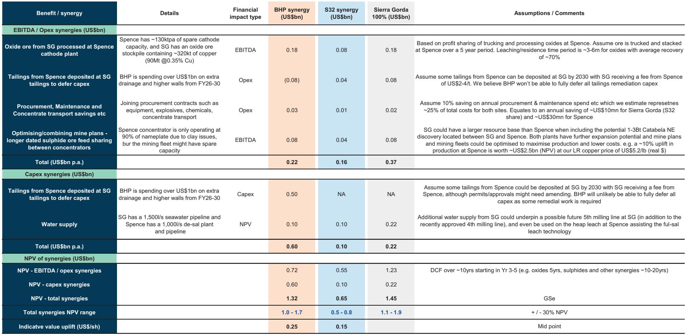
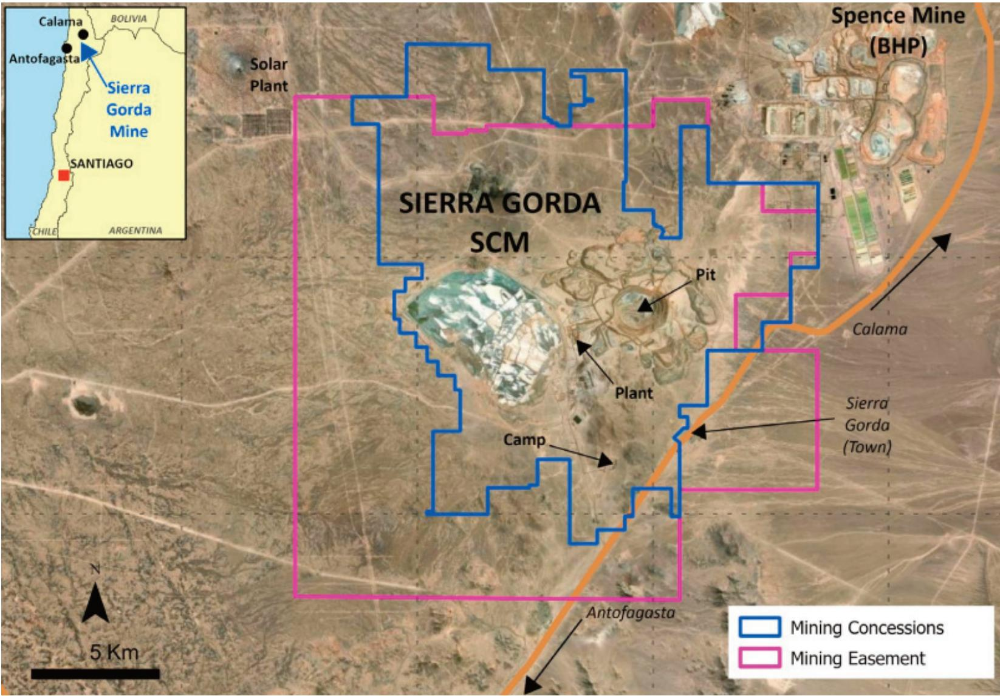

# GS：BHP智利铜矿合作可释放20-40亿美元协同效应

两家相距仅20公里的铜矿，正在尝试一种新的合作模式。这份GS研报的核心判断是：如果BHP旗下的Spence铜矿与Sierra Gorda合资项目（KGHM持股55%，South32持股45%）实现深度协作，可能释放出20至40亿美元的协同价值。这个数字相当于Spence和Sierra Gorda各自净现值的10%到20%。

市场目前并未将这一可能性计入定价。两家公司签署的谅解备忘录只是第一步，真正的商业条款、许可审批和项目建设，可能需要3到5年才能兑现大部分收益。但研报的分析框架揭示了一个容易被忽略的结构性机会：在铜矿供应日益紧张的背景下，资产层面的运营整合，可能比大型并购更高效、更可控。

## 1. 闲置的阴极产能和堆存的氧化矿，是第一个价值来源

Sierra Gorda拥有一个约含32万吨铜的氧化矿堆存，而Spence的阴极工厂有约每年13万吨的闲置产能。将矿石运输至Spence进行堆浸，回收率约70%，浸出周期3至6个月。研报估算，这一项每年可产生约2亿美元的EBITDA。

这个协同的逻辑很简单：一方有原料，一方有闲置加工能力，中间只差一段20公里的运输距离。在铜价处于每磅5.2美元（GS长期假设）的背景下，这种“低资本支出、高运营收益”的协作，比新建一座矿山要宏观环境得多。

## 2. 尾矿处理的资本支出节省，是更大的隐性收益

BHP正在为Spence的尾矿设施投入超过10亿美元，用于增加排水和高墙加固（2026至2030财年）。而Sierra Gorda已经在运营高密度浓密机，其第四磨矿线要求尾矿固体含量达到62%。Spence也在将尾矿密度从53%提升至65%。

如果Spence的尾矿可以输送至Sierra Gorda的尾矿库，BHP可能推迟超过5亿美元的 remediation 资本支出。这相当于将一笔巨额现金支出延后数年，对自由现金流的改善是实质性的。

> **KC评论：** 尾矿协同的价值容易被低估，因为它不直接增加产量，而是减少未来的资本支出。在矿业公司的估值模型中，资本支出的减少直接提升净现值，且效果比同等规模的运营成本削减更持久。

## 3. 水、电和采购的共享，支撑更长期的扩产路径

Sierra Gorda通过第三方供应商拥有每秒1500升的海水供应能力，第四磨矿线投产后将消耗约80%至85%。如果未来建设第五磨矿线，用水量将超过90%，但泵站有升级空间。Spence的海水淡化厂目前运行在每秒870升，预计2028年达到每秒1000升的满负荷。

两家矿山的用水结构不同——Spence无法直接处理海水，而Sierra Gorda可以同时处理海水和淡化水。这种互补性意味着，如果未来Spence需要扩大堆浸规模（尤其是使用盐作为催化剂的“全盐浸出”技术），Sierra Gorda的富余海水供应可能成为关键支撑。

采购方面，研报估算两座矿山约20%至30%的现场成本与维护和采购相关。假设联合采购能节省10%，每年可节约约4000万美元。

## 4. 一个可复用的观察框架：资产层面的“轻量整合”比并购更值得关注

这份报告的真正价值，不在于具体数字的精确性，而在于它提供了一个观察框架：在大型矿业公司难以完成大规模并购的监管环境下，资产层面的运营协作可能成为新的价值创造模式。

Spence和Sierra Gorda的案例有几个关键特征：地理位置相邻（20公里）、资产互补（闲置产能vs.富余资源）、技术可迁移（高密度浓密机、自动化卡车）、以及基础设施可共享（水、电、尾矿）。这些条件并非独一无二——全球许多矿区都存在类似的“邻居”关系。

研报的测算显示，即便只实现部分协同，对BHP的每股净资产价值也有约0.25美元的提升，对South32则更为显著（约每股0.15美元，占其集团净资产的35%）。更重要的是，这类交易“战略意义很强”，GS预计BHP未来会在美洲继续推进类似的资产层面合作。

对于关注资源行业的读者，这个框架提供了一个新的分析维度：与其紧盯并购公告，不如留意那些“距离够近、资产够互补”的矿区，它们之间的合作协议，可能比一次大型收购更早兑现价值。

For informational purposes only. Portions may be generated,translated,summarized,or edited with AI assistance based on source materials and may contain omissions or errors. Please verify independently. This is not investment,legal,tax,accounting,or other professional advice.

For informational purposes only. Portions may be generated,translated,summarized,or edited with AI assistance based on source materials and may contain omissions or errors. Please verify independently. This is not investment,legal,tax,accounting,or other professional advice.

