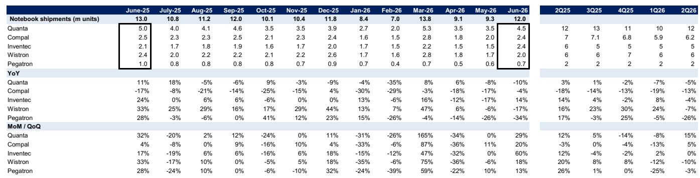
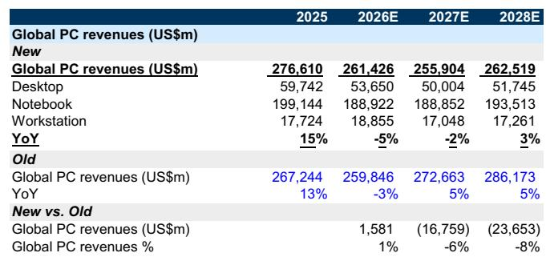
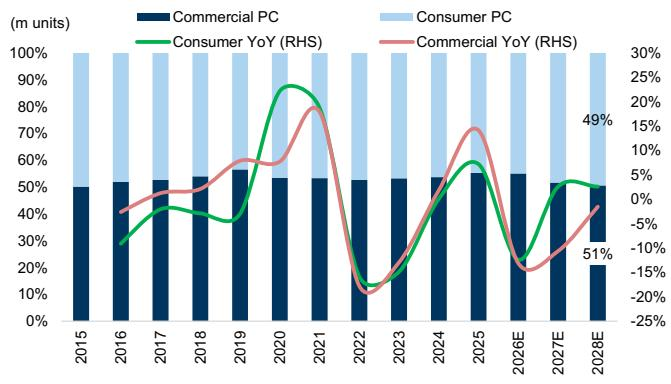

# PC行业面临需求调整，但AI驱动设备预计到2028年将占据82%的市场份额

全球PC出货量预计在2026年下降14%，2027年进一步下降5%，这一调整幅度较此前预期更为明显，主要受组件成本上升以及Windows 10替换周期结束的影响。整体市场规模将从2025年的2.97亿台缩减至2027年的2.43亿台，随后在2028年稳定在2.44亿台。这并非周期性的暂停，而是一次结构性的调整。然而，在这一调整过程中，一个显著的分化正在出现。具备AI能力的PC在2025年已占出货量的36%，预计到2026年将增长至59%，到2028年达到82%，同期出货量将从1.08亿台增至1.99亿台。行业并非单纯萎缩，而是在内部发生重塑。

这种张力十分明显。整体出货量在下降，但单台收入在上升。平均售价预计将从2025年的933美元升至2026年的1025美元，增幅约10%，并持续上升至2028年的1077美元。这意味着收入下降的幅度将远小于出货量的收缩。PC行业收入预计在2026年仅下降5%至2610亿美元，2027年再下降2%，随后在2028年恢复3%的增长。战略含义很清晰：竞争不再围绕出货数量，而是通过AI能力、高端定位和供应链韧性来获取单台价值。

这一转变的时机很关键。2026年上半年同比数据仍将表现积极，第一季度出货量同比增长3%，收入同比增长15%。但调整将在下半年显现。2026年第三季度出货量预计同比下降19%，第四季度下降22%。2026年下半年将是低谷。那些基于平稳复苏来规划库存、产能和营销支出的管理者将面临挑战。为AI驱动的高端市场重新定位的时间窗口正在收窄。

## 内存与CPU成本上升重塑需求弹性，为AI PC创造结构性优势

出货量预期下调的主要驱动因素是关键组件成本的上升，尤其是内存和CPU。原材料成本上升正在压缩各环节的利润空间，但需求反应并不一致。非AI PC主要依靠价格竞争，对这些成本上升更为敏感。物料清单成本每增加50美元，就可能对低价位产品造成较大影响。

相比之下，AI PC的价格弹性较低。其购买者并非在边际上做选择。采购具备AI能力设备的企业客户是基于能力驱动的决策，而非成本最小化。神经处理单元和端侧AI推理能力支撑了更高的价格点，而内存和CPU的增量成本在系统总价中占比较小。这种不对称性形成了自我强化的动态。随着组件成本上升，AI PC的相对竞争力反而提升。制造商有财务动力推广AI产品线，因为它们能更好地维持利润。结果是，即便整体市场收缩，AI PC的渗透率也将加速提升。

数据印证了这一点。AI PC出货量预计在2026年增长39%至1.5亿台，而非AI PC出货量则下降超过30%。到2028年，非AI PC将成为一个残余类别，仅占市场的18%。对硬件厂商而言，战略启示是明确的：任何未在2026年中之前将AI能力作为优先事项的产品路线图，都将在一个萎缩、对价格敏感且利润空间不断压缩的尾部市场中竞争。

## 商用市场将承受调整的主要压力，消费需求则更具韧性

调整在不同终端市场并非均匀分布。商用PC出货量在2025年占市场的55%，预计2026年下降13%，2027年再下降11%。消费PC出货量在2026年下降12%，但随后在2027年和2028年恢复3%的增长。原因是结构性的，而非周期性的。

商用市场是2024-2025年Windows 10生命周期结束升级周期的主要受益者。该周期目前已基本完成。已升级设备的企业在未来三到四年内没有迫切的更新需求。商用替换周期正在趋平，短期内缺乏类似的催化剂。Windows 11的采用虽然仍在进行，但不会产生同样的强制升级动力，因为硬件要求已嵌入近期的采购中。

相比之下，消费需求更多由个人替换周期、新使用场景和自主升级决策驱动。消费市场在2026年的下降主要是对价格上涨的反应，但2027-2028年的恢复反映了更稳定的替换节奏。此外，消费用户更可能被AI PC的新功能所吸引，如本地语言模型、实时翻译和AI增强的创意工具。这表明消费营销策略应从价格促销转向功能演示。对商用厂商而言，挑战不同：他们需要说服IT决策者基于端侧AI带来的生产力提升来加速更新周期，这在预算受限的环境中难度更大。

## 苹果与联想有望在市场向高端与规模集中过程中获得份额

厂商层面的数据显示出明显的市场份额分化趋势。联想预计其份额将从2025年的24%增至2026年的27%，到2028年达到31%。苹果的份额预计从9%升至2026年的11%，到2028年达到14%。与此同时，惠普和戴尔的合计份额预计同期从32%降至29%。包括小型品牌和白牌厂商在内的“其他”类别将经历最显著的收缩，从2025年的26%降至2028年的11%。

这并非随机现象。联想的规模使其在成本上升环境中具备采购优势，能比小型竞争对手更有效地吸收组件价格上涨。其广泛的地域覆盖，尤其是在亚太和中国市场，提供了对区域波动的缓冲。苹果的优势在于其垂直整合的芯片策略。该公司内置神经引擎的自研M系列芯片在AI PC能力方面具备成本和性能优势，而基于英特尔和AMD的竞争对手需要通过更昂贵的独立组件来追赶。

对行业其他厂商而言，启示是明确的。没有自研芯片、没有规模采购优势、没有清晰AI差异化策略的中端厂商将面临结构性市场份额流失。市场集中并非预测，而是已体现在数据中。对于管理者和观察者而言，问题是其产品组合处于这一分化的哪一侧。

## 应对2026-2028年PC市场的决策框架

对于管理者和观察者而言，未来三年需要一个超越整体出货量预测的战略框架。以下决策矩阵将市场数据转化为可操作的优先事项。

首先，按AI能力和价格弹性对产品组合进行细分。搭载NPU处理器和专用AI软件栈的产品应获得不成比例的研发和营销投入。缺乏AI能力的产品应以现金产出而非增长为目标进行管理，并在组件成本进一步侵蚀利润前定价清仓。

其次，使地域布局与区域增长趋势相匹配。数据显示，亚太（不含日本）和中国市场的出货量下降幅度将小于美国和西欧。美国市场在2026年第四季度面临22%的同比下降。在美国商用市场敞口较大的公司应准备应对更明显的收入冲击，并考虑将市场拓展资源向亚洲分散。

第三，评估内存和CPU的供应链与采购策略。当前的成本环境并非暂时现象。组件供应商自身也面临产能限制和定价能力。通过锁定长期供应协议并设定固定价格或价格区间，可以保护利润。反之，依赖现货采购的公司将面临利润压缩，且无法在不进一步抑制需求的情况下将成本完全转嫁给终端客户。

第四，围绕平均售价增长而非出货量增长来调整收入预期。行业整体收入将由平均售价上升而非数量支撑。一家在2026年保持收入持平而竞争对手失去份额的公司，实际上表现更优。关键指标是人均收入和单SKU收入，而非出货量市场份额。

最后，为2027年后的恢复做好准备。到2028年，市场出货量将恢复零增长，但收入增长3%，完全由AI PC占比提升和平均售价扩张驱动。现在投资于AI软件生态、开发者工具和企业AI工作流的公司，将在2028-2029年左右的下一个商用更新周期开始时抓住升级浪潮。

---

*仅供参考。部分内容可能基于源材料通过AI辅助生成、翻译、总结或编辑，可能存在遗漏或错误。请独立核实。本文不构成专业建议。*

仅供参考。部分内容可能基于源材料通过AI辅助生成、翻译、总结或编辑，可能存在遗漏或错误。请独立核实。本文不构成专业建议。

