# 大中华区半导体观察：6月IC进出口数据更新

## 中国半导体行业

## 探索 >

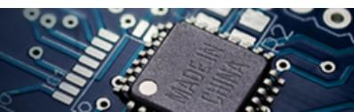

**5-6月数据概览（图表1-4）：** 6月集成电路进口量同比增长6.6%（5月为同比下降1.0%），进口额同比增长72.3%（5月为同比增长68.0%），对应6月集成电路进口均价同比上升61.6%。5月集成电路产量同比增长22.9%（4月为同比增长22.1%）。库存方面，5月中国电子行业库存周转天数为62天，高于过去几年平均水平（2025/2024/2023年5月分别为58/56/60天）。

总体来看，5-6月数据显示中国市场需求保持稳健。我们持续关注具备公司自身驱动因素（新产品放量、产品结构升级、份额提升）的企业，并认为先进制程与生成式AI将支撑中国半导体行业在IP、设计、代工、先进封装及半导体设备等领域的发展（报告链接）。

关注：Kematek、中芯国际（1Q26毛利率超预期）、华虹半导体、中微公司、地平线、壁仞科技、MetaX、北方华创、ACM Research、寒武纪、天岳先进。

## 5-6月IC产量与进口额保持同比强劲增长

**IC产量：** 5月产量达500亿颗，同比增长22.9%（4月同比增长22.1%，2025年5月同比增长11.5%）。我们对中国半导体行业趋势保持积极看法，主要受生成式AI、国内ADAS/自动驾驶趋势以及本土供应商市场份额持续扩大（伴随资本开支计划增加）等因素驱动。

**半导体总收入：** 5月数据同比增长87.2%，环比增长10.7%至320亿美元（4月同比增长78.3%，2025年5月同比增长14.1%），延续2026年以来的同比增长态势。

## 台湾半导体企业6月营收同比增长49.2%/环比增长7.0%：

6月主要台湾上市半导体公司合计营收同比增长49.2%（5月同比增长26.3%，2025年6月同比增长20.7%），环比增长7.0%。其中，代工/IC设计/封测营收分别环比增长6.2%/15.9%/3.2%。

## 半导体设备进口额：5月同比下降9.0%/环比下降16.1%至25亿美元（4月同比下降4.2%）

## Allen Chang

+852-2978-2930 | allen.k.chang@gs.com GS (Asia) L.L.C.

## Verena Jeng

+852-2978-1681 | verena.jeng@gs.com
GS (Asia) L.L.C.

Ting Song
+852-2978-6466 | ting.song@gs.com
GS (Asia) L.L.C.

## Yifan Hu

+852-2978-0996 | yifan.hu@gs.com
GS (Asia) L.L.C.

（2025年5月同比下降1.0%）。半导体测试设备进口额同比增长49.8%/环比下降37.7%至3560万美元（4月同比增长48.4%）；进口均价环比下降41.0%至3.84万美元。中国光刻机进口量同比下降40%至36台，进口均价同比上升64%至830万美元。来自荷兰的光刻机进口量同比下降38%至8台，进口均价同比上升72%至3440万美元。

**IC出口额：** 6月同比增长121.9%/环比增长7.5%至382亿美元（5月同比增长110.9%，2025年6月同比增长24.2%）。出口额自2024年以来持续增长，2026年年初至今达1773亿美元，同比增长95.9%。

**中国半导体企业近期招标动态：** 7月观察到中国半导体企业持续进行招标。润鹏半导体发出电子特气订单，华虹半导体与邑埠半导体发出测试设备招标，这与我们对中国半导体行业未来几年资本开支上行趋势的积极看法一致（CHIPS Act 3报告）。

**图表1：5月中国IC产量同比增长22.9%，4月为同比增长22.1%**
**大中华区半导体月度数据**

<table><tr><td></td><td>2024年11月</td><td>2024年12月</td><td>2025年1-2月</td><td>2025年3月</td><td>2025年4月</td><td>2025年5月</td><td>2025年6月</td><td>2025年7月</td><td>2025年8月</td><td>2025年9月</td><td>2025年10月</td><td>2025年11月</td><td>2025年12月</td><td>2026年1-2月</td><td>2026年3月</td><td>2026年4月</td><td>2026年5月</td><td>2026年6月</td></tr><tr><td>中国IC产量（十亿颗）</td><td>38.0</td><td>42.6</td><td>72.5</td><td>39.4</td><td>39.4</td><td>40.4</td><td>45.1</td><td>46.9</td><td>42.5</td><td>43.7</td><td>41.8</td><td>43.9</td><td>48.1</td><td>81.5</td><td>47.5</td><td>48.1</td><td>49.6</td><td>-</td></tr><tr><td>中国IC进口额（十亿美元）</td><td>33.9</td><td>36.6</td><td>56.0</td><td>32.4</td><td>34.8</td><td>33.7</td><td>34.6</td><td>37.3</td><td>35.8</td><td>41.1</td><td>37.8</td><td>38.6</td><td>42.6</td><td>78.2</td><td>49.8</td><td>53.9</td><td>56.6</td><td>59.6</td></tr><tr><td>中国IC进口量（十亿颗）</td><td>45.9</td><td>47.8</td><td>83.5</td><td>47.8</td><td>50.1</td><td>50.2</td><td>50.4</td><td>55.3</td><td>50.9</td><td>56</td><td>50</td><td>47</td><td>51</td><td>91</td><td>55</td><td>56</td><td>50</td><td>54</td></tr><tr><td>IC进口均价（美元）</td><td>0.7</td><td>0.8</td><td>0.7</td><td>0.7</td><td>0.7</td><td>0.7</td><td>0.7</td><td>0.7</td><td>0.7</td><td>0.7</td><td>0.8</td><td>0.8</td><td>0.8</td><td>0.9</td><td>0.9</td><td>1.0</td><td>1.1</td><td>1.1</td></tr><tr><td>台湾半导体营收（十亿新台币）</td><td>428.9</td><td>427.6</td><td>856.9</td><td>455.6</td><td>509.5</td><td>471.3</td><td>426.8</td><td>474.9</td><td>493.7</td><td>506.0</td><td>538.4</td><td>507.7</td><td>502.5</td><td>1036.3</td><td>604.5</td><td>586.9</td><td>595.4</td><td>637.0</td></tr><tr><td>环比</td><td>2024年11月</td><td>2024年12月</td><td>2025年1-2月</td><td>2025年3月</td><td>2025年4月</td><td>2025年5月</td><td>2025年6月</td><td>2025年7月</td><td>2025年8月</td><td>2025年9月</td><td>2025年10月</td><td>2025年11月</td><td>2025年12月</td><td>2026年1-2月</td><td>2026年3月</td><td>2026年4月</td><td>2026年5月</td><td>2026年6月</td></tr><tr><td>中国IC产量</td><td>6.9%</td><td>12.2%</td><td>-</td><td>-</td><td>0.0%</td><td>2.4%</td><td>11.7%</td><td>4.0%</td><td>-9.4%</td><td>2.8%</td><td>-4.3%</td><td>5.0%</td><td>9.6%</td><td>-</td><td>-</td><td>1.3%</td><td>3.1%</td><td>-</td></tr><tr><td>中国IC进口额</td><td>-1.2%</td><td>7.9%</td><td>-</td><td>-</td><td>7.5%</td><td>-3.3%</td><td>2.7%</td><td>7.9%</td><td>-3.9%</td><td>14.5%</td><td>-8.0%</td><td>2.1%</td><td>10.5%</td><td>-</td><td>-</td><td>8.2%</td><td>5.0%</td><td>5.3%</td></tr><tr><td>中国IC进口量</td><td>-4.3%</td><td>4.2%</td><td>-</td><td>-</td><td>4.8%</td><td>0.2%</td><td>0.4%</td><td>9.8%</td><td>-8.1%</td><td>9.2%</td><td>-9.5%</td><td>-6.8%</td><td>8.9%</td><td>-</td><td>-</td><td>1.8%</td><td>-10.8%</td><td>8.1%</td></tr><tr><td>IC进口均价</td><td>3.3%</td><td>3.6%</td><td>-</td><td>-</td><td>2.6%</td><td>-3.5%</td><td>2.3%</td><td>-1.8%</td><td>4.5%</td><td>4.9%</td><td>1.6%</td><td>9.6%</td><td>1.5%</td><td>-</td><td>-</td><td>6.3%</td><td>17.7%</td><td>-2.5%</td></tr><tr><td>台湾半导体营收</td><td>-10.4%</td><td>-0.3%</td><td>-</td><td>-</td><td>11.8%</td><td>-7.5%</td><td>-9.4%</td><td>11.3%</td><td>4.0%</td><td>2.5%</td><td>6.4%</td><td>-5.7%</td><td>-1.0%</td><td>-</td><td>-</td><td>-2.9%</td><td>1.5%</td><td>7.0%</td></tr><tr><td>同比</td><td>2024年11月</td><td>2024年12月</td><td>2025年1-2月</td><td>2025年3月</td><td>2025年4月</td><td>2025年5月</td><td>2025年6月</td><td>2025年7月</td><td>2025年8月</td><td>2025年9月</td><td>2025年10月</td><td>2025年11月</td><td>2025年12月</td><td>2026年1-2月</td><td>2026年3月</td><td>2026年4月</td><td>2026年5月</td><td>2026年6月</td></tr><tr><td>中国IC产量</td><td>23.1%</td><td>12.5%</td><td>4.4%</td><td>9.2%</td><td>4.0%</td><td>11.5%</td><td>15.8%</td><td>15.0%</td><td>3.2%</td><td>5.9%</td><td>17.7%</td><td>15.6%</td><td>12.9%</td><td>12.4%</td><td>20.6%</td><td>22.1%</td><td>22.9%</td><td>-</td></tr><tr><td>中国IC进口额</td><td>3.7%</td><td>9.6%</td><td>2.3%</td><td>3.5%</td><td>11.1%</td><td>8.9%</td><td>11.5%</td><td>13.0%</td><td>8.4%</td><td>14.1%</td><td>10.2%</td><td>13.9%</td><td>16.6%</td><td>39.8%</td><td>53.7%</td><td>54.7%</td><td>68.0%</td><td>72.3%</td></tr><tr><td>中国IC进口量</td><td>12.6%</td><td>13.0%</td><td>6.3%</td><td>11.2%</td><td>7.6%</td><td>9.9%</td><td>11.3%</td><td>12.3%</td><td>2.1%</td><td>11.7%</td><td>4.9%</td><td>2.1%</td><td>6.7%</td><td>9.0%</td><td>14.5%</td><td>11.2%</td><td>-1.0%</td><td>6.6%</td></tr><tr><td>IC进口均价</td><td>-7.9%</td><td>-3.0%</td><td>-3.7%</td><td>-6.9%</td><td>3.3%</td><td>-1.0%</td><td>0.1%</td><td>0.6%</td><td>6.1%</td><td>2.1%</td><td>5.1%</td><td>11.5%</td><td>9.3%</td><td>28.2%</td><td>34.3%</td><td>39.1%</td><td>69.7%</td><td>61.6%</td></tr><tr><td>台湾半导体营收</td><td>20.0%</td><td>33.1%</td><td>27.9%</td><td>31.6%</td><td>34.1%</td><td>25.3%</td><td>20.7%</td><td>14.8%</td><td>22.0%</td><td>23.8%</td><td>12.5%</td><td>18.4%</td><td>17.5%</td><td>20.9%</td><td>32.7%</td><td>15.2%</td><td>26.3%</td><td>49.2%</td></tr></table>

数据来源：国家统计局、中国海关、公司数据

**图表2：5月IC产量同比增长22.9%（4月为同比增长22.1%）**
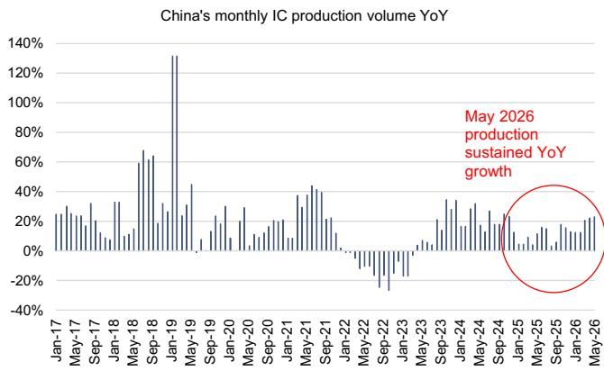
数据来源：国家统计局

**图表3：6月IC进口额同比增长72.3%（5月为同比增长68.0%）**
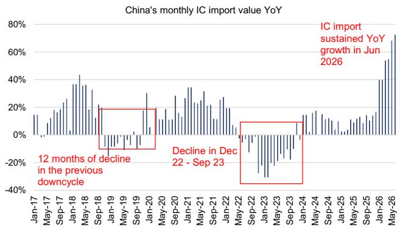
数据来源：中国海关、国家统计局

**图表4：5月/6月IC进口量同比变化为-1.0%/+6.6%**
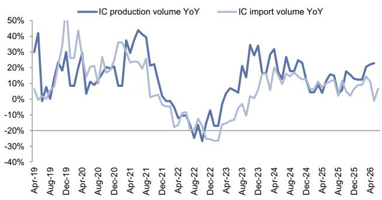
数据来源：国家统计局

**图表5：5月库存周转天数为62天，2025/2024/2023年5月分别为58/56/60天**

中国电子制造业（含计算机、手机、其他电子设备、电子元器件、集成电路）库存余额与库存周转天数

数据来源：国家统计局

**图表6：5月中国IC产量同比增长22.9%**
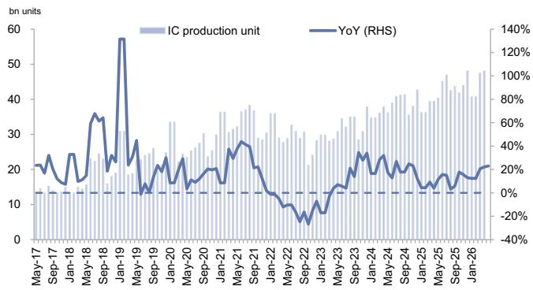
数据来源：国家统计局

**图表7：5月半导体设备进口额同比下降9%（4月同比下降4%）**
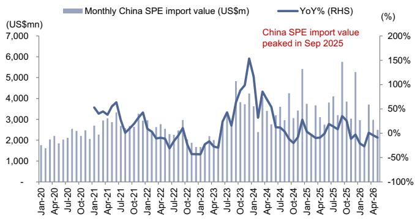

**图表8：5月中国半导体营收同比增长87.2%（4月同比增长78.3%）**
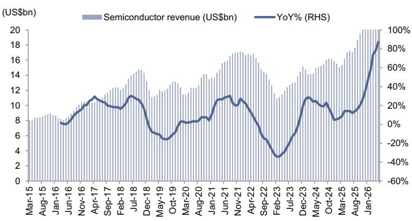
数据来源：Wind
数据来源：中国海关

**图表9：6月中国IC出口额同比增长122%至380亿美元**
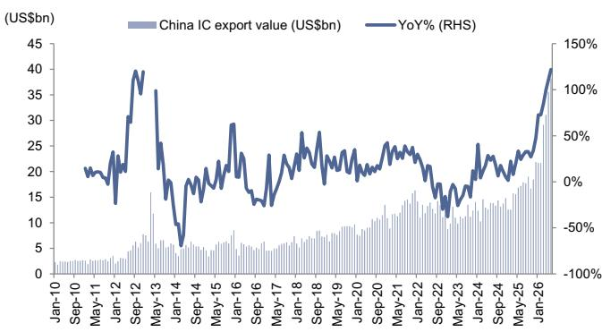
数据来源：国家统计局

**图表10：6月主要台湾半导体公司合计营收同比增长49%（5月同比增长26%）**
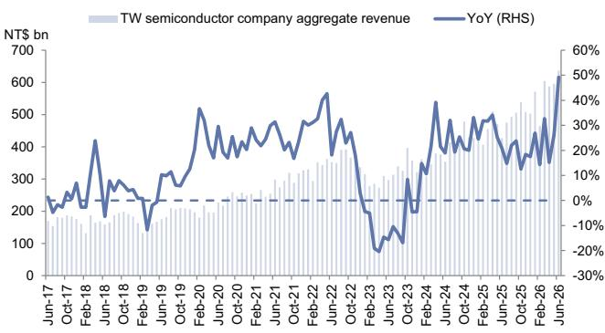
包含台积电、联电、世界先进、稳懋、联发科、联咏、矽力杰、谱瑞、瑞昱、日月光、力成、京元电、颀邦。
数据来源：TEJ

**图表11：5月中国光刻机全球进口量同比下降40%至36台，进口均价同比上升64%至830万美元**
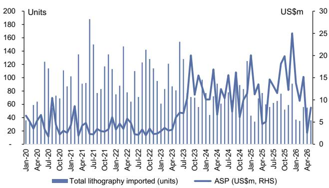
含光刻步进机及其他光刻设备；HS编码：84862031, 84862039
数据来源：中国海关

**图表12：5月中国来自荷兰的光刻机进口量同比下降38%至8台，进口均价同比上升72%至3440万美元**
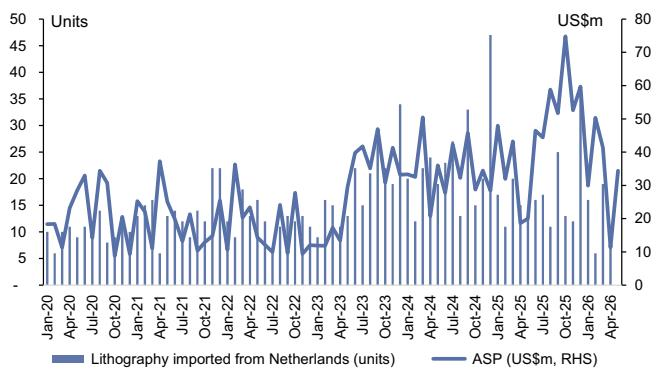
含光刻步进机及其他光刻设备；HS编码：84862031, 84862039
数据来源：中国海关

**图表13：5月中国半导体测试设备进口额同比增长50%至3600万美元**
中国月度半导体测试设备进口额
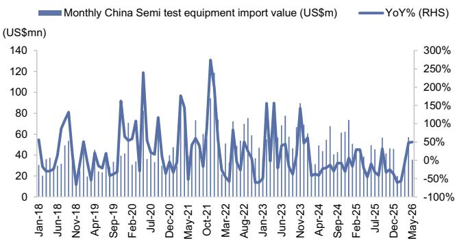
数据来源：Wind

**图表14：代工厂：季度营收**

数据来源：公司数据、GS全球研究

**图表15：中国半导体企业近期招标**

<table><tr><td colspan="5">中国半导体企业近期招标</td></tr><tr><td>公司</td><td>代码</td><td>招标时间</td><td>计划完成日期</td><td>项目</td></tr><tr><td>中芯国际</td><td>0981.HK</td><td>2025年1月</td><td>2026年12月</td><td>上海12英寸晶圆代工生产线</td></tr><tr><td>长鑫存储</td><td>非上市</td><td>2025年3月</td><td>2027年</td><td>DRAM晶圆后道先进存储模组组装与测试设备</td></tr><tr><td>先进半导体制造</td><td>非上市</td><td>2025年5月</td><td>-</td><td>5英寸、6英寸、8英寸晶圆生产线扩产、升级及新工艺开发项目用涂胶显影设备</td></tr><tr><td>杭州富芯半导体</td><td>非上市</td><td>2025年6月</td><td>-</td><td>12英寸IC制造项目</td></tr><tr><td>华虹半导体</td><td>688347.SS/1347.HK</td><td>2025年6月</td><td>-</td><td>8英寸IC制造项目用CMP设备</td></tr><tr><td>润鹏半导体</td><td>非上市</td><td>2025年6月</td><td>2025年底</td><td>HDP-CVD设备、等离子氧化沉积设备、检测设备、量测设备采购</td></tr><tr><td>华虹半导体</td><td>688347.SS/1347.HK</td><td>2025年7月</td><td>-</td><td>8英寸IC制造项目用湿法清洗设备与刻蚀机</td></tr><tr><td>华虹半导体</td><td>688347.SS/1347.HK</td><td>2025年7月</td><td>-</td><td>12英寸IC制造项目用晶圆量测设备</td></tr><tr><td>润鹏半导体</td><td>非上市</td><td>2025年7月</td><td>-</td><td>沉积设备采购</td></tr><tr><td>华虹半导体</td><td>688347.SS/1347.HK</td><td>2025年8月</td><td>-</td><td>扩散炉采购</td></tr><tr><td>格科微</td><td>非上市</td><td>2025年8月</td><td>-</td><td>检测设备采购</td></tr><tr><td rowspan="2">邑埠半导体</td><td>非上市</td><td>2025年8月</td><td>-</td><td>清洗设备采购</td></tr><tr><td>非上市</td><td>2025年9月</td><td>-</td><td>检测设备采购</td></tr><tr><td>格科微</td><td>非上市</td><td>2025年9月</td><td>-</td><td>晶圆薄膜去除机采购</td></tr><tr><td>格林达</td><td>688432.SS</td><td>2025年10月</td><td>-</td><td>12英寸晶圆制造项目用外延炉2台采购</td></tr><tr><td>格科微</td><td>非上市</td><td>2025年10月</td><td>-</td><td>退火设备与探针台采购</td></tr><tr><td>杭州富芯半导体</td><td>非上市</td><td>2025年10月</td><td>-</td><td>电镀液分析设备采购</td></tr><tr><td>天科合达</td><td>非上市</td><td>2025年11月</td><td>-</td><td>清洗设备采购</td></tr><tr><td>邑埠半导体</td><td>非上市</td><td>2025年11月</td><td>-</td><td>晶圆缺陷检测、TSV电镀、晶圆抛光设备采购</td></tr><tr><td>邑埠半导体</td><td>非上市</td><td>2025年11月</td><td>-</td><td>光刻胶剥离设备采购</td></tr><tr><td>格科微</td><td>非上市</td><td>2025年12月</td><td>-</td><td>检测设备与IC测试分选机采购</td></tr><tr><td>天科合达</td><td>非上市</td><td>2025年1月</td><td>-</td><td>缺陷检测设备采购</td></tr><tr><td>润鹏半导体</td><td>非上市</td><td>2025年1月</td><td>-</td><td>SIMS测试服务采购</td></tr><tr><td>天水天光半导体</td><td>非上市</td><td>2026年2月</td><td>-</td><td>光刻机与涂胶显影设备采购</td></tr><tr><td>MCL</td><td>非上市</td><td>2026年3月</td><td>-</td><td>背面密封炉采购</td></tr><tr><td>先进微半导体</td><td>非上市</td><td>2026年3月</td><td>-</td><td>探针台采购</td></tr><tr><td>格科微</td><td>非上市</td><td>2026年4月</td><td>-</td><td>金属沉积、CVD、清洗设备采购</td></tr><tr><td>润鹏半导体</td><td>非上市</td><td>2026年4月</td><td>-</td><td>高能离子注入机采购</td></tr><tr><td>Echip Semi</td><td>非上市</td><td>2026年4月</td><td>-</td><td>释放层涂布机采购</td></tr><tr><td>Echip Semi</td><td>非上市</td><td>2026年5月</td><td>-</td><td>检测设备采购</td></tr><tr><td>电子核心产业时代</td><td>非上市</td><td>2026年5月</td><td>-</td><td>炉管设备采购</td></tr><tr><td>MCL</td><td>非上市</td><td>2026年6月</td><td>2027年3季度</td><td>检测设备采购</td></tr><tr><td>润鹏半导体</td><td>非上市</td><td>2026年6月</td><td>-</td><td>刻蚀用耗材部件采购</td></tr><tr><td>润鹏半导体</td><td>非上市</td><td>2026年7月</td><td>-</td><td>电子特气采购</td></tr><tr><td>华虹半导体</td><td>688347.SS/1347.HK</td><td>2026年7月</td><td>-</td><td>测试设备采购</td></tr><tr><td>邑埠半导体</td><td>非上市</td><td>2026年7月</td><td>-</td><td>测试设备采购</td></tr></table>

数据来源：中国招标网

## 附录

## 分析师声明

我们，Allen Chang、Verena Jeng、Ting Song和Yifan Hu，特此证明本报告中表达的所有观点准确反映了我们对相关公司及其证券的个人观点。我们也证明，我们的薪酬中没有任何部分直接或间接与本报告中提出的具体建议或观点相关。

除非另有说明，本报告封面所列人员为GS全球研究部门的分析师。

撰稿作者：Allen Chang GS (Asia) L.L.C.，Verena Jeng GS (Asia) L.L.C.，Ting Song GS (Asia) L.L.C.，Yifan Hu GS (Asia) L.L.C.。

除非另有说明，本报告撰稿作者披露中列出的个人为GS全球研究部门的分析师。

## GS因子概况

GS因子概况通过将关键属性与市场（即我们的评级股票池）及其行业同行进行比较，为股票提供研究背景。所描绘的四个关键属性为：增长、财务回报、倍数（如估值）和综合（增长、财务回报和倍数的复合）。增长、财务回报和倍数通过计算每只股票特定指标的标准化排名得出。各指标的标准化排名随后取平均值并转换为相应属性的百分位数。每个指标的具体计算可能因财年、行业和地区而异，但标准方法如下：

增长基于股票的前瞻性销售增长、EBITDA增长和EPS增长（对于金融股，仅EPS和销售增长），百分位数越高表示增长潜力越大。财务回报基于股票的前瞻性ROE、ROCE和CROCI（对于金融股，仅ROE），百分位数越高表示财务回报越高。倍数基于股票的前瞻性P/E、P/B、价格/股息（P/D）、EV/EBITDA、EV/FCF和EV/债务调整后现金流（DACF）（对于金融股，仅P/E、P/B和P/D），百分位数越高表示股票交易倍数越高。综合百分位数计算为增长百分位数、财务回报百分位数和（100% - 倍数百分位数）的平均值。

财务回报和倍数使用GS分析师对未来至少三个季度后的财年末预测。增长使用对未来至少七个季度后的财年输入，与未来至少三个季度后的财年进行比较（所有指标均基于每股）。

有关GS因子概况计算方式的更详细说明，请联系您的GS代表。

## M&A排名

在我们的全球覆盖范围内，我们使用M&A框架审视股票，考虑定性因素和定量因素（可能因行业和地区而异），以纳入某些公司可能被收购的可能性。然后我们分配M&A排名，对我们评级覆盖范围内的公司从1到3进行评分，其中1表示公司成为收购目标的可能性较高（30%-50%），2表示中等可能性（15%-30%），3表示较低可能性（0%-15%）。对于排名为1或2的公司，根据我们的标准部门指南，我们将M&A组成部分纳入目标价。M&A排名为3被视为不重要，因此不计入我们的目标价，并且可能在研究中讨论或不讨论。

## Quantum

Quantum是GS的专有数据库，提供详细的财务报表历史、预测和比率访问。可用于对单一公司进行深入分析，或比较不同行业和市场的公司。

## 披露

## 其他披露

美国商务部工业与安全局（BIS）对向BIS实体清单上的非美国方出口、再出口和/或转让（境内）特定物项施加了特定许可要求。本研究不构成也不应被解释为诱导从事与BIS实体清单上各方相关的任何未经许可的活动。

根据经修订的第13959号行政令，美国对某些中国公司实施了制裁限制，通常禁止美国人投资此类公司发行的证券。本研究不构成也不应被解释为诱导从事违反美国制裁法律的任何证券交易。

## 评级与定价信息

ACM Research（关注，91.96美元）、中微公司（关注，391.29元人民币）、壁仞科技（关注，42.48港元）、寒武纪（关注，1347.46元人民币）、地平线（关注，4.42港元）、华虹半导体（关注，169.30港元）、Kematek（关注，132.54元人民币）、MetaX（关注，864.09元人民币）、北方华创（关注，742.66元人民币）、天岳先进（关注，129.83元人民币）和中芯国际（H）（关注，76.30港元）

## 评级分布/投行关系

GS研究全球股票覆盖范围

<table><tr><td rowspan="2"></td><td colspan="3">评级分布</td><td colspan="3">投行关系</td></tr><tr><td>关注</td><td>中性</td><td>卖出</td><td>关注</td><td>中性</td><td>卖出</td></tr><tr><td>全球</td><td>50%</td><td>34%</td><td>16%</td><td>65%</td><td>59%</td><td>43%</td></tr></table>

截至2026年7月1日，GS全球研究对3104只股票有评级。GS将股票指定为各区域投资清单上的关注和卖出；未如此指定的股票被视为中性。此类指定相当于FINRA规则要求的上述披露中的关注、持有和卖出。请参见下文"评级、覆盖范围及相关定义"。投行关系图表反映了每个评级类别中GS在过去十二个月内提供投行服务的公司百分比。

## 监管披露

## 美国法律法规要求的披露

请参见上文公司特定监管披露，了解本报告提及公司所需的任何以下披露：待定交易中的主承销商或联合主承销商；1%或以上所有权；特定服务的报酬；客户关系类型；前期公开发行的主承销/联合承销；董事职位；对于股票，做市和/或专家角色。GS可能作为本金交易本报告讨论的发行人的债务证券（或相关衍生品）。

以下为额外要求的披露：所有权与重大利益冲突：GS政策禁止其分析师、向分析师汇报的专业人员及其家庭成员持有分析师覆盖范围内的任何公司证券。分析师薪酬：分析师的薪酬部分基于GS的盈利能力，其中包括投行收入。分析师作为高管或董事：GS政策通常禁止其分析师、向分析师汇报的人员或其家庭成员担任分析师覆盖范围内任何公司的高管、董事或顾问。非美国分析师：非美国分析师可能不是GS & Co. LLC的关联人员，因此可能不受FINRA规则2241或FINRA规则2242关于与目标公司沟通、公开露面以及交易分析师覆盖证券的限制。

## 美国以外司法管辖区法律法规要求的额外披露

以下为特定司法管辖区要求的
