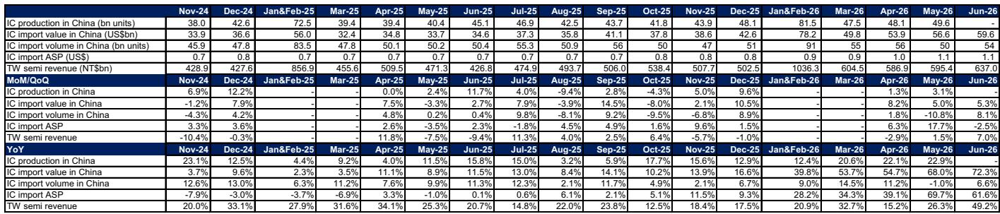
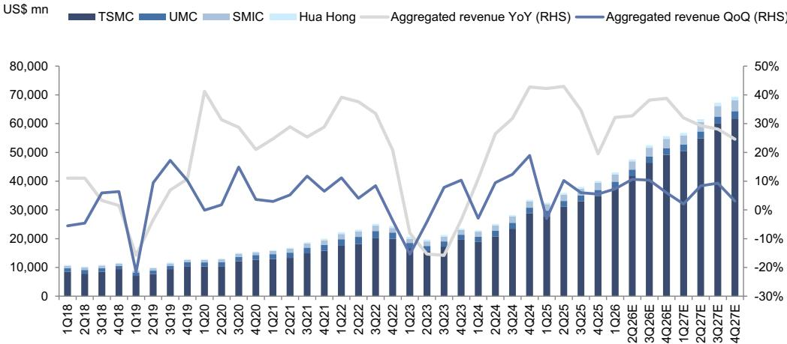
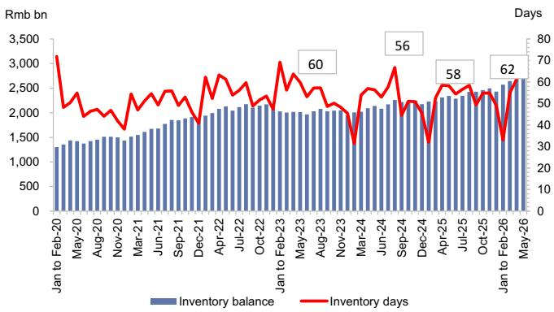

# China's Semiconductor Import Surge Signals a Structural Shift, Not a Cyclical Blip

China imported USD 59.6 billion of integrated circuits in June 2026, a 72.3 percent year-on-year increase. This is not a routine inventory build. The volume of imports rose only 6.6 percent, meaning the value growth is overwhelmingly driven by a 61.6 percent jump in average import price. The narrative that China is merely stockpiling generic chips no longer fits the data. What is unfolding is a deliberate, capital-intensive pivot toward higher-value semiconductors, advanced nodes, and domestic production capacity that is reshaping the global supply chain. The May-June 2026 trade and production data reveal a market that is simultaneously consuming more sophisticated chips and accelerating its own manufacturing capabilities at a pace that outstrips any recent precedent.

The tension in the current data is instructive. On one hand, China's IC export value soared 121.9 percent year-on-year in June to USD 38.2 billion, with year-to-date exports reaching USD 177.3 billion—a 95.9 percent increase. This suggests that Chinese-made chips are finding buyers globally. On the other hand, import value continues to accelerate, implying that domestic production is not yet substituting for the highest-end components. The result is a two-track market: a booming export channel for mid-range and mature-node chips, and an increasingly expensive import channel for the advanced logic and memory that underpin generative AI and autonomous driving systems.

The strategic implication is clear. Companies that can navigate this bifurcated demand environment—by supplying equipment for China's capacity expansion, by designing chips that serve the domestic substitution theme, or by capturing the value of rising import ASPs—will be well positioned. The data from May and June provides the evidence base for that thesis. This article interprets those numbers through a decision-oriented lens, translating the trade statistics into actionable strategic conclusions for observers and corporate planners.

## The Surge in IC Import Value Reflects a Deliberate Shift to Premium Chips, Not Panic Stockpiling

The most striking data point in the June release is the divergence between import volume and import value. Volume grew 6.6 percent year-on-year, a modest acceleration from the -1.0 percent in May. Value, however, surged 72.3 percent. The implied import ASP of USD 1.10 per unit in June 2026 is a record high and represents a 61.6 percent year-on-year increase. This is not a story of buying more chips; it is a story of buying more expensive chips.

The pattern is consistent with China's known priorities. Generative AI workloads require high-bandwidth memory and advanced logic processors, both of which carry significantly higher unit prices than the commodity chips that dominated import baskets three years ago. The average import ASP has climbed from USD 0.70 in late 2024 to USD 1.10 in June 2026, a trajectory that aligns with the ramp of AI data center construction and the proliferation of advanced driver-assistance systems in Chinese electric vehicles. The data from Taiwan's semiconductor ecosystem corroborates this: aggregate revenue for major Taiwan-listed semiconductor companies was up 49.2 percent year-on-year in June, with IC design revenue rising 15.9 percent month-on-month. Those are the companies supplying the high-value chips China is importing.

The inventory data further supports the thesis that this is structural demand, not a one-time restocking event. China's electronics sector days of inventory stood at 62 days in May 2026, above the 58-day level of May 2025 and the 56-day level of May 2024. Inventory is elevated, but it is not at panic levels. It reflects a deliberate decision by Chinese OEMs and system integrators to secure supply of premium components in a market where lead times for advanced chips remain extended. The risk is not that inventory will be destocked; it is that supply constraints will persist as demand continues to grow.

## Domestic IC Production Growth Is Accelerating, but Capacity Is Concentrated in Mature Nodes

China's IC production volume reached 49.6 billion units in May 2026, up 22.9 percent year-on-year. This marks an acceleration from 22.1 percent in April and 11.5 percent in May 2025. The production trend is unequivocally positive, and it reflects the ongoing expansion of Chinese foundries and integrated device manufacturers. However, the production data must be read alongside the import data to understand the full picture.

Domestic production is growing rapidly from a smaller base and is concentrated in mature nodes—28 nanometers and above. The import ASP data implies that the chips China cannot yet produce domestically are precisely the ones that command the highest prices. This is not a failure of policy; it is a predictable phase of the industrial build-out. The Chinese semiconductor ecosystem is following the same trajectory that Taiwan and South Korea followed decades ago: start with mature nodes, capture market share through cost and scale, and then gradually move up the technology curve.

The equipment import data provides a window into how quickly that upward move is happening. China's semiconductor production equipment import value was USD 2.5 billion in May 2026, down 9.0 percent year-on-year. Within that total, lithography equipment imports tell a more nuanced story. Global lithography import volume fell 40 percent year-on-year to 36 units, but the ASP jumped 64 percent to USD 8.3 million. Imports from the Netherlands specifically saw volume drop 38 percent to 8 units, with ASP rising 72 percent to USD 34.4 million. The interpretation is straightforward: China is buying fewer but more advanced lithography tools, likely the high-NA systems required for sub-7-nanometer production. The absolute volume decline is a constraint, but the ASP increase signals that existing export controls are not preventing the acquisition of cutting-edge equipment entirely.

## The Equipment and Materials Supply Chain Is the Critical Bottleneck and a Key Area of Focus

The bidding activity from Chinese semiconductor manufacturers in July 2026 reinforces the capex narrative. Runpeng Semiconductor placed orders for electronic specialty gas, while Hua Hong and Yibu Semiconductor issued tenders for testing equipment. These are not isolated events. The bidding table in the underlying report shows a steady drumbeat of procurement across deposition equipment, inspection tools, cleaning systems, and ion implanters stretching back to early 2025. The pattern is consistent with a multiyear capacity expansion that is now entering the equipment installation and qualification phase.

For observers, the strategic implication is that the equipment and materials segment offers a direct lens into China's semiconductor build-out, with less of the geopolitical risk that attaches to foundry or design companies. SPE import value may have declined 9 percent year-on-year in May, but that is a month-over-month fluctuation within a long-term upward trend. The test equipment sub-segment tells a clearer story: import value rose 49.8 percent year-on-year, even though the month-on-month figure was negative due to lumpy shipment patterns. The underlying demand for test, metrology, and deposition equipment is structural.

The logic is mutually exclusive and collectively exhaustive. Foundries benefit from volume growth but face margin pressure from depreciation and technology licensing costs. IC design houses benefit from domestic substitution but compete with global leaders on performance. Equipment and materials suppliers, by contrast, benefit from all of the above. Every new fab, whether owned by SMIC, Hua Hong, or a private startup, requires the same suite of deposition, etch, cleaning, and test tools. The bidding data confirms that this procurement cycle is broad-based and shows no signs of deceleration.

## A Decision Framework for Navigating the Two-Track Semiconductor Market

The data from May and June 2026 supports a structured decision framework with three axes: end-market exposure, technology node positioning, and supply chain dependency.

First, end-market exposure. The fastest-growing demand segments are generative AI and automotive ADAS. These are the applications driving the 61.6 percent increase in IC import ASP. Companies that serve these end markets—whether through chip design, foundry services, or advanced packaging—will see revenue growth that outpaces the broader semiconductor cycle. The 22.9 percent year-on-year growth in IC production is a tailwind, but the 72.3 percent growth in import value is the more telling metric for where pricing power resides.

Second, technology node positioning. The data implies that China's domestic production is winning in mature nodes while remaining dependent on imports for advanced nodes. This bifurcation creates two distinct areas of focus. For mature-node capacity, the case rests on volume growth and market share gains. For advanced-node capability, the case rests on the eventual substitution of imports, which will require years of capex and technology transfer. Near-term returns favor the former; long-term optionality favors the latter.

Third, supply chain dependency. The lithography import data reveals a binding constraint on advanced-node expansion. China imported only 8 lithography units from the Netherlands in May, albeit at a high ASP. This suggests that the pace of advanced-node capacity addition will be constrained by equipment availability, not by demand or financing. Companies that provide equipment or materials that are not subject to the same export restrictions—such as test equipment, cleaning systems, or specialty gases—face a more favorable supply-demand dynamic. The 49.8 percent year-on-year growth in test equipment imports is evidence that this segment is already benefiting.

The framework yields a clear hierarchy. Companies with direct exposure to AI and automotive demand, a focus on mature-node production or equipment supply, and a product portfolio that avoids the most restricted technology categories offer a favorable risk-reward profile. The bidding activity in July 2026 confirms that this is not a theoretical exercise; the capital is being deployed now.

## The Export Data Confirms That China Is Becoming a Net Exporter of Mid-Range Chips, Reshaping Global Competitive Dynamics

China's IC export value reached USD 38.2 billion in June 2026, up 121.9 percent year-on-year. The year-to-date total of USD 177.3 billion represents a 95.9 percent increase over the same period in 2025. This is not a marginal trend. China is becoming a significant exporter of integrated circuits, and the growth rate is accelerating.

The export data must be interpreted in the context of the import data. China is importing high-value chips and exporting lower-value chips, but the export value growth suggests that the domestic industry is moving up the value chain. The 22.9 percent year-on-year increase in IC production volume provides the supply-side foundation for this export growth. Chinese foundries are producing enough mature-node chips to serve domestic demand and generate a growing surplus for export.

The competitive implications are significant. China's emergence as a chip exporter puts pressure on incumbent manufacturers in Taiwan, South Korea, and Southeast Asia. The 49.2 percent year-on-year revenue growth for Taiwan-listed semiconductor companies in June suggests that the overall pie is growing fast enough to accommodate both Chinese and non-Chinese suppliers for now. But as Chinese capacity continues to expand, price competition in mature-node segments will intensify. Companies that lack cost advantages or proprietary technology will face margin compression.

The strategic takeaway is that the global semiconductor industry is entering a period of dual expansion: rising demand for advanced chips from AI and automotive, and rising supply of mature-node chips from China. The winners will be those that can serve the premium segment while defending their position in the volume segment through cost leadership or differentiation. The data from May and June 2026 provides a clear read on which direction the market is moving.

*For informational purposes only. Portions may be generated, translated, summarized, or edited with AI assistance based on source materials and may contain omissions or errors. Please verify independently. This is not professional advice.*

For informational purposes only. Portions may be generated, translated, summarized, or edited with AI assistance based on source materials and may contain omissions or errors. Please verify independently. This is not professional advice.

