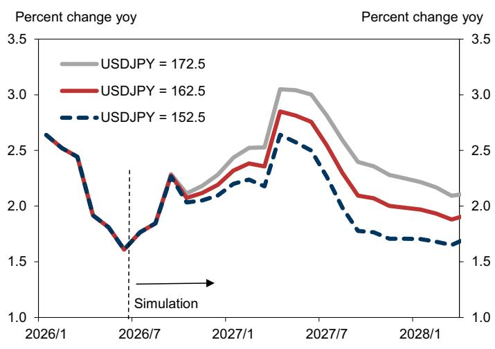
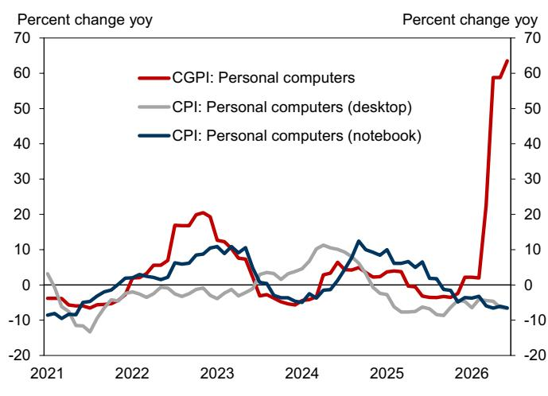
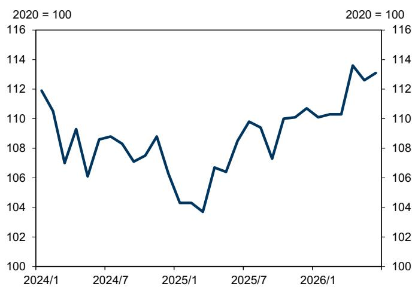
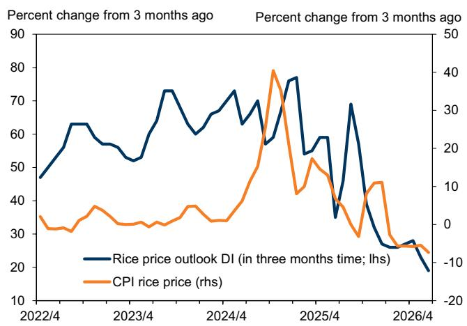
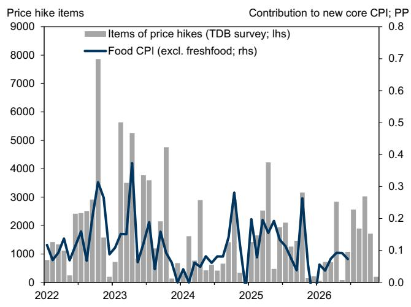
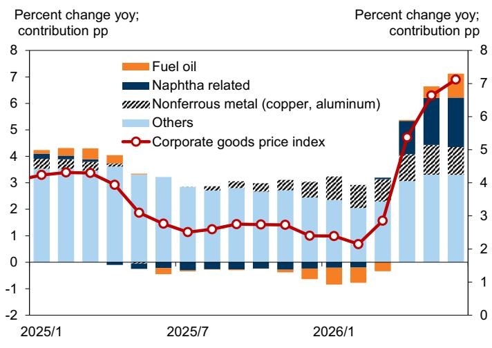
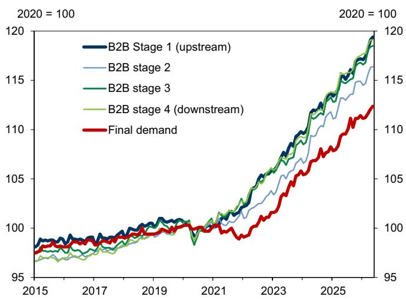
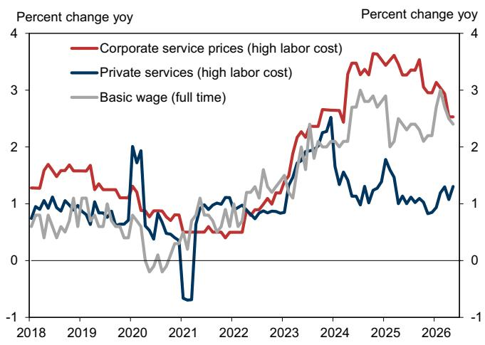
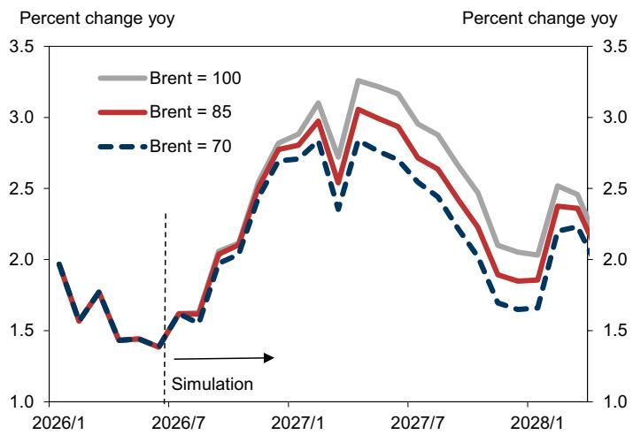

# Japan Economic Flash: Adjusting FY2027 Inflation Projections Based on Currency, Semiconductor, and Food Price Trends

We have updated our inflation projections for FY2027. Our projections for new core CPI (excluding fresh food and energy) in FY2026 and FY2027 are 2.1% (unchanged from previous projection) and 2.3% (+0.3pp), respectively.

Tomohiro Ota  
+81(3)4587-9984 |  
tomohiro.ota@gs.com  
GS Japan Co., Ltd.

The upward revision to our FY2027 projections reflects our foreign exchange research team's updated forecast (12-month forecast: from ¥155/US$ to ¥165/US$), a notable increase in memory chip prices, and higher food prices partly due to weather factors. While these factors will influence inflation not only in FY2027 but also in FY2026, our FY2026 inflation projection remains unchanged, since the rise in private services prices is tracking below our forecast. Naphtha-related price increases (the rise in naphtha-related product prices) moderated in the June corporate goods price index (CGPI, goods-PPI equivalent) print. This is consistent with our view that the margin of price increases will narrow as pass-through progresses downstream. We expect some price increases from June, mainly in non-durable goods, but the margin of increase in retail prices, which are the farthest downstream in the supply chain, is likely to be small.

Meanwhile, our core CPI (excluding fresh food) projections for FY2026 and FY2027 are also revised to be 2.1% (-0.2pp from our previous projection) and 2.3% (+0.2pp), respectively. The downward revision for FY2026 reflects crude oil prices trending at levels below our previous projection, as well as the government's price control measures exceeding our initial assumptions in scale. Our commodities research team has also revised down its crude oil price projection for FY2027, and reflecting this, the upward revision for FY2027 is smaller than that of the new core CPI.

This projection revision does not incorporate the upcoming CPI base-year revision in August as well as the potential consumption tax cut which the government may implement from April 2027. While the impact of the CPI base-year revision to our projection is unclear, inflation rate could decline notably with the start of the tax cut, from April 2027.

## Adjusting FY2027 Inflation Projections Due to Currency, Semiconductor, and Food Price Trends

## Upward Revisions to New Core CPI Outlook, Mainly in FY2027

We revise our inflation projections mainly to incorporate changes in our foreign exchange forecasts and higher memory chip prices (Exhibit 1). Our new core CPI (excluding fresh food and energy) projections for FY2026 and FY2027 are 2.1% (unchanged vs. previous projection) and 2.3% (+0.3pp).

The upward revisions to the new core CPI are concentrated in FY2027, driven mainly by our foreign exchange research team's revised USD/JPY forecast toward a weaker yen (12-month forecast: from ¥155/US$ to ¥165/US$), the expected impact of higher memory chip prices on the CPI from fall 2026 through H1 2027, and higher food prices in 2026-2027. Of these, higher memory chip and food prices are also upside factors for the FY2026 inflation rate. However, as discussed later, they are offset by the increase in private services prices tracking below our expectations, leaving the new core CPI outlook for FY2026 unchanged. In this note, we examine each price fluctuation factor.

We also note that in the upcoming once-every-five-year base year revision for the CPI on August 7, the CPI inflation rate for January-June 2026 is subject to retroactive revision and could also impact the future inflation rate (we estimate a small upward revision to January-June 2026 inflation rate, while the new base year could exert downward pressure on the future CPI, although uncertainty is high). We plan to review our inflation projection once the new CPI series is officially released.

In addition, we currently do not incorporate a potential consumption tax cut in our base-case projections. Therefore, our core CPI inflation projections from April 2027, the expected starting period for a possible tax cut, could decline by 1.3pp with a tax cut.

Exhibit 1: Inflation Outlook Raised, Mainly for FY2027  
  
Source: Ministry of Internal Affairs and Communications, BoJ, JCER, GS Global Investment Research

## Foreign Exchange: Upside Risk to Prices From Further Yen Depreciation of Around ¥5 Is Small, but Impact on Monetary Policy Cannot Be Ignored

One reason for the upside in the FY2027 inflation rate shown in Exhibit 1 is that our foreign exchange research team revised its 12-month USD/JPY forecast from ¥155/US$ to ¥165/US$. In our model, a ¥10 depreciation of the yen (a weaker yen of just over 6% in terms of rate of change) pushes up the new core CPI by 0.25pp 12 months later.

The rate of change in the foreign exchange rate is what affects the inflation rate (Exhibit 2). Therefore, given that the yen has already depreciated to a level exceeding ¥160, even if the yen were to weaken by several yen beyond our team's forecast of ¥165/US$, we would expect upside to the inflation rate to be limited. However, the Bank of Japan (BOJ) is becoming increasingly vigilant against the risk of underlying inflation rising above 2%, and some of BOJ's indicators of underlying inflation are approaching 2%. Consequently, even a relatively modest upside surprise to prices could heighten BOJ concerns over the risk of underlying inflation exceeding 2%.

Exhibit 2: Compared to When the USD/JPY Rate Was Around ¥100/US$, the Impact of a ¥10 Fluctuation on the Inflation Rate Is Smaller
Impact of USD/JPY Fluctuations on New Core CPI  
  
Source: Ministry of Internal Affairs and Communications, GS Global Investment Research

## AI-Related: The CPI-Boosting Effect of Higher Memory Chip Prices

Along with the rapid surge in demand related to AI servers, memory chip prices have increased notably since H2 2025, with spot prices reportedly up seven-fold year-on-year (Nikkei, June 29). Reflecting this movement, B2B prices for PCs have already risen since April. In light of this, we expect PC prices in the CPI, which tend to lag B2B prices by several months, to rise going forward (Exhibit 3). However, since retail prices are also influenced by logistics costs and labor costs at the retail level, it is unlikely that PC retail prices will be hiked as much as the increase in B2B prices. Furthermore, since the weighting of PCs and tablets in the CPI is only just over 0.3%, the resulting boost to the CPI could be limited to a cumulative approximately 0.05pp.

Mobile phones have a larger impact on the CPI since they account for about 1% of the CPI weight (Exhibit 4). While retail prices have been raised for some models on rising component prices, the iPhone, which has about a 50% share of the mobile phone market in Japan, will reportedly see the launch of new products in two stages this fall and next spring, and price hikes are anticipated. If prices are raised by nearly 20% as reported, the iPhone price hike alone would push up next year's CPI by about 0.1pp, an impact that cannot be ignored.

Exhibit 3: PC Prices in the PPI, Which Leads the CPI by Several Months, Rose in April
Domestic Corporate Goods Prices and CPI PC Prices  
  
Source: BoJ, Ministry of Internal Affairs and Communications

Exhibit 4: Mobile Phone Price Hikes Reflecting Rising Memory Prices Have Just Begun
Mobile Phone Prices in CPI  
  
Source: Ministry of Internal Affairs and Communications

## Food Inflation: A Third Wave Arrives, but Lower Rice Prices Serve as a Dampening Factor

Food prices, which rose notably in 2024-25 driven primarily by rice prices, have seen relatively limited price increases since the end of 2025, becoming the main driver of the inflation rate slowdown over the past half-year. Rice prices, which drove food inflation in 2024-25, are likely to continue declining due to increased inventories (Exhibit 5).

However, according to a Teikoku Databank survey, the number of food items subject to price hikes is expected to increase again from July, making it likely that a third wave of food inflation will push up the CPI going forward (Exhibit 5). On this point, micro-level information from the BOJ's July Branch Managers' Meeting also indicated that many companies are considering price hikes from the summer onward. This is partly due to much higher packaging film prices driven by higher naphtha prices, but the contribution from prices for imported food ingredients, which continue to rise mainly for meat prices, is also seen as significant.

In addition, wheat planting in the US and Australia is declining due to weather conditions and other factors, and the import price of meat, which accounts for 20% of food import value, continues to rise. Thus, the rise in related food prices is likely to continue next year as well.

Number of Food Items Subject to Price Hikes and Food CPI  
Exhibit 5: Rice Prices Likely to Continue Declining
Rice Price Outlook DI and CPI Rice Prices  
  
The DI is an index of the difference between the percentage of dealers answering that "rice prices over the next three months will rise compared to current prices" and the percentage answering that they will "decline."

## Exhibit 6: Food Prices Expected to Rise Again From the Summer

  
Source: Teikoku Data Bank, Ministry of Internal Affairs and Communications, Data compiled by GS Global Investment Research  
Source: Ministry of Internal Affairs and Communications, Japan Rice Stable Supply Support Organization, Data compiled by GS Global Investment Research

## Naphtha-Related Price Increases: Impact on CPI Likely to Remain Small

We have previously expected the cumulative impact of rising naphtha prices on the CPI to remain at +0.2-0.3pp, and we make no change to this projection at this point. The CGPI (goods PPI equivalent) rose further in June, but no notable acceleration was seen in prices of naphtha-related items (naphtha, chemicals, plastic products, and rubber products), as Exhibit 7 indicates. As we pointed out before, this is likely because the margin of price increases shrinks as pass-through moves downstream. If the scale of pass-through downstream continues to lessen in this manner, the margin of increase in retail prices, which are the farthest downstream, is likely to remain small.

However, moves to raise B2B prices have been observed in July, mainly for construction material-related products (derived by increases in naphtha prices), posing upside risks to the July CGPI. Furthermore, retail price hikes, seemingly stemming from rising naphtha prices, are scheduled from July onward for detergents, automobile tires, apparel, and other items, so we expect some positive contribution centered on non-durable goods prices.

The acceleration in the June CGPI was almost entirely due to higher fuel prices (such as jet fuel, kerosene, and heavy fuel oil; Exhibit 7). If fuel prices continue to rise, they could broadly push up import prices. However, the rate of fuel price increase is only about half the 2021 level.

Exhibit 7: Acceleration of Naphtha-Related Price Increases Pauses in June B2B Prices
CGPI YoY Growth Rate and Contributions  
  
Source: BoJ, Data compiled by GS Global Investment Research

## Private Services Prices: Pass-Through of Wage Hikes Remains Sluggish in Labor Intensive Sectors

In recent years, the pass-through of increased production costs has become more visible in goods prices, such as food products. In the service industries, however, the pace of increase in final demand prices (the majority of which are retail prices) remains sluggish compared to price increases upstream in the supply chain. Exhibit 8 shows a weighted average of various B2B service prices grouped by stage of the supply chain (the most upstream B2B service prices belong to Stage 1, with prices positioned progressively downstream classified into Stages 2, 3, and 4, while the most downstream prices, which are predominantly B2C, are grouped under final demand). The chart indicates that the lag in price increases is observed only at the final demand stage.

This trend is particularly pronounced in labor-intensive B2C services industries. The BOJ's labor-intensive corporate services (services with a high labor cost ratio) prices are rising in tandem with the wage growth rate, indicating that the pass-through of personnel costs in B2B prices is progressing smoothly. However, the labor-intensive private services CPI, our estimate using a similar methodology, remains at a low growth rate (Exhibit 9).

We had expected services prices to also rise to some extent in April—a month when private services price revisions are concentrated—reflecting the high wage growth rate, but the actual margin of increase in April-May was smaller than expected.

Exhibit 8: In the Services Industry, Pass-Through to Final Demand Prices Lags Price Increases Upstream in the Supply Chain

B2B and B2C Service Prices Grouped by Stage of the Supply Chain (FD-ID Price Index)

  
For final demand services prices, we have removed special factors such as free high school tuition.

Exhibit 9: Despite Accelerating Wage Growth, No Signs of Acceleration Apparent in Labor-Intensive Retail Services Prices
Basic Wage Growth and Services Prices

  
Source: BoJ, Ministry of Health, Labour and Welfare  
Source: BoJ, Data compiled by GS Global Investment Research

FY2026 Core CPI Outlook Revised Down, FY2027 Revised Up
We revise our core CPI (excluding fresh food) projections to 2.1% (-0.2pp from previous projection) for FY2026 and 2.3% (+0.2pp) for FY2027. In contrast to the new core CPI projection for FY2026, which is unchanged from our previous projection, we lower our core CPI projection mainly because crude oil prices are below our projection as of April, and the electricity and gas price control measures for the summer of 2026 exceeded our initial assumptions in scale (Exhibit 10).

Exhibit 10: Core CPI Expected to Turn Up in the Summer and Accelerate in November
Core CPI Projection and Factor Decomposition  
  
To avoid complicating the exhibit, only factors other than energy price control measures are listed as special factors (energy prices include the impact of policy factors).  
Source: Ministry of Internal Affairs and Communications, GS Global Investment Research

Regarding FY2027 as well, we raise our core CPI projection by less than the new core CPI, reflecting the downward revision to the crude oil price projection by our commodities research team (whereas their projection as of April 2026 was for the Brent price to remain at US$80/bbl throughout 2027, the team has now revised this to a decline to US$70 by the end of 2027).

Energy Prices: Price Risks Are Two-Sided Amid Fluid Middle East Situation, but Government Price Control Measures Likely to Suppress Core CPI Volatility
We assume that crude oil prices will return to US$70/bbl, the level before the deterioration of the Middle East situation, by the end of 2027. As a result, gasoline prices would fall below ¥170/liter in 2027, and the fuel price control measures, which are designed to keep gasoline prices below ¥170, are expected to naturally expire. We also assume that electricity and gas price control measures will be scaled back in 2027 in tandem with the decline in crude oil prices, and terminated in the winter of 2027.

However, crude oil price uncertainty is high, with the Middle East situation remaining fluid. Exhibit 11 shows our estimates of the trajectory of the core CPI assuming crude oil prices are held constant at US$70, US$85, and US$100/bbl going forward. The reaction of core CPI to crude oil prices is smaller than before, because gasoline prices are effectively fixed by the government.

Exhibit 11: Due to Government Price Control Measures, the Impact of Crude Oil Prices on Core CPI Is Smaller Than Before
Core CPI Inflation Rate Simulation by Crude Oil Price Scenario  
  
Source: Ministry of Internal Affairs and Communications, GS Global Investment Research

The Japan Economics Team

Akira Otani  
+81(3)4587-9960  
akira.otani@gs.com  
GS Japan Co., Ltd.

Tomohiro Ota  
+81(3)4587-9984  
tomohiro.ota@gs.com  
GS Japan Co., Ltd.

Yuriko Tanaka  
+81(3)4587-9964  
yuriko.tanaka@gs.com  
GS Japan Co., Ltd.

## Disclosure Appendix

## Reg AC

I, Tomohiro Ota, hereby certify that all of the views expressed in this report accurately reflect my personal views, which have not been influenced by considerations of the firm's business or client relationships.

Unless otherwise stated, the individuals listed on the cover page of this report are analysts in GS' Global Investment Research division.

Contributing Authors: Tomohiro Ota GS Japan Co., Ltd..

Unless otherwise stated, the individuals listed in the Contributing Authors disclosure of this report are analysts in GS' Global Investment Research division.

## Disclosures

## Regulatory disclosures

## Disclosures required by United States laws and regulations

See company-specific regulatory disclosures above for any of the following disclosures required as to companies referred to in this report: manager or co-manager in a pending transaction; 1% or other ownership; compensation for certain services; types of client relationships; managed/co-managed public offerings in prior periods; directorships; for equity securities, market making and/or specialist role. GS trades or may trade as a principal in debt securities (or in related derivatives) of issuers discussed in this report.

The following are additional required disclosures: Ownership and material conflicts of interest: GS policy prohibits its analysts, professionals reporting to analysts and members of their households from owning securities of any company in the analyst's area of coverage. Analyst compensation: Analysts are paid in part based on the profitability of GS, which includes investment banking revenues. Analyst as officer or director: GS policy generally prohibits its analysts, persons reporting to analysts or members of their households from serving as an officer, director or advisor of any company in the analyst's area of coverage. Non-U.S. Analysts: Non-U.S. analysts may not be associated persons of GS & Co. LLC and therefore may not be subject to FINRA Rule 2241 or FINRA Rule 2242 restrictions on communications with a subject company, public appearances and trading in securities covered by the analysts.

## Additional disclosures required under the laws and regulations of jurisdictions other than the United States

The following disclosures are those required by the jurisdiction indicated, except to the extent already made above pursuant to United States laws and regulations. Australia: GS Australia Pty Ltd and its affiliates are not authorised deposit-taking institutions (as that term is defined in the Banking Act 1959 (Cth)) in Australia and do not provide banking services, nor carry on a banking business, in Australia. This research, and any access to it, is intended only for "wholesale clients" within the meaning of the Australian Corporations Act, unless otherwise agreed by GS. In producing research reports, members of Global Investment Research of GS Australia may attend site visits and other meetings hosted by the companies and other entities which are the subject of its research reports. In some instances the costs of such site visits or meetings may be met in part or in whole by the issuers concerned if GS Australia considers it is appropriate and reasonable in the specific circumstances relating to the site visit or meeting. To the extent that the contents of this document contains any financial product advice, it is general advice only and has been prepared by GS without taking into account a client's objectives, financial situation or needs. A client should, before acting on any such advice, consider the appropriateness of the advice having regard to the client's own objectives, financial situation and needs. A copy of certain GS Australia and New Zealand disclosure of interests and a copy of GS' Australian Sell-Side Research Independence Policy Statement are available at: https://www.goldmansachs.com/disclosures/australia-new-zealand/index.html. Brazil: Disclosure information in relation to CVM Resolution n. 20 is available at https://www.gs.com/worldwide/brazil/area/gir/index.html. Where applicable, the Brazil-registered analyst primarily responsible for the content of this research report, as defined in Article 20 of CVM Resolution n. 20, is the first author named at the beginning of this report, unless indicated otherwise at the end of the text. Canada: This information is being provided to you for information purposes only and is not, and under no circumstances should be construed as, an advertisement, offering or solicitation by GS & Co. LLC for purchasers of securities in Canada to trade in any Canadian security. GS & Co. LLC is not registered as a dealer in any jurisdiction in Canada under applicable Canadian securities laws and generally is not permitted to trade in Canadian securities and may be prohibited from selling certain securities and products in certain jurisdictions in Canada. If you wish to trade in any Canadian securities or other products in Canada please contact GS Canada Inc., an affiliate of The GS Group Inc., or another registered Canadian dealer. Hong Kong: Further information on the securities of covered companies referred to in this research may be obtained on request from GS (Asia) L.L.C. India: Further information on the subject company or companies referred to in this research may be obtained from GS (India) Securities Private Limited, Research Analyst - SEBI Registration Number INH000001493, 10th Floor, Ascent-Worli, Sudam Kalu Ahire Marg, Worli, Mumbai-400 025, India, Corporate Identity Number U74140MH2006FTC160634, Phone +91 22 6616 9000, Fax +91 22 6616 9001. GS may beneficially own 1% or more of the securities (as such term is defined in clause 2 (h) the Indian Securities Contracts (Regulation) Act, 1956) of the subject company or companies referred to in this research report. Registration granted by SEBI and certification from NISM in no way guarantee performance of the intermediary or provide any assurance of returns to investors. GS (India) Securities Private Limited compliance officer and investor grievance contact details, a copy of the annual compliance audit report and other relevant information and disclosures can be found at this link:

https://www.goldmansachs.com/worldwide/india/research-analyst. Japan: See below. Korea: This research, and any access to it, is intended only for "professional investors" within the meaning of the Financial Services and Capital Markets Act, unless otherwise agreed by GS. Further information on the subject company or companies referred to in this research may be obtained from GS (Asia) L.L.C., Seoul Branch. New Zealand: GS New Zealand Limited and its affiliates are neither "registered banks" nor "deposit takers" (as defined in the Reserve Bank of New Zealand Act 1989) in New Zealand. This research, and any access to it, is intended for "wholesale clients" (as defined in the Financial Advisers Act 2008) unless otherwise agreed by GS. A copy of certain GS Australia and New Zealand disclosure of interests is available at: https://www.goldmansachs.com/disclosures/australia-new-zealand/index.html. Russia: Research reports distributed in the Russian Federation are not advertising as defined in the Russian legislation, but are information and analysis not having product promotion as their main purpose and do not provide appraisal within the meaning of the Russian legislation on appraisal activity. Research reports do not constitute a personalized investment recommendation as defined in Russian laws and regulations, are not addressed to a specific client, and are prepared without analyzing the financial circumstances, investment profiles or risk profiles of clients. GS assumes no responsibility for any investment decisions that may be taken by a client or any other person based on this research report. Singapore: GS (Singapore) Pte. (Company Number: 198602165W), which is regulated by the Monetary Authority of Singapore, accepts legal responsibility for this research, and should be contacted with respect to any matters arising from, or in connection with, this research. Taiwan: This material is for reference only and must not be reprinted without permission. Investors should carefully consider their own investment risk. Investment results are the responsibility of the individual investor. United Kingdom: Persons who would be categorized as retail clients in the United Kingdom, as such term is defined in the rules of the Financial Conduct Authority, should read this research in conjunction with prior GS on the covered companies referred to herein and should refer to the risk warnings that have been sent to them by GS International. A copy of these risks warnings, and a glossary of certain financial terms used in this report, are available from GS International on request.

European Union and United Kingdom: Disclosure information in relation to Article 6 (2) of the European Commission Delegated Regulation (EU) (2016/958) supplementing Regulation (EU) No 596/2014 of the European Parliament and of the Council (including as that Delegated Regulation is implemented into United Kingdom domestic law and regulation following the United Kingdom's departure from the European Union and the European Economic Area) with regard to regulatory technical standards for the technical arrangements for objective presentation of investment recommendations or other information recommending or suggesting an investment strategy and for disclosure of particular interests or indications of conflicts of interest is available at https://www.gs.com/disclosures/europeanpolicy.html which states the European Policy for Managing Conflicts of Interest in Connection with Investment Research.

Japan: GS Japan Co., Ltd. is a Financial Instrument Dealer registered with the Kanto Financial Bureau under registration number Kinsho 69, and a member of Japan Securities Dealers Association, Financial Futures Association of Japan Type II Financial Instruments Firms Association, and Investment Management Association of Japan. Sales and purchase of equities are subject to commission pre-determined with clients plus consumption tax. See company-specific disclosures as to any applicable disclosures required by Japanese stock exchanges, the Japanese Securities Dealers Association or the Japanese Securities Finance Company.

## Global product; distributing entities

GS Global Investment Research produces and distributes research products for clients of GS on a global basis. Analysts based in GS offices around the world produce research on industries and companies, and research on macroeconomics, currencies, commodities and portfolio strategy. This research is disseminated in Australia by GS Australia Pty Ltd (ABN 21 006 797 897); in Brazil by GS do Brasil Corretora de Títulos e Valores Mobiliários S.A.; Public Communication Channel GS Brazil: 0800 727 5764 and / or contatogoldmanbrasil@gs.com. Available Weekdays (except holidays), from 9am to 6pm. Canal de Comunicação com o Público GS Brasil: 0800 727 5764 e/ou contatogoldmanbrasil@gs.com. Horário de funcionamento: segunda-feira à sexta-feira (exceto feriados), das 9h às 18h; in Canada by GS & Co. LLC; in Hong Kong by GS (Asia) L.L.C.; in India by GS (India) Securities Private Ltd.; in Japan by GS Japan Co., Ltd.; in the Republic of Korea by GS (Asia) L.L.C., Seoul Branch; in New Zealand by GS New Zealand Limited; in Russia by OOO GS; in Singapore by GS (Singapore) Pte. (Company Number: 198602165W); and in the United States of America by GS & Co. LLC. GS International has approved this research in connection with its distribution in the United Kingdom.

GS International ("GSI"), authorised by the Prudential Regulation Authority ("PRA") and regulated by the Financial Conduct Authority ("FCA") and the PRA, has approved this research in connection with its distribution in the United Kingdom.

European Economic Area: GS Bank Europe SE ("GSBE") is a credit institution incorporated in Germany and, within the Single Supervisory Mechanism, subject to direct prudential supervision by the European Central Bank and in other respects supervised by German Federal Financial Supervisory Authority (Bundesanstalt für Finanzdienstleistungsaufsicht, BaFin) and Deutsche Bundesbank and disseminates research within the European Economic Area.

## General disclosures

This research is for our clients only. Other than disclosures relating to GS, this research is based on current public information that we consider reliable, but we do not represent it is accurate or complete, and it should not be relied on as such. The information, opinions, estimates and forecasts contained herein are as of the date hereof and are subject to change without prior notification. We seek to update our research as appropriate, but various regulations may prevent us from doing so. Other than certain industry reports published on a periodic basis, the large majority of reports are published at irregular intervals as appropriate in the analyst's judgment.

GS conducts a global full-service, integrated investment banking, investment management, and brokerage business. We have investment banking and other business relationships with a substantial percentage of the companies covered by Global Investment Research. GS & Co. LLC, the United States broker dealer, is a member of SIPC (https://www.sipc.org).

Our salespeople, traders, and other professionals may provide oral or written market commentary or trading strategies to our clients and principal trading desks that reflect opinions that are contrary to the opinions expressed in this research. Our asset management area, principal trading desks and investing businesses may make investment decisions that are inconsistent with the recommendations or views expressed in this research.

We and our affiliates, officers, directors, and employees will from time to time have long or short positions in, act as principal in, and buy or sell, the securities or derivatives, if any, referred to in this research, unless otherwise prohibited by regulation or GS policy.

The views attributed to third party presenters at GS arranged conferences, including individuals from other parts of GS, do not necessarily reflect those of Global Investment Research and are not an official view of GS.

Any third party referenced herein, including any salespeople, traders and other professionals or members of their household, may have positions in the products mentioned that are inconsistent with the views expressed by analysts named in this report.

This research is focused on investment themes across markets, industries and sectors. It does not attempt to distinguish between the prospects or performance of, or provide analysis of, individual companies within any industry or sector we describe.

Any trading recommendation in this research relating to an equity or credit security or securities within an industry or sector is reflective of the investment theme being discussed and is not a recommendation of any such security in isolation.

This research is not an offer to sell or the solicitation of an offer to buy any security in any jurisdiction where such an offer or solicitation would be illegal. It does not constitute a personal recommendation or take into account the particular investment objectives, financial situations, or needs of individual clients. Clients should consider whether any advice or recommendation in this research is suitable for their particular circumstances and, if appropriate, seek professional advice, including tax advice. The price and value of investments referred to in this research and the income from them may fluctuate. Past performance is not a guide to future performance, future returns are not guaranteed, and a loss of original capital may occur. Fluctuations in exchange rates could have adverse effects on the value or price of, or income derived from, certain investments.

Certain transactions, including those involving futures, options, and other derivatives, give rise to substantial risk and are not suitable for all investors. Investors should review current options and futures disclosure documents which are available from GS sales representatives or at https://www.theocc.com/about/publications/character-risks.jsp and https://www.goldmansachs.com/disclosures/cftc\_fcm\_disclosures. Transaction costs may be significant in option strategies calling for multiple purchase and sales of options such as spreads. Supporting documentation will be supplied upon request.

Differing Levels of Service provided by Global Investment Research: The level and types of services provided to you by GS Global Investment Research may vary as compared to that provided to internal and other external clients of GS, depending on various factors including your individual preferences as to the frequency and manner of receiving communication, your risk profile and investment focus and perspective (e.g., marketwide, sector specific, long term, short term), the size and scope of your overall client relationship with GS, and legal and regulatory constraints.

As an example, certain clients may request to receive notifications when research on specific securities is published, and certain clients may request that specific data underlying analysts' fundamental analysis available on our internal client websites be delivered to them electronically through data feeds or otherwise. No change to an analyst's fundamental research views (e.g., ratings, price targets, or material changes to earnings estimates for equity securities), will be communicated to any client prior to inclusion of such information in a research report broadly disseminated through electronic publication to our internal client websites or through other means, as necessary, to all clients who are entitled to receive such reports.

All research reports are disseminated and available to all clients simultaneously through electronic publication to our internal client websites. Not all research content is redistributed to our clients or available to third-party aggregators, nor is GS responsible for the redistribution of our research by third party aggregators. For research, models or other data related to one or more securities, markets or asset classes (including related services) that may be available to you, please contact your GS representative or go to https://research.gs.com.

Disclosure information is also available at https://www.gs.com/research/hedge.html or from Research Compliance, 200 West Street, New York, NY 10282.

## © 2026 GS.

You are permitted to store, display, analyze, modify, reformat, and print the information made available to you via this service only for your own use. You may not resell or reverse engineer this information to calculate or develop any index for disclosure and/or marketing or create any other derivative works or commercial product(s), data or offering(s) without the express written consent of GS. You are not permitted to publish, transmit, or otherwise reproduce this information, in whole or in part, in any format to any third party without the express written consent of GS. This foregoing restriction includes, without limitation, using, extracting, downloading or retrieving this information, in whole or in part, to train or finetune a machine learning or artificial intelligence system, or to provide or reproduce this information, in whole or in part, as a prompt or input to any such system.
