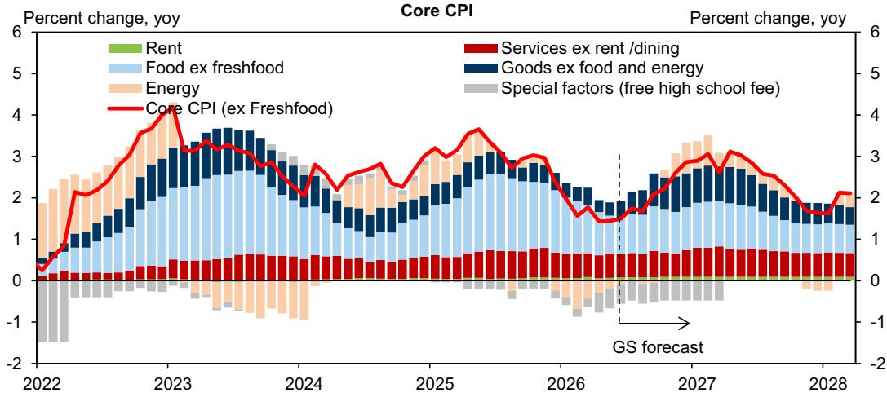
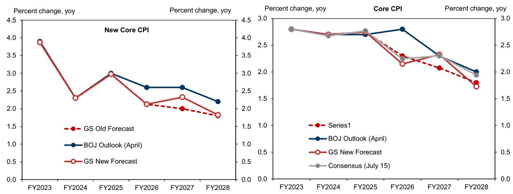

# GS：GS日本宏观环境速报，日元贬值推升通胀但服务价格滞后才是央行考验

日本通胀的叙事正在发生微妙变化。GS最新报告上调了日本2027财年核心通胀预测，核心原因有三：日元进一步走弱、存储芯片价格飙升、以及食品价格反弹。但这份报告最有价值的判断，并不在于通胀数字本身，而在于它揭示了日本通胀结构正在从“商品驱动”转向“服务滞后”——这正是日本央行货币政策面临的核心矛盾。

报告将2027财年剔除生鲜食品和能源的“新核心CPI”预测上调0.3个百分点至2.3%，同时维持2026财年2.1%不变。这一看似矛盾的调整背后，隐藏着不同价格传导机制的节奏差异。

## 1. 日元贬值对通胀的边际影响正在递减，但央行关注度却在上升

GS外汇研究团队将12个月美元兑日元预测从155调整为165，这是本次通胀预测上调的主要驱动力之一。但报告明确指出一个容易被忽视的细节：影响通胀的是汇率变动率，而非汇率相对水平。当日元已经从100贬值到160以上，即使再贬值5-10日元，对通胀的推升作用也远小于过去。

然而，日本央行对通胀超标的警惕程度正在提高。部分央行内部使用的潜在通胀指标已接近2%。这意味着，即便通胀上行幅度有限，也可能触发央行更强烈的政策反应。这是一个典型的“边际变化比相对水平更重要”的场景。

## 2. 存储芯片价格飙升对CPI的直接影响有限，但iPhone价格调整值得关注

AI服务器需求推动存储芯片价格自2025年下半年以来飙升，现货价格同比涨幅达七倍。这一传导已经体现在PC的B2B价格上，但报告认为，由于零售端还要叠加物流和人工成本，PC零售价格涨幅不会同步放大。加上PC和平板在CPI中权重仅0.3%，对整体通胀的累计贡献约0.05个百分点。

更大的变量在手机。手机在CPI中权重约1%，而iPhone占据日本手机市场约50%份额。报告援引媒体报道称，iPhone可能分两阶段在秋季和明年春季推出新品并提价，若提价幅度接近20%，仅此一项就将推升明年CPI约0.1个百分点。这是一个不可忽视的单项影响。

> **KC评论：** 存储芯片涨价对CPI的直接拉动看似不大，但iPhone提价的传导路径更短、权重更高，且消费者对手机涨价的接受度通常高于日用消费品。这可能是2026-2027年通胀中最容易被低估的单项因素。

## 3. 食品通胀第三波将至，但大米价格回落形成对冲

2024-2025年由大米价格驱动的食品通胀正在退潮。随着库存增加，大米价格预计继续节奏变化。但GS援引帝国征信调查指出，从7月起食品涨价项目数量将再次增加，形成“第三波食品通胀”。背后的驱动因素包括：石脑油价格上涨推高包装薄膜成本、进口肉类价格持续上涨、以及美国和澳大利亚小麦种植面积因天气因素减少。

这一轮食品通胀的结构与上一轮不同：大米是日本国内供给问题，而新一波更多来自进口原材料成本传导。后者对央行而言更难通过国内政策应对。

## 4. 服务价格传导滞后是当前通胀最大的不确定性

报告最值得关注的判断集中在服务价格领域。GS构建的供应链各阶段服务价格指数显示，上游B2B服务价格已随工资上涨顺利传导，但最终需求端（主要是零售服务）的价格涨幅明显滞后。在劳动密集型B2C服务领域，尽管工资增速加快，但相关CPI仍处于低位增长。

报告原本预期4月——日本私营服务价格集中调整的月份——会出现较明显的上涨，但4-5月的实际涨幅低于预期。这意味着，工资上涨向服务价格的传导机制可能比预想中更慢、更弱。如果这一趋势持续，日本央行期待的“工资-通胀良性循环”将缺少关键一环。

## 5. 能源价格节奏变化和政府管控压低核心CPI，但中东局势仍是变数

与“新核心CPI”不同，GS将2026财年剔除生鲜食品的“核心CPI”预测下调0.2个百分点至2.1%，主要原因是原油价格低于此前预期，且政府对电力和燃气的价格管控力度超出初始假设。2027财年核心CPI上调幅度也小于新核心CPI，反映了大宗商品团队对原油价格在2027年底回落至70美元/桶的预测。

报告模拟了原油价格分别维持在70、85和100美元/桶三种情景下的核心CPI路径。由于汽油价格被政府有效锁定，原油价格波动对核心CPI的影响已明显小于过去。但中东局势仍高度不确定，这是报告明确指出的上行不确定性。

---

这份报告的核心洞察可以概括为一句话：日本通胀的上行不确定性来自日元、芯片和食品，但真正的结构性变量在于服务价格能否接棒。如果服务价格传导持续滞后，日本央行将面临一个两难局面——通胀数字可能达标，但通胀的可持续性存疑。

For informational purposes only. Portions may be generated,translated,summarized,or edited with AI assistance based on source materials and may contain omissions or errors. Please verify independently. This is not investment,legal,tax,accounting,or other professional advice.

For informational purposes only. Portions may be generated,translated,summarized,or edited with AI assistance based on source materials and may contain omissions or errors. Please verify independently. This is not investment,legal,tax,accounting,or other professional advice.

