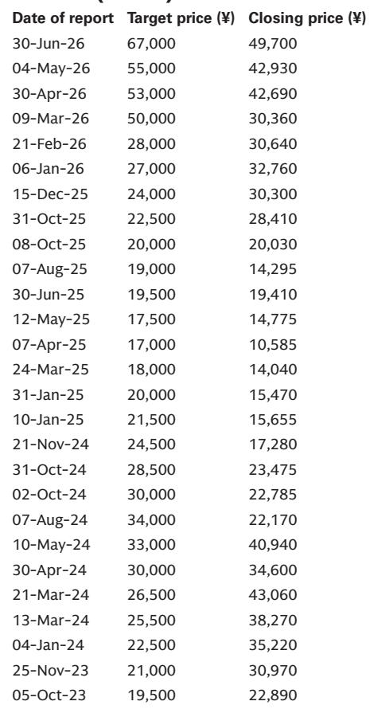
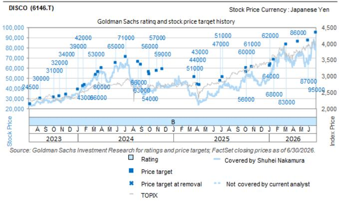

# TSMC的资本支出上调确认：日本半导体设备制造商正获得定价能力，而不仅仅是销量增长

全球最大的晶圆代工厂TSMC在7月16日的业绩说明会上，将2026年全年销售展望从此前的同比增长超过30%上调至同比增长略超40%。对半导体设备行业而言，更具意义的是，该公司将全年资本支出指引从此前520亿至560亿美元区间的上端，上调至600亿至640亿美元的新区间。这不仅仅是需求故事。TSMC明确将采购成本因通胀上升列为资本支出调整的驱动因素之一。对日本半导体设备制造商来说，这一表态改变了战略考量。该行业此前被视为销量驱动——更多芯片意味着更多设备。新的证据表明，在这个资本密集的供应链中长期缺失的定价能力，终于开始显现。

时机很重要，因为市场一直在应对一种张力。消费类半导体需求依然偏弱，但人工智能需求加速如此显著，以至于正在覆盖周期性的影响。TSMC宣布在亚利桑那州为N2及以下先进制程和先进封装启动一项新的1000亿美元投资计划，可能涉及四座晶圆厂，这表明这不是一个季度的短暂现象。这是对资本支出框架的结构性重新评估。对日本半导体设备供应商——Lasertec、Ebara、Disco和东京电子——的启示，不仅仅是它们将销售更多设备，而是定价环境正在向有利于它们的方向转变，且这一转变可能持续。

以下分析将解读：为何TSMC指引中隐含的通胀信号是业绩说明会中最被低估的数据点；资本支出分配框架如何揭示哪些半导体设备子板块受益最大；以及随着周期演进，读者应使用何种决策框架来区分不同的日本半导体设备公司。

## TSMC明确提及采购成本通胀，标志着半导体设备定价动态的格局转变

多年来，半导体设备行业一直在一个结构性约束下运行：晶圆代工厂和逻辑芯片制造商拥有巨大的采购力，而设备供应商难以转嫁成本上涨。TSMC在7月16日业绩说明会上的评论打破了这一模式。该公司表示，资本支出指引上调不仅受客户持续强劲需求驱动，还因通胀导致的采购成本上升。这是一个买方罕见的承认，通常它将设备定价视为可向下优化的可谈判变量。

战略含义很明确。当全球较强大的半导体买家明确承认通胀正在推高其资本支出时，这验证了设备供应商已经能够提价。这不是由现货短缺驱动的暂时现象。TSMC的采购通胀反映了一个更广泛的动态：N2及以下节点所需的设备变得更加复杂、资本密集度更高且更不可替代。随着技术前沿推进，可行的工具供应商数量在减少。日本半导体设备制造商，尤其是那些高度涉足前沿制程的，获得了定价杠杆。

数据支持这一解读。TSMC将其总资本支出的70-80%分配给先进制程，10%给特色节点，10-20%给先进封装、掩模制造和测试。先进制程板块正是日本设备制造商最集中的领域。例如，Lasertec很大一部分收入来自极紫外光刻和先进光掩模的检测工具——这些领域替代供应商有限。Disco用于先进封装和晶圆减薄的划片和研磨工具同样具有差异化。当像TSMC这样的客户表示采购成本在上升时，合乎逻辑的推断是这些专业工具制造商拥有定价能力。

格局转变之所以重要，是因为它改变了该行业的盈利轨迹。仅靠销量增长会带来收入扩张，但如果定价持平，利润率会受到压缩。定价能力，即使是温和的，也会传导至经营杠杆。对观察者而言，问题从“TSMC将购买多少设备？”转变为“TSMC将以什么价格购买它们？”第二个问题的答案可能比市场已定价的更有利。

## 70-80%的先进制程资本支出分配为日本半导体设备公司创造了集中的机会集

TSMC的资本支出分配框架并不新鲜，但结合上调后的指引，其含义变得更加清晰。在600亿至640亿美元的总资本支出中，大约420亿至510亿美元投向先进制程。这是推动对技术要求最高的设备需求的支出：极紫外相关检测、等离子体刻蚀、化学机械平坦化以及晶圆划片和研磨。

分析覆盖的日本半导体设备公司——东京电子、Lasertec、Ebara和Disco——各自对先进制程支出有不同的敞口。东京电子作为宽线刻蚀和沉积供应商，受益于先进晶圆厂建设的规模。Ebara的化学机械平坦化系统嵌入多层逻辑和存储堆栈所需的平坦化步骤。Lasertec的检测工具在最先进节点上对缺陷检测至关重要，单个掩模版缺陷可能毁掉整个晶圆批次。Disco的精密切割和研磨设备对于TSMC正在积极扩产的先进封装至关重要，包括其1000亿美元的亚利桑那州承诺。

关键洞察并非四家公司同等受益，而是资本支出集中在先进制程有利于技术差异化高、替代风险低的公司。这正是通胀信号和分配信号交汇之处。如果TSMC只是购买更多相同的设备，定价压力将持续存在。但该公司正在为更复杂的工艺购买更复杂的设备，且通常来自有限的供应商基础。这种组合自然支持定价。

1000亿美元的亚利桑那州投资，管理层指出可能涉及四座晶圆厂，增加了多年的可见性。这些晶圆厂将需要N2及以下节点的设备，以及先进封装产能。直接涉足TSMC的日本设备制造商——报告估计根据公司不同，敞口约占收入的10%至30%以上——将受益于一个持续、地理上扩展的资本支出周期。

## 通胀作为促成因素而非阻力，重塑了半导体设备行业的风险状况

传统观点将通胀视为资本密集型行业的风险。投入成本上升压缩利润率，利率上升增加大型项目融资成本。TSMC的业绩说明会表明半导体设备行业存在不同动态。通胀正作为资本支出增加的促成因素，而非约束。这是因为TSMC作为主导代工厂，可以将其更高成本转嫁给客户。人工智能驱动的需求激增赋予其自身产出的定价能力，进而使其有信心批准更大的设备预算。

对日本半导体设备制造商而言，这创造了一个有利的反馈循环。TSMC愿意接受更高的设备价格，因为其自身收入同比增长超过40%，这意味着设备制造商的利润率得到保护。只要人工智能需求保持强劲，TSMC在定价上强烈施压的风险就会降低。报告的分析师明确指出，通胀作为促成因素的提及表明，设备市场的价格上涨可能正在获得动力。这是一个结构性转变，而非周期性转变。

第二个层面的含义是，该行业盈利对销量假设的敏感性可能被高估。如果定价每年为收入增长贡献额外的2-3%，对盈利能力的复合效应是显著的，尤其是对于固定成本基础高的公司。东京电子凭借其广泛的产品组合和庞大的安装基础，经营杠杆将改善。Lasertec凭借其高利润率的检测工具，效果将更为明显。Ebara和Disco凭借其对前沿和封装需求的敞口，将从销量和价格的双重推动中受益。

当然，风险在于人工智能需求放缓，或TSMC的客户对其自身定价提出异议。但报告并未将此视为近期担忧。TSMC将销售展望从30%增长上调至超过40%增长，并将资本支出指引中点上调约80亿美元。这些决策是基于对客户需求和成本结构的可见性做出的。通胀评论并非抱怨，而是一种解释。这一区别对于如何解读该行业前景很重要。

## 在资本支出和定价上升环境中区分日本半导体设备公司的决策框架

并非所有日本半导体设备公司都会从上述动态中同等受益。报告提供了足够的数据，可以基于三个变量构建一个决策框架：对TSMC先进制程资本支出的敞口、设备类别内的技术差异化，以及定价能力在多大程度上已反映在当前预期中。

第一个变量——对TSMC的敞口——最为直接。报告关于对TSMC销售敞口的图表显示，Lasertec和Ulvac的估计敞口最高，其次是东京电子和Disco。Ebara的直接敞口较低，但通过其他跟随TSMC产能扩张模式的代工厂和逻辑客户间接受益。应优先考虑直接、高利润率涉足TSMC先进制程支出的公司，因为这些公司对销量和定价的杠杆作用最大。

第二个变量——技术差异化——需要更多判断。在刻蚀和沉积领域，东京电子与应用材料和泛林半导体竞争。在化学机械平坦化领域，Ebara与应用材料竞争。在检测领域，Lasertec面临科磊的竞争，但在极紫外相关检测中占据强势地位。在划片和研磨领域，Disco是主导者，直接竞争有限。差异化越高，公司能维持的定价能力越强。Lasertec和Disco似乎拥有较强的护城河，其次是东京电子和Ebara。

第三个变量——已嵌入预期的定价能力——最为动态。报告的分析师重申了对所有四家公司的观点，其中Lasertec为增持。这些目标基于全球半导体设备行业平均倍数，并给予30%至50%的溢价，反映了这些公司的质量和增长状况。如果定价能力实现强于预期，盈利预测将需要上调，提供额外上行空间。

因此，决策框架并非关于选择哪家公司，而是关于如果通胀驱动的定价主题得以实现，哪家公司更值得关注。答案指向Lasertec和Disco，鉴于它们的高差异化和对TSMC最复杂支出的直接敞口。东京电子和Ebara仍具吸引力，但更受销量因素影响，并面临来自非日本参与者的竞争。对于寻求纯粹涉足定价能力主题的观察者而言，前者提供了更清晰的叙事。

*仅供参考。部分内容可能基于源材料通过人工智能辅助生成、翻译、总结或编辑，可能存在遗漏或错误。请独立核实。这不构成专业建议。*

仅供参考。部分内容可能基于源材料通过人工智能辅助生成、翻译、总结或编辑，可能存在遗漏或错误。请独立核实。这不构成专业建议。

