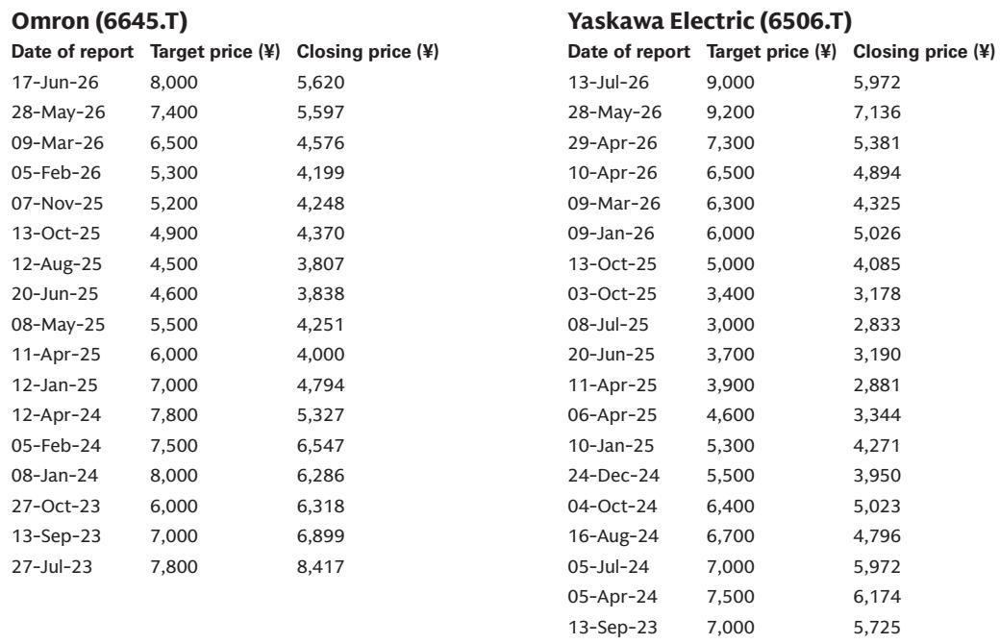
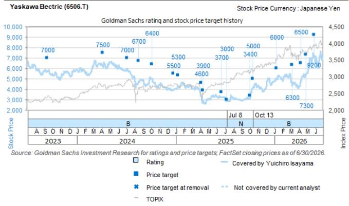
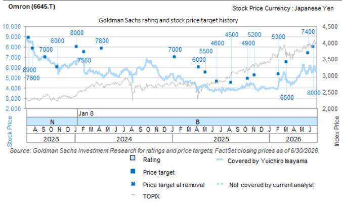

# Omron, Not the Robot Giants, Is the Most Direct Beneficiary of NVIDIA’s Physical AI Push in Japan

On July 16, NVIDIA CEO Jensen Huang stood in Japan and declared that physical AI represents the next industrial revolution and that it would be born as "Made in Japan." The announcement triggered a flurry of collaborations with Japanese industrial stalwarts, but the market’s reaction was revealing—and, in one critical case, misleading. Fanuc, Yaskawa Electric, and Kawasaki Heavy Industries all closed in positive territory, while Omron, which also announced an expanded NVIDIA partnership, fell 1.83% on a day when the TOPIX dropped 1.45%. The contrast is not a reflection of relative merit. It is a mispricing driven by media attention and narrative momentum, not by the substance of what each company actually announced.

The three robot manufacturers are still in the business exploration phase, with no capital commitments or financial guarantees attached to their partnerships. Omron, by contrast, announced technologies that are already implemented, directly monetizable, and aligned with the most urgent demand trend in industrial automation today: the need for higher-precision inspection of AI server printed circuit boards (PCBs) and semiconductor package substrates. The market overlooked this distinction. That oversight creates an opportunity for those who read past the headlines.

This article unpacks the four partnerships announced on July 16, evaluates each company’s positioning relative to the physical AI theme, and argues that Omron offers the most immediate and underappreciated exposure to the NVIDIA ecosystem in Japan’s industrial sector.

## The Robot Giants Are Exploring a Vision, Not Executing a Plan

The partnership framework involving Fujitsu, Fanuc, Yaskawa Electric, and Kawasaki Heavy Industries is structured around a sovereign collaborative control platform called Takane, which Fujitsu will develop using NVIDIA’s Cosmos world foundation model, Isaac/Omniverse, and the Newton physics engine. The platform is designed to reduce concerns about confidential information leakage by keeping the technology stack domestic, and it targets factories and logistics sites facing severe labor shortages. The roles of each robot partner are clearly differentiated: Fanuc is responsible for manufacturing optimization, Yaskawa for retail and logistics automation, and Kawasaki Heavy Industries for healthcare, including hospital-wide integration of robots with electronic medical records.

This is a coherent vision, but it remains exactly that—a vision. The announcement explicitly states that all three companies are at the beginning of the business exploration phase, with roadmaps to be formulated going forward. There are no capital relationships, no financial commitments, and no near-term revenue contributions. The press event was a declaration of direction, not a disclosure of earnings impact.

That does not mean the partnerships lack strategic value. Fanuc, as the world’s largest industrial robot maker by install base, is pursuing an open-platform strategy that allows external AI brains—from NVIDIA, Google Gemini, or Fujitsu’s Takane—to drive its robots via ROS 2 and Python. This positions its existing fleet as a receptacle for the AI ecosystem, a long-term play that could compound over years. Yaskawa, by contrast, takes a vertically integrated approach, embedding NVIDIA GPUs as standard in its MOTOMAN NEXT autonomous robot, which is already in mass production and commercial sale since 2023. It is the only one of the three with a product on the market today. Kawasaki Heavy Industries has opened a Physical AI Center in Silicon Valley and is developing hospital automation use cases, but the product concepts, while concrete, are still pre-commercial.

For all three, the July 16 announcements mark the beginning of a journey, not the midpoint. The market’s positive reaction to their stock prices reflected enthusiasm for the narrative, not evidence of near-term earnings acceleration.

## Omron’s Announcement Is Already Implemented and Directly Monetizable

Omron’s expanded collaboration with NVIDIA Omniverse is qualitatively different. It is not an exploration. It is an announcement of results already implemented, building on a digital twin partnership that began in 2022. The company disclosed three immediately deployable technologies, each tied directly to the most pressing quality-control challenge in the AI data center supply chain.

First, Omron has developed a technology that uses physical simulation to visualize PCB component “warping” in real time, enabling pre-adjustment of heat sources to predict and prevent solder joint defects. Second, the company can now overlay 3D surface data from its automated optical inspection (AOI) equipment with internal structural data from its 3D-CT X-ray inspection (AXI) equipment in digital space, allowing operators to immediately identify causal relationships—such as internal voids behind surface misalignments. Third, Omron has integrated NVIDIA’s VSS AI agent, which combines vision-language models with graph-based retrieval, enabling even novice operators to perform complex inspection tasks.

These capabilities are squarely aligned with the tightening quality demands of AI data center PCB and semiconductor package substrate manufacturing. As AI server architectures become more complex, the number of layers, density of interconnects, and thermal stress on components all increase. Defect rates that were acceptable in consumer electronics become catastrophic in data center infrastructure. Omron’s inspection equipment business, including AXI and AOI, had been growing rapidly to revenues of several tens of billions of yen, but profitability had been a challenge. The expanded partnership with NVIDIA addresses exactly this concern by increasing the value-added ratio of the equipment—enabling higher-priced systems with differentiated software capabilities that command better margins.

The stock market ignored this entirely. The Nikkei’s breaking news article mentioned Omron only briefly, in a single paragraph toward the end of a piece focused on the robot partnerships. The market followed the media’s lead. But the substance of the announcement suggests that Omron is best positioned among the four companies to directly benefit from the current shift in the demand environment, specifically in the context of AI server PCB inspection. The benefits for Omron are being significantly underestimated.

## A Decision Framework for Evaluating Physical AI Exposure in Japan Industrials

Those assessing which Japanese industrial companies offer genuine, near-term exposure to the physical AI theme should apply a three-part framework: monetization readiness, demand alignment, and competitive differentiation.

Monetization readiness measures whether the company’s announced technology is already generating revenue, is in late-stage development with a clear path to commercialization, or remains in the exploration phase. Omron scores highest here because its technologies are already implemented and tied to existing product lines. Yaskawa scores second, with a product already in mass production. Fanuc and Kawasaki Heavy Industries score lower, as their partnerships are still at the roadmap stage.

Demand alignment assesses whether the company’s offering addresses a current, accelerating market need or a future, speculative one. Omron’s inspection technologies address the immediate quality-control bottleneck in AI server manufacturing, a market that is expanding rapidly as data center capex surges. Yaskawa’s MOTOMAN NEXT addresses labor shortages in non-routine tasks like food plating and strawberry packing, which are real but less urgent than the quality demands of the AI supply chain. Fanuc and Kawasaki Heavy Industries address longer-term automation needs in manufacturing and healthcare, respectively.

Competitive differentiation evaluates whether the company’s partnership with NVIDIA provides a defensible advantage. Omron’s digital twin integration with Omniverse is proprietary and embedded in its inspection workflow, creating switching costs for customers. Yaskawa’s embedded GPU approach is differentiated but replicable. Fanuc’s open-platform strategy is deliberately non-proprietary, which limits margin capture but maximizes install base adoption.

Applying this framework, Omron emerges as the most attractive near-term exposure to the physical AI theme in Japan’s industrial sector, despite being the stock that fell on the announcement day. The market’s mispricing reflects a failure to distinguish between narrative and substance.

## The Risk Is That the Market Continues to Overlook the Near-Term Opportunity

The most significant risk to this thesis is not that Omron’s technology fails to deliver—the announcement suggests it already has—but that the market’s attention remains fixed on the robot giants and their more dramatic narrative. Media coverage of the July 16 event was heavily skewed toward Fanuc, Yaskawa, and Kawasaki Heavy Industries, and that bias may persist in subsequent reporting. If observers continue to associate “physical AI in Japan” with industrial robots rather than inspection equipment, Omron’s stock may remain undervalued relative to its near-term earnings potential.

There is also a risk that the broader pullback in AI- and semiconductor-related names, which dragged down FA stocks within the industrials coverage, continues to weigh on Omron regardless of its specific fundamentals. The company’s fall on July 16 was part of a sector-wide decline, and a reversal may require a catalyst beyond the NVIDIA partnership—such as quarterly earnings that demonstrate margin improvement from the new inspection technologies.

However, the same dynamics that caused the market to overlook Omron also create the opportunity. The company’s expanded partnership with NVIDIA is not a speculative exploration. It is a concrete improvement to a product line that addresses a rapidly growing, high-value market. As the AI data center supply chain continues to tighten and quality demands escalate, Omron’s inspection equipment becomes more indispensable, not less. The market will eventually recognize this. The question is whether observers are willing to act before the re-rating occurs.

*For informational purposes only. Portions may be generated, translated, summarized, or edited with AI assistance based on source materials and may contain omissions or errors. Please verify independently. This is not investment, legal, tax, accounting, or other professional advice.*

For informational purposes only. Portions may be generated, translated, summarized, or edited with AI assistance based on source materials and may contain omissions or errors. Please verify independently. This is not investment, legal, tax, accounting, or other professional advice.

