# Kingsoft Cloud (KC)

# 2Q26 Preview: Moderated revenue growth against a more normalized base; Capex visibility key to 2H26 growth acceleration

Kingsoft Cloud (KC) is scheduled to report 2Q26 results in mid-to-late Aug. Share price has moved -23% since its 1Q26 results reported in late May, as market participants are concerned about disconnect between management's optimistic capex outlook and revenue guidance which appeared to be unchanged. We believe such adjustment may be overdone as management's 30%+ revenue yoy growth outlook in 2026 should be the base case based on the 1Q26 capex run rate, while outlook for Rmb15-20bn capex implies a more bullish case and could support c.35% revenue yoy growth in 2026E based on our estimate.

Into the 2Q26 print, we believe market focus will be primarily on: 1) AI cloud revenue growth (GSe +62% yoy in 2Q26E vs. +90% yoy in 1Q26) and path to growth re-acceleration into 2H26E (GSe +71% yoy); 2) capex spending visibility considering supply dynamics and pricing of advanced chips/servers; 3) GPM vs. OPM trajectory (GSe 2Q26E non-GAAP GPM 14.3% with narrower yoy decline, yet potentially still affected by pricing with KAs, and non-GAAP OPM back to positive thanks to OPEX control); 4) progress of MaaS services which provide higher profitability vs. GPUaaS. For 2Q26E, we model revenue +27% yoy to Rmb3.0bn (2% below Visible Alpha Consensus Data) led by +37% yoy public cloud revenue growth (moderating from +47% yoy in 1Q26 against a more normalized base as 1Q25 public cloud revenue only grew +14% yoy), Rmb909mn adj. EBITDA (largely in line with consensus) and Rmb13mn adj. operating profit.

We keep our 2026E-28E revenue and adj. EBITDA forecasts largely unchanged, yet revise up 2026E-28E adj. operating profit by 85%/6%/4% to account for better OPEX efficiency. That said, we modify our DCF-based 12m TP to US\$17 (vs. US\$19.5 prior) based on a 10.3% WACC and 3% terminal growth (unchanged), as we factor in higher capex needed in the longer term to support the revenue growth given the rising chip/server prices.

Timothy Zhao
+852-2978-2673 | timothy.zhao@gs.com
GS (Asia) L.L.C.

Ronald Keung, CFA
+852-2978-0856 | ronald.keung@gs.com
GS (Asia) L.L.C.

Eunice Liu
+852-2978-7472 | eunice.liu@gs.com
GS (Asia) L.L.C.

## Key Data

<table><tr><td>Market cap: $3.0bn</td></tr><tr><td>Enterprise value: $3.9bn</td></tr><tr><td>3m ADTV: $19.3mn</td></tr><tr><td>China</td></tr><tr><td>China Internet Verticals</td></tr><tr><td>M&amp;A Rank: 3</td></tr><tr><td>Leases incl. in net debt &amp; EV?: No</td></tr></table>

GS Forecast

<table><tr><td colspan="5">GS Forecast</td></tr><tr><td></td><td>12/25</td><td>12/26E</td><td>12/27E</td><td>12/28E</td></tr><tr><td>Revenue (Rmb mn) New</td><td>9,558.6</td><td>12,506.6</td><td>15,702.2</td><td>19,040.0</td></tr><tr><td>Revenue (Rmb mn) Old</td><td>9,558.6</td><td>12,506.7</td><td>15,707.7</td><td>19,050.9</td></tr><tr><td>EBITDA (Rmb mn)</td><td>2,328.1</td><td>3,982.8</td><td>5,685.4</td><td>7,478.0</td></tr><tr><td>EPS (Rmb) New</td><td>(2.67)</td><td>(2.03)</td><td>(1.24)</td><td>(0.52)</td></tr><tr><td>EPS (Rmb) Old</td><td>(2.67)</td><td>(2.14)</td><td>(1.30)</td><td>(0.60)</td></tr><tr><td>P/E (X)</td><td>NM</td><td>NM</td><td>NM</td><td>NM</td></tr><tr><td>P/B (X)</td><td>2.9</td><td>2.4</td><td>2.5</td><td>2.6</td></tr><tr><td>Dividend yield (%)</td><td>0.0</td><td>0.0</td><td>0.0</td><td>0.0</td></tr><tr><td>CROCI (%)</td><td>14.0</td><td>14.6</td><td>16.3</td><td>16.9</td></tr><tr><td></td><td>3/26</td><td>6/26E</td><td>9/26E</td><td>12/26E</td></tr><tr><td>EPS (Rmb)</td><td>(0.78)</td><td>(0.52)</td><td>(0.47)</td><td>(0.26)</td></tr></table>

GS Factor Profile

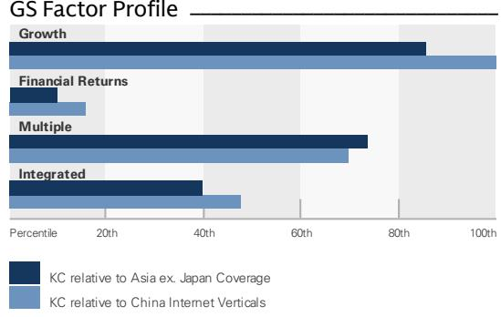  
Source: Company data, GS estimates. See disclosures for details.

## Kingsoft Cloud (KC)

Rating since Feb 11, 2026

Ratios & Valuation

<table><tr><td></td><td>12/25</td><td>12/26E</td><td>12/27E</td><td>12/28E</td></tr><tr><td>P/E (X)</td><td>NM</td><td>NM</td><td>NM</td><td>NM</td></tr><tr><td>P/B (X)</td><td>2.9</td><td>2.4</td><td>2.5</td><td>2.6</td></tr><tr><td>FCF yield (%)</td><td>(3.5)</td><td>(6.3)</td><td>(10.1)</td><td>(5.4)</td></tr><tr><td>EV/EBITDAR (X)</td><td>13.7</td><td>6.9</td><td>5.5</td><td>4.5</td></tr><tr><td>EV/EBITDA (excl. leases) (X)</td><td>13.7</td><td>6.9</td><td>5.5</td><td>4.5</td></tr><tr><td>CROCI (%)</td><td>14.0</td><td>14.6</td><td>16.3</td><td>16.9</td></tr><tr><td>ROE (%)</td><td>(10.1)</td><td>(6.9)</td><td>(4.5)</td><td>(2.0)</td></tr><tr><td>Net debt/equity (%)</td><td>30.1</td><td>64.3</td><td>111.0</td><td>145.9</td></tr><tr><td>Net debt/equity (excl. leases) (%)</td><td>29.1</td><td>63.3</td><td>109.9</td><td>144.8</td></tr><tr><td>Interest cover (X)</td><td>(0.3)</td><td>0.1</td><td>0.6</td><td>1.0</td></tr><tr><td>Days inventory outst, sales</td><td>-</td><td>-</td><td>-</td><td>-</td></tr><tr><td>Receivable days</td><td>61.3</td><td>55.3</td><td>51.3</td><td>50.3</td></tr><tr><td>Days payable outstanding</td><td>88.6</td><td>85.2</td><td>85.2</td><td>81.1</td></tr><tr><td>DuPont ROE (%)</td><td>(7.9)</td><td>(7.2)</td><td>(4.6)</td><td>(2.0)</td></tr><tr><td>Turnover (X)</td><td>0.4</td><td>0.4</td><td>0.5</td><td>0.5</td></tr><tr><td>Leverage (X)</td><td>2.9</td><td>3.5</td><td>4.1</td><td>4.8</td></tr><tr><td>Gross cash invested (ex cash) (Rmb)</td><td>22,049.1</td><td>29,450.3</td><td>38,384.9</td><td>48,027.1</td></tr><tr><td>Average capital employed (Rmb)</td><td>8,114.6</td><td>9,887.8</td><td>11,072.9</td><td>12,433.4</td></tr><tr><td>BVPS (Rmb)</td><td>34.05</td><td>28.28</td><td>26.76</td><td>25.98</td></tr></table>

Income Statement (Rmb mn)

<table><tr><td></td><td>12/25</td><td>12/26E</td><td>12/27E</td><td>12/28E</td></tr><tr><td>Total revenue</td><td>9,558.6</td><td>12,506.6</td><td>15,702.2</td><td>19,040.0</td></tr><tr><td>Cost of goods sold</td><td>(8,016.9)</td><td>(10,695.8)</td><td>(13,428.7)</td><td>(16,238.7)</td></tr><tr><td>SG&amp;A</td><td>(1,114.8)</td><td>(1,135.3)</td><td>(1,221.9)</td><td>(1,320.8)</td></tr><tr><td>R&amp;D</td><td>(752.9)</td><td>(774.5)</td><td>(843.1)</td><td>(933.6)</td></tr><tr><td>Other operating inc./(exp.)</td><td>-</td><td>-</td><td>-</td><td>-</td></tr><tr><td>EBITDA</td><td>2,162.0</td><td>3,802.1</td><td>5,511.6</td><td>7,304.3</td></tr><tr><td>Depreciation &amp; amortization</td><td>(2,480.4)</td><td>(3,908.1)</td><td>(5,303.2)</td><td>(6,757.4)</td></tr><tr><td>EBIT</td><td>(152.2)</td><td>74.7</td><td>382.2</td><td>720.7</td></tr><tr><td>Net interest inc./(exp.)</td><td>(417.2)</td><td>(509.2)</td><td>(590.9)</td><td>(709.3)</td></tr><tr><td>Income/(loss) from associates</td><td>-</td><td>-</td><td>-</td><td>-</td></tr><tr><td>Pre-tax profit</td><td>(735.6)</td><td>(615.2)</td><td>(382.5)</td><td>(162.4)</td></tr><tr><td>Provision for taxes</td><td>4.2</td><td>(5.1)</td><td>0.0</td><td>0.0</td></tr><tr><td>Minority interest</td><td>-</td><td>(0.1)</td><td>-</td><td>-</td></tr><tr><td>Preferred dividends</td><td>-</td><td>-</td><td>-</td><td>-</td></tr><tr><td>Net inc. (pre-exceptionals)</td><td>(731.4)</td><td>(620.3)</td><td>(382.5)</td><td>(162.4)</td></tr><tr><td>Post-tax exceptionals</td><td>(204.9)</td><td>(296.8)</td><td>(306.3)</td><td>(363.3)</td></tr><tr><td>Net inc. (post-exceptionals)</td><td>(936.3)</td><td>(917.1)</td><td>(688.8)</td><td>(525.6)</td></tr><tr><td>EPS (basic, pre-except) (Rmb)</td><td>(2.67)</td><td>(2.03)</td><td>(1.24)</td><td>(0.52)</td></tr><tr><td>EPS (diluted, pre-except) (Rmb)</td><td>(2.67)</td><td>(2.03)</td><td>(1.24)</td><td>(0.52)</td></tr><tr><td>EPS (basic, post-except) (Rmb)</td><td>(3.42)</td><td>(3.00)</td><td>(2.23)</td><td>(1.68)</td></tr><tr><td>EPS (diluted, post-except) (Rmb)</td><td>(3.42)</td><td>(3.00)</td><td>(2.23)</td><td>(1.68)</td></tr><tr><td>DPS (Rmb)</td><td>-</td><td>-</td><td>-</td><td>-</td></tr><tr><td>Div. payout ratio (%)</td><td>0.0</td><td>0.0</td><td>0.0</td><td>0.0</td></tr></table>

Growth & Margins (%)

<table><tr><td></td><td>12/25</td><td>12/26E</td><td>12/27E</td><td>12/28E</td></tr><tr><td>Total revenue growth</td><td>22.8</td><td>30.8</td><td>25.6</td><td>21.3</td></tr><tr><td>EBITDA growth</td><td>179.9</td><td>71.1</td><td>42.7</td><td>31.5</td></tr><tr><td>EPS growth</td><td>21.0</td><td>24.1</td><td>38.9</td><td>58.0</td></tr><tr><td>DPS growth</td><td>NM</td><td>NM</td><td>NM</td><td>NM</td></tr><tr><td>EBIT margin</td><td>(1.6)</td><td>0.6</td><td>2.4</td><td>3.8</td></tr><tr><td>EBITDA margin</td><td>24.4</td><td>31.8</td><td>36.2</td><td>39.3</td></tr><tr><td>Net income margin</td><td>(7.7)</td><td>(5.0)</td><td>(2.4)</td><td>(0.9)</td></tr></table>

Price Performance  
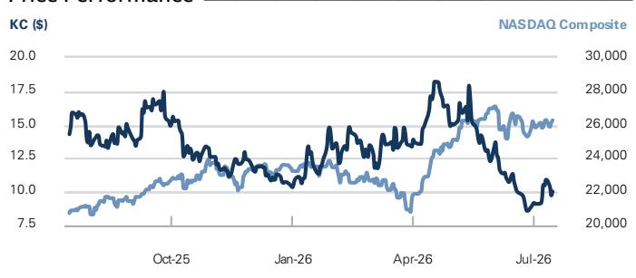

<table><tr><td></td><td>3m</td><td>6m</td><td>12m</td></tr><tr><td>Absolute</td><td>(40.6)%</td><td>(18.9)%</td><td>(33.5)%</td></tr><tr><td>Rel. to the NASDAQ Composite</td><td>(45.7)%</td><td>(27.3)%</td><td>(47.7)%</td></tr></table>

Source: FactSet. Price as of 15 Jul 2026 close.

<table><tr><td colspan="5">Balance Sheet (Rmb mn)</td></tr><tr><td></td><td>12/25</td><td>12/26E</td><td>12/27E</td><td>12/28E</td></tr><tr><td>Cash &amp; cash equivalents</td><td>6,117.2</td><td>4,812.5</td><td>4,200.2</td><td>5,046.8</td></tr><tr><td>Accounts receivable</td><td>1,740.5</td><td>2,047.2</td><td>2,364.1</td><td>2,880.6</td></tr><tr><td>Inventory</td><td>-</td><td>-</td><td>-</td><td>-</td></tr><tr><td>Other current assets</td><td>3,165.7</td><td>3,795.6</td><td>4,416.7</td><td>5,000.6</td></tr><tr><td>Total current assets</td><td>11,023.4</td><td>10,655.3</td><td>10,981.0</td><td>12,928.0</td></tr><tr><td>Net PP&amp;E</td><td>10,193.3</td><td>14,404.7</td><td>18,011.1</td><td>21,006.8</td></tr><tr><td>Net intangibles</td><td>5,138.5</td><td>5,018.9</td><td>4,909.3</td><td>4,836.2</td></tr><tr><td>Total investments</td><td>234.2</td><td>234.2</td><td>234.2</td><td>234.2</td></tr><tr><td>Other long-term assets</td><td>139.8</td><td>139.8</td><td>139.8</td><td>139.8</td></tr><tr><td>Total assets</td><td>26,729.2</td><td>30,453.0</td><td>34,275.4</td><td>39,145.0</td></tr><tr><td>Accounts payable</td><td>2,014.5</td><td>2,977.7</td><td>3,287.8</td><td>3,930.5</td></tr><tr><td>Short-term debt</td><td>3,348.3</td><td>3,348.3</td><td>3,348.3</td><td>3,848.3</td></tr><tr><td>Short-term lease liabilities</td><td>40.9</td><td>40.9</td><td>40.9</td><td>40.9</td></tr><tr><td>Other current liabilities</td><td>4,017.7</td><td>4,589.9</td><td>5,083.0</td><td>5,578.5</td></tr><tr><td>Total current liabilities</td><td>9,421.3</td><td>10,956.8</td><td>11,760.1</td><td>13,398.3</td></tr><tr><td>Long-term debt</td><td>3,023.5</td><td>3,023.5</td><td>4,523.5</td><td>6,023.5</td></tr><tr><td>Long-term lease liabilities</td><td>51.1</td><td>51.1</td><td>51.1</td><td>51.1</td></tr><tr><td>Other long-term liabilities</td><td>4,920.1</td><td>7,772.8</td><td>9,674.4</td><td>11,568.2</td></tr><tr><td>Total long-term liabilities</td><td>7,994.8</td><td>10,847.5</td><td>14,249.1</td><td>17,642.9</td></tr><tr><td>Total liabilities</td><td>17,416.2</td><td>21,804.3</td><td>26,009.2</td><td>31,041.2</td></tr><tr><td>Preferred shares</td><td>0.0</td><td>-</td><td>-</td><td>-</td></tr><tr><td>Total common equity</td><td>9,317.0</td><td>8,652.6</td><td>8,270.1</td><td>8,107.7</td></tr><tr><td>Minority interest</td><td>(4.0)</td><td>(3.9)</td><td>(3.9)</td><td>(3.9)</td></tr><tr><td>Total liabilities &amp; equity</td><td>26,729.2</td><td>30,453.0</td><td>34,275.4</td><td>39,145.0</td></tr><tr><td>Net debt, adjusted</td><td>2,714.6</td><td>5,472.0</td><td>9,086.0</td><td>11,733.2</td></tr></table>

Cash Flow (Rmb mn)

<table><tr><td colspan="5">Cash flow (Kmb mln)</td></tr><tr><td></td><td>12/25</td><td>12/26E</td><td>12/27E</td><td>12/28E</td></tr><tr><td>Net income</td><td>(943.7)</td><td>(917.0)</td><td>(688.8)</td><td>(525.6)</td></tr><tr><td>D&amp;A add-back</td><td>2,480.4</td><td>3,908.1</td><td>5,303.2</td><td>6,757.4</td></tr><tr><td>Minority interest add-back</td><td>-</td><td>-</td><td>-</td><td>-</td></tr><tr><td>Net (inc)/dec working capital</td><td>1,760.7</td><td>3,451.5</td><td>1,767.0</td><td>1,931.6</td></tr><tr><td>Other operating cash flow</td><td>503.6</td><td>252.7</td><td>306.3</td><td>363.3</td></tr><tr><td>Cash flow from operations</td><td>3,801.0</td><td>6,695.3</td><td>6,687.7</td><td>8,526.6</td></tr><tr><td>Capital expenditures</td><td>(4,742.4)</td><td>(8,000.0)</td><td>(8,800.0)</td><td>(9,680.0)</td></tr><tr><td>Acquisitions</td><td>-</td><td>-</td><td>-</td><td>-</td></tr><tr><td>Divestitures</td><td>-</td><td>-</td><td>-</td><td>-</td></tr><tr><td>Others</td><td>212.6</td><td>-</td><td>-</td><td>-</td></tr><tr><td>Cash flow from investing</td><td>(4,529.7)</td><td>(8,000.0)</td><td>(8,800.0)</td><td>(9,680.0)</td></tr><tr><td>Repayment of lease liabilities</td><td>-</td><td>-</td><td>-</td><td>-</td></tr><tr><td>Dividends paid (common &amp; pref)</td><td>-</td><td>-</td><td>-</td><td>-</td></tr><tr><td>Inc/(dec) in debt</td><td>1,357.3</td><td>0.0</td><td>1,500.0</td><td>2,000.0</td></tr><tr><td>Other financing cash flows</td><td>2,758.5</td><td>0.1</td><td>0.0</td><td>0.0</td></tr><tr><td>Cash flow from financing</td><td>4,115.8</td><td>0.1</td><td>1,500.0</td><td>2,000.0</td></tr><tr><td>Total cash flow</td><td>3,387.1</td><td>(1,304.6)</td><td>(612.3)</td><td>846.6</td></tr><tr><td>Free cash flow</td><td>(941.3)</td><td>(1,304.7)</td><td>(2,112.3)</td><td>(1,153.4)</td></tr></table>

Source: Company data, GS estimates.

We see its current valuation as noteworthy; KC is trading at 1.5x 2026E P/S which is at 2x standard deviation below its historical average level of 2.5x since 2025. Key catalysts: Xiaomi's new model launches (e.g. MiMo, Xiaomi-Robotics embodied foundation model; also see Setting the scene for a catalyst-rich 3Q; Sharpening the scene ahead of SkyNomad launch and continued AI progress); enhanced chip availability; domestic chip breakthrough.

Exhibit 1: We model KC's revenue growth at $27\%$ yoy in 2Q26E moderating from $37\%$ yoy in 1Q26 due to chip constraints  
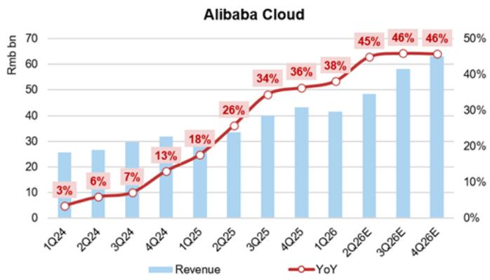

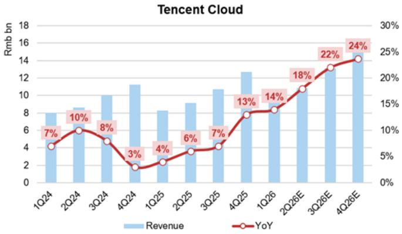

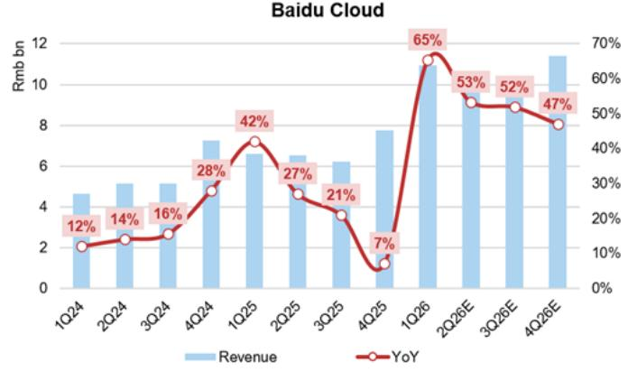  
Source: Company data, GS Global Investment Research

Exhibit 2: We expect AI related revenue contribution to increase to 40%+ in 2026E vs. 31% in 2025  
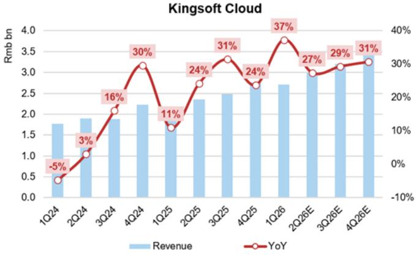

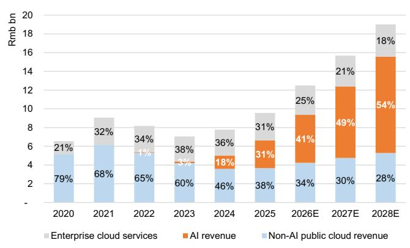  
Source: Company data, GS Global Investment Research

Exhibit 3: We expect Xiaomi and Kingsoft combined to account for $40\%$ of KC's revenue by 2028E vs. $27\%$ in 2025...  
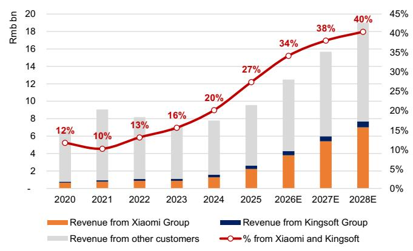  
Source: Company data, GS Global Investment Research

Exhibit 4: ... with revenue from Xiaomi/Kingsoft combined growing at a 43% CAGR in 2025-28E vs. an 18% CAGR for revenue from other customers
yoy revenue growth by customer  
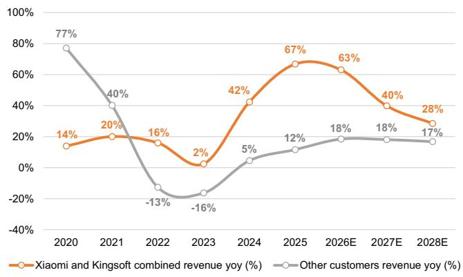  
Source: Company data, GS Global Investment Research

Exhibit 5: Our quarterly forecasts on GPM, EBITDA margin and operating margin  
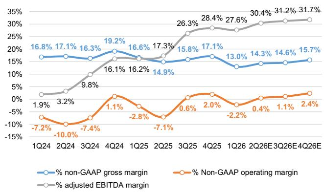  
Source: Company data, GS Global Investment Research

Exhibit 6: Our annual forecasts on GPM, EBITDA margin and operating margin  
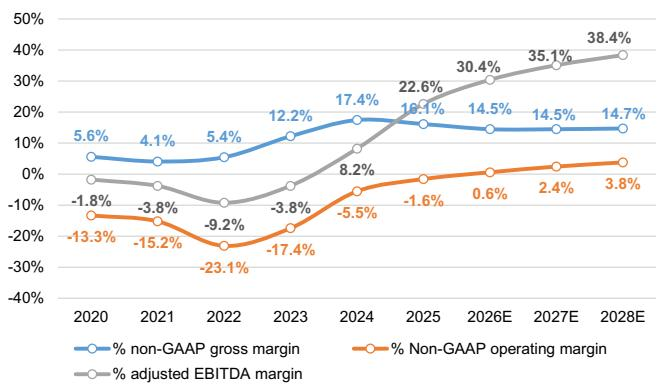  
Source: Company data, GS Global Investment Research

Exhibit 7: KC is trading at a 1.4x 12m-fwd P/S which is at its -2SD historical average level since 2025
KC 12-fwd P/S ratio  
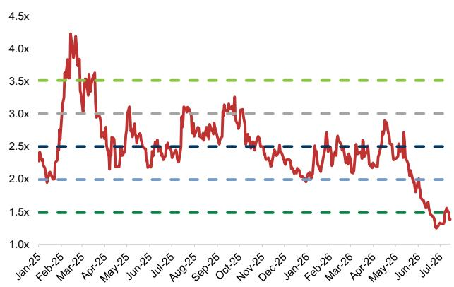  
Source: Bloomberg, Data compiled by GS Global Investment Research

Exhibit 8: KC 2Q26 results preview

<table><tr><td rowspan="2">Rmb mn</td><td rowspan="2">1Q24</td><td rowspan="2">2Q24</td><td rowspan="2">3Q24</td><td rowspan="2">4Q24</td><td rowspan="2">1Q25</td><td rowspan="2">2Q25</td><td rowspan="2">3Q25</td><td rowspan="2">4Q25</td><td rowspan="2">1Q26</td><td colspan="3">New</td></tr><tr><td>2Q26</td><td>%QoQ</td><td>%YoY</td></tr><tr><td>Public cloud services</td><td>1,187</td><td>1,235</td><td>1,176</td><td>1,410</td><td>1,353</td><td>1,625</td><td>1,752</td><td>1,902</td><td>1,996</td><td>2,219</td><td>11%</td><td>37%</td></tr><tr><td>AI revenue</td><td>263</td><td>326</td><td>362</td><td>474</td><td>525</td><td>729</td><td>782</td><td>926</td><td>998</td><td>1,184</td><td>19%</td><td>62%</td></tr><tr><td>Non-AI public cloud revenue</td><td>925</td><td>909</td><td>814</td><td>936</td><td>828</td><td>897</td><td>970</td><td>976</td><td>998</td><td>1,035</td><td>4%</td><td>15%</td></tr><tr><td>Enterprise cloud services</td><td>588</td><td>657</td><td>710</td><td>822</td><td>616</td><td>724</td><td>726</td><td>859</td><td>707</td><td>773</td><td>9%</td><td>7%</td></tr><tr><td>Xiaomi and Kingsoft</td><td>337</td><td>370</td><td>376</td><td>489</td><td>506</td><td>629</td><td>691</td><td>798</td><td>855</td><td>1,019</td><td>19%</td><td>62%</td></tr><tr><td>Third-party customers</td><td>1,438</td><td>1,522</td><td>1,510</td><td>1,743</td><td>1,464</td><td>1,720</td><td>1,787</td><td>1,964</td><td>1,849</td><td>1,973</td><td>7%</td><td>15%</td></tr><tr><td>Total revenues</td><td>1,776</td><td>1,892</td><td>1,886</td><td>2,232</td><td>1,970</td><td>2,349</td><td>2,478</td><td>2,761</td><td>2,704</td><td>2,992</td><td>11%</td><td>27%</td></tr><tr><td>Cost of revenues, GAAP</td><td>(1,482)</td><td>(1,573)</td><td>(1,582)</td><td>(1,806)</td><td>(1,652)</td><td>(2,010)</td><td>(2,097)</td><td>(2,296)</td><td>(2,358)</td><td>(2,571)</td><td>-9%</td><td>-28%</td></tr><tr><td>Gross (loss)/profit, GAAP</td><td>293</td><td>318</td><td>303</td><td>426</td><td>318</td><td>339</td><td>381</td><td>465</td><td>346</td><td>421</td><td>22%</td><td>24%</td></tr><tr><td>Gross profit, non-GAAP</td><td>299</td><td>323</td><td>308</td><td>428</td><td>328</td><td>351</td><td>393</td><td>471</td><td>351</td><td>426</td><td>21%</td><td>22%</
