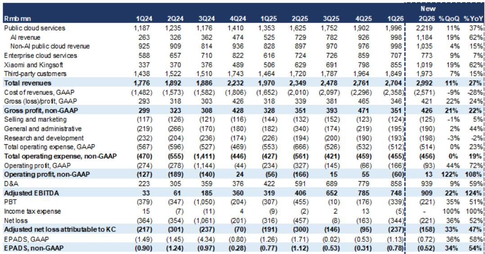
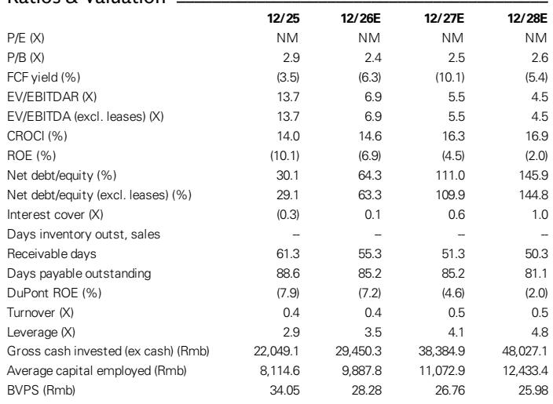
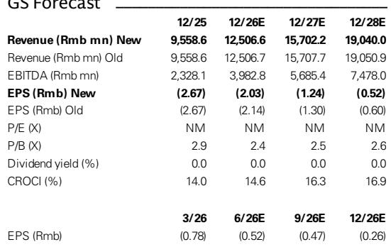

# 市场对金山云资本开支信号的误读：回调创造观察窗口

金山云自5月底发布2026年第一季度业绩以来，公司报价出现一定幅度调整，主要源于市场对管理层乐观的资本开支展望与看似未变的收入指引之间的认知差异。这一调整可能过度。管理层提出的2026年收入同比增长30%以上是基础情景，而非乐观情景，仅基于第一季度资本开支运行率即可支撑。更为积极的150-200亿元资本开支展望，市场似乎将其视为不可靠信号，但实际上，根据公司运营模型中资本部署与收入生成的可观察关系，这一展望隐含全年约35%的收入增长。

这一市场定价偏差的时机值得关注。金山云计划于8月中下旬公布第二季度业绩，即将发布的报告可能成为观察窗口，原因有三。第一，AI云收入增长虽预计从第一季度的90%放缓至第二季度的62%，但预计在2026年下半年重新加速至71%的同比增长。第二，公司当前交易价格约为2026年预期市销率的1.5倍，低于2025年以来2.5倍的历史均值——这一估值已包含相当程度的谨慎预期。第三，催化路径较为清晰，小米新模型发布、国内芯片突破以及芯片可用性提升，均指向当前报价尚未反映的下半年加速。

关注短期收入增速放缓的观察者可能忽略了正在发生的结构性变化。AI相关收入贡献预计从2025年的31%上升至2026年的40%以上，金山云与其两大主要股东——小米和金山——的关系正在深化，这从根本上改变了公司的增长轨迹。此次调整为观察一家从传统云服务商向AI基础设施方向转型的公司提供了窗口，其需求来自生态系统内部。

## 第二季度收入放缓是基数效应，而非需求问题

第二季度预计收入同比增长27%，较第一季度的37%有所放缓，这似乎印证了市场对增长动能减弱的担忧。但这种解读可能具有误导性。放缓主要源于比较基数的变化：2025年第一季度公有云收入仅同比增长14%，而2025年第二季度公有云收入增速较快，达32%。当基数正常化后，增长率自然压缩，但相对收入轨迹依然健康。

公有云服务收入预计在第二季度约为22.19亿元，较第一季度的19.96亿元环比增长11%。其中，AI云收入预计为11.84亿元，环比增长19%，同比增长62%。环比增长尤其具有参考价值：它表明需求并未减弱，而是在年内逐步累积。下半年AI收入同比增长预计重新加速至71%，这得益于上半年部署的资本开支带来的产能上线，以及新芯片的可用性。

企业云板块规模较小，第二季度预计为7.73亿元，同比增长7%，环比改善9%。这并非增长引擎，但随着AI业务规模扩大，它提供了稳定性和交叉销售机会。关键在于，收入结构正明确转向更高增长、更高价值的AI工作负载，而整体增速的暂时放缓是基数的数学结果，并非需求饱和的信号。

## 资本开支与收入的关联比市场假设的更紧密，150-200亿元展望具有可信度

自第一季度业绩发布以来，市场关注的核心矛盾在于管理层提出的2026年150-200亿元积极资本开支指引与看似未变的收入指引之间的感知差距。市场将此解读为管理层过度投入的信号，或认为资本开支无法转化为相应收入。数据可能指向相反方向。

基于第一季度的资本开支运行率，30%以上的收入增长指引作为基础情景是可以实现的。150-200亿元的资本开支范围则隐含更为乐观的情景，可支撑2026年约35%的收入增长。资本开支与收入之间的关系并非推测，而是基于公司的资本密集度和可观察的投入资本回报率，后者预计将从2025年的14.0%提升至2026年的14.6%，到2028年进一步提升至16.9%。

资本开支的可见性问题确实存在，但可以管理。先进芯片和服务器供应趋紧及价格上涨带来执行风险，但这是时间问题，而非需求问题。国内芯片突破作为报告提及的关键催化因素，提供了可缓解约束的替代供应路径。市场正在为芯片可用性的最坏情景定价，而未考虑金山云通过其与小米的关系及更广泛的生态系统合作伙伴关系可获得的多种产能扩张路径。

## 生态系统优势是竞争对手难以复制的结构性差异

金山云研究框架中最被低估的要素是与小米和金山收入集中度的深化。来自这两大股东的综合收入预计从2025年到2028年将以43%的年复合增长率增长，而其他客户的收入年复合增长率为18%。到2028年，小米和金山预计将占金山云收入的40%，高于2025年的27%。

这不是依赖风险，而是结构性优势。小米的新模型发布，包括MiMo和小米机器人具身基础模型，创造了AI云基础设施的专属需求，这是任何第三方云服务商无法以同等整合深度提供的。来自小米和金山的收入在第二季度同比增长62%至10.19亿元，占总收入的34%。这一增长正在加速而非放缓，并提供了大多数云公司所缺乏的可见性缓冲。

生态系统模式也改变了关于利润率的讨论。来自小米和金山的收入具有更高的战略价值，且对价格的敏感度低于第三方企业云合同。随着收入结构向这些更高质量的来源转移，即使公司继续投资于产能，毛利率轨迹也应有所改善。第二季度非GAAP毛利率为14.3%，虽仍受关键客户优惠定价的压缩，但预计同比降幅将收窄，且由于严格的运营费用控制，非GAAP运营利润率预计将转正。

## 第二季度报告的决策框架：决定观察窗口是否出现的三个变量

关注第二季度业绩的观察者应聚焦三个具体变量，它们将确认或反驳加速增长的观点。

第一，AI云收入增长及重新加速的路径。第二季度62%的同比增长估计已低于第一季度的90%，因此问题不在于本季度是否放缓，而在于管理层是否提供支持下半年71%同比增长预期的指引或定性评论。关注产能上线、AI工作负载的新客户获取或小米扩大承诺的具体提及。如果评论强化了下半年轨迹，当前估值折价应开始收窄。

第二，资本开支支出的可见性与芯片供应叙事。市场需要听到，尽管供应趋紧和价格上涨，150-200亿元的资本开支范围仍可实现。管理层关于国内芯片突破、长期供应协议或库存建设的评论，将比相对资本开支数字更为重要。风险在于芯片约束迫使资本开支计划下调，这将压缩2027年的收入增长潜力。这是最大的变量。

第三，利润率轨迹，特别是非GAAP毛利率的进展以及实现持续运营盈利的路径。第二季度非GAAP运营利润估计为1300万元，这是一个规模虽小但具有象征意义的正数，标志着多年亏损后的转变。问题在于这是否可持续，还是费用时间安排带来的单季度现象。2026年全年运营利润估计为7470万元，这意味着随着收入增长快于固定成本，利润率应在年内改善。如果第二季度利润率超出预期，将表明运营杠杆的观点是真实的。

然而，最重要的领先指标是MaaS（模型即服务）相对于GPU即服务产品的进展。MaaS具有更高的盈利能力，因为它将软件和模型优化叠加在原始计算之上，每单位GPU部署捕获更多价值。如果金山云在MaaS方面与小米或其他生态系统合作伙伴取得进展，将表明公司正从商品化GPU租赁向更高利润的AI平台服务价值链上游移动。这一转变如果得到确认，将从根本上改变利润率展望，并支持超出当前市销率倍数扩张的估值重估。

此次调整为市场定价了一个悲观情景，而该情景与潜在需求环境、生态系统优势和资本开支驱动的增长轨迹不一致。第二季度报告不会解决所有不确定性，但将提供判断观察窗口是否真实所需的证据。对于愿意审视基数效应的观察者而言，当前风险回报特征值得关注。

*仅供参考。部分内容可能基于源材料通过AI辅助生成、翻译、总结或编辑，可能存在遗漏或错误。请独立核实。本文不构成任何专业建议。*

仅供参考。部分内容可能基于源材料通过AI辅助生成、翻译、总结或编辑，可能存在遗漏或错误。请独立核实。本文不构成任何专业建议。

