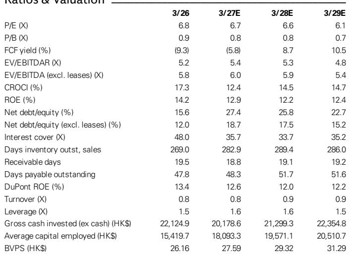
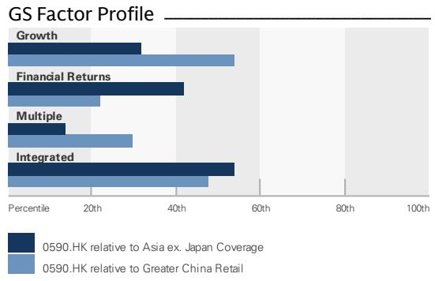
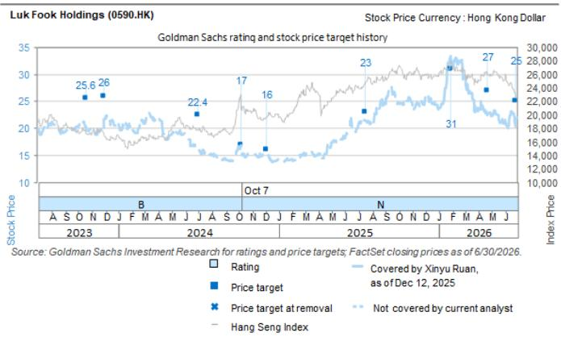

# 六福门店调整加速：黄金驱动增长背后的零售结构观察

六福集团近期公布了季度运营数据。在香港和澳门市场，同店销售额同比增长41%；内地授权门店也录得25%的同店增长。这些数字表面上看，似乎印证了珠宝消费的持续回暖。然而，一个更值得关注的信号隐藏在数据之下：该公司在本季度于内地净关闭了150家门店——这一数字是上一季度71家的两倍多，也达到了分析师对上半财年关闭数量的预期。

这并不是一个零售商陷入困境的故事。六福的市值约为135亿港元，企业价值为178亿港元。公司的估值约为未来收益的6.7倍，股息率超过6.5%。核心问题在于，当前以黄金产品和授权扩张为主的收入结构，能否维持支撑当前估值水平的利润率和回报率。

强劲的同店销售与激进的店铺优化之间形成的张力，需要从战略层面进行解读。观察者需要区分黄金需求的周期性回暖，与珠宝零售商在增速放缓、利润率降低的环境中，如何实现回报的结构性变化。

## 黄金与定价珠宝表现分化：消费偏好的结构性转变，而非短期周期

季度数据显示出不同产品类别之间的明显分化。在内地市场，自营门店的黄金产品同店销售额同比增长21%，而定价珠宝的同店销售额则下降了7%。在香港和澳门，这种差距更为显著：黄金同店销售额同比激增55%，恢复至疫情前水平的103%；而定价珠宝的同店销售额仅增长15%，仅为正常水平的48%。

这种分化并非短期现象。它反映了一个持续多年的趋势：消费者越来越多地将黄金饰品视为一种价值储存手段，而非纯粹的装饰品。在宏观环境变化的背景下，黄金购买兼具消费与储蓄的双重功能。而定价珠宝虽然利润率较高，但缺乏内在价值属性，因此受到了与奢侈品配饰和服装类似的消费降级影响。

这对利润率的影响是直接的。由于黄金作为大宗商品，其成本透明，因此黄金产品的毛利率低于定价珠宝。当黄金产品在销售组合中占据主导地位时，即使收入增长，整体毛利率也会受到压缩。六福的财务预测也印证了这一动态：尽管收入预计增长近21%，但公司的EBITDA利润率预计将从2026财年的18.2%下降至2027财年的15.8%。净利润率预计将从11.9%降至9.8%。

对于观察者而言，问题不在于黄金需求是否会持续——考虑到宏观环境，它很可能会持续——而在于产品结构变化带来的利润率侵蚀，能否通过其他方面的运营杠杆来弥补。门店关闭的数据表明，管理层认为至少在目前的门店数量下，这是难以实现的。

## 门店调整加速：管理层在规模与盈利之间做出选择，重塑增长逻辑

六福在季度内于内地净关闭了150家门店。这超过了上一季度71家的关闭数量，也与整个上半财年净关闭150家的预测相符。这一节奏表明，公司并非仅仅在淘汰表现不佳的门店，而是在有意识地收缩其授权门店网络。

授权门店约占六福内地门店网络的91%。这些门店通过向加盟商收取特许权使用费和销售产品来产生收入，但其利润率低于自营门店。这一轮关闭潮表明，授权门店的边际贡献已转为负值或不足以支撑其营运资金和库存投入。

这是一种理性的战略回应。当同店销售增长强劲，但门店层面的盈利能力较弱时，最优选择是减少门店数量，将收入集中在质量更高的地段。数据支持这一解读：内地自营门店的同店销售额同比增长16%，超过疫情前水平5%；而授权门店的同店销售额增长25%，意味着超过疫情前水平19%。自营门店虽然数量较少，但在可比基础上恢复得更快。

这对收入增长的影响是增速放缓。总收入在2026财年增长了29%，但预计增速将在2027财年放缓至20.9%，2028财年放缓至10.3%，2029财年放缓至7.0%。门店关闭是导致增速放缓的直接因素之一。然而，这种权衡换来的是资本效率的提升。预计自由现金流将在2027财年转为负值，为负7.75亿港元，随后在2028财年强劲转正至11.6亿港元，并在2029财年达到14亿港元。这个转折点恰好发生在门店优化全面生效之时。

## 港澳市场表现突出：双速复苏要求对不同区域进行独立评估

香港和澳门市场同店销售额同比增长41%，标志着从疫情低谷的显著复苏，该区域运营水平已达到2018年（疫情及社会事件前）的78%。这些市场的黄金产品已完全恢复，达到正常水平的103%，而定价珠宝仍仅为48%。

这种突出表现并非仅仅是需求压抑后的释放。它反映了内地游客旅行模式的结构性变化。曾经前往欧洲、日本或东南亚进行奢侈品购物的内地消费者，如今受旅行政策变化、签证限制以及对短途、低风险旅行偏好的影响，正将消费集中在香港和澳门。季度数据显示，这种需求转移正在加速，内地市场6月份的同店销售增速较5月份有所放缓，管理层将此归因于折扣力度减少以及消费者需求向港澳市场转移。

对于六福而言，港澳业务与内地业务的经济模式不同。该季度该区域门店数量持平，没有净关闭。公司在海外市场新增了两家门店，表明国际扩张仍是增长重点。港澳业务可能因授权费用较低、平均交易额较高以及客户群更富裕而拥有更高的利润率。

观察者应将这两个区域分开建模。内地业务正在进行以提升盈利能力为导向的收缩，这将抑制收入增长但改善现金流。港澳业务则正经历由需求驱动的扩张，同时提升收入和利润率。对合并财务数据的净影响取决于各板块的相对权重，而随着内地门店关闭加速，这一权重正朝着有利于港澳的方向倾斜。

## 相较于周大福的估值折价反映了结构性风险，但随着六福的资本纪律显现成效，差距可能缩小

六福相较于周大福存在约40%的估值折价。这一折价水平与2017-2018年观察到的水平一致，当时港澳市场的同店销售增长表现更优。估值差距反映了几个结构性因素：六福规模较小、对授权门店的依赖度更高、对利润率较低的黄金产品敞口更大，以及相对于周大福的品牌溢价较低。

问题在于，这一折价是合理的还是过度的。如果六福的门店优化成功提升了股本回报率和自由现金流生成能力，那么当前的估值倍数可能显得过于苛刻。公司预计2027财年的股本回报率为12.9%，2028财年降至12.2%，然后在2029财年恢复至12.4%。这些并非卓越的回报率，但它们是稳定的，并得到了强劲资产负债表的支持（净负债与权益比率为27.4%，不含租赁）。

主要风险在于，门店关闭速度可能超出预期，这表明授权门店模式存在更深层次的结构性弱点。如果随着折扣减少和以旧换新政策变得更加严格，授权门店的同店销售增长放缓，收入基础可能会比管理层预期的萎缩得更快。季度数据已经显示6月份较5月份有所放缓，管理层将其归因于有意的政策选择。如果这种放缓持续，门店关闭率可能需要进一步上升。

相反，如果港澳市场的复苏被证明是持久的，并且海外扩张取得进展，六福可能会成为一家更精简、盈利能力更强、收入质量更高的公司。2028财年的自由现金流转折点是最值得关注的指标。如果公司能够实现这一轨迹，那么相对于周大福的估值折价应该会缩小。

## 评估当前周期下珠宝零售商的决策框架

分析六福或同类珠宝零售商时，可以应用一个三部分框架，将周期性复苏与结构性变化区分开来。

首先，按产品类别和区域分解同店销售增长。黄金与定价珠宝的区分并非细枝末节，它是决定利润率走势的主要因素。一家报告总同店销售强劲但定价珠宝销售下滑的零售商，正在经历由产品结构驱动的利润率压缩，这种压缩在消费者行为改变之前不会逆转。同样，港澳与内地的增长率差异揭示了公司是受益于旅行驱动的需求还是国内消费趋势。

其次，追踪门店数量变化与同店销售增长的关系。一家在报告正同店销售增长的同时关闭门店的公司，正在做出关于资本配置的战略选择。关键问题是，这些关闭是主动的（淘汰低利润门店以提高整体回报）还是被动的（应对无法逆转的门店层面亏损）。关闭速度与管理层自身指引的比较提供了最清晰的信号。当关闭数量超出指引时（正如六福在季度中的情况），表明管理层在优化方面的行动比之前沟通的更为积极。

第三，对自由现金流而非收入增长进行建模。珠宝零售是营运资金密集型行业，尤其是在黄金库存占比较高的情况下。六福的库存周转天数预计将从2026财年的269天增加到2027财年的283天。公司的现金转换周期正在延长，这给运营现金流带来压力。从负自由现金流到正自由现金流的转变，是判断商业模式在较低门店数量下是否可持续的最重要指标。

具体到六福，关键的转折点是2028财年，届时自由现金流预计将强劲转正。如果公司在维持45%的派息率的同时实现这一目标，那么当前6.8%的股息率将是可持续的。如果自由现金流不及预期，股息可能面临压力，而该股票的回报表现支撑也将减弱。

季度运营更新展示了一家正在妥善应对艰难转型的公司。同店销售强劲，门店关闭在管理层主动推动下加速，资产负债表依然健康。风险在于，结构性逆风——黄金产品组合导致的利润率压缩、门店优化限制收入增长、以及来自周大福的激烈竞争——可能比旅游业复苏和黄金需求带来的周期性顺风更为强大。未来两个季度将揭示这一战略是否有效，或者门店关闭是否是更深层次问题的征兆。

*仅供参考。部分内容可能基于源材料通过AI辅助生成、翻译、总结或编辑，可能存在遗漏或错误。请独立核实。这不构成任何专业建议。*

仅供参考。部分内容可能基于源材料通过AI辅助生成、翻译、总结或编辑，可能存在遗漏或错误。请独立核实。这不构成任何专业建议。

