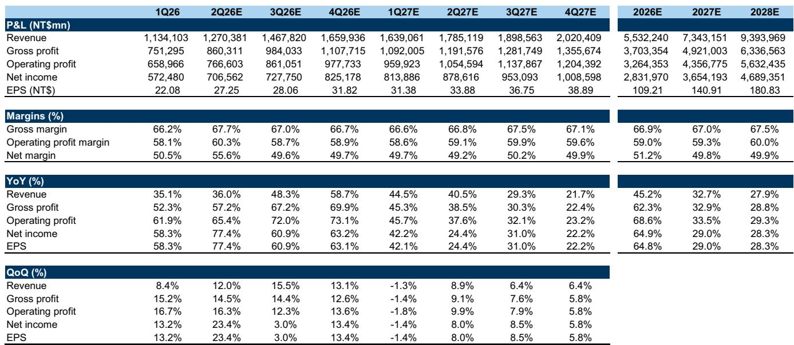
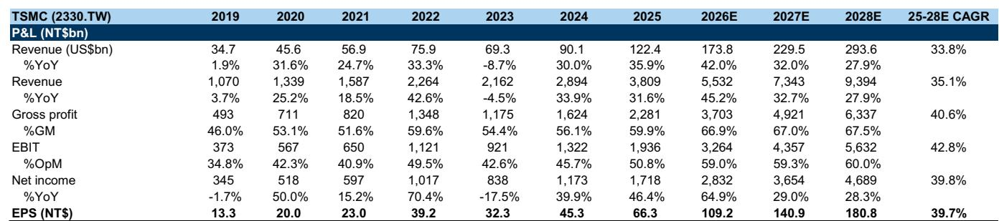
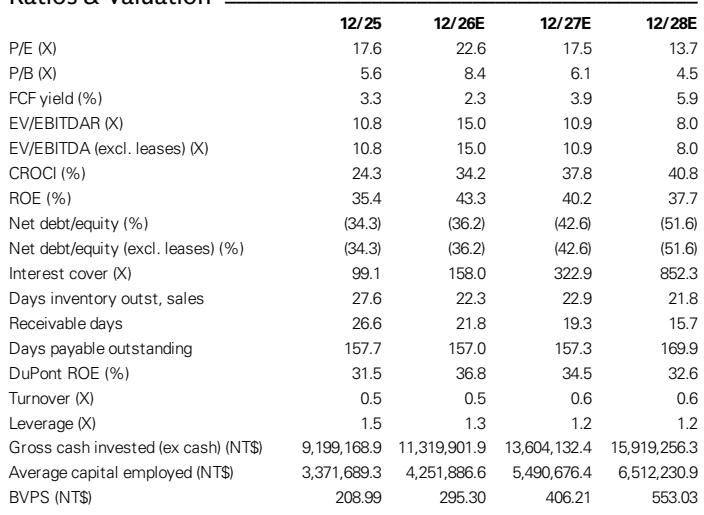

# GS：台积电AI需求可见度至2030年-上调2026年营收预期至40%

这份GS在7月16日台积电法说会后发布的报告，最值得关注的判断不是季度数字，而是管理层对AI需求的语气出现了实质性升级。报告明确指出，管理层的表述比上一季度更加乐观，对多年期AI需求的信心被描述为“非常高”，客户持续发出的强劲需求信号已经延伸至2029至2030年。管理层甚至将这一变化定性为“一个新AI产业的浮现”。

与此同时，台积电将2026年全年营收增长预期从此前的“高于30%”上调至“略高于40%”，并将资本支出指引从520至560亿美元区间的上沿，直接提升至600至640亿美元。这些数字背后，是公司正在加速产能建设的明确信号——包括在亚利桑那州追加1000亿美元研究，使当地总研究规模接近2650亿美元。

> **KC评论：** 市场此前对AI资本开支的持续性存在分歧，但台积电管理层将需求可见度拉长至2030年，并用真金白银的产能研究来背书，这比任何季度指引都更有说服力。关键在于，这不是一次性的乐观表态，而是连续两个季度都在上调预期。

## 1. 2026年指引的上调幅度超出市场预期，但毛利率的软肋同样值得关注

报告认为，2026年全年营收和资本支出指引的上调是本次法说会最大的意外。台积电将全年营收增速从“高于30%”提升至“略高于40%”，高于GS此前预期的39%。资本支出方面，公司直接跳升到600至640亿美元，而GS此前预期为560亿美元。

但报告也坦诚指出了相对少见的软肋：第二季度毛利率为67.7%，虽然高于公司自身指引，却低于GS预期的68.5%以及部分乐观读者的预期。这一细节说明，即便在AI需求强劲的背景下，N2制程的初期爬坡仍然对利润率构成阶段性不确定性。

## 2. 管理层对AI需求的定性已从“增长”升级为“产业诞生”

报告特别强调了一个关键变化：管理层不再只是谈论AI需求的增长，而是将当前阶段描述为“一个新AI产业的浮现”。这一措辞的升级，意味着台积电内部对AI的长期判断已经发生了结构性变化。

报告还指出，代理型AI（Agentic AI）被明确列为增量驱动因素，CPU需求非常强劲，覆盖x86、ARM、RISC-V等所有架构，且涉及台积电的全部客户。这与GS此前在美国路演中强调的CPU主题一致。

值得注意的是，台积电并未更新2024至2029年AI营收复合增长率的长期指引（此前为“高于50%”），但明确表示当前的增长轨迹已经强于此前指引。这种“不更新但暗示更强”的表达方式，本身就是一个信号。

## 3. 产能研究加速，但管理层对竞争格局的回应同样关键

台积电宣布在亚利桑那州追加1000亿美元研究，使当地总研究达到约2650亿美元，将新增四座晶圆厂。与此同时，台湾本地还有13座领先制程和先进封装厂正在建设中，加上N3在台湾、亚利桑那和日本的扩产，以及N5到N3的设备转换。

对于多年度资本支出展望，管理层没有给出具体三年数字，但表示将“比前三年更加显著”——前三年累计约为1010亿美元。报告认为，这一表态的语气相比上一季度明显升级。

在竞争问题上，管理层的回应值得细读。他们强调半导体行业没有捷径，客户选择代工厂是一个长达数年的技术合作伙伴决策：需要理解技术、运行测试芯片、准备、然后爬坡，整个过程实际需要长达五年。这一表述直接指向了台积电在先进制程领域的护城河——不是单一技术领先，而是整个生态系统的不可替代性。

> **KC评论：** 五年周期这个数字很关键。它意味着即便竞争对手在技术上取得突破，从客户验证到大规模量产的时间窗口也足够长，长到台积电可以用下一代制程继续保持领先。这解释了为什么管理层对竞争格局的回应如此笃定。

## 4. 定价策略保持克制，但成本通胀正在为涨价铺路

报告指出，台积电的定价策略仍然保持克制。管理层重申了“衡量、伙伴关系驱动”的理念，不会突然大幅提价以威胁客户的财务健康，而是希望在推动更高利润率的同时，保持“值得信赖的合作伙伴”定位。

但报告同时注意到，管理层承认投入成本正在上升，包括WFE设备通胀和海外晶圆厂成本。随着成本通胀在供应链中变得越来越广泛，报告认为台积电有理由在定价中逐步反映这些成本。GS目前假设2027年价格将上涨低至中个位数，结合生产效率提升、产品组合优化和更好的经营杠杆，应该能够支撑结构性更高的盈利能力。

在成熟制程方面，台积电表示将继续增加产能，但会聚焦于更高附加值的领域。日本JASM专注于特殊制程和CMOS，德国ESMC则聚焦汽车和工业。报告特别指出，成熟制程的需求呈现分化：只有AI相关的成熟制程（尤其是PMIC和传感器）处于短缺状态，而更广泛的消费类成熟制程需求仍然疲软。

这一分化意味着，台积电在成熟制程上的扩张是有选择性的，并非全面铺开，而是围绕AI生态系统的需求进行精准布局。

For informational purposes only. Portions may be generated,translated,summarized,or edited with AI assistance based on source materials and may contain omissions or errors. Please verify independently. This is not investment,legal,tax,accounting,or other professional advice.

For informational purposes only. Portions may be generated,translated,summarized,or edited with AI assistance based on source materials and may contain omissions or errors. Please verify independently. This is not investment,legal,tax,accounting,or other professional advice.

