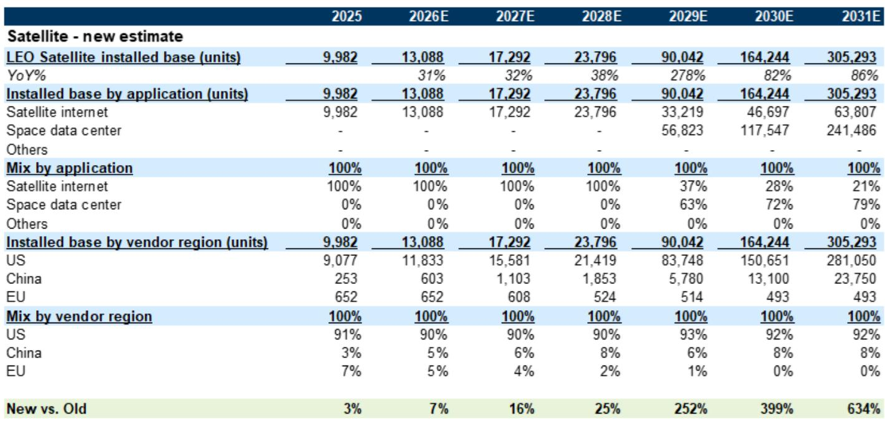
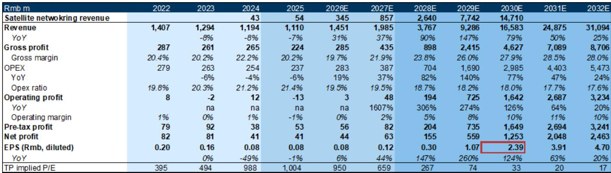
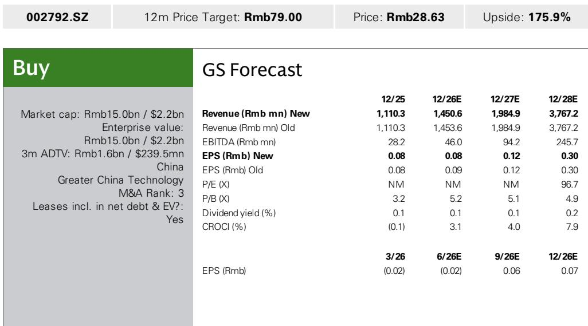

# GS：通宇通讯-中国低轨卫星进展中-二季度净亏损1200万较一季度收窄

这份GS研报对通宇通讯的判断，值得关注的不是二季度亏损收窄本身，而是它背后的结构性切换。公司正在从一家传统的基站射频供应商，转向低轨卫星射频组件供应商。这个切换，正在重塑它的收入结构和毛利率曲线。

二季度净亏损中位数为1200万元，较一季度的1300万元有所收窄，但仍低于GS此前预期的1100万元盈利。管理层给出的解释是原材料涨价、市场竞争、产品组合变化和汇率影响。这些因素短期内不会消失，但研报的核心逻辑并不依赖短期盈利改善。

真正支撑判断的，是低轨卫星星座建设带来的需求曲线。GS在7月更新了全球低轨卫星TAM预测，将2028年/2031年的卫星安装基数从此前的1.9万/4.2万台上调至2.4万/30.5万台。其中，中国的安装基数从2025年的253台增长至2031年的2.375万台。这个增速曲线，才是通宇通讯估值框架的锚点。

## 1. 毛利率的U型反转，依赖卫星组件的占比提升

通宇通讯2026年毛利率预测被下调0.7个百分点至19.7%，原因是上半年毛利率同比下滑。但研报依然维持未来几年毛利率上行趋势的判断。这个矛盾的背后，是产品结构的切换逻辑。

传统基站射频业务的毛利率在下降，但低轨卫星组件的毛利率更高。随着卫星网络设备收入从2025年的5400万元增长至2028年的26.4亿元，其收入占比将快速提升，从而拉动整体毛利率。2026年毛利率的下调，只是切换过程中的一个短期扰动，不是趋势逆转。

> **KC评论：** 这张毛利率曲线图的关键，不是2026年的低点，而是2028年之后的上行斜率。卫星组件收入占比越高，整体毛利率越接近卫星业务的水平。这是一个典型的“先降后升”的结构性拐点。

## 2. 海外收入是平滑周期的安全垫，不是增长引擎

管理层在业绩指引中特别提到，2026年上半年海外收入继续保持同比增长。这一点容易被忽视，但它解释了为什么公司在国内基站需求变化时，收入没有出现更大幅度的波动。

海外业务提供了跨市场的收入分散。当国内基站建设周期处于调整阶段时，海外订单可以部分对冲。这不是一个高增长故事，而是一个不确定性缓冲机制。研报对2026年收入的预测仅微调0.2%，也说明海外业务在短期内的作用更多是稳定而非加速。

## 3. 估值框架的隐含假设：2029年之后才是真正爆发期

GS采用贴现P/E估值法，目标市盈率44.7倍对应的是2030年EPS，再以10.8%的权益成本贴现回2027年。这个框架的隐含假设是，通宇通讯的盈利爆发期在2029年之后。

从财务模型看，2028年净利润预计为1.55亿元，而2029年跳升至5.59亿元，2030年进一步增至12.53亿元。这个跳跃的背后，是低轨卫星安装基数在2028年后进入指数增长阶段。2028年之前，公司仍处于投入期和爬坡期，盈利规模有限。

这意味着，当前的市场定价更多反映的是远期预期，而非近期基本面。如果低轨卫星建设进度低于预期，估值将面临重新调整的不确定性。研报也在观察提示中明确列出了这一点。

通宇通讯的故事，本质上是一个关于时间差的故事。短期盈利承压，长期增长依赖卫星星座的落地节奏。对于关注这个领域的读者，需要持续跟踪的变量不是季度亏损幅度，而是中国低轨卫星的发射进度和通宇在供应链中的份额变化。

For informational purposes only. Portions may be generated,translated,summarized,or edited with AI assistance based on source materials and may contain omissions or errors. Please verify independently. This is not investment,legal,tax,accounting,or other professional advice.

For informational purposes only. Portions may be generated,translated,summarized,or edited with AI assistance based on source materials and may contain omissions or errors. Please verify independently. This is not investment,legal,tax,accounting,or other professional advice.

