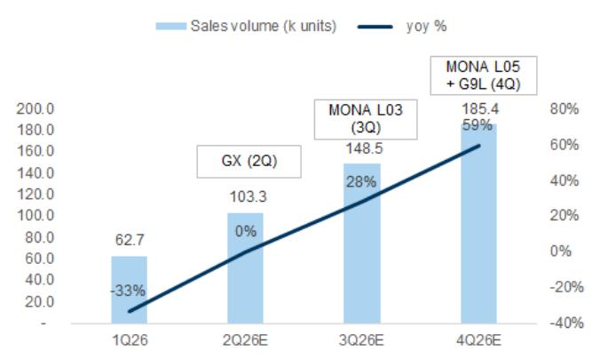
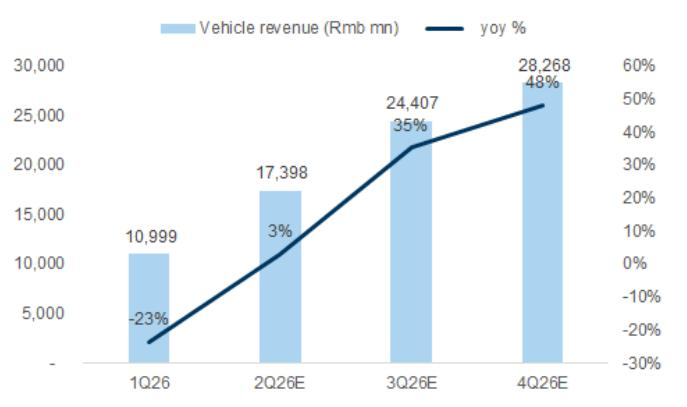

XPENG INC. (XPEV/9868.HK)

# Mona L03 有望推动交付量增长，订单表现强劲

小鹏汽车于7月16日在德国慕尼黑正式推出其新款SUV车型Mona L03，官方起售价为人民币123.8k（相较于预售价人民币143.8k，以及Mona M03的官方起售价人民币119.8k）。Mona L03在全球发布后7分钟/1小时内分别获得2万/4.7万个不可退订单（作为对比，Mona M03在2024年发布后52分钟/48小时内获得1万/3万个不可退订单）。据公司介绍，这是小鹏汽车Mona品牌下的第二款车型，旨在面向更广阔的市场（即SUV对比轿车）。我们注意到，其首款车型Mona M03于2024年8月发布，取得了显著成绩：1）发布后52分钟/48小时内获得1万/3万个不可退订单；2）前六个月平均月交付量为1.3万辆，近12个月平均月销量稳定在1.2万辆。

公司强调了其全球化战略，包括：1）未来所有车型也将在海外发布；例如，公司目标在2026年进入65个全球市场；2）VLA2.0模型计划于2027年在欧洲推出；3）公司已开始组织海外Robotaxi车队；4）目标在2027年向海外交付人形机器人；5）公司计划未来在欧洲推出飞行汽车。公司表示，计划采取“在欧洲，为欧洲”的战略，并得到慕尼黑研发中心和奥地利麦格纳工厂的支持。

Tina Hou
+86(21)2401-8694 |
tina.hou@goldmansachs.cn
GS (China) Securities
Company Limited

Jenny Du
+86(21)2401-8978 |
jenny.x.du@goldmansachs.cn
GS (China) Securities
Company Limited

GS分析：我们认为，Mona已在大众市场领域建立起一个强大且差异化的品牌，在智能功能和现代设计方面具有独特定位。Mona M03在10万-15万元价格区间的纯电轿车中销量排名第一（图表4）。基于我们对10万-15万元价格区间畅销新能源SUV的产品对比分析，我们认为Mona L03纯电/增程版在同类车型中表现突出（尤其是增程版排名前三），在续航和尺寸方面具有竞争优势（图表5）。我们预计Mona L03 SUV的稳定月销量将达到1.4万辆，在2026年第三季度/第四季度分别贡献小鹏汽车总销量的22%/23%，并进一步推动2026年第三季度/第四季度的销量同比增长28%/59%。此外，我们看到小鹏汽车月度交付量正稳步回升，6月同比增长16%（相较于4月/5月的同比下降12%/4%），这进一步支持了我们的观点。

图表1：公司于7月16日公布Mona L03官方起售价为人民币123.8k

<table><tr><td></td><td colspan="3">小鹏MONA M03</td><td colspan="2">小鹏MONA L03</td></tr><tr><td>日期</td><td>2024/8/8</td><td>2024/8/20</td><td>2024/8/27</td><td>2026/7/2</td><td>2026/7/16</td></tr><tr><td>事件</td><td>开启预售</td><td>公布正式发布日期</td><td>正式发布</td><td>开启预售</td><td>全球发布（慕尼黑）</td></tr><tr><td rowspan="3">定价</td><td rowspan="3"></td><td rowspan="3"></td><td rowspan="3">人民币119.8k（比预售价低人民币16.1k）</td><td>人民币143.8k（纯电Max版）</td><td>人民币123.8k（纯电Plus版）</td></tr><tr><td rowspan="2">人民币149.8k（增程Max版）</td><td>人民币134.8k（纯电Max版）</td></tr><tr><td>人民币123.8k（增程Plus版）</td></tr><tr><td>详情</td><td>开启人民币99元盲订</td><td></td><td>前52分钟/48小时内获得1万/3万个不可退订单</td><td>预付人民币1k可抵扣人民币3k</td><td>前7分钟/1小时内获得2万/4.7万个不可退订单</td></tr></table>

来源：公司数据，GS全球投资研究整理

## 展望未来，我们认为小鹏汽车的新车型周期将在未来三个季度推动交付量加速增长（图表2和图表3）：

1. 2026年第二季度：我们预计5月推出的GX SUV将有助于交付量恢复至2025年第二季度的同比水平，并实现环比增长65%。5月20日，小鹏汽车推出了其新款旗舰六座SUV车型GX，据公司称，该车型在12小时内获得了近2.5万个不可退订单。基于我们对近期推出的六座SUV车型的产品对比分析框架，我们发现GX（尤其是增程版）在16款车型中排名前三，在价格、续航和尺寸方面得分均衡；

2. 2026年第三季度：我们预计7月推出的Mona L03 SUV将进一步推动第三季度交付量同比增长28%，环比再增长44%。我们认为，Mona已在大众市场领域建立起一个强大品牌，在智能功能和现代设计方面具有独特定位。Mona M03在10万-15万元价格区间的纯电轿车中销量排名第一（图表4）。基于我们对10万-15万元价格区间畅销新能源SUV的产品对比分析，我们认为Mona L03纯电/增程版在同类车型中表现突出（尤其是增程版排名前三），在续航和尺寸方面具有竞争优势（图表5）；

3. 2026年第四季度：我们预计Mona L05 SUV和G9L SUV最终将使平均月交付量超过6万辆（对比2026年第一季度的2万辆），实现交付量同比增长59%。

即将到来的催化剂：（1）每周订单和月度销售趋势；（2）Mona L03更多订单信息；（3）2026年第三季度人形机器人展示；（4）2026年第三季度Robotaxi试点乘客运营启动；（5）2026年第四季度Mona L05和G9L发布。

图表2：我们预计新车型周期将推动交付量加速增长  
  
来源：公司数据，GS全球投资研究

图表3：……以及小鹏汽车的营收增长  
  
来源：公司数据，GS全球投资研究

图表4：MONA M03在中国10万-15万元价格区间畅销新能源轿车中排名第一  
10万-15万元价格区间畅销轿车前十名

<table><tr><td>厂商 车型</td><td>小鹏 小鹏MONA M03 纯电</td><td>吉利 星耀8 插混</td><td>比亚迪 秦L 纯电</td><td>比亚迪 海豹06 纯电</td><td>奇瑞 风云A9L 插混</td><td>蔚来 萤火虫 纯电</td><td>长安 启源A06 增程</td><td>比亚迪 驱逐舰05 DM</td><td>东风日产 N7 纯电</td><td>广汽埃安 Aion S Plus 纯电</td></tr><tr><td>车型发布日（最新改款入门级）</td><td>2026年4月</td><td>2026年3月</td><td>2025年3月</td><td>2025年6月</td><td>2025年7月</td><td>2026年4月</td><td>2025年11月</td><td>2025年5月</td><td>2026年4月</td><td>2024年7月</td></tr><tr><td>车身类型</td><td>轿车</td><td>轿车</td><td>轿车</td><td>轿车</td><td>轿车</td><td>轿车</td><td>轿车</td><td>轿车</td><td>轿车</td><td>轿车</td></tr><tr><td>细分市场</td><td>A</td><td>C</td><td>B</td><td>B</td><td>C</td><td>A0</td><td>C</td><td>B</td><td>C</td><td>A</td></tr><tr><td>座位数</td><td>5</td><td>5</td><td>5</td><td>5</td><td>5</td><td>5</td><td>5</td><td>5</td><td>5</td><td>5</td></tr><tr><td>动力类型</td><td>纯电</td><td>插混</td><td>纯电</td><td>纯电</td><td>插混</td><td>纯电</td><td>增程</td><td>插混</td><td>纯电</td><td>纯电</td></tr><tr><td>入门价格（人民币千元）</td><td>119.8</td><td>142.8</td><td>119.8</td><td>109.8</td><td>149.9</td><td>119.8</td><td>119.9</td><td>101.8</td><td>148.9</td><td>118.8</td></tr><tr><td>最大续航里程（公里）</td><td>540</td><td>1,500</td><td>470</td><td>470</td><td>2,000</td><td>420</td><td>2,120</td><td>1,200</td><td>635</td><td>505</td></tr><tr><td>轴距（毫米）</td><td>2,815</td><td>2,928</td><td>2,820</td><td>2,820</td><td>3,000</td><td>2,615</td><td>2,922</td><td>2,718</td><td>2,915</td><td>2,760</td></tr><tr><td>硬件0-100km/h加速时间（秒）</td><td>7.8</td><td></td><td>4.1</td><td>4.1</td><td>7.9</td><td>8.1</td><td></td><td>7.9</td><td></td><td>8.0</td></tr><tr><td>电池容量（千瓦时）</td><td>51.8</td><td>28.3</td><td>46.1</td><td>46.1</td><td>33.7</td><td>42.1</td><td>28.4</td><td>8.3</td><td>73.0</td><td>53.7</td></tr><tr><td>充电速度（千瓦时/分钟）</td><td>1.0</td><td>0.9</td><td>1.0</td><td>1.0</td><td>1.1</td><td>1.0</td><td>0.9</td><td></td><td>2.4</td><td>0.9</td></tr><tr><td>连续语音指令</td><td>是</td><td>是</td><td>是</td><td>是</td><td>是</td><td>是</td><td>是</td><td>是</td><td>是</td><td>是</td></tr><tr><td>软件 高速自动驾驶</td><td>标配</td><td>无</td><td>标配</td><td>标配</td><td>无</td><td>标配</td><td>标配</td><td>无</td><td>无</td><td>无</td></tr><tr><td>城市自动驾驶</td><td>标配</td><td>无</td><td>无</td><td>无</td><td>无</td><td>无</td><td>无</td><td>无</td><td>无</td><td>无</td></tr><tr><td>价格评分</td><td>5</td><td>3</td><td>5</td><td>9</td><td>1</td><td>5</td><td>4</td><td>10</td><td>2</td><td>8</td></tr><tr><td>续航评分</td><td>5</td><td>8</td><td>2</td><td>2</td><td>9</td><td>1</td><td>10</td><td>7</td><td>6</td><td>4</td></tr><tr><td>尺寸评分</td><td>4</td><td>9</td><td>5</td><td>5</td><td>10</td><td>1</td><td>8</td><td>2</td><td>7</td><td>3</td></tr><tr><td>自动驾驶评分</td><td>4</td><td>0</td><td>2</td><td>2</td><td>0</td><td>2</td><td>2</td><td>0</td><td>0</td><td>0</td></tr><tr><td>小计评分</td><td>18</td><td>20</td><td>14</td><td>18</td><td>20</td><td>9</td><td>24</td><td>19</td><td>15</td><td>15</td></tr><tr><td>平均月销量（近12个月）</td><td>12,333</td><td>7,103</td><td>6,497</td><td>6,468</td><td>5,930</td><td>4,571</td><td>4,283</td><td>4,276</td><td>4,108</td><td>3,749</td></tr><tr><td>月销量峰值（近12个月）</td><td>16,593</td><td>10,191</td><td>9,648</td><td>10,163</td><td>10,334</td><td>6,695</td><td>10,072</td><td>24,690</td><td>10,148</td><td>26,392</td></tr><tr><td>累计销量</td><td>257,917</td><td>86,766</td><td>87,338</td><td>71,144</td><td>59,300</td><td>55,086</td><td>34,262</td><td>449,718</td><td>49,964</td><td>526,719</td></tr></table>

来源：汽车之家，乘联会，GS全球投资研究整理

图表5：10万-15万元价格区间新能源SUV产品对比  
10万-15万元价格区间畅销SUV前十名

<table><tr><td colspan="13">10万-15万元价格区间畅销SUV前十名</td></tr><tr><td>厂商</td><td>比亚迪</td><td>比亚迪</td><td>比亚迪</td><td>零跑</td><td>长安</td><td>吉利</td><td>比亚迪</td><td>比亚迪</td><td>广汽</td><td>长安</td><td>小鹏</td><td>小鹏</td></tr><tr><td>车型</td><td>宋Pro DM</td><td>海狮06 纯电</td><td>宋L DM</td><td>C10 纯电</td><td>深蓝S05 纯电</td><td>银河E5 纯电</td><td>元PLUS 纯电</td><td>海狮05 纯电</td><td>丰田bZ3X 纯电</td><td>启源Q07 插混</td><td>MONA L03 纯电</td><td>MONA L03 增程</td></tr><tr><td>车型发布日（最新改款入门级）</td><td>2024年9月</td><td>2026年5月</td><td>2025年10月</td><td>2025年5月</td><td>2025年8月</td><td>2024年8月</td><td>2024年3月</td><td>2025年3月</td><td>2025年3月</td><td>2025年4月</td><td>2026年7月</td><td>2026年7月</td></tr><tr><td>车身类型</td><td>SUV</td><td>SUV</td><td>SUV</td><td>SUV</td><td>SUV</td><td>SUV</td><td>SUV</td><td>SUV</td><td>SUV</td><td>SUV</td><td>SUV</td><td>SUV</td></tr><tr><td>细分市场</td><td>A</td><td>B</td><td>B</td><td>B</td><td>A</td><td>A</td><td>A</td><td>A0</td><td>A</td><td>B</td><td>A</td><td>A</td></tr><tr><td>座位数</td><td>5</td><td>5</td><td>5</td><td>5</td><td>5</td><td>5</td><td>5</td><td>5</td><td>5</td><td>5</td><td>5</td><td>5</td></tr><tr><td>动力类型</td><td>插混</td><td>纯电</td><td>插混</td><td>纯电</td><td>纯电</td><td>纯电</td><td>纯电</td><td>纯电</td><td>纯电</td><td>插混</td><td>纯电</td><td>增程</td></tr><tr><td>入门价格（人民币千元）</td><td>112.8</td><td>129.9</td><td>139.8</td><td>122.8</td><td>119.9</td><td>109.8</td><td>119.8</td><td>117.8</td><td>109.8</td><td>129.8</td><td>123.8</td><td>123.8</td></tr><tr><td>最大续航里程（公里）</td><td>1,360</td><td>205</td><td>1,550</td><td>530</td><td>520</td><td>440</td><td>430</td><td>475</td><td>430</td><td>1,345</td><td>550</td><td>1,380</td></tr><tr><td>轴距（毫米）</td><td>2,712</td><td>2,820</td><td>2,782</td><td>2,825</td><td>2,880</td><td>2,750</td><td>2,720</td><td>2,720</td><td>2,765</td><td>2,905</td><td>2,850</td><td>2,850</td></tr><tr><td>硬件0-100km/h加速时间（秒）</td><td>8.5</td><td>7.8</td><td>7.5</td><td>7.3</td><td>6.3</td><td>6.9</td><td>7.3</td><td>7.6</td><td>3.7</td><td>7.4</td><td>6.8</td><td>6.8</td></tr><tr><td>电池容量（千瓦时）</td><td>12.9</td><td>26.6</td><td>18.3</td><td>69.9</td><td>56.1</td><td>49.5</td><td>49.92</td><td>50.1</td><td>50.0</td><td>21.5</td><td>37.2</td><td>37.2</td></tr><tr><td>充电速度（千瓦时/分钟）</td><td></td><td></td><td>0.4</td><td>1.2</td><td>1.9</td><td>1.3</td><td>0.8</td><td>1.4</td><td>1.0</td><td>0.7</td><td>1.8</td><td>1.8</td></tr><tr><td>连续语音指令</td><td>是</td><td>是</td><td>是</td><td>是</td><td>是</td><td>是</td><td>是</td><td>是</td><td>是</td><td>是</td><td>是</td><td>是</td></tr><tr><td>软件 高速自动驾驶 城市自动驾驶</td><td>标配 选配</td><td>标配 选配</td><td>标配 选配</td><td>标配 选配</td><td>标配 选配</td><td>标配 选配</td><td>标配 选配</td><td>标配 选配</td><td>标配 无</td><td>标配 无</td><td>选配 选配</td><td>选配 选配</td></tr><tr><td>价格评分</td><td>10</td><td>2</td><td>1</td><td>6</td><td>7</td><td>11</td><td>8</td><td>9</td><td>11</td><td>3</td><td>4</td><td>4</td></tr><tr><td>续航评分</td><td>10</td><td>1</td><td>12</td><td>7</td><td>6</td><td>4</td><td>2</td><td>5</td><td>2</td><td>9</td><td>8</td><td>11</td></tr><tr><td>尺寸评分</td><td>1</td><td>7</td><td>6</td><td>8</td><td>11</td><td>4</td><td>2</td><td>2</td><td>5</td><td>12</td><td>9</td><td>9</td></tr><tr><td>自动驾驶评分</td><td>3</td><td>3</td><td>3</td><td>3</td><td>3</td><td>3</td><td>3</td><td>3</td><td>2</td><td>2</td><td>2</td><td>2</td></tr><tr><td>小计评分</td><td>24</td><td>13</td><td>22</td><td>24</td><td>27</td><td>22</td><td>15</td><td>19</td><td>20</td><td>26</td><td>23</td><td>26</td></tr><tr><td>平均月销量（近12个月）</td><td>13,068</td><td>12,818</td><td>7,594</td><td>9,392</td><td>9,129</td><td>8,174</td><td>6,921</td><td>6,841</td><td>7,661</td><td>5,550</td><td></td><td></td></tr><tr><td>月销量峰值（近12个月）</td><td>27,812</td><td>20,956</td><td>25,198</td><td>14,113</td><td>15,211</td><td>18,962</td><td>30,799</td><td>14,075</td><td>10,027</td><td>10,192</td><td></td><td></td></tr><tr><td>累计销量</td><td>待核实</td><td>153,812</td><td>273,546</td><td>209,820</td><td>164,972</td><td>228,799</td><td>912,877</td><td>117,916</td><td>111,525</td><td>87,341</td><td></td><td></td></tr></table>

我们假设MONA L03的入门级指导价较MONA M03高出人民币1万元，并假设纯电版最大续航里程与MONA M03相同（540公里），增程版最大续航里程与同类车型平均水平相当（平均1,418公里）
来源：汽车之家，乘联会，GS全球投资研究

对于2026年全年，我们继续预测：（1）受国内市场和海外扩张的新车型发布推动，营收增长20%：在国内，小鹏汽车已于5月推出GX的双动力版本，2026年下半年还将推出两款MONA SUV和另一款SUV。我们预测2026年销量为50万辆（同比增长16%）。我们还预计海外营收将贡献总营收的20%以上，2026年海外销量将翻番；（2）得益于规模效应和海外销售贡献增加，毛利率将从2025年的18.9%提升至2026年的19.1%；（3）研发费用将从2025年的95亿元人民币增至2026年的120亿元人民币，其中对物理AI的投入增加（2026年为70亿元人民币）；（4）2026年营业利润基本稳定在亏损28亿元人民币，经营性现金流为正。

<table><tr><td>9868.HK</td><td>12个月目标价：港币89元</td><td colspan="2">现价：港币52.55元</td><td colspan="2">潜在空间：69.4%</td></tr><tr><td>XPEV</td><td>12个月目标价：23美元</td><td colspan="2">现价：13.78美元</td><td colspan="2">潜在空间：66.9%</td></tr><tr><td>买入</td><td colspan="5">GS预测</td></tr><tr><td></td><td></td><td>2025/12</td><td>2026/12E</td><td>2027/12E</td><td>2028/12E</td></tr><tr><td>市值：133亿美元</td><td>营收（人民币百万元）</td><td>76,719.7</td><td>91,923.4</td><td>104,725.9</td><td>117,058.4</td></tr><tr><td>企业价值：97亿美元</td><td>EBITDA（人民币百万元）</td><td>(323.5)</td><td>13.6</td><td>4,203.6</td><td>7,246.8</td></tr><tr><td>3个月日均交易量：1.101亿美元</td><td>每股收益（人民币）</td><td>(0.48)</td><td>(1.47)</td><td>2.18</td><td>4.59</td></tr><tr><td>中国</td><td>市盈率（倍）</td><td>NM</td><td>NM</td><td>42.8</td><td>20.3</td></tr><tr><td>中国出行科技</td><td>市净率（倍）</td><td>4.5</td><td>3.2</td><td>3.0</td><td>2.7</td></tr><tr><td></td><td>股息率（%）</td><td>0.0</td><td>0.0</td><td>0.0</td><td>0.0</td></tr><tr><td>并购排名：3</td><td>净债务/EBITDA（不含租赁，倍）</td><td>--</td><td>15.4</td><td>(8.6)</td><td>(5.3)</td></tr><tr><td>租赁包含在净债务和企业价值中？：是</td><td>CROCI（%）</td><td>NM</td><td>29.9</td><td>85.2</td><td>95.6</td></tr><tr><td></td><td>自由现金流回报表现（%）</td><td>3.6</td><td>(2.7)</td><td>0.9</td><td>6.9</td></tr><tr><td></td><td></td><td>2026/3</td><td>2026/6E</td><td>2026/9E</td><td>2026/12E</td></tr><tr><td></td><td>每股收益（人民币）</td><td>(1.76)</td><td>(0.62)</td><td>(0.33)</td><td>1.22</td></tr></table>

来源：公司数据，GS预测，FactSet。价格截至2026年7月15日收盘。

## 研究观点

小鹏汽车是中国增长最快的纯电动汽车制造商之一，专注于智能汽车功能。自2024年第四季度以来，小鹏汽车通过Mona M03和P7+的发布，在新车型和改款车型方面持续取得进展，这两款车型的销量在其各自细分市场中均排名前三。小鹏汽车还加快了新车型发布频率，2024-2026年期间共推出10款车型，而2019-2023年期间每年仅推出1-2款新车型。小鹏汽车未来每年将推出10款新车型及改款车型，以更好地适应当前高度动态的市场环境。此外，小鹏汽车更加注重海外扩张，产品阵容不断扩大（2026年将推出4款车型），并推进本地化生产（印度尼西亚、奥地利和马来西亚）。我们给予报告评级（ADR/H股），因为我们看到一系列努力正通过公司的产品发布和海外扩张取得成果，这为未来可持续的销量增长和利润率改善提供了更高的可见性。小鹏汽车目前的估值与其过去一年的历史平均远期市销率倍数相当，我们认为考虑到其增长轨迹，这一估值具有吸引力。催化剂包括即将推出的产品发布（如新车型的销量爬坡）以及季度业绩。

## 目标价风险与方法论

我们给予报告评级，基于12个月DCF估值模型（WACC 11.8%，TGR 3.0%），ADR/H股目标价分别为23美元/89港元。风险：销量低于预期；价格竞争超预期；市场需求弱于预期。

## 附录披露

## Reg AC

我们，Tina Hou和Jenny Du，特此证明本报告中表达的所有观点均准确反映了我们个人对相关公司或其证券的看法。我们还证明，我们的薪酬中没有任何部分直接或间接与本报告中提出的具体建议或观点相关。

撰稿作者：Tina Hou GS（中国）证券有限公司，Jenny Du GS（中国）证券有限公司。

除非另有说明，本报告撰稿作者披露中列出的个人是GS全球投资研究部门的分析师。

## GS因子概况

GS因子概况通过将股票的关键属性与市场（即我们评级的股票池）及其行业同行进行比较，为股票提供投资背景。所描绘的四个关键属性是：增长、财务回报、倍数（例如估值）和综合（增长、财务回报和倍数的综合）。增长、财务回报和倍数是使用每只股票特定指标的标准化排名计算得出的。然后将指标的标准化排名进行平均，并转换为相关属性的百分位数。每个指标的具体计算可能因财年、行业和地区而异，但标准方法如下：

增长基于股票的前瞻性销售增长、EBITDA增长和每股收益增长（对于金融股，仅基于每股收益和销售增长），百分位数越高表示公司增长越快。财务回报基于股票的前瞻性ROE、ROCE和CROCI（对于金融股，仅基于ROE），百分位数越高表示公司财务回报越高。倍数基于股票的前瞻性市盈率、市净率、价格/股息（P/D）、EV/EBITDA、EV/FCF和EV/债务调整后现金流（DACF）（对于金融股，仅基于市盈率、市净率和P/D），百分位数越高表示股票交易倍数越高。综合百分位数计算为增长百分位数、财务回报百分位数和（100% - 倍数百分位数）的平均值。

财务回报和倍数使用GS分析师对未来至少三个季度后的财年末的预测。增长使用对未来至少七个季度后的财年与对未来至少三个季度后的财年相比的输入（所有指标均基于每股）。

有关我们如何计算GS因子概况的更详细说明，请联系您的GS代表。

## 并购排名

在我们的全球覆盖范围内，我们使用并购框架审视股票，同时考虑定性因素和定量因素（可能因行业和地区而异），以纳入某些公司可能被收购的可能性。然后，我们分配一个并购排名，作为对我们评级覆盖范围内的公司从1到3进行评分的方法，其中1表示公司成为收购目标的可能性高（30%-50%），2表示可能性中等（15%-30%），3表示可能性低（0%-15%）。对于排名为1或2的公司，根据我们的标准部门指南，我们将并购组成部分纳入我们的目标价。并购排名为3被认为不重要，因此不计入我们的目标价，并且可能在研究中讨论或不讨论。

## Quantum

Quantum是GS的专有数据库，提供详细的财务报表历史、预测和比率的访问。它可用于对单个公司进行深入分析，或对不同行业和市场的公司进行比较。

## 披露

对XPeng Inc.（ADR）和XPeng Inc.（H）的评级是相对于其覆盖范围内的其他公司：比亚迪（A股）、比亚迪（H股）、福耀玻璃（A股）、福耀玻璃（H股）、广汽集团（A股）、广汽集团（H股）、禾赛集团（ADR）、禾赛集团（H股）、理想汽车（ADR）、理想汽车（H股）、敏实集团、蔚来（ADR）、蔚来（H股）、宁波拓普集团、上汽集团、XPeng Inc.（ADR）、XPeng Inc.（H股）、浙江零跑科技

## 公司特定监管披露

以下披露涉及GS集团（及其附属机构，“GS”）与GS全球投资研究所涵盖的公司之间的关系。

截至本报告前一个月底，GS实益拥有普通股1%或以上（不包括由关联公司和不需要根据美国证券法汇总的业务部门管理的头寸）：XPeng Inc.（ADR）（13.78美元）和XPeng Inc.（H股）（港币56.55元）

GS预计在未来3个月内将或打算寻求投资银行服务报酬：XPeng Inc.（ADR）（13.78美元）和XPeng Inc.（H股）（港币56.55元）

GS在过去12个月内与以下公司存在投资银行服务客户关系：XPeng Inc.（ADR）（13.78
