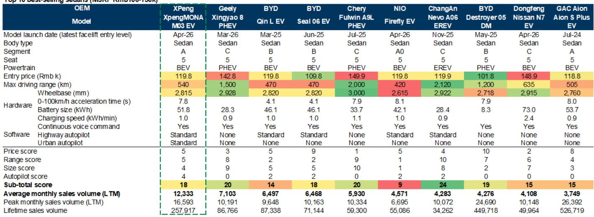
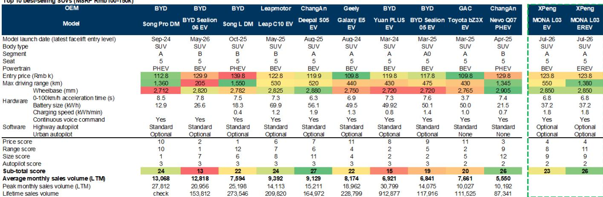
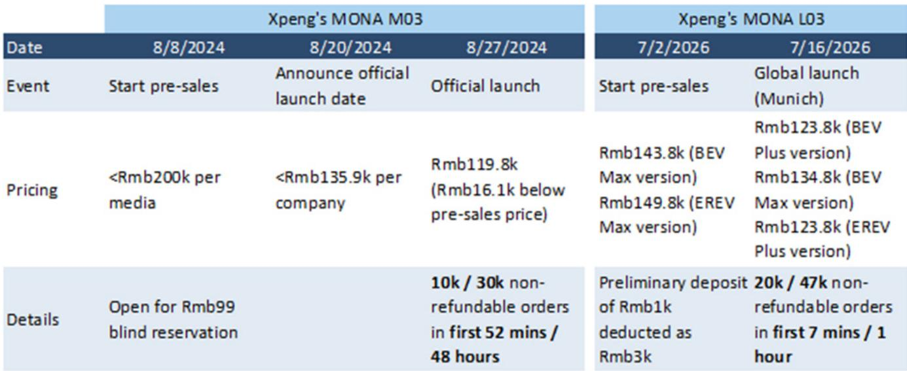

# GS：小鹏MONAL03订单加速推动销量增长

7月16日，小鹏在慕尼黑全球首发了MONA品牌第二款车型L03。这款SUV的正式起售价为12.38万元，比此前预售价低了2万元。更值得关注的数字是订单：开放后7分钟收获2万个不可退定金订单，1小时内达到4.7万个。作为对比，MONA品牌首款车型M03在2024年8月上市时，52分钟获得1万个订单，48小时达到3万个。L03的订单速度是M03的两倍以上。

这不是一次简单的产品迭代。GS这份报告的核心判断是：小鹏正在进入一个由多款新车驱动的销量加速周期，从2026年第二季度开始，季度同比增速将从个位数回升至28%到59%。支撑这一判断的，是MONA品牌在10-15万元价格带已经验证的竞争力，以及小鹏在海外、机器人、飞行汽车等方向的布局正在从规划走向执行。

> **KC评论：** 订单数据本身有热度，但真正值得关注的是L03的定价策略。起售价12.38万元，比M03仅高出4000元，但L03是SUV，且提供了EREV增程版本。在10-15万元SUV市场，增程车型的竞争格局远没有纯电轿车拥挤，这可能是小鹏选择在这个时间点推出L03的关键考量。

## 1. MONA品牌已经证明自己不是“第二品牌”，而是10-15万价格带的差异化玩家

M03上市后的表现提供了最直接的证据。GS的数据显示，在10-15万元纯电轿车市场，M03以近12个月平均月销1.23万辆排名第一，超过比亚迪秦L EV、海豹06 EV等车型。更重要的是，M03在智能驾驶配置上是同价位相对少见标配城市自动辅助驾驶的车型——这在10-15万元区间几乎是整理版卖点。

L03的竞争力同样有数据支撑。GS对10-15万元热销新能源SUV做了产品力评分，L03的纯电版和增程版都排在前列，其中增程版在续航和尺寸两个维度上得分突出。报告预计L03稳定月销可达1.4万辆，占小鹏2026年第三、第四季度总销量的22%和23%。

这意味着什么：MONA品牌已经从一个“走量”的定位，升级为小鹏在主流价格带建立差异化壁垒的核心载体。智能驾驶不再是高端车型的专属，而是向下渗透的竞争武器。

## 2. 2026年产品线密集投放，季度销量增速有望从个位数跳升至59%

GS梳理了小鹏2026年的新车节奏：5月推出6座SUV GX，7月MONA L03上市，下半年还有MONA L05和G9L两款SUV。报告预计，到2026年第四季度，小鹏月均交付量将从第一季度的约2万辆提升至6万辆以上，同比增速达到59%。

GX的订单数据同样不弱。5月20日上市后，12小时内获得近2.5万个不可退定金订单。GS对近期上市的16款6座SUV做了产品力对比，GX的增程版本综合评分排在前三，在价格、续航和尺寸三个维度上表现均衡。

销量增长的背后是产品节奏的根本变化。小鹏在2019-2023年间每年只推出1-2款新车，但2024-2026年计划推出10款新车，之后每年保持10款以上新车型和改款车型的投放频率。这种节奏变化，反映的是小鹏对当前市场竞争环境的判断：产品更新速度本身就是竞争力。

## 3. 海外和物理AI正在成为第二增长曲线，但短期仍需验证

报告提到，小鹏计划2026年进入65个海外市场，海外收入占比目标超过20%，销量弹性较高。公司还规划了2027年在欧洲推出VLA 2.0自动驾驶模型，同时启动海外Robotaxi车队运营，并计划同年交付人形机器人。

这些方向听起来宏大，但报告给出了具体的资源配置：2026年研发费用预计增至120亿元，其中物理AI相关投入占70亿元。这个数字比2025年的95亿元研发预算高出26%，说明小鹏正在将资源从传统汽车开发向AI和机器人倾斜。

不过，这些海外和AI业务在2026年对利润表的贡献仍然有限。报告预计2026年营业利润仍为亏损28亿元，但经营性现金流将转正。真正的利润拐点可能要到2027年，届时EBITDA预计达到42亿元。

> **KC评论：** 小鹏的海外战略有一个值得关注的细节——“在欧洲为欧洲”，依托慕尼黑研发中心和奥地利麦格纳工厂进行本地化生产。这与单纯出口的路径不同，意味着更高的本地化程度，但也意味着更长的投入周期和更高的固定成本。海外业务能否在2026年实现20%的收入占比，关键要看欧洲市场的接受速度和本地化产能的爬坡效率。

## 4. 一个可复用的观察框架：产品力评分如何预测销量

GS在这份报告中提供了一个简洁的分析框架：对10-15万元价格带的新能源车型，从价格、续航、尺寸、智能驾驶四个维度打分，然后与实际月销量做对比。

从结果看，得分与销量并非严格正相关。M03在轿车市场得分18分（满分40分），排名第一；但L03在SUV市场得分23-26分，却还没有实际销量数据可以验证。这说明产品力评分更适合作为“进入门槛”的判断工具，而非销量预测的精确模型。真正决定销量的，还有渠道覆盖、品牌认知、产能爬坡速度等变量。

这个框架的价值在于：它提供了一个结构化的比较基准，帮助读者快速定位一款新车在竞品中的相对位置。对于关注小鹏后续车型（L05、G9L）的读者，可以用同样的维度去评估它们的竞争力。

For informational purposes only. Portions may be generated,translated,summarized,or edited with AI assistance based on source materials and may contain omissions or errors. Please verify independently. This is not investment,legal,tax,accounting,or other professional advice.

For informational purposes only. Portions may be generated,translated,summarized,or edited with AI assistance based on source materials and may contain omissions or errors. Please verify independently. This is not investment,legal,tax,accounting,or other professional advice.

