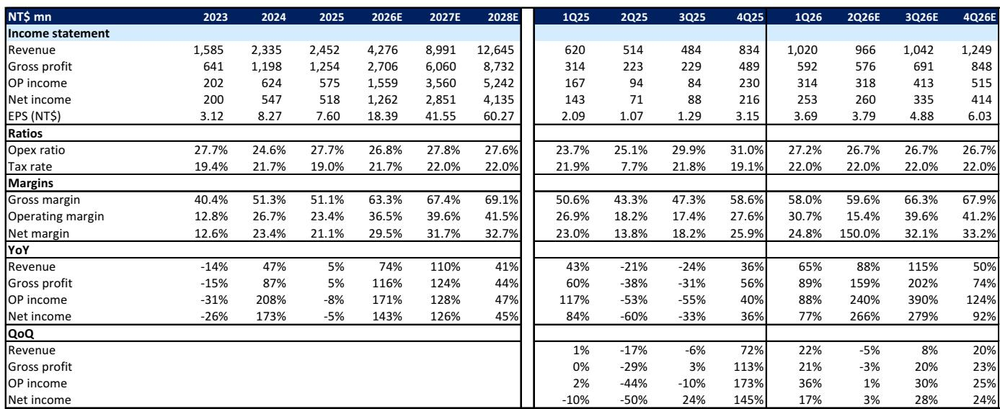
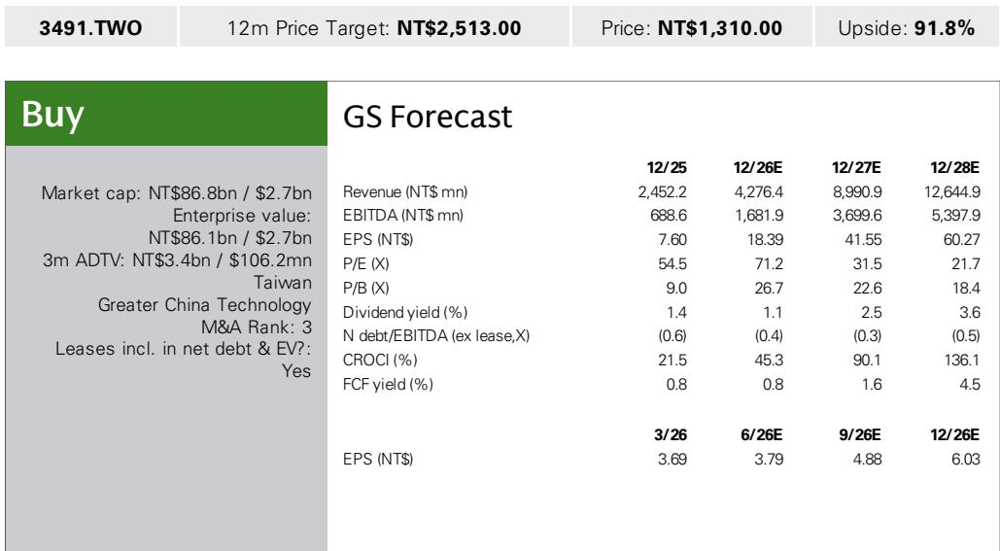
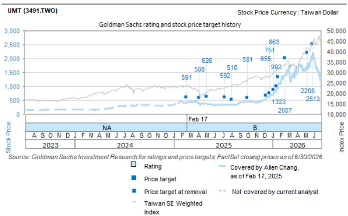

# GS：UMT并购DYNAHZ——产能扩2-3倍切入AI数据中心高速互联

一家以矩形波导和低轨卫星组件为核心业务的公司，正在通过并购向AI数据中心的高速互联领域延伸。GS最新研究指出，这家名为UMT的企业计划以17亿新台币收购高频高速互联方案商DYNAHZ Technology的多数股权，交易预计在2026年8月完成。研究认为，这一战略扩张方向值得关注，尽管收购本身能否落地仍存在不确定性。

UMT的核心产品是矩形波导——一种用于引导微波或毫米波信号传播的金属管道。通过不同形状和组合，波导可以构成滤波器、双工器、耦合器、天线等多种射频无源组件。公司目前主要服务于全球领先的低轨卫星运营商，其产品广泛部署在卫星载荷和地面站网关中。2024年，公司营收为23.35亿新台币，同比增长47%；2025年预计营收24.52亿新台币，增速节奏变化至5%。

## 1. 收购标的DYNAHZ已切入AI数据中心客户，产能计划扩2-3倍

DYNAHZ Technology提供射频、微波、毫米波方案以及高速信号模块，客户覆盖AI数据中心和卫星领域。研究特别提到，DYNAHZ已经进入AI数据中心客户体系，而UMT自身也在与客户验证太赫兹产品。管理层预期，收购完成后，公司能够为更大规模的客户群提供不同类型的互联方案。

产能方面，DYNAHZ正在高雄扩建新工厂，目标是在2028年将产能提升2至3倍，以应对客户需求的增长。这一扩张节奏与AI数据中心对高速互联的爆发式需求在时间上吻合。

> **KC评论：** 产能扩张计划本身是一个可追踪的验证节点。如果高雄工厂按计划在2028年前完成扩产，意味着DYNAHZ的客户订单已经具备足够的能见度来支撑这一研究。反之，如果扩产节奏延迟，可能暗示需求或整合存在阻力。

## 2. 太赫兹产品是下一个技术锚点，但验证仍在进行中

研究披露，UMT早在2022年8月就在工厂内建立了首个太赫兹测试实验室，目前正在与多家客户进行产品验证。管理层对太赫兹在下一代AI数据中心架构和6G应用中的前景持乐观态度，认为其优势在于高速互联和高性价比。

收购DYNAHZ的意义在于，这家公司的高频高速技术能力与UMT的太赫兹业务具有互补性。研究认为，这种整合能够帮助UMT在太赫兹领域建立更完整的产品组合，而不是仅停留在波导这一单一技术路径上。

需要指出的是，太赫兹产品目前仍处于验证阶段，距离大规模商用还有距离。研究没有给出具体的验证完成时间表或客户名称，这意味着这一技术路径的落地节奏仍需后续跟踪。

## 3. 财务模型显示营收结构将发生根本性转变

从GS给出的财务预测来看，UMT的营收结构正在经历一次根本性转变。2025年预计营收为24.52亿新台币，到2028年预计跃升至126.45亿新台币，三年复合增长率超过70%。更关键的是毛利率的变化：从2025年的51.1%提升至2028年的69.1%，营业利润率从23.4%提升至41.5%。

毛利率的大幅提升，通常意味着产品组合从低毛利的标准件向高毛利的定制化互联方案迁移。这与公司通过收购切入AI数据中心业务的战略方向一致——数据中心内部的高速互联组件通常具有更高的技术壁垒和定价权。

> **KC评论：** 毛利率从51%到69%的跃升，背后隐含的假设是AI数据中心业务占比快速提升。如果这一假设成立，那么UMT的估值逻辑将从卫星组件供应商切换为数据中心互联方案商，后者在市场上通常享有更高的估值倍数。但这一切换能否实现，取决于DYNAHZ的客户整合和太赫兹产品的商业化进度。

## 4. 不确定性集中在卫星部署节奏和竞争格局

研究也明确列出了几个关键不确定性。首先是低轨卫星部署速度可能慢于预期，这直接影响UMT的传统业务基本盘。其次是来自新进入者的竞争，尤其是在波导和射频组件领域，技术门槛并非不可逾越。第三，低轨卫星运营商可能选择自行制造组件，这将直接削弱UMT的客户基础。

这些不确定性并非新问题，但在公司向AI数据中心转型的过程中，传统业务的不确定性反而可能成为转型的推动力——如果卫星业务增速节奏变化，公司有更强的动力去加速数据中心业务的布局。

For informational purposes only. Portions may be generated,translated,summarized,or edited with AI assistance based on source materials and may contain omissions or errors. Please verify independently. This is not investment,legal,tax,accounting,or other professional advice.

