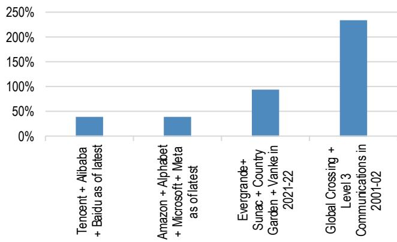
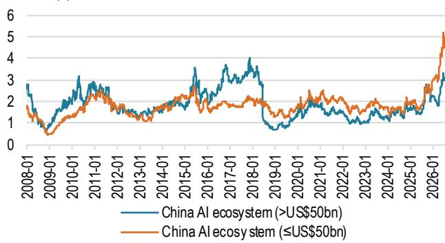
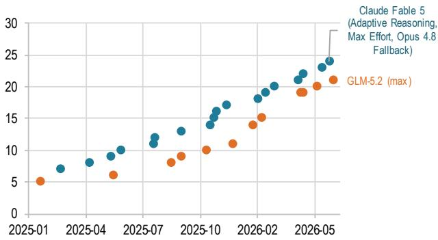
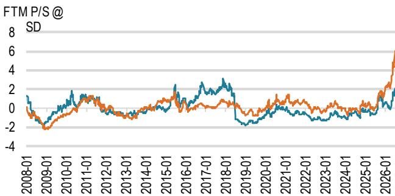
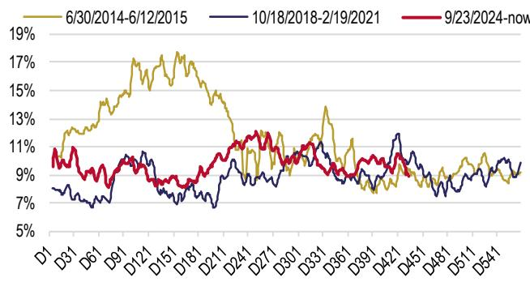
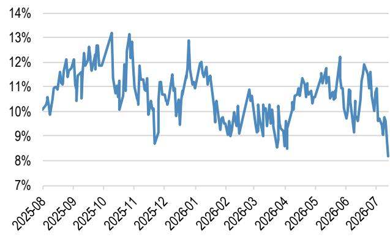
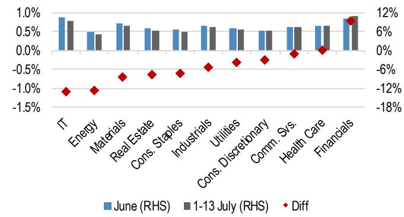
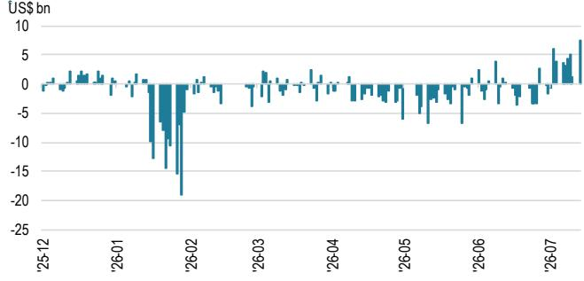

## 宏观环境研究

### AI主题：去杠杆作为一次健康的调整

在过去一周的境内交流中，客户讨论主要围绕中国AI生态系统展开。市场参与者普遍认为，近期的回调由去杠杆驱动，但对于更长期的基本面前景，特别是AI资本开支的可持续性，存在不同看法。我们基于以下三项事实核查，不同意“泡沫即将破裂”的说法：1）资产负债表健康。中国和全球超大规模企业的资产负债率均维持在约40%，远低于此前周期峰值时中国房地产企业（约100%）和美国互联网泡沫时期（约230%）的杠杆极端水平（图1）。2）能力边界仍在拓展。大语言模型提供商持续推动性能边界，中国模型也在努力缩小与美国同行的差距。我们认为，技术进步解锁新应用场景并推动年度经常性收入增长，这提供了上行期权（图2）。3）硬件瓶颈短期内不会消失。关键AI组件的产能限制最早要到2027-2028年底才可能缓解。未来两个季度不太可能成为验证窗口（图3-图4）。在短期流动性波动的背景下，我们倾向于关注大盘、高质量的AI相关公司，这些公司在回调后的整体远期市销率倍数和估值离散度处于更为合理的水平（图5-图6）。

- **流动性观察**：AI主题的去杠杆正在进行中。流动性状况支持健康回调的观点。两个指标值得关注：第一，换手率有所缓和但未出现恐慌性抛售。A股5日滚动换手率已从周期高点约6.5%显著下降，但仍高于此前牛市底部的低谷水平，这与泡沫被挤出而非机构读者离场的特征相符。第二，融资去杠杆已基本完成。融资交易占总成交额的比例全面下降。在信息技术板块内部，该比例已从约12%的阶段性高点降至8-9%，表明AI交易中杠杆最高的部分已经历了显著的强制平仓。令人鼓舞的是，自7月初以来，A股ETF资金流入已转为正值，其中科技和硬件ETF领涨。

- **基本面核查#1**：与中国房地产或美国互联网泡沫时期的峰值水平相比，超大规模企业的杠杆率仍处于健康水平。中国超大规模企业（腾讯、阿里巴巴、百度）及其美国同行（亚马逊、Alphabet、微软、Meta）的资产负债率均在约40%，远低于中国房地产开发商在2021年峰值时约100%的平均比率，更是远低于美国电信运营商在2001年互联网泡沫时期约230%的平均杠杆水平。这表明AI基础设施层的资产负债表仍然健康。从债券评级角度看，尽管近期新发行推高了部分标的的期权调整利差，但所有超大规模企业均被评为投资级，美国超大规模企业评级从A+到AAA，中国超大规模企业评级从BBB+到A+。

- **基本面核查#2**：大语言模型能力持续进步，需求创造是上行期权。AI堆栈中年度经常性收入的加速增长，增强了资本开支上调的信心，尤其是对于订单可见性已显著改善的中国本土AI供应链而言。图2显示，近年来美国和中国的大语言模型能力持续提升，截至2026年中，中国领先模型正努力追赶美国领先模型的性能水平。每一代更强大的模型都解锁了新的企业和消费者应用场景，进而推动基础设施支出的增长。我们认为，这一周期尚未受到需求饱和的制约。

- **基本面核查#3**：支撑AI资本开支紧迫性的硬件供应瓶颈，预计至少在未来18-24个月内不会缓解。因此，未来两个季度并不构成验证资本开支可持续性的窗口——约束条件依然存在，定价权得以维持。如图3和图4所示：中国本土供应提升（图3）：华为昇腾960预计于2027年第四季度推出，长鑫存储的HBM3E 12层堆叠同年进入量产。华为下一代昇腾970及长鑫存储每月50万片晶圆的产能目标计划于2028年实现，长电科技的7纳米先进封装工厂也计划于2028年下半年投产。全球供应提升（图4）：台积电亚利桑那州Fab 2于2027年进入3纳米量产，美光同时在美国和新加坡启动HBM生产。SK海力士CEO警告称，2027年将是历史上最严重的存储芯片短缺。全年产能拐点——即全球HBM供应进入大规模释放阶段、短缺缓解——要到2028年才会到来，台积电熊本Fab 2也于同年进入3纳米量产。

- 我们维持对MSCI中国指数和沪深300指数的2026年底基准目标，分别为100点和5200点，悲观情景目标分别为80点和4000点，这基于市场一致预期的每股收益同比增长率以及整体有利的流动性条件。短期内，我们认为从AI向非AI领域的轮动可能在7月持续，这得益于月底政治局会议前的政策预期以及券商、保险和医疗保健板块的强劲业绩。在非AI领域，我们关注的公司包括中国银行-H、CICC-H、信达生物、比亚迪-H和华润置地。我们认为，中国AI生态系统可能在8月财报季重新确立领先地位，在第二季度业绩和下半年指引方面均表现突出。

【2027】

## 重点图表

图1：中国及全球超大规模企业最新资产负债率 vs 部分中国房地产企业和美国电信企业在各自周期峰值时的水平  
  
来源：彭博财经（2026年7月13日）

华为昇腾960于第四季度推出

— 长鑫存储上海工厂投产，长鑫存储HBM3E 12层堆叠进入量产

## 【2028】

华为昇腾970推出（第三代昇腾旗舰架构，性能大幅提升）

— 长鑫存储总产能目标为每月50万片晶圆

— 长电科技78亿元先进封装工厂计划于2028年下半年投产
来源：华为（2025年9月18日），新浪（2026年7月11日），凤凰网（2026年7月6日）

图5：中国AI相关公司远期市销率汇总  
  
中国AI生态系统（>500亿美元）
中国AI生态系统（≤500亿美元）  
来源：LSEG Workspace（2026年7月13日）。注：不包括超大规模企业/数据中心

图3：部分中国AI公司产能提升预期时间表  
图2：中国大语言模型追赶美国同行  
  
来源：JPM（2026年7月15日）

图4：部分全球AI公司产能提升预期时间表

<table><tr><td>产能提升</td></tr><tr><td>【2027年下半年】</td></tr><tr><td>台积电亚利桑那州Fab 2进入3纳米量产美光同时在美国和新加坡启动HBM生产↓</td></tr><tr><td>【2027年全年】SK海力士CEO警告：2027年将是历史上最严重的存储芯片短缺↓</td></tr><tr><td>【2028年夏季】美光数十亿美元的广岛HBM工厂正式投产↓</td></tr><tr><td>【2028年全年产能拐点】台积电熊本Fab 2达到3纳米量产全球HBM供应进入大规模释放阶段；短缺缓解</td></tr><tr><td>来源：新浪（2026年7月11日），新浪（2026年4月20日），Aju Daily（2026年2月26日），EET中国（2026年7月6日），TrendForce（2026年4月16日）</td></tr></table>

图6：中国AI相关公司远期市销率标准差汇总  
  
中国AI生态系统（>500亿美元）
中国AI生态系统（≤500亿美元）  
来源：LSEG Workspace（2026年7月13日）。注：不包括超大规模企业/数据中心

图7：A股换手率（5日滚动）  
  
来源：Wind（2026年7月13日）

图8：A股融资交易占总成交额比例（5日滚动）  

图9：A股信息技术板块融资交易占总成交额比例  
  
来源：Wind（2026年7月13日）  
来源：Wind（2026年7月13日）

图10：A股各板块融资交易占总成交额比例  

图11：A股ETF每日净资金流  
  
来源：Wind（2026年7月13日）

来源：Wind（2026年7月13日）

图12：A股融资交易占总成交额比例（5日滚动）

<table><tr><td rowspan="2">按基准指数分类的ETF</td><td colspan="2">2023年12月18日 - 2024年2月9日</td><td colspan="2">2024年2月19日 - 2026年1月9日</td><td colspan="2">2026年第二季度</td><td colspan="2">7月1日-13日</td></tr><tr><td>总计</td><td>日均</td><td>总计</td><td>日均</td><td>总计</td><td>日均</td><td>总计</td><td>日均</td></tr><tr><td>沪深300</td><td>254.3</td><td>6.7</td><td>356.7</td><td>0.8</td><td>-354.3</td><td>-5.9</td><td>-17.9</td><td>-2.0</td></tr><tr><td>上证50 + A50</td><td>35.1</td><td>0.9</td><td>30.0</td><td>0.1</td><td>-55.1</td><td>-0.9</td><td>0.6</td><td>0.1</td></tr><tr><td>A500</td><td>0.0</td><td>0.0</td><td>204.9</td><td>0.4</td><td>-59.6</td><td>-1.0</td><td>8.6</td><td>1.0</td></tr><tr><td>中证500</td><td>32.5</td><td>0.9</td><td>31.6</td><td>0.1</td><td>-62.6</td><td>-1.0</td><td>12.0</td><td>1.3</td></tr><tr><td>中证1000</td><td>29.8</td><td>0.8</td><td>58.0</td><td>0.1</td><td>-19.5</td><td>-0.3</td><td>21.5</td><td>2.4</td></tr><tr><td>中证2000</td><td>6.2</td><td>0.2</td><td>-5.4</td><td>0.0</td><td>-0.7</td><td>0.0</td><td>0.5</td><td>0.1</td></tr><tr><td>创业板</td><td>24.6</td><td>0.6</td><td>-15.1</td><td>0.0</td><td>-28.8</td><td>-0.5</td><td>8.3</td><td>0.9</td></tr><tr><td>科创板</td><td>9.4</td><td>0.2</td><td>-71.0</td><td>-0.2</td><td>-66.1</td><td>-1.1</td><td>13.1</td><td>1.5</td></tr><tr><td>红利</td><td>12.2</td><td>0.3</td><td>60.5</td><td>0.1</td><td>35.3</td><td>0.6</td><td>5.6</td><td>0.6</td></tr><tr><td>消费</td><td>-2.4</td><td>-0.1</td><td>33.0</td><td>0.1</td><td>-4.3</td><td>-0.1</td><td>0.0</td><td>0.0</td></tr><tr><td>半导体</td><td>-0.4</td><td>0.0</td><td>-25.4</td><td>-0.1</td><td>-12.4</td><td>-0.2</td><td>108.0</td><td>12.0</td></tr><tr><td>IT硬件</td><td>0.0</td><td>0.0</td><td>0.7</td><td>0.0</td><td>57.9</td><td>1.0</td><td>31.6</td><td>3.5</td></tr><tr><td>其他</td><td>-0.9</td><td>0.0</td><td>184.2</td><td>0.4</td><td>-115.9</td><td>-1.9</td><td>42.4</td><td>4.7</td></tr><tr><td>总计</td><td>400.3</td><td>10.5</td><td>842.6</td><td>1.8</td><td>-686.3</td><td>-11.4</td><td>234.2</td><td>26.0</td></tr></table>

来源：Wind（2026年7月13日）

本报告中讨论的公司（除非另有说明，本报告中的所有价格均为2026年7月15日收盘价）

中微公司-A（688012.SS/人民币391.29元/增持），比亚迪股份有限公司-H（1211.HK/港币86.95元/增持），百度集团（9888.HK/港币107.50元/增持），百度（BIDU）（BIDU/109.73美元[2026年7月14日]/增持），中国银行-H（3988.HK/港币5.04元/增持），中国国际金融股份有限公司（3908）（3908.HK/港币22.22元/增持），华润置地（1109）（1109.HK/港币33.64元/增持），沐曦集成电路-H（9903.HK/港币559.50元/增持），信达生物制药（1801）（1801.HK/港币97.05元/增持），长电科技-A（600584.SS/人民币92.46元/增持），北方华创-A（002371.SZ/人民币742.66元/增持），胜宏科技-H（2476.HK/港币236.20元/增持），潍柴动力-H（2338.HK/港币33.24元/增持），智谱AI（2513.HK/港币1707.00元/增持），中际旭创-A（300308.SZ/人民币1169.31元/增持）

分析师认证：本报告封面标注“AC”的研究分析师证明（或，若多位研究分析师主要负责本报告，则封面或文件内标注“AC”的研究分析师分别就其在本研究中涵盖的每个证券或发行人证明）：(1) 本报告中表达的所有观点准确反映了研究分析师对任何及所有标的证券或发行人的个人观点；(2) 研究分析师的薪酬中没有任何部分直接或间接与本报告中所表达的具体建议或观点相关。对于封面列出的所有韩国研究分析师（如适用），他们还根据KOFIA要求证明，研究分析师的分析是本着诚信原则进行的，且观点反映了研究分析师本人的意见，未受到不当影响或干预。

除非另有说明，本报告中列出的所有作者均为独立撰写研究报告的研究分析师。在欧洲，本报告中可能显示行业专家（销售和交易人员）为联系人，但他们并非报告作者或研究部门成员。

## 重要披露

公司特定披露：JPM寻求并确实与其研究报告中所涵盖的公司开展业务。因此，读者应注意，该公司可能存在利益冲突，可能影响本报告的客观性。读者应将本报告视为做出投资决策的单一因素。重要披露，包括价格图表和信用意见历史表（如适用），可通过访问https://www.jpmm.com/research/disclosures、致电1-800-477-0406或发送电子邮件至research.disclosure.inquiries@JPM.com获取，适用于汇编报告及所有JPM覆盖的公司及某些未覆盖的公司。

## 股票研究评级、名称及分析师覆盖范围说明：

JPM使用以下评级体系：增持（在本报告所述价格目标期间内，我们预期该股票的表现将优于研究分析师或其团队覆盖范围内股票的平均总回报）；中性（在本报告所述价格目标期间内，我们预期该股票的表现将与研究分析师或其团队覆盖范围内股票的平均总回报一致）；减持（在本报告所述价格目标期间内，我们预期该股票的表现将逊于研究分析师或其团队覆盖范围内股票的平均总回报）。NR表示未评级。在此情况下，JPM已移除该股票的评级及（如适用）价格目标，原因包括缺乏足够的基本面依据，或出于法律、监管或政策原因。先前的评级及（如适用）价格目标不应再被依赖。NR名称并非推荐或评级。部分覆盖的股票有评级但无价格目标；在此情况下，我们预期该股票的表现将优于/一致/逊于研究分析师或其团队覆盖范围内股票在相关区域内的平均总回报。在我们的亚洲（除澳大利亚和印度外）及英国中小盘股票研究中，每只股票的预期总回报是与基准国家市场指数的预期总回报进行比较，而非与研究分析师的覆盖范围进行比较。若本报告的重要披露部分未显示，认证研究分析师的覆盖范围可在JPM网站https://www.JPMmarkets.com上找到。

JPM股票研究评级分布，截至2026年7月4日

<table><tr><td></td><td>增持（买入）</td><td>中性（持有）</td><td>减持（卖出）</td></tr><tr><td>JPM全球股票研究覆盖范围*</td><td>53%</td><td>36%</td><td>12%</td></tr><tr><td>投行客户**</td><td>83%</td><td>80%</td><td>73%</td></tr><tr><td>JPM证券股票研究覆盖范围*</td><td>51%</td><td>37%</td><td>12%</td></tr><tr><td>投行客户**</td><td>95%</td><td>92%</td><td>87%</td></tr></table>

\*请注意，由于四舍五入，百分比可能未加总至100%。
\*\*JPM在过去12个月内提供投资银行服务的“买入”、“持有”和“卖出”类别中各标的公司的百分比。
仅就FINRA评级分布规则而言，我们的增持评级属于报告评级类别；我们的中性评级属于持有评级类别；我们的减持评级属于报告评级类别。请注意，标有NR的股票不包括在上述表格中。此信息截至最近一个日历季度末。

股票估值与风险：有关所覆盖公司的估值方法或价格目标的风险，请参阅最新的公司特定研究报告，访问http://www.JPMmarkets.com，联系首席分析师或您的JPM代表，或发送电子邮件至research.disclosure.inquiries@JPM.com。有关所用专有模型的重要信息，请参阅公司特定研究报告中的财务摘要和公司概况表，这些文件可在我们客户网站http://www.JPMmarkets.com的公司页面上下载。本报告还阐述了其中使用的重要基础假设。

## 研究交流历史：

过去12个月内发布的JPM交流历史可在http://www.JPMmarkets.com的研究与评论页面访问，您也可以按分析师姓名、行业或金融工具进行搜索。

分析师薪酬：负责编写本报告的研究分析师的薪酬基于多种因素，包括研究的质量和准确性、客户反馈、竞争因素以及公司整体收入。

非美国分析师注册：除非另有说明，本报告封面列出的非美国分析师是非美国JPM证券有限责任公司关联公司的员工，可能未根据FINRA规则注册为研究分析师，可能不是JPM证券有限责任公司的关联人士，并且可能不受FINRA规则2241或2242关于与所覆盖公司沟通、公开露面以及交易研究分析师账户持有证券的限制。

## 其他披露

JPM是JPM公司及其全球子公司和关联公司的投资银行业务的营销名称。

英国MiFID FICC研究豁免：英国客户应参阅英国MiFID研究豁免，了解JPM实施FICC研究豁免的详细信息以及相关FICC研究分类的指导。

所有向客户提供的研究材料均同时在我们的客户网站JPM Markets上提供，除非相关法律特别允许。并非所有研究内容都会重新分发、通过电子邮件发送或提供给第三方聚合商。如需获取特定股票的所有可用研究材料，请联系您的销售代表。

本研究材料中提及中国、香港、台湾和澳门的任何长格式名称分别为中国大陆、中国香港特别行政区、中国台湾和中国澳门特别行政区。

JPM可能不时撰写关于受到美国、欧盟、英国或其他相关司法管辖区政府当局实施或管理的经济或金融制裁的发行人或证券（“受制裁证券”）的文章。本报告中的任何内容均无意被解读为鼓励、促进、推动或以其他方式批准对受制裁证券的投资或交易。客户在做出投资决定时应了解自己的法律和合规义务。

本研究报告中讨论的任何数字或加密资产均受快速变化的监管环境影响。有关加密资产（包括比特币和以太坊）的相关监管建议，请参阅https://www.JPM.com/disclosures/cryptoasset-disclosure。

本研究报告的作者可能未获授权在您的司法管辖区开展受监管活动，如果未获授权，则不会声称自己能够这样做。

交易所交易基金（ETF）：JPM证券有限责任公司（“JPMS”）作为几乎所有美国上市ETF的授权参与者。如果本报告中提及任何ETF，JPMS可能因分销这些ETF份额而赚取佣金和基于交易的补偿，并可能因执行其他交易相关服务（例如向ETF份额的空头卖家提供证券借贷）而赚取费用。JPMS还可能为ETF本身提供服务，包括担任ETF的经纪商或交易商。此外，JPMS的关联公司可能为ETF提供服务，包括信托、托管、管理、借贷、指数计算和/或维护及其他服务。

期权和期货相关研究：如果此处包含的信息涉及期权或期货相关研究，则此类信息仅提供给已收到适当期权或期货风险披露文件的人士。请联系您的JPM代表或访问https://www.theocc.com/components/docs/riskstoc.pdf获取期权清算公司的标准化期权的特征和风险，或访问https://www.finra.org/sites/default/files/2020-08/Security\_Futures\_Risk\_Disclosure\_Statement\_2020.pdf获取证券期货风险披露声明。

银行间同业拆借利率（IBOR）及其他基准利率的变更：某些利率基准正在或可能在未来受到持续的国际、国内及其他监管指导、改革和改革提案的影响。更多信息，请查阅：https://www.JPM.com/global/disclosures/interbank\_offered\_rates

私人银行客户：如果您作为JPM公司及其子公司（“JPM私人银行”）提供的私人银行业务的客户接收研究，则研究由JPM私人银行提供给您，而非JPM的其他部门，包括但不限于JPM企业与投资银行及其全球研究部门。

负责制作和分发研究的法律实体：本材料作者（即Reg AC研究分析师）姓名下方标识的法律实体是负责制作本研究的法律实体。如果多位Reg AC研究分析师共同撰写本材料，且其姓名下方标识了不同的法律实体，则这些法律实体共同负责制作本研究。如果分析师姓名下列出多个法律实体，则除非另有说明，第一个法律实体负责制作。来自不同JPM关联公司的研究分析师可能对本材料的制作有所贡献，但可能未获授权在您的司法管辖区开展受监管活动（并且不会声称自己能够这样做）。除非下文法律实体披露中另有说明，本材料已由负责制作的法律实体分发，或者如果分析师姓名下列出多个法律实体，则第一个法律实体负责分发。如果您有任何疑问，请联系您所在司法管辖区的相关研究分析师或分发本研究材料的实体。

## 法律实体披露及国家/地区特定披露：

阿根廷：JPM银行布宜诺斯艾利斯分行受阿根廷共和国中央银行（BCRA）和阿根廷国家证券委员会（CNV - ALYC y AN Integral N°51）监管。

澳大利亚：JPM证券澳大利亚有限公司（JPMSAL）（ABN 61 003 245 234/AFS牌照号：238066）受澳大利亚证券和投资委员会监管，是ASX Limited的市场参与者、ASX Clear Pty Limited的清算和结算参与者以及ASX Clear (Futures) Pty Limited的清算参与者。本材料由JPMSAL在澳大利亚向“批发客户”（定义见《2001年公司法》第761G条）发行和分发。所有涵盖金融产品的列表可通过访问https://www.jpmm.com/research/disclosures获取。JPM力求覆盖所有全球行业分类标准（GICS）行业中与国内外读者基础相关的公司，以及各种市值规模的公司。如适用，在对标的公司进行公开尽职调查的过程中，研究分析师团队有时可能通过公司访问、与公司代表讨论、管理层演示等方式进行此类尽职调查。JPMSAL发布的研究已按照JPM澳大利亚的研究独立性政策编制，该政策可在以下链接找到：JPM澳大利亚 - 研究独立性政策。

巴西：JPM银行受巴西证券委员会（CVM）和巴西中央银行监管。JPM监察员：0800-7700847 / 0800-7700810（听力障碍人士）/ ouvidoria.jp.morgan@jpmchase.com。
加拿大：JPM证券加拿大有限公司是一家注册投资交易商，受加拿大投资监管组织和安大略省证券委员会监管，是加拿大交易所的参与会员。本材料由JPM证券加拿大有限公司在加拿大分发。

智利：JPM投资有限公司是一家在智利注册的非监管实体。

中国：JPM证券（中国）有限公司已获中国证监会批准开展证券投资咨询业务。

哥伦比亚：JPM哥伦比亚银行受哥伦比亚金融监管局（SFC）监管。本材料中提及由哥伦比亚境外实体提供的产品或服务仅用于描述目的。此类引用不构成也不应被解释为在哥伦比亚境内进行促销活动或提供金融产品或服务，根据适用的哥伦比亚法规的定义。

迪拜国际金融中心（DIFC）：JPM银行迪拜分行受迪拜金融服务局（DFSA）监管，其注册地址为迪拜国际金融中心 - The Gate, West Wing, Level 3 and 9 PO Box 506551, Dubai, UAE。本材料由JPM银行迪拜分行向根据DFSA规则被视为专业客户或市场对手方的人士分发。

欧洲经济区（EEA）：除非另有说明，研究由JPMSE（“JPM SE”）在EEA分发，JPM SE是一家信贷机构，由联邦金融监管局（BaFin）授权，并受BaFin、德国中央银行（德意志联邦银行）和欧洲中央银行（ECB）共同监管。JPM SE是一家总部位于法兰克福的公司，注册地址为TaunusTurm, Taunustor 1, Frankfurt am Main, 60310, Germany。本材料已在EEA向根据MiFID II第4条第1款第10项及附件II及其在各自母国的实施被视为专业读者（或同等资格）的人士（“EEA专业读者”）分发。非EEA专业读者不得依据或依赖本材料行事。本材料所涉及的任何投资或投资活动仅面向EEA相关人士，并仅与EEA相关人士进行。

香港：JPM证券（亚太）有限公司（CE编号AAJ321）受香港金融管理局和香港证券及期货事务监察委员会监管，JPM经纪（香港）有限公司（CE编号AAB027）受香港证券及期货事务监察委员会监管。JPM银行香港分行（CE编号AAL996）受香港金融管理局和证券及期货事务监察委员会监管，根据美国法律组织，承担有限责任。如果本材料的分发在香港是受监管活动，则本材料由JPM证券（亚太）有限公司和/或JPM经纪（香港）有限公司在香港分发。印度：JPM印度私人有限公司（公司识别号 - U67120MH1992FTC068724），注册地址为JPM印度私人有限公司（公司识别号 - U67120MH1992FTC068724）。

NSDL-285-2008/ INBI00000984/ INE231311239）作为印度的指定商业银行，这是其主要牌照，允许其在印度开展银行业务以及印度银行分行获准从事的其他活动。对于非本地研究材料，本材料不由JPM印度私人有限公司在印度分发。合规官：Ashutosh Sharma；ashutosh.i.sharma@ipmchase.com；+912261575002。申诉官：Ramprasadh K. ipmipl.research.feedback@ipmorgan.com：+912261573000。SEBI的注册和NISM的认证绝不保证中介机构的业绩或向读者提供任何回报保证。请访问条款和条件以及最重要的条款和条件（MITC）。年度合规审计报告可在http://www.jpmipl.com/#research获取。

印度尼西亚：JPM印度尼西亚证券公司是印度尼西亚证券交易所的成员，并受金融服务管理局（OJK）注册和监管。

韩国：JPM证券（远东）有限公司首尔分行是韩国交易所（KRX）的成员。JPM银行首尔分行在韩国获得外国银行分行牌照（JPM银行）。两个实体均受金融服务委员会（FSC）和金融监督院（FSS）监管。对于非宏观研究材料，该材料由JPM证券（远东）有限公司首尔分行在韩国分发。

日本：JPM证券日本有限公司和JPM银行东京分行受日本金融厅监管。

马来西亚：本材料由JPM证券（马来西亚）有限公司（18146-X）在马来西亚发行和分发，该公司是马来西亚交易所的参与组织，并持有马来西亚证券委员会颁发的资本市场服务牌照。

墨西哥：JPM证券有限公司（JPM金融集团成员）是墨西哥证券交易所（Bolsa Mexicana de Valores）和机构证券交易所（Bolsa Institucional de Valores）的成员，并获国家银行和证券委员会（Comisión Nacional Bancaria y de Valores）授权作为经纪交易商。

新西兰：本材料由JPMSAL在新西兰仅向“批发客户”（定义见《2013年金融市场行为法》）发行和分发。JPMSAL已根据《2008年金融服务提供商（注册和争议解决）法》注册为金融服务提供商。

菲律宾：JPM证券菲律宾公司是菲律宾证券交易所的交易参与者，也是菲律宾证券清算公司和证券读者保护基金的成员。它受证券交易委员会监管。

新加坡：本材料由JPM证券新加坡私人有限公司（JPMSS）[MDDI (P) 057/08/2025 及公司注册号：199405335R] 和/或JPM银行新加坡分行（JPMCB Singapore）在新加坡发行和分发，两者均受新加坡金融管理局监管。JPMSS是新加坡交易所证券交易有限公司的成员。本材料仅向符合《证券及期货法》（第289章）第4A条定义的认可读者、专家读者和机构读者在新加坡发行和分发。本材料无意向任何零售读者或不符合“认可读者”、“专家读者”或“机构读者”定义的其他读者发行或分发。新加坡的接收者如需就本材料产生的或与之相关的任何事宜，请联系JPMSS或JPMCB Singapore。

南非：JPM南非股票有限公司和JPM银行约翰内斯堡分行是约翰内斯堡证券交易所的成员，并受金融服务行为监管局（FSCA）监管。

台湾：JPM证券（台湾）有限公司是台湾证券交易所的参与者（公司型），并受台湾证券期货局监管。与股票证券相关的材料由JPM证券（台湾）有限公司在台湾发行和分发，受限于台湾适用法律法规的许可范围。如果JPM证券（台湾）有限公司制作关于未在台湾证券交易所或台北交易所上市的证券（“非台湾上市证券”）的研究材料，这些材料不构成台湾适用法规下的证券推荐，并且为免生疑问，JPM证券（台湾）有限公司不担任非台湾上市证券的经纪商。根据《证券商推介客户买卖有价证券作业办法》第7-1条第2款（经修订或补充）和/或其他适用法律法规，请注意，除非本材料“重要披露”中另有披露，本材料的接收者不得从事与本材料相关的任何可能产生利益冲突的活动。

泰国：本材料由JPM证券（泰国）有限公司在泰国发行和分发，该公司是泰国证券交易所的成员，并受财政部和证券交易委员会监管。注册地址为548 One City Center Building, 50th Floor, Ploenchit Road, Lymphini, Pathum Wan, Bangkok 10330。

英国：研究由JPM证券有限公司（“JPMS plc”）在英国制作，该公司是伦敦证券交易所的成员，并受审慎监管局授权及受金融行为监管局和审慎监管局监管；或由JPM市场有限公司（“JPMML Ltd”）制作，该公司受金融行为监管局授权和监管。除非另有说明，本材料由JPMS plc在英国分发，并且仅面向英国：(a) 具有《2000年金融服务和市场法（金融促销）令2005》（“FPO”）第19(5)条所述的投资相关事务专业经验的人士；(b) FPO第49条所述的人士（高净值公司、非法人协会或合伙企业、高价值信托的受托人等）；或(c) 可以合法接收此通讯的任何其他人；所有此类人士均称为“英国相关人士”。非英国相关人士不得依据或依赖本材料行事。本材料所涉及的任何投资或投资活动仅面向英国相关人士，并仅与英国相关人士进行。JPMEMEA关于预防和避免与研究制作相关的利益冲突政策的描述可在以下链接找到：JPMEMEA - 研究独立性政策。

美国：JPM证券有限责任公司（“JPMS”）是纽约证券交易所、FINRA、SIPC和NFA的成员。JPM银行是FDIC的成员。非美国关联公司发布的材料由JPMS在美国分发，JPMS对其内容承担责任。

一般信息：可根据要求提供更多信息。本材料中的信息来自被认为可靠的来源。尽管已采取一切合理措施确风险自担材料中陈述的事实准确，且其中包含的预测、意见和预期公平合理，但JPM公司或其关联公司和/或子公司（统称“JPM”）对本材料的完整性或准确性不作任何陈述或保证，但有关JPM和研究分析师参与作为本材料主题的发行人的披露除外。因此，不应依赖本材料所含信息的准确性、公平性或完整性。由于计算、调整、翻译成不同语言和/或当地监管限制（如适用），本材料中可能存在某些数据差异和/或内容有限。这些差异不应影响对材料中可能讨论的标的公司的整体分析、观点和/或推荐。人工智能工具可能已用于本材料的准备，包括协助数据分析、模式识别和研究材料的内容起草。JPM对因使用本材料或其内容而产生的任何损失不承担任何责任，JPM及其各自的董事、高级职员或员工均不对本文件的内容承担任何责任，但相关司法管辖区的监管机构或该监管制度可能施加的责任和义务除外。本材料中包含的意见、预测或预测仅代表JPM截至材料日期的当前意见或判断，如有变更，恕不另行通知。可能会根据公司特定发展或公告、市场状况或任何其他公开信息提供公司/行业的定期更新。无法保证未来结果或事件与任何此类意见、预测或预测一致，这些意见、预测或预测仅代表一种可能的结果。此外，此类意见、预测或预测受某些未经验证
