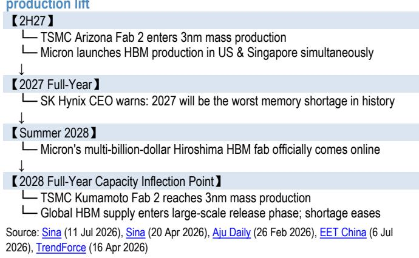
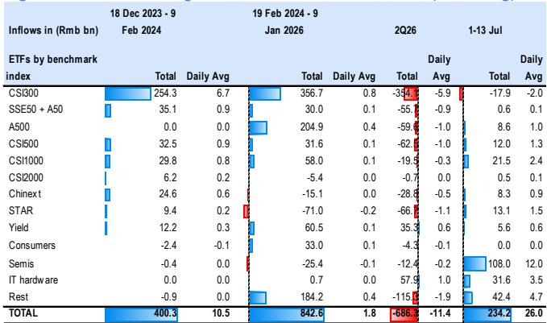
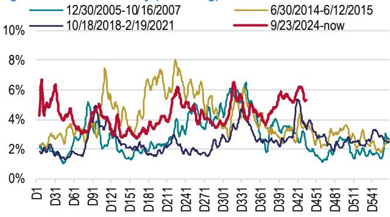

# JPM：中国权益策略-AI主题-去杠杆是健康重置

市场对AI板块的担忧，最近集中在同一个问题上：这轮调整是不是趋势转变的前兆？JPM在最新中国策略报告中给出了一个反直觉的判断——回调恰恰是健康的，去杠杆正在完成，而非开始。

报告从三个维度拆解了“泡沫论”的支撑是否成立。第一个也是最容易被忽视的，是资产负债表。中国和全球超大规模云厂商的资产负债率目前都在40%左右，而中国房地产企业在2021年峰值时接近100%，美国电信公司在2001年互联网泡沫时高达230%。AI基础设施层的杠杆水平，和历史上那些真正破裂的泡沫，不在一个量级。

> **KC评论：** 40%对100%或230%，这个差距不是量级的，是性质的。报告隐含的意思是，如果AI是泡沫，它至少还缺一个“过度借贷”的阶段。而目前看，这个阶段没有出现。

第二个维度是能力边界。大语言模型的能力仍在持续提升，中国头部模型正在追赶美国同行。每一代更强大的模型，都会解锁新的企业级和消费级应用场景，进而驱动增量基础设施支出。报告认为，需求饱和还不是约束条件——需求创造才是上行期权。

第三个维度最硬：硬件瓶颈不会在2028年之前缓解。华为昇腾960预计2027年四季度推出，CXMT的HBM3E 12层堆叠同年量产；下一代昇腾970和CXMT 50万片/月的产能目标要到2028年。全球方面，台积电亚利桑那Fab 2在2027年进入3nm量产，SK海力士CEO已警告2027年将是史上最严重的存储短缺。全球HBM供应进入大规模释放、短缺缓解的拐点，要到2028年才会到来。

报告由此得出结论：未来两个季度不是验证AI资本支出可持续性的窗口——约束仍然存在，定价权仍在。

## 1. 流动性去杠杆已基本完成，ETF资金开始回流

报告用两个指标支撑“健康回调”的判断。一是换手率。相关市场5日滚动换手率从周期高点约6.5%明显回落，但仍高于此前牛市底部的低谷水平。这意味着“泡沫”在被清除，而非机构读者在退出。

二是融资去杠杆。IT板块融资交易占成交额的比例，已从阶段性峰值约12%降至8-9%，表明AI交易中最杠杆化的部分已经经历了显著出清。更积极的信号是，相关市场ETF资金自7月初以来已转为净流入，科技和硬件ETF领涨。

## 2. 估值修正后，大型AI标的的性价比开始显现

报告指出，经过回调，中国AI生态中大型标的（市值超过500亿美元）的远期市销率倍数和估值离散度，都已回落到更合理的水平。小型标的的估值压缩更为剧烈。

这意味着，市场正在从“所有AI公司都涨”的阶段，进入一个需要区分质量、规模和护城河的阶段。大型、高质量的AI标的，在估值修正后，可能重新获得资金关注。

## 3. 短期非AI板块有政策窗口，但AI可能在8月业绩季重新领跑

报告维持对MSCI中国指数和沪深300指数2026年底的基准目标。短期来看，7月资金可能继续从AI轮动到非AI板块，受益于月底相关会议前的政策预期，以及机构、保险、医疗等板块的强劲业绩。

但报告认为，AI生态可能在8月业绩季重新确立领先地位——无论是二季度业绩还是下半年指引，AI板块都有望跑赢。

> **KC评论：** 报告对AI的判断有一个隐含的时间结构：短期看流动性修复，中期看硬件瓶颈持续，长期看需求创造。这三个时间维度叠加，意味着当前的回调可能不是离场信号，而是重新评估标的质量的窗口。

For informational purposes only. Portions may be generated,translated,summarized,or edited with AI assistance based on source materials and may contain omissions or errors. Please verify independently. This is not investment,legal,tax,accounting,or other professional advice.

For informational purposes only. Portions may be generated,translated,summarized,or edited with AI assistance based on source materials and may contain omissions or errors. Please verify independently. This is not investment,legal,tax,accounting,or other professional advice.

