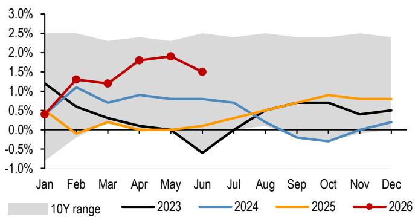
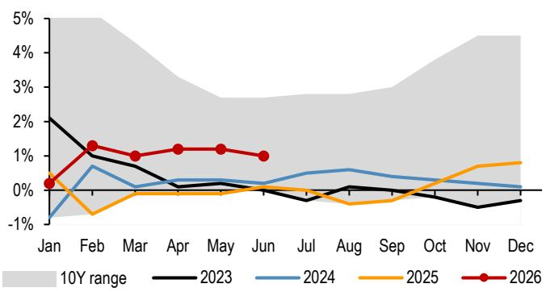
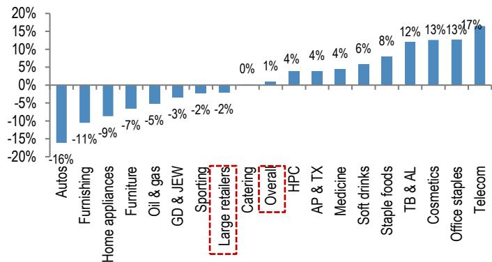

# 关于消费趋势的观察笔记

6月社会消费品零售总额同比转正至1.0%，超过市场预期的-0.1%。但相关研究在最新消费趋势报告中提醒，这个数字更多是低基数效应——两年复合增速5.8%，与5月基本持平。更值得关注的信号藏在结构里：二季度零售总额同比仅增0.2%，较一季度的2.4%有所变化；6月CPI-PPI剪刀差已扩大至-3.1%，意味着成本不确定性正在从上游向下游传导，而多数消费企业尚未展现出足够的定价能力。

这份报告的核心判断是：相关规划给出了3.7%的年复合增长目标，但“如何实现”仍是悬而未决的问题。在需求偏弱、成本上升的双重影响下，研究预计更多公司将在二季度业绩期下调全年指引。

## 1. 二季度消费动能明显节奏变化，线上与线下分化加剧

一季度零售总额同比增2.4%，二季度降至0.2%。6月单月1.0%的同比增速看似回暖，但剔除基数效应后，动能并未实质改善。分渠道看，二季度线上实物商品零售同比增2.3%，而线下零售同比下滑0.6%。即便在618大促季，线上增速也仅录得2.6%，低于一季度的7.5%。

品类层面，消费电子（同比增13-17%）、化妆品（+13%）、食品饮料（+8%）成为6月的主要拉动项。但汽车（-16%）、建材（-11%）、家电（-9%）和家具（-7%）持续影响。这种分化并非短期波动——汽车和地产后周期品类已连续多月处于负增长区间，反映出居民在大件消费上的意愿仍然谨慎。

> **观察评论：** 线上增速节奏变化而线下转负，说明整体消费意愿在调整，而非简单的渠道转移。618大促没能扭转趋势，这个信号值得持续跟踪。

## 2. CPI-PPI剪刀差扩大，成本不确定性正在影响利润

6月PPI同比跳升至4.1%，而CPI仅上涨1.0%，两者差值扩大至-3.1个百分点。这意味着上游原材料涨价尚未有效传导至终端消费品价格。研究指出，那些既无法与上游供应商议价、也无法向下游转嫁成本的公司，将面临明显的利润影响。

报告特别提到，大宗商品成本虽已基本见顶，但成本不确定性可能持续贯穿下半年。对于依赖原材料且定价能力薄弱的公司，二季度业绩期可能成为分水岭——更多企业会选择下调全年指引，而非硬扛。

## 3. 就业市场观察：AI渗透与成本不确定性可能触发新一轮调整

6月失业率5.0%，环比微降0.1个百分点，同比持平。但研究认为，随着AI在更多行业的渗透加速，叠加三季度起成本不确定性上升，更多企业可能在下半年寻求“降本”措施——人员调整是最直接的选项之一。

报告没有给出具体数字预测，但指出了这个逻辑链条：成本上升 -> 企业利润承压 -> 人员调整 -> 居民收入预期走弱 -> 消费意愿进一步调整。对于消费行业而言，这意味着需求端的改善可能比市场预期的更慢。

## 4. 观察框架：质量龙头与困境反转，避开两头受挤压的公司

研究维持观察框架：一端是基本面扎实、盈利率先企稳的质量标的——安踏（多品牌执行力强、海外有增量）、农夫山泉（品牌势能强、利润缓冲足）、美的（收入结构均衡、B2B有期权价值）；另一端是困境反转标的——茶颜悦色（国内反转+股东回报改善）、瑞幸（同店销售好于预期、二季度起盈利释放）。

报告明确建议避开那些高度暴露于原材料涨价、且定价能力有限的公司，例如科沃斯、华润饮料。

> **观察评论：** 这份报告最有价值的部分不是公司提到，而是它提供了一个观察框架：在成本上升周期，真正能跑赢的公司，要么有品牌溢价（能涨价），要么有规模议价权（能压供应商），要么有业务结构对冲（B2B占比高）。三者缺一，就要警惕利润被两头挤压。

For informational purposes only. Portions may be generated,translated,summarized,or edited with AI assistance based on source materials and may contain omissions or errors. Please verify independently. This is not investment,legal,tax,accounting,or other professional advice.

For informational purposes only. Portions may be generated,translated,summarized,or edited with AI assistance based on source materials and may contain omissions or errors. Please verify independently. This is not investment,legal,tax,accounting,or other professional advice.

