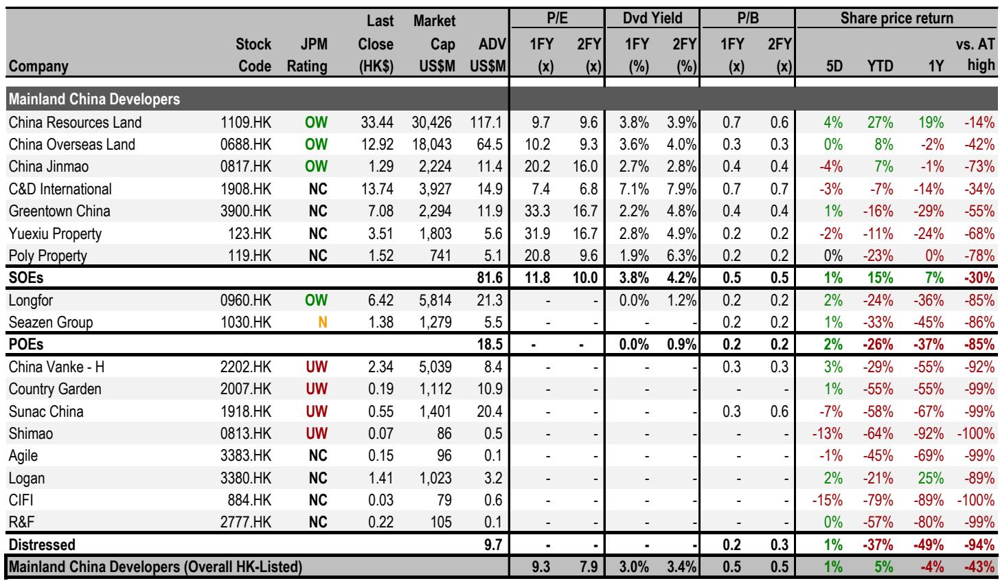
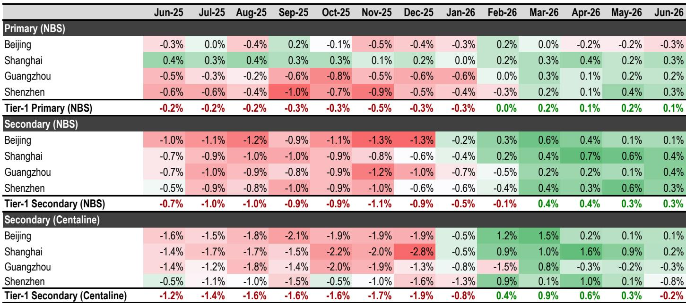
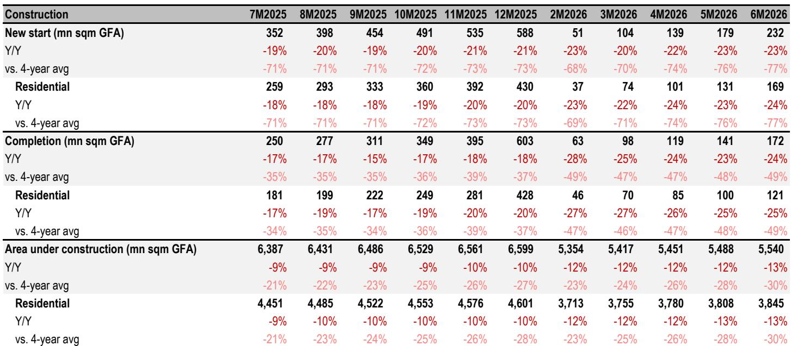

# 中国房地产市场观察：一线城市价格趋稳，整体趋势分化

6月数据给出了一个清晰的信号：一线城市房价连续第四个月环比正增长，但全国70城整体趋势仍在分化。最新研究指出，这种“K型企稳”格局下，新房和二手房、一线与低线城市之间的差距正在拉大。住宅销售额同比降幅从5月的8%扩大至6月的14%，低于此前预期。与此同时，新开工面积同比下滑26%，施工端持续调整。报告认为，供给调整反而为房价企稳创造了条件，但前提是需求端能否跟上。

## 1. 一线城市二手房出现分歧信号，上海是相对少见持续跑赢的城市

国家统计局数据显示，6月一线城市二手房价格环比上涨0.3%，连续四个月正增长。但中原地产的指数给出了不同画面：该指数6月环比下降0.2%，是四个月来首次转负，主要受深圳（-0.8%）和广州（-0.3%）影响。上海仍是相对少见亮点，中原指数环比上涨0.2%。两种数据源的差异值得注意——统计局数据覆盖范围更广，而中原指数更贴近中介实际成交价。报告认为，一线城市二手房价格将在2026年实现“软企稳”，但上海可能成为相对少见实现温和增长的城市，背后是二手房挂牌量持续下降，6月环比再降1%。

> **观察：** 统计局与中原指数的背离，说明一线城市内部并非铁板一块。深圳和广州的二手房实际成交价可能比官方数据更弱，而上海是相对少见在两种口径下都保持正增长的城市。关注挂牌量变化比关注价格本身更能预判趋势。

## 2. 全国销售下滑加速，但高线城市新开工调整正在减少供给

6月住宅销售额同比下降12%，较5月的7%明显扩大。研究将全年销售预测从-7%下调至-10%，意味着下半年在低基数下同比降幅可能收窄至5%。新开工面积同比下降26%，连续两个月扩大，全年预计下滑22%。报告的逻辑是：新开工仍在调整导致未来新房供给减少，这反而有助于稳定房价——但前提是需求不能同步收缩。从7月高频数据看，新房销售面积同比降幅已收窄至7%，显示政策效果可能在边际显现。

## 3. 国企开发商成为少数跑赢市场的“阿尔法”

在整体销售承压的背景下，部分国企开发商实现了逆势增长。中国海外发展、华润置地和中国金茂上半年销售表现跑赢行业，年初至今报价分别上涨7%、23%和12%，而同期恒生指数下跌4%。报告认为，在K型企稳格局中，市场份额向国企集中的趋势仍在持续。这些公司的共同特征是：聚焦高能级城市、土地储备质量较高、融资成本优势明显。对于关注行业结构性机会的读者而言，销售增速能否持续跑赢同行，是区分“阿尔法”与“贝塔”的关键指标。

## 4. 观察框架：用三个指标判断房价企稳的真实性

报告隐含了一套可复用的判断框架。第一，看二手房挂牌量是否持续下降——这是供给端最领先的信号。第二，看统计局与中介指数是否收敛——如果两者方向一致，企稳可信度更高。第三，看新开工与销售增速的剪刀差——新开工调整幅度大于销售降幅，意味着库存去化加速，这是价格企稳的滞后条件。当前一线城市满足前两个条件，但全国层面仍需观察。

For informational purposes only. Portions may be generated,translated,summarized,or edited with AI assistance based on source materials and may contain omissions or errors. Please verify independently. This is not investment,legal,tax,accounting,or other professional advice.

For informational purposes only. Portions may be generated,translated,summarized,or edited with AI assistance based on source materials and may contain omissions or errors. Please verify independently. This is not investment,legal,tax,accounting,or other professional advice.

