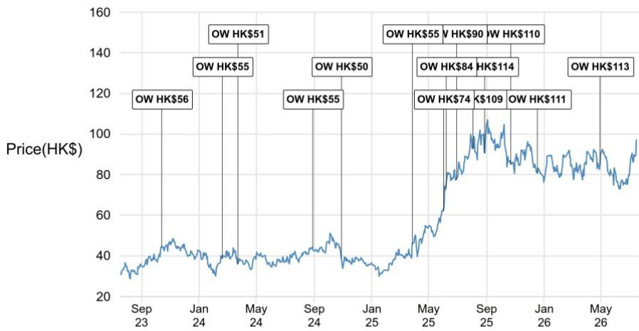
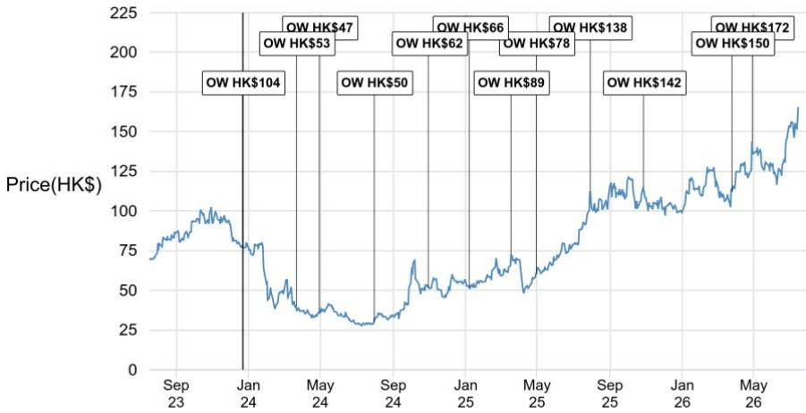
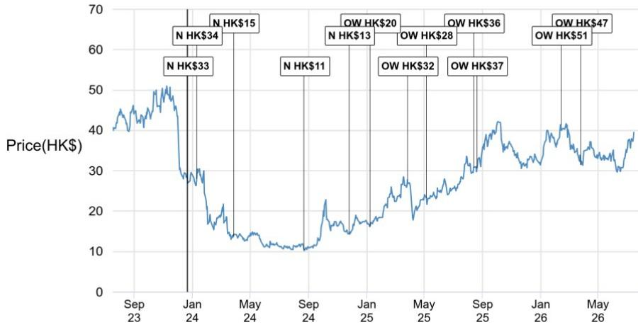

# 行业观察：中国医疗成都调研，创新方向与全球实践

一份为期两天的成都医疗调研，覆盖9家生物科技、CRO和器械公司，给出了一个与市场普遍叙事不太一样的信号。相关研究指出，中国医疗创新的核心驱动力正在从成本优势转向临床差异化，而AI的渗透、对外授权交易的活跃度、以及行业规范对格局的实际影响，都在印证这一转变。

调研发生在7月中旬，正值市场对中国医疗板块情绪回暖的窗口期。读者关心的几个问题——行业规范冲击是否还在、AI能否真正改变研发效率、海外授权能否持续——在这份报告里都有基于实地交流的回应。

## 1. AI提升效率，但实验能力才是真正的核心

多家被调研公司已经在药物发现和开发中嵌入AI。HitGen将AI与DEL筛选、结构生物学和自动化DMTA循环结合；Hinova和Zenitar则把AI用于分子设计、靶点结构分析和先导化合物优化。科伦博泰特别强调，高质量物理数据和私有数据集对AIDD模型的价值，远大于算法本身。

报告传递了一个关键区分：AI可以减少需要合成的分子数量、缩短发现周期，但它不取代实验验证。拥有整合数据、生物学和实验室平台的公司，比单纯的AI工具提供商更可能受益。

> **观察：** 这张图值得注意——AI在药物研发中的角色更像是加速器而非替代者。那些同时具备高质量私有数据和实验能力的公司，才是真正能兑现AI价值的对象。纯算法公司如果缺乏数据闭环，可能很难形成持续竞争力。

## 2. 对外授权交易的核心驱动力是临床差异化，而非低成本

科伦博泰与默沙东的合作、BioKin与百时美施贵宝的联手、吉利德收购Ouro（Keymed的主要资产），这些案例表明跨国药企对中国资产的兴趣集中在ADC和免疫学领域。更早期的公司如Hinova和Zenitar也报告了海外合作伙伴对分子胶、代谢资产和自身免疫项目的浓厚兴趣。

报告特别指出，没有一家公司表达了对地缘政治影响授权活动的担忧。Keymed甚至明确表示，未来更倾向于与跨国药企直接交易，而非通过Newco结构。这暗示中国创新药出海的通道正在变得更加直接和成熟。

推动交易价值的关键变量，是对未满足临床需求的强差异化能力，而不是更低开发成本。这意味着，那些管线布局与全球标准治疗存在明确差异的公司，在授权谈判中拥有更强议价权。

## 3. 行业规范加速分化，合规和创新产品反而受益

报告覆盖的几家创新药公司表示，近期政策收紧并未实质性地影响销售进展。新商业化产品如果具备合规推广体系和明确的临床价值，受到的影响更小。科伦药业预计，二季度许多公司的销售费用将下降，临床必需药品与推广驱动型辅助产品之间的分化会进一步加剧。

长期来看，这一趋势对基于证据的创新产品有利，对依赖高销售费用或非正式医院渠道的公司则构成不确定性。行业正在经历一轮自然筛选，合规能力和临床证据正在取代销售能力成为核心竞争力。

## 4. 下半年临床催化剂密集，但市场情绪仍存在不确定性

读者对HARMONi-3数据在下半年的表现以及当前医疗板块反弹的持续性存在分歧。但多数读者认同，中国医疗基本面依然扎实，若报价出现调整，会是布局机会。

报告预期，中国公司将在WCLC 2026、ESMO 2026、SABCS 2026等会议上公布强临床数据，包括科伦博泰的sac-TMT三期数据和百利的iza-Bren三期数据。这些催化剂能否转化为持续的市场关注，取决于数据本身是否具备改变标准治疗的潜力。

对于关注中国医疗创新的读者而言，当前阶段需要区分两类公司：一类是依靠AI叙事和授权交易支撑估值的，另一类是拥有差异化临床数据、合规商业化体系和全球化执行能力的。报告倾向后者，而调研中9家公司的交流也指向同一个方向——中国医疗创新的竞争力，正在从“能做”转向“做得好”。

For informational purposes only. Portions may be generated,translated,summarized,or edited with AI assistance based on source materials and may contain omissions or errors. Please verify independently. This is not investment,legal,tax,accounting,or other professional advice.

For informational purposes only. Portions may be generated,translated,summarized,or edited with AI assistance based on source materials and may contain omissions or errors. Please verify independently. This is not investment,legal,tax,accounting,or other professional advice.

