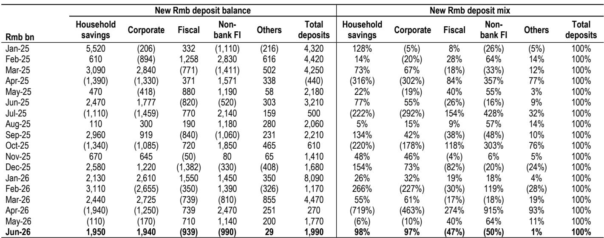
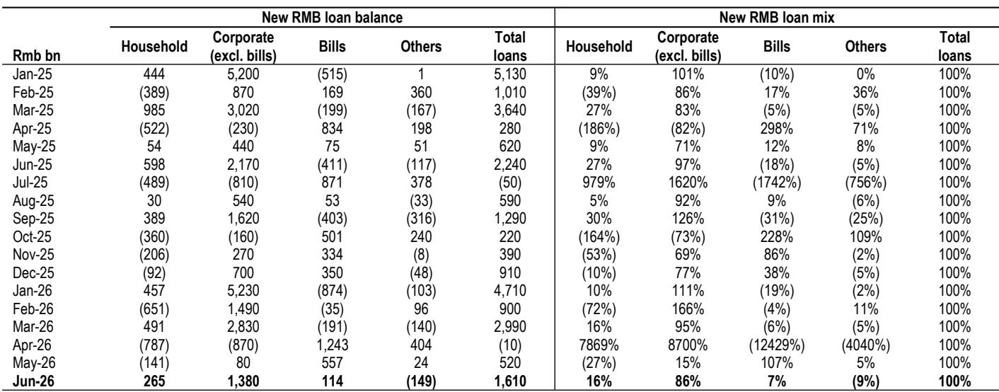
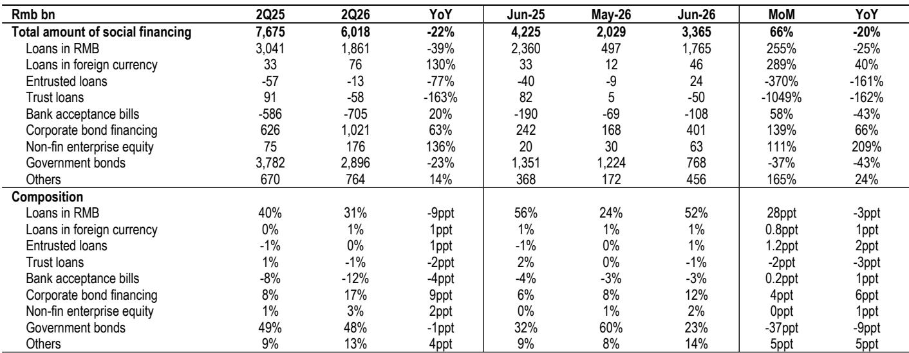

# JPM：中国银行6月资金数据观察——需求仍在调整与定价不确定性持续

6月资金数据公布后，市场对总量层面的关注度很高——社融和新增人民币贷款双双低于预期，M1-M2剪刀差进一步走阔至-4.0%。但JPM这份研究笔记的核心判断并不在总量层面，而在于一个更结构性的问题：银行正在失去对贷款定价的控制力。

报告指出，6月新发放企业贷款加权平均利率已降至约3.0%，同比下降约20个基点，且低于3月约3.1%的水平。更关键的是，这一趋势发生在没有进一步降息的环境下——这意味着银行在主动让利，或者说，在被动接受更低的定价。与此同时，零售贷款余额同比调整1.3%，其中短期零售贷款增速降至-6.7%，中长期零售贷款增速也节奏变化至0.5%。高收益资产的调整叠加低收益资产的定价节奏变化，正在挤压银行的净息差。

报告预计，二季度净息差可能环比持平或小幅下降，而一季度覆盖银行曾录得环比3个基点的改善。这一逆转值得关注。

> **KC评论：** 市场通常关注降息对银行息差的直接影响，但这份报告揭示了一个更隐蔽的机制：即使政策利率不变，贷款结构的出现变化——高收益零售贷款调整、低收益对公贷款占比上升——本身就在压缩息差。定价权比利率水平更重要。

## 1. 零售贷款调整是结构性的，不是季节性的

6月新增零售贷款仅2650亿元，远低于去年同期的5980亿元，占新增贷款比重从27%降至16%。报告特别指出，零售贷款增速已连续多月为负，且短期和中长期两个维度都在走弱。这不是月末冲量或季节性扰动可以解释的。

房贷需求变化是原因之一，但消费信贷的调整同样明显。报告提到，短期零售贷款增速已降至-6.7%，较5月的-6.0%进一步出现变化。这意味着居民部门的加杠杆意愿和能力都在调整，而非仅仅是购房意愿的问题。

## 2. 企业贷款定价节奏变化，但债券融资正在替代银行信贷

6月企业债券融资达4010亿元，同比增长66%，环比增长139%。政府债券和企业债券合计余额增速仍达12.8%，远高于银行贷款5.2%的增速。报告认为，债券融资的强劲表现一方面支撑了社融总量，另一方面也在对银行信贷形成替代效应。

这与央行在新闻发布会上的表态一致——贷款已不再是衡量融资条件的相对少见指标，贷款和债券应被合并评估。但对银行而言，这意味着优质客户的融资渠道正在从表内贷款转向债券市场，银行被迫向不确定性更高的客户或更低的价格倾斜。

## 3. 存款增速仍高于贷款，但增量存款正在转向资金规划产品

6月存款增速为8.2%，仍高于贷款增速5.2%，系统流动性充裕。但报告注意到一个关键变化：零售存款增速已从2023年2月18.3%的峰值降至7.1%，而非银行机构存款在6月环比调整9900亿元。

报告认为，这支持了“增量零售存款正在转向资金产品”的判断。6月新发资金规划产品规模同比增长38%，新发公募产品规模虽同比下降5%，但相对量仍达953亿元。这意味着居民资产配置正在从存款向资金规划和产品迁移，对银行的负债端成本构成潜在不确定性。

## 4. 央行的政策重心已从数量转向价格，弱信贷增长不是优先事项

报告引用了央行新闻发布会的表态：解决弱贷款增长并非当前政策优先事项，政策重心已从数量型管理转向价格型管理。这意味着，即使信贷数据持续偏弱，央行也不会轻易通过降准或窗口指导来刺激贷款投放。

这对银行的意义在于：贷款量的不确定性短期内不会缓解，而定价的节奏变化不确定性可能持续。报告认为，在这种环境下，具备盈利韧性的高质量银行更具防御性，包括国有大行中的建设银行、中国银行和工商银行，以及股份行中的中信银行和招商银行。

> **KC评论：** 这份报告提供了一个观察银行公司的分析框架：在贷款量价双承压的环境下，银行的差异不在于规模，而在于能否通过负债成本管理、非息收入占比和资产质量来对冲息差节奏变化。那些零售贷款占比高、存款成本控制好的银行，可能在当前环境下获得相对收益。

For informational purposes only. Portions may be generated,translated,summarized,or edited with AI assistance based on source materials and may contain omissions or errors. Please verify independently. This is not investment,legal,tax,accounting,or other professional advice.

For informational purposes only. Portions may be generated,translated,summarized,or edited with AI assistance based on source materials and may contain omissions or errors. Please verify independently. This is not investment,legal,tax,accounting,or other professional advice.

