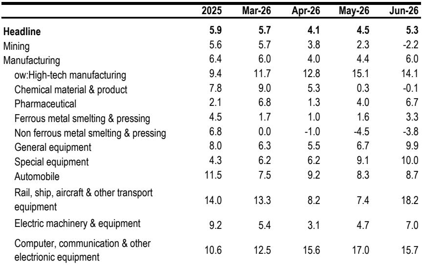
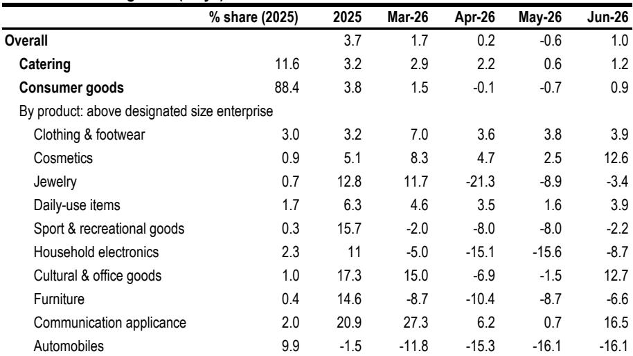
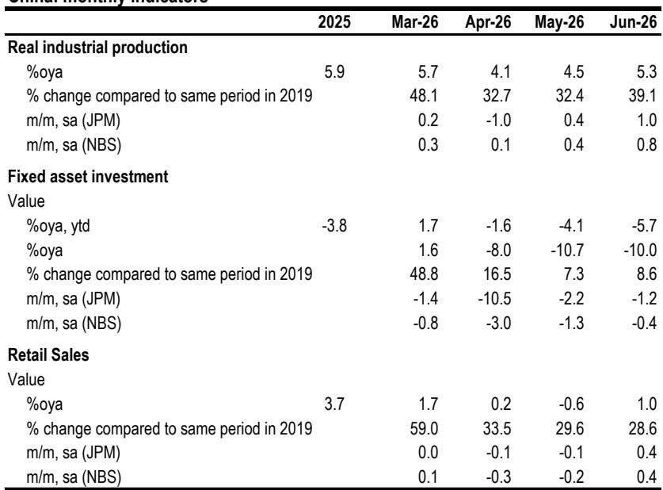

# JPM：中国增长企稳但动能减弱-二季度GDP降至4.3%

二季度GDP增速降至4.3%，但六月工业增加值反弹至5.3%，零售销售转正，固定资产研究却加速下滑至-10%。JPM这份研报的核心判断是：宏观环境正在企稳，但企稳的支撑面越来越窄——集中在出口、设备制造和高技术产业，而房地产、私人研究和家庭消费仍在影响国内吸收。报告将全年GDP预测从4.7%下调至4.6%，同时上调下半年环比增速，理由是财政可能加速落地。但这份上调本身也说明，增长缓冲垫很薄。

## 1. 生产端企稳，但集中在外部需求和政策支持的窄带

六月工业增加值同比5.3%，高于市场预期的4.6%，环比折年增速回升至12%左右。但拆开看，增长高度集中：装备制造业和高技术制造业分别增长9.3%和13.3%，而采矿、化工、有色等传统行业增速节奏变化甚至转负。集成电路产量增长18.8%，工业机器人28.1%，新能源汽车29.4%——这些产品都与全球AI周期、出口和产业升级直接相关。

报告指出，生产可能已经触底，但触底的范围有限。六月的PMI数据也支持这一判断：生产端企稳，但主要靠外需和设备更新驱动，而非内需全面回暖。

> **KC评论：** 生产企稳不等于宏观环境企稳。关键看库存：如果生产回升但终端需求没有跟上，库存就会累积，进而压利润、压价格。这份报告虽然没有直接说库存周期，但“生产韧性可能转化为库存和价格竞争”的判断，值得关注。

## 2. 研究是最大影响，房地产和私人研究未见底

六月固定资产研究同比-10.0%，比五月的-10.7%略有收窄，但仍处于深度调整区间。房地产研究累计同比-18.0%，制造业研究转负至-1.2%，基础设施研究也降至-2.4%。私人固定资产研究累计同比-8.5%，显示企业信心依然谨慎。

相对少见正增长的是知识产权产品研究（+9.4%）和高技术产业研究（+4.6%），但规模太小，不足以对冲房地产、传统制造和公共工程的影响。报告特别提到，基础设施研究中，水利和环境管理已经降至-6.5%，说明地方财政约束正在制约公共研究。

## 3. 消费改善但基础脆弱，汽车和住房相关品类持续仍在调整

六月零售销售同比1.0%，较五月的-0.6%有所改善，环比折年也回升至约5%。但改善幅度有限，且结构分化明显：餐饮、服装、化妆品等可选消费小幅增长，而汽车销售同比-16.1%，家电-8.7%，家具-6.6%。报告认为，以旧换新政策的边际效应正在递减，汽车和住房相关消费仍是主要影响。

居民储蓄率仍处于高位，消费者信心指数没有明显改善。报告指出，服务和线上渠道相对有韧性，但商品零售整体仍在调整，说明家庭需求尚未形成自发修复。

## 4. 贸易是缓冲器而非增长引擎，外部不确定性正在累积

六月货物贸易出口增长20.8%，进口增长29.4%，机电产品出口占上半年总出口的63.5%，与AI/电子周期一致。但报告明确说，贸易可以缓冲节奏变化，不能独自拉动增长。进口增速快于出口，说明部分出口依赖进口中间品，净出口对GDP的贡献可能有限。

外部不确定性正在增加：中东局势推升能源和航运成本，美国通过301/232条款重建关税壁垒，欧洲在电动车、电池、光伏和补贴领域施压。报告认为，即使九月特朗普与中方峰会能在战术上稳定关系，结构性争端不会解决。

## 5. 政策重心需要从供给侧转向吸收侧，但执行仍是关键

报告的核心政策建议是：财政必须从供给端转向吸收端。具体来说，需要加快财政存款下拨、前置专项债、扩大政策性银行和中央融资，把钱投到有真实需求、能提升生产率、有私人部门参与的项目上。货币政策可以边际宽松，但如果没有更强的信贷需求，降息更多是信号而非刺激。

七月政治局会议预计会强调加快财政部署、稳定就业和市场预期。但报告提醒，关键在于政策能否把可用的资金转化为实际活动，否则财政只会是缓冲器，而非转折点。7月13日发布的《扩大消费“十五五”规划》方向正确，但缺乏实施细节和明确的财政安排。报告担心，消费规划可能变成政府主导、供给导向、基础设施偏重的老路，难以真正激活家庭需求。

这份报告没有给出乐观的结论。它认为，下半年更可能的是“管理下的稳定”，而非决定性的反弹。外部需求和产业升级仍在做重活，而国内吸收太弱，无法支撑更广泛的复苏。对于关注宏观环境的读者来说，最值得跟踪的不是GDP数字本身，而是财政执行能否从“可用资金”变成“实际活动”——这是下半年增长路径的分水岭。

For informational purposes only. Portions may be generated,translated,summarized,or edited with AI assistance based on source materials and may contain omissions or errors. Please verify independently. This is not investment,legal,tax,accounting,or other professional advice.

For informational purposes only. Portions may be generated,translated,summarized,or edited with AI assistance based on source materials and may contain omissions or errors. Please verify independently. This is not investment,legal,tax,accounting,or other professional advice.

