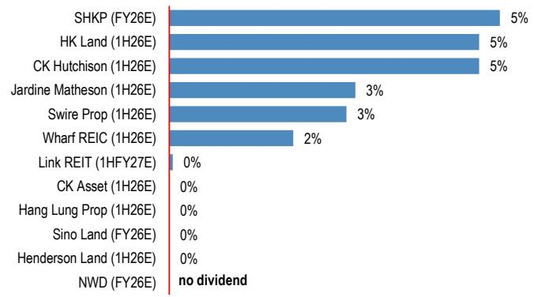
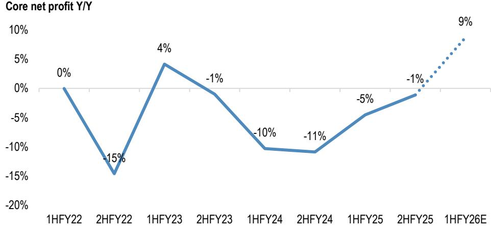
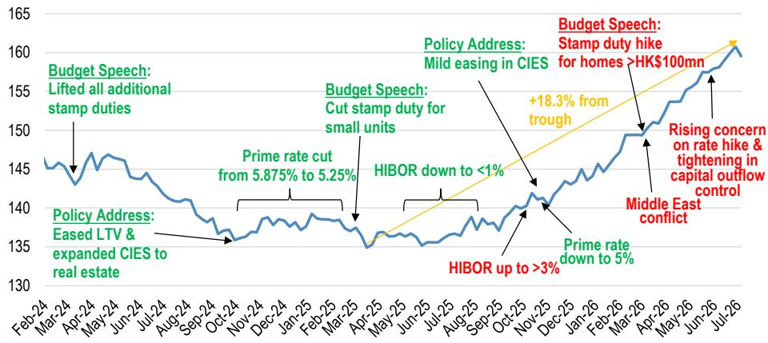
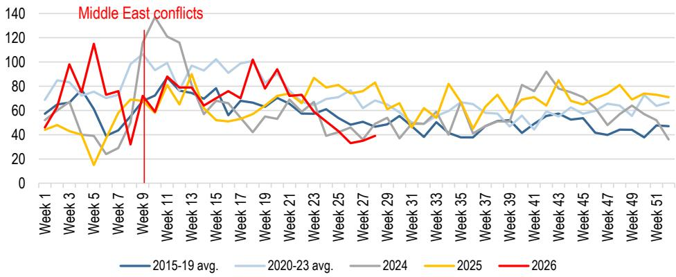
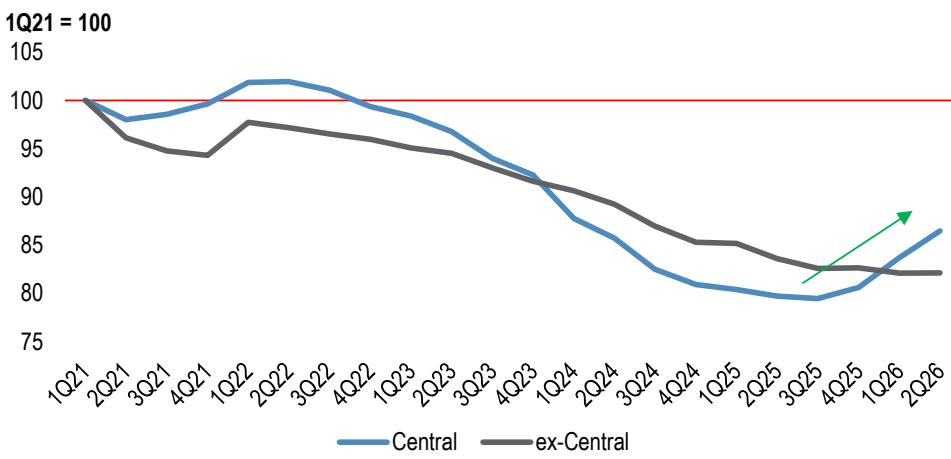
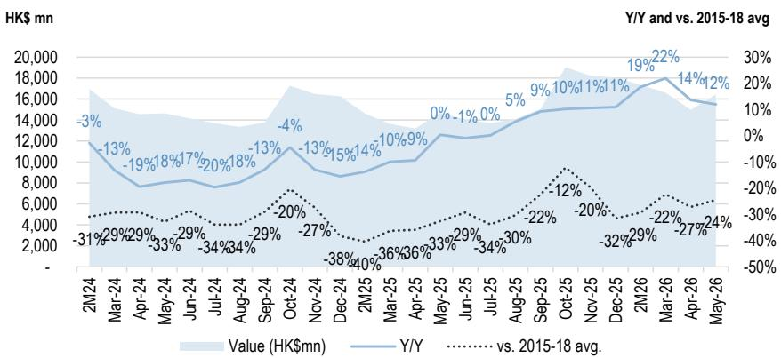
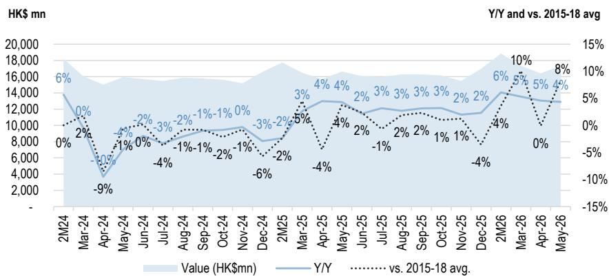
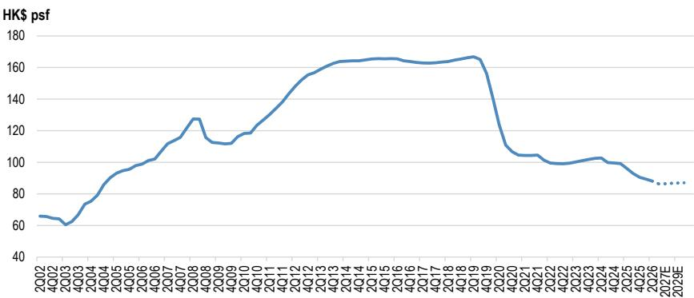
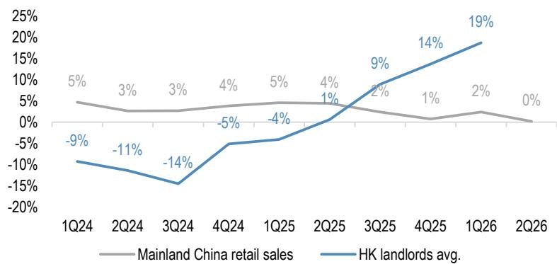
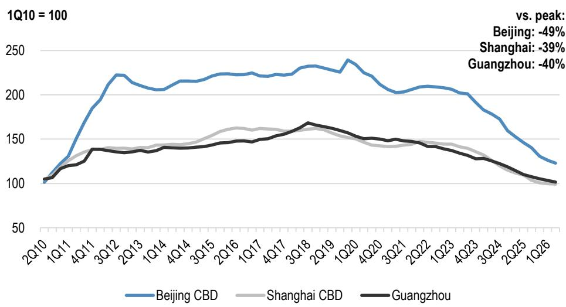

# Hong Kong Property & Conglomerates

Results preview: kickstarting the earnings upcycle

After a 2-3 year earnings downcycle, we believe the upcoming results (to be released from July to November; most are interim, but some are annual results) will kickstart a multi-year earnings upcycle (we forecast a 9% Y/Y earnings growth (Figure 3) and 2-3% Y/Y DPS growth), driven by improving HK DP margins (Table 10), partial stabilization in rental income (Figure 12) & lowering financing costs. In the near term, we expect the sector may continue to be heavily influenced by the interest rate narrative, which is rapidly shifting. In our stock-picking, we prefer companies with (1) lower sensitivity to rates; (2) earnings revival over the next 2-3 years; (3) proactive capital recycling; and (4) improvement in operating data of key sub-sector exposure (e.g. spot rent rebound in Central office; spot rent stabilization in HK retail). Since the overhang of capital outflow control may not be totally removed any time soon, we see higher certainty in landlords over developers in the near term. Top picks: Link REIT, HKL & Swire Prop among landlords; SHKP among developers; CK Hutchison & Jardine Matheson among conglomerates.

## Results preview

- Most companies will see earnings growth (Figure 1): Both CKH & CKA will likely see $>100\%$ Y/Y earnings growth due to the disposal gains of UKPN (which benefited both companies). Excluding disposal gains, we expect CKH to see $11\%$ Y/Y earnings growth (benefiting from elevated oil prices through Cenovus) while CKA will see a $6\%$ Y/Y decline due to the booking of low-margin DP projects in HK. We expect Henderson to see a strong $42\%$ Y/Y growth due to the booking of The Legacy ( $>50\%$ margin), while the $13\%$ Y/Y jump in Swire Prop's is also due to the booking of HK DP. We expect SHKP to register a $5\%$ Y/Y growth with upside risk if DP margin is better than expected, while JM should see a $3\%$ Y/Y growth despite a drag from Astra. For HKL ( $+10\%$ ), Wharf REIC ( $+2\%$ ) and Link REIT ( $+0\%$ ), the earnings improvement is mostly due to cost savings. For Hang Lung, while we expect core net profit to drop $2\%$ , this is mostly due to a drop in interest capitalization (non-cash); operating profit (which we expect a mild $2\%$ growth) is a better way to assess the company's well-being. We expect an $8\%$ Y/Y drop in Sino's earnings due to smaller DP booking and lower interest income. NWD will likely remain in a net loss, but the loss may narrow due to profit booking of high-margin HK DP projects (The Legacy & Pavilia Farm).

- Assessing dividend certainty (Figure 2): Apart from NWD (no dividend), we expect all companies to at least maintain a flat DPS. We forecast SHKP, HKL & CKH to deliver \~5% DPS growth, while JM, Swire Prop & Wharf REIC should see 2-3% growth. We see upside risk in CKH (as we expect EPS to grow >10% Y/Y, but historically DPS growth has not necessarily tracked the same as EPS growth) and SHKP (if earnings growth is >5%). We see downside risk to Wharf REIC if the increase in turnover rent is unable to offset the decline in base rent. CKA is another one with higher uncertainty, especially as a special dividend has been anticipated by some investors, but we don't have 100% conviction that CKA will declare one (based on track record). That said, in our base case, we pencil in a small special DPS to offset the decline in core DPS (thus we expect interim DPS to be flat Y/Y). The following companies should see high certainty in meeting our DPS forecast (likely at least flat): HKL, JM, Swire Prop, Hang Lung, Sino & Henderson. Finally, we expect Link REIT to see a flattish DPS due to cost savings (to be reported in November).

- Other non-results catalysts: For developers, we believe the following data may be stronger share price drivers: (1) home price momentum; (2) sell-through rates of primary launches; (3) overall sales volumes. For landlords, we believe monthly retail sales data & quarterly office rental data may also be important. Generally, capital recycling is also a key rerating factor. Within our coverage, companies active in recycling include HKL, Swire Prop, Link REIT, JM &CKH. To a lesser extent, CKA might also be considered one, although its asset disposals are relatively passive. Meanwhile, Wharf REIC's potential disposal of its Singapore assets might also be a positive catalyst if executed. Finally, Link REIT, HKL & JM have been active in buyback.

## Sub-sector outlook

Sub-sector preference: In 2H26, in terms of momentum (measured by growth in home prices/rents), our pecking order is HK office (Central only) > HK residential = Mainland China retail = HK discretionary retail > HK staples retail > HK office (ex-Central) > Mainland China office.

## In an upcycle:

- HK Office (Central only): Since the bottom in 3Q25, spot rents in Central have risen 9%, and due to improvement in vacancy rates (now down to 8.8%) & solid demand from the financial services sector (Figure 6), we expect spot office rents in Central to see another MSD% growth in 2H26 (after a 7-8% jump in 1H26). If the trajectory continues, rental reversion should turn stable in FY27. More discussion can be found in our earlier report on HK commercial property.

- HK Residential: Year-to-date, HK home prices have surged 11% (stronger than expected) (Figure 4), already reaching our target range of 10-15% for FY26. While we maintain our full-year forecast, this implies home price growth will slow to <5% in 2H26 as the housing market faces 3 major uncertainties (capital outflow control, rate hike concerns, and a challenging macro environment), although the last two have recently been eased. We believe the upcycle will continue but the momentum will slow after the strong FOMO sentiment in 1H26 fades. Structurally supportive factors (population inflows, optimal inventory) remain in place (more in our in-depth report). Recent secondary sales volume has slowed (Figure 5), but if the interest rate narrative turns less hawkish & the market recovery continues in HK, we see upside risk to the housing market. Sell-through rates of upcoming launches are key to watch, and the next one will be Garden Regency by SHKP this weekend (with >40x over-subscriptions, we expect a 95-100% sell-through rate).

- Mainland China Retail: Note that for this sub-segment, we only refer to mid/high-end retail in top-tier cities which most HK landlords are exposed to. We estimate HK landlords have achieved a 5-10% Y/Y tenant sales growth in 1H26, outperforming the broader market (+1% Y/Y)(Figure 10). We expect HK landlords to see low-single-digit % positive rental reversion among their malls in Mainland China in FY26.

- HK Discretionary Retail: Year-to-date, HK discretionary retail sales have risen 17% Y/Y, but are still 20-30% below 2015-18 levels (Figure 7). While negative rental reversion may continue for the next 1-2 years, we expect spot rents to see stable/low-single-digit % growth in FY26. That said, we note that the Y/Y growth in tourist arrivals has been moderating from $>10\%$ in 1Q to $<10\%$ over the past 2 months, and this may affect the growth momentum.

## Bottoming out:

- HK Staples Retail: Staples retail sales have risen 5% Y/Y year-to-date, and have already recovered to surpass the average 2015-18 level (Figure 8). Since last year, the sector has faced challenges from cross-border e-commerce like Pinduoduo, but the trend, albeit becoming structural, has stabilized. We believe spot rents should stabilize in 2026, and negative rental reversion may narrow to a MSD% in 2027.

## In a downcycle:

- HK Office (ex-Central): The HK office market is seeing a K-shaped recovery. While Central has been outperforming, districts outside of Central remain relatively quiet (particularly Kowloon East) due to high vacancy rates (mid-to-high teens %) (Figure 6). Spot rents (ex-Central) have mildly dropped 1% in 1H26, and we expect a continual low-single-digit % drop in 2H26, mostly dragged by Kowloon East.

- Mainland China Office: Year-to-date, office rents in tier-1 cities have dropped 4% (Figure 11). With no improvement in vacancy rates (15-20%), we expect another mid-single-digit % drop in 2H26. Fortunately, HK landlords are not heavily exposed to this sub-segment (\~5% of NAV), but with >10% negative rental reversion, this segment will continue to be a drag to HK landlords' rental income.

Equity Ratings and Price Targets

<table><tr><td rowspan="2">Company</td><td rowspan="2">Ticker</td><td rowspan="2">Mkt Cap ($ mn)</td><td rowspan="2">Price CCY</td><td rowspan="2">Price</td><td colspan="2">Rating</td><td colspan="4">Price Target</td></tr><tr><td>Cur</td><td>Prev</td><td colspan="2">Cur End Date</td><td>Prev</td><td>End Date</td></tr><tr><td>CK Asset Holdings Ltd (1113)</td><td>1113 HK</td><td>21,049</td><td>HKD</td><td>47.14</td><td>OW</td><td>n/c</td><td>52.00</td><td>Jun-27</td><td>n/c</td><td>Dec-26</td></tr><tr><td>Henderson Land Development (0012)</td><td>12 HK</td><td>16,616</td><td>HKD</td><td>26.90</td><td>N</td><td>n/c</td><td>27.00</td><td>Jun-27</td><td>n/c</td><td>Dec-26</td></tr><tr><td>New World Development (0017)</td><td>17 HK</td><td>2,129</td><td>HKD</td><td>6.63</td><td>N</td><td>n/c</td><td>6.80</td><td>Jun-27</td><td>n/c</td><td>Dec-26</td></tr><tr><td>Sino Land (0083)</td><td>83 HK</td><td>13,026</td><td>HKD</td><td>10.65</td><td>OW</td><td>n/c</td><td>12.50</td><td>Jun-27</td><td>n/c</td><td>Dec-26</td></tr><tr><td>Sun Hung Kai Properties (0016)</td><td>16 HK</td><td>45,217</td><td>HKD</td><td>122.30</td><td>OW</td><td>n/c</td><td>140.00</td><td>Jun-27</td><td>n/c</td><td>Dec-26</td></tr><tr><td>Hang Lung Properties (0101)</td><td>101 HK</td><td>4,899</td><td>HKD</td><td>7.38</td><td>OW</td><td>n/c</td><td>12.00</td><td>Jun-27</td><td>n/c</td><td>Dec-26</td></tr><tr><td>Hongkong Land</td><td>HKL SP</td><td>15,802</td><td>USD</td><td>7.40</td><td>OW</td><td>n/c</td><td>10.70</td><td>Jun-27</td><td>n/c</td><td>Dec-26</td></tr><tr><td>Swire Properties (1972)</td><td>1972 HK</td><td>15,955</td><td>HKD</td><td>21.72</td><td>OW</td><td>n/c</td><td>30.00</td><td>Jun-27</td><td>n/c</td><td>Dec-26</td></tr><tr><td>CK Hutchison Holdings (0001)</td><td>1 HK</td><td>35,013</td><td>HKD</td><td>71.65</td><td>OW</td><td>n/c</td><td>79.00</td><td>Jun-27</td><td>n/c</td><td>n/c</td></tr><tr><td>Jardine Matheson</td><td>JM SP</td><td>18,117</td><td>USD</td><td>61.59</td><td>OW</td><td>n/c</td><td>94.00</td><td>Jun-27</td><td>n/c</td><td>Dec-26</td></tr></table>

Source: Company data, Bloomberg Finance L.P., JPM estimates. n/c = no change. All prices as of 15 Jul 26.

## 1HFY26 / FY26 / 1HFY27 results preview

## Figure 1: 1H26E / FY26E / 1HFY27E core net profit Y/Y growth

<table><tr><td></td><td>net loss</td></tr><tr><td>CK Hutchison (1H26E) (incl. disposal gain)</td><td>139%</td></tr><tr><td>CK Asset (1H26E) (incl. disposal gain)</td><td>117%</td></tr><tr><td>Henderson Land (1H26E)</td><td>42%</td></tr><tr><td>Swire Prop (1H26E)</td><td>13%</td></tr><tr><td>CK Hutchison (1H26E)</td><td>11%</td></tr><tr><td>HK Land (1H26E)</td><td>10%</td></tr><tr><td>SHKP (FY26E)</td><td>5%</td></tr><tr><td>Jardine Matheson (1H26E)</td><td>3%</td></tr><tr><td>Hang Lung Prop (1H26E) (operating profit)</td><td>2%</td></tr><tr><td>Wharf REIC (1H26E)</td><td>2%</td></tr><tr><td>Link REIT (1HFY27E)</td><td>0%</td></tr><tr><td>Hang Lung Prop (1H26E)</td><td>-2%</td></tr><tr><td>CK Asset (1H26E)</td><td>-6%</td></tr><tr><td>Sino Land (FY26E)</td><td>-8%</td></tr><tr><td>Swire Prop (1H26E) (incl. disposal gain)</td><td>-13%</td></tr><tr><td>NWD (FY26E)</td><td></td></tr></table>

Note: JM's figure has excluded the non-trading items (HKL's DP segment, disposals of businesses at DFI Retail and JC&C, and shift in accounting treatment of Zhongsheng).
Source: Company data, JPM estimates.  
Figure 2: 1H26E / FY26E / 1HFY27E DPS Y/Y growth

  
Source: Company data, JPM estimates.

Core net profit Y/Y

Figure 3: Semi-annual core net profit Y/Y growth  
  
Source: JPM estimates, Company data.
Note: including companies reporting 1H26 results only

# Results preview / what to watch out for

## 1H26 results

## CK Asset (1113.HK) - Overweight

- Strong headline earnings growth due to disposals: Including disposal gains from UKPN (HK\$8.4bn) and UK Rail (HK\$0.8bn), we forecast a 117% Y/Y growth in headline net profit (HK\$14.8bn).

- Core net profit growth may, however, remain soft: Excluding disposal gains from UKPN (but including UK Rail), we forecast a 6% Y/Y decline in core net profit to HK\$6.4bn, due to (1) lower profit contribution from HK DP booking (Blue Coast will be booked in 1H26, but we estimate a very low profit contribution due to low margin); (2) smaller DP delivery in Mainland China; (3) decline in rental income (-2%); (4) lower contribution from infrastructure projects due to disposals.

- Special dividend, if any, will be small: While we forecast interim DPS (excluding special DPS, if any) to drop 6% Y/Y due to lower core net profit, we believe it is possible for CKA to declare a special dividend (due to the earlier disposal gains), which may be distributed in either 1H26 or FY26. However, since we believe CKA's priority is to recoup cash in the near term, we expect the special dividend to be minimal, and may be used as a "balancing figure" to keep interim DPS flat by offsetting the decline in core DPS.

- Watch out for: (1) any potential special dividend from disposal gains; (2) pricing strategy for upcoming HK residential launches (e.g. Victoria Blossom); (3) capital allocation priorities (especially CKA has likely turned net cash as of end-June 2026 due to disposal proceeds); (4) leasing updates for CKC II; (5) asset disposals.

## Henderson Land (12.HK) - Neutral

- Strong earnings growth from a low base: We expect core net profit to surge 46% Y/Y to HK\$4.3bn, due to (1) a low base in 1H25 (core net profit fell 44% Y/Y in 1H25 due to a lack of one-off items); (2) higher DP profit contribution from the booking of The Legacy (we estimate a >50% margin & EBIT contribution of HK\$1-2 billion in 1H26), partly offset by projects with lower margin (e.g. Eight Southpark). We expect rental income to remain broadly stable, as the incremental contribution from The Henderson should offset the negative rental reversions in existing properties. We expect a flat interim DPS of HK\$0.5.

- Farmland resumption may accelerate in 2H26: Based on the latest progress, we do not expect any profit contribution from farmland resumption in 1H26. That said, as the government is scheduled to resume farmland in San Tin and Hung Shui Kiu in September, we expect Henderson to benefit from this, and there could be profit contribution from farmland resumption in 2H26.

- Watch out for: (1) guidance on progress of farmland resumption; (2) latest DP sales and pricing strategy; (3) latest status of shareholders' loans & progress in deleveraging; (4) leasing updates of Central Yards; (5) appetite for fund raising (e.g. CB).

## Swire Properties (1972.HK) - Overweight

- Higher DP profit contribution to offset the mild decline in IP profit: We forecast a 13% Y/Y growth in core net profit to HK\$3.9bn (but -13% Y/Y if considering the disposal gains from Miami assets in 1H25). For DP EBIT, we estimate a 68% Y/Y jump to HK\$860mn from the booking of two ultra-luxury houses at 6 Deep Water Bay Road. For rental EBIT, we estimate a mild 3% Y/Y decline due to the loss of contribution of Miami (disposed). Excluding Miami, we expect flattish IP profit, with negative rental reversion in the HK office portfolio (JPMe: -7% Y/Y), partly offset by higher contribution from Mainland China retail (+10%) and HK retail (+2%).

- High DPS visibility: We expect a $3\%$ Y/Y growth in interim DPS (same as 1H25), while for FY25, we expect a $5\%$ Y/Y growth as per the company's dividend policy.

- Watch out for: (1) Mainland China tenant sales performance; (2) rental reversion in HK office & leasing updates in Taikoo Place; (3) further plans for capital recycling; (4) any changes in financial management after new CFO onboards.

## Wharf REIC (1997.HK) - Neutral

- Mild earnings growth from lower finance costs: We expect a 2% Y/Y growth in the bottom line and DPS (based on 65% payout from underlying earnings in HK IP & hotel). We expect lower rental income (JPMe: -2% Y/Y) due to negative rental reversion in both retail and office, but offset by lower finance costs (due to smaller net debt & lower HIBOR).

- Potential sale of Singapore assets: According to Bloomberg (link), Wharf REIC is exploring the sale of Wheelock Place and Scotts Square in Singapore at above book value (HK\$7.7bn, or 3.6% of its total IP book value). The two assets are valued at cap rates of 4.4% for retail and 3.8% for office (on NOI basis), and account for 5% of FY25 revenue, or 3% of operating profit. If Wharf REIC is able to dispose of the assets at a premium to book value, this will be positive for the company, and we expect the potential proceeds will be used to reduce net debt and fund the AEI (or redevelopment) of Marco Polo Hotel.

- Watch out for: (1) latest HK tenant sales performance; (2) guidance on rental reversion and finance cost; (3) update on Marco Polo AEI/redevelopment; (4) potential asset disposal of Wheelock Place and Scotts Square in Singapore.

## Hongkong Land (HKL SP) - Overweight

- Lower interest expenses to offset negative rental reversion: Since FY25, HKL has changed the definition of "underlying earnings" by excluding the DP segment (as it becomes a non-strategic business). Under the new definition, we expect 1H26 core net profit to grow 10% Y/Y due to lower interest expenses, partly offset by a lower rental income in HK office (more in "Takeaways from company call - HK office rental reversion may turn neutral in 2027").

- Honoring the MSD% dividend growth commitment: As HKL plans to rebalance the interim/final DPS split (with a MSD% Y/Y growth in annual DPS commitment), we expect interim DPS to grow 5% Y/Y to US\$0.063.

- Watch out for: (1) plans for capital recycling; (2) potential asset acquisitions (e.g. Marina One in Singapore); (3) latest office and retail rental reversion guidance; (4) strategies to expand private REITs; (5) updates on investments in Suntec REIT.

## Hang Lung Properties (101.HK) - Overweight

- Focus on operating profit: At the operating profit level, we expect a 2% Y/Y growth due to higher turnover rent in Mainland China retail, partly offset by lower rental income from HK IP due to negative rental reversion. However, at the net profit level, we expect a 2% Y/Y decline due to a lower interest capitalisation ratio alongside completions of Westlake 66. As this is non-cash in nature, we believe operating profit is a better way to assess HLP's true earnings quality.

- Scrip dividend may ease: We expect interim DPS to stay flat Y/Y, while the scrip dividend arrangement is likely to cease (as management has guided that this is not intended to be a long-term policy, and we believe capex has peaked with the completion of Westlake 66).

- Watch out for: (1) latest Mainland China tenant sales performance and outlook; (2) rental reversion guidance; (3) arrangement for scrip dividend; (4) progress in CEO search; (5) strategies on Westlake 66; (6) updates on asset-light strategies.

## CK Hutchison (1.HK) - Overweight

- Organic growth in underlying businesses: Excluding the disposal gain of UKPN (HK\$14.5bn), we forecast 11% Y/Y growth in underlying profit to HK\$12.6bn, due to (1) stable growth in most core businesses (we forecast a 2% Y/Y growth in ports due to higher storage income, and a 5% growth in retail due to growth in Europe); (2) higher contribution from Cenovus Energy due to higher oil prices, partly offset by lower contribution from telecom & infrastructure (due to disposal of UKPN and UK Rail; on a like-for-like basis, we expect the infrastructure segment to see a mild Y/Y growth). We forecast a lower 5% Y/Y growth in DPS to HK\$0.75, as historically CKH's EPS & DPS growth have not necessarily been exactly the same. Given CKH's prudent approach, we think DPS growth may be slower than EPS growth.

- Disposal gains are likely to be excluded from underlying profit: Including the disposal gain from UKPN, we forecast a 139% Y/Y growth in bottom line to HK \$27bn. That said, we expect this to be excluded from the company's definition of underlying profit for dividend payments.

- Watch out for: (1) updates on ports disposal; (2) potential sale or listing of telecom business (ex-UK); (3) potential listing of AS Watsons; (4) potential disposal of Marionnaud; (5) guidance on special dividend.

## Jardine Matheson (JM SP) - Overweight

- We forecast a 3% Y/Y growth in core net profit: driven by (1) growth in DFI Retail, HKL (JPMe: +10% Y/Y) and Jardine Pacific; (2) lower finance costs, partly offset by a decline in Astra's contribution.

- 5% growth commitment in full-year DPS: While JM has committed to a 5% Y/Y growth in the full-year dividend (more in "Revealing the 2030 playbook"), we expect interim DPS to grow 3% Y/Y (in line with the EPS growth), and the company will honor the 5% Y/Y growth in final DPS.

- Watch out for: (1) full-year earnings and dividend outlook; (2) capital allocation and recycling strategy; (3) strategy for Indonesia; (4) updates on I-Med.

## FY26 results

## Sun Hung Kai Properties (16.HK) - Overweight

- Earnings and DP margin have bottomed out: We expect FY26 earnings to grow 5% Y/Y to HK\$23 billion, due to more DP completions (we estimate both Cullinan Sky Ph2 and Cullinan Harbour to contribute \~HK\$1.2-1.3bn of EBIT with a 20-30% margin), partly offset by lower margins in 1HFY26 DP bookings (8% EBIT margin due to bookings of Cullinan Sky Ph1 and Sierra Sea Ph1, which contain zero/very thin margin). Breaking it down into semi-annual, we expect HK DP margin to recover to the teens % level in 2HFY26. However, in 2H26, earnings growth will be partially offset by lower booking contribution from Mainland China (which fetches high margins).

- DPS to revive growth: With a 5% Y/Y growth in FY26E EPS, we expect SHKP to maintain a 50% payout ratio (the upper end of the guided 40-50% payout ratio), and thus DPS will grow 5% Y/Y to HK\$3.95.

- Watch out for: (1) any change in dividend policy; (2) upcoming DP launch pipeline, pricing strategy & margin guidance; (3) outlook for HK residential market; (4) leasing progress for IGC in Hong Kong / ITC in Shanghai.

## Sino Land (83.HK) - Overweight

- Lumpy earnings as expected: We forecast an 8% Y/Y decline in FY26 core net profit to HK\$4.7bn, due to (1) lower rental and hotel income; (2) lower interest income, partly offset by a higher DP profit contribution from the booking of the St. George's Mansions. Looking ahead, we expect profit to continue to see Y/Y decline in FY27E due to lower DP profit recognition. That said, we believe this should be anticipated by the market given the company has been operating on a thin land bank over the past few years.

- DPS to remain stable: While the payout ratio will exceed 100% (JPMe: 114%), we expect DPS to stay flat at HK\$0.58 due to its net cash position and solid track record.

- Watch out for: (1) pricing strategy and margin for the upcoming DP pipeline; (2) capital allocation plan (e.g. land-banking strategy).

## New World Development (17.HK) - Neutral

- Net loss may be a non-event: We expect a reported net loss of HK\$3.9bn due to (1) impairment, (2) high interest expenses and (3) distribution to perpetuals (although the distribution is delayed, this remains a financial obligation that needs to be recognized in the P&L due to accounting treatment). We also expect no dividend. As NWD has remained loss making since FY23, we expect this to be a non-event.

- Underlying net loss to narrow: We expect the underlying net loss to narrow from HK\$2bn to HK\$1.4bn, due to higher HK DP profit contribution from Pavilia Farm III (we estimate an EBIT contribution of HK\$1.5bn) and The Legacy (JPMe JV profit: \~HK\$1bn), and lower finance costs amid a lower HIBOR. A key downside risk is further impairments on 11 SKIES.

- Watch out for: (1) balance sheet metrics and deleveraging progress; (2) asset disposal plans (e.g. Mainland China IP); (3) guidance on potential rights issuance/financial support from controlling family; (4) latest update on 11 SKIES.

## 1HFY27 results

## Link REIT (823.HK) - Overweight

- Flat DPU: We forecast a 3% Y/Y decline in NPI due to negative rental reversion in HK retail portfolio, but the decline will be offset by lower G&A, lower financing costs & reduction in unit count due to buyback. Overall, we expect interim DPU to stay flat Y/Y at HK\$1.27.

- Expect positive tenant sales print in 1QFY27: With HK staples retail continuing to stabilize, we expect a positive tenant sales performance in 1QFY27 (Apr - Jun 2026), where the next update by the company will be published in August.

- Watch out for: (1) HK tenant sales performance and rental reversion guidance; (2) potential disposal (e.g. 100 Market Street in Sydney); (3) strategy by new CEO; (4) buyback strategy.

## HK Residential

Figure 4: Hong Kong secondary home price index (and major events)  
  
Source: Centraline

Figure 5: Hong Kong weekly secondary transactions in 35 major estates  
  
Source: Midland.

## HK Office

Figure 6: HK Grade-A office rental index (1Q21 = 100)  
  
Source: JLL

## HK Retail

Figure 7: Hong Kong monthly retail sales – discretionary  
  
Source: Hong Kong Census & Statistics Department.  
Note: Including: (1) clothing, footwear & allied products; (2) jewelry, watches, clocks & valuable goods; (3) department stores; and (4) consumer durable goods.  
We combined Jan & Feb data into 2M data to eliminate the CNY seasonality.

Figure 8: Hong Kong monthly retail sales – staples  
  
Source: Hong Kong Census & Statistics Department.  
Note: Including: (1) food, alcoholic drinks & tobacco; (2) supermarkets; (3) fuel; and (4) other consumer goods (e.g., medicines, optical shops).  
We combined Jan & Feb data into 2M data to eliminate the CNY seasonality.

Figure 9: HK overall prime retail net effective rent  
  
Source: JLL

## Mainland China Retail

Figure 10: HK landlords' Mainland China tenant sales Y/Y growth vs. Mainland China retail sales  
  
Source: Company data., NBS

## Mainland China Office

Figure 11: Mainland China office rents  
  
Source: JLL

## Results Announcement Dates

Table 1: HK Property & Conglomerates - expected results announcement dates

<table><tr><td rowspan="2" colspan="2">Company Name</td><td rowspan="2">Category</td><td rowspan="2">Ticker</td><td rowspan="2">Interim / Final</td><td colspan="3">Results announcement</td></tr><tr><td>Date</td><td></td><td>Time</td></tr><tr><td>HK Land</td><td>香港置地</td><td>Landlord</td><td>HKL SP</td><td>Interim</td><td>28-Jul-26</td><td>Tuesday</td><td>After market</td></tr><tr><td>Jardine Matheson</td><td>怡和</td><td>Conglomerate</td><td>JM SP</td><td>Interim</td><td>30-Jul-26</td><td>Thursday</td><td>After market</td></tr><tr><td>Hang Lung Prop</td><td>恒隆地產</td><td>Landlord</td><td>101 HK</td><td>Final</td><td>31-Jul-26</td><td>Friday</td><td>Noon</td></tr><tr><td>Swire Properties</td><td>太古地產</td><td>Landlord</td><td>1972 HK</td><td>Interim</td><td>6-Aug-26</td><td>Thursday</td><td>Noon</td></tr><tr><td>Swire Pacific</td><td>太古股份A</td><td>Conglomerate</td><td>19 HK</td><td>Interim</td><td>6-Aug-26</td><td>Thursday</td><td>Noon</td></tr><tr><td>Hysan
