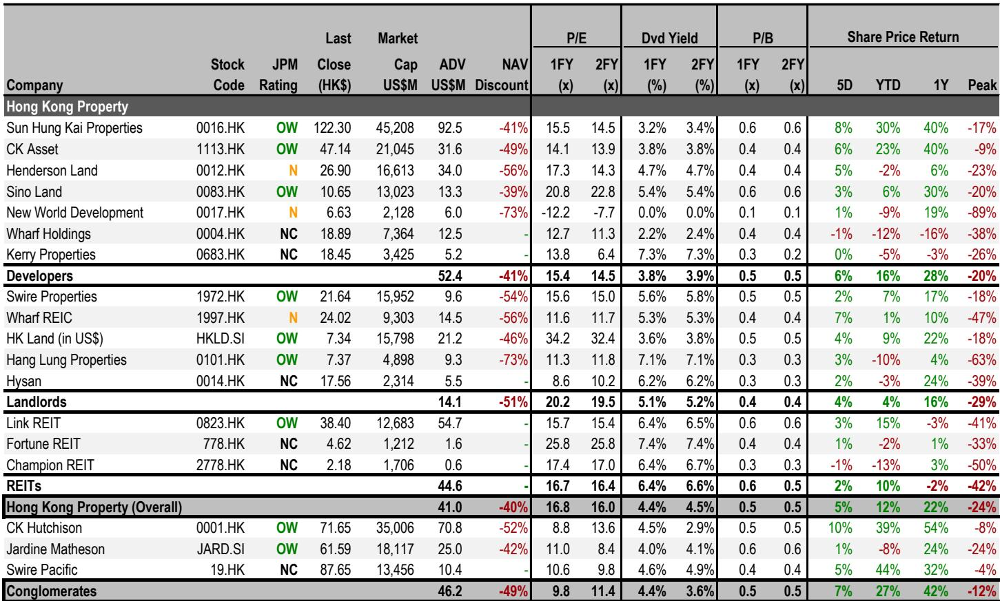
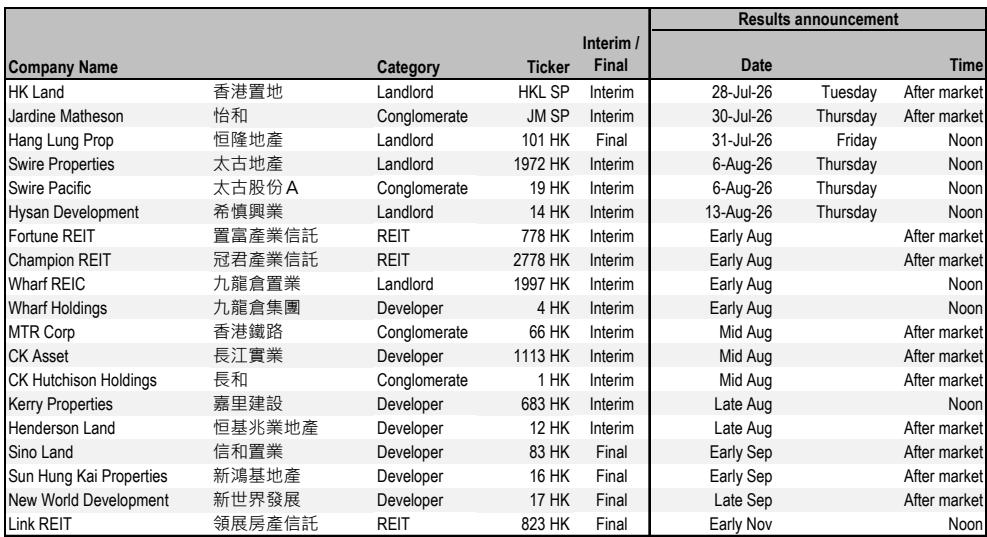
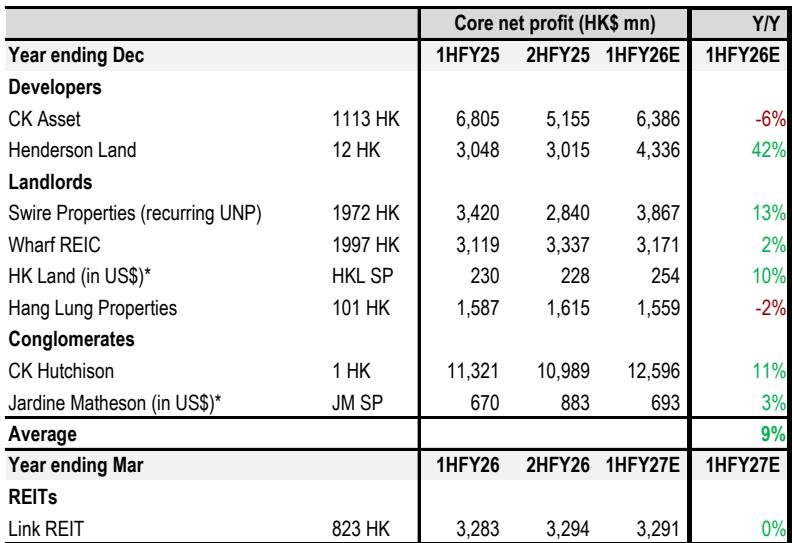

# 香港地产板块盈利周期观察：分化中的结构性机会

经历过去两至三年的盈利调整后，香港地产及综合企业板块即将迎来中期及年度业绩发布期（7月至11月），这或标志着多年度盈利修复周期的开启。据测算，该板块核心净利润预计同比增长9%，每股股息增长2-3%。这并非全面反弹，而是一个由三大因素驱动的选择性周期：香港开发利润率改善、租金收入局部企稳、融资成本下降。那些兼具较低利率敏感度、可见盈利复苏轨迹、主动资本循环以及关键子板块经营数据改善的公司，将更受关注。短期内，利率叙事仍是主导波动因素。在资本流动管控持续的环境下，收租类公司相比开发商具有更高确定性。对观察者而言，关键问题并非周期是否真实，而是哪些子板块和公司能够把握这一趋势。

数据已显示转折信号。板块半年度核心净利润增长率在连续五个半年度为负或持平后，预计将转为明确正值。以长和为例，剔除英国电网出售收益后，受其持有的Cenovus股权相关油价上涨推动，预计盈利增长11%。恒基兆业地产预计因“The Legacy”项目入账（利润率超50%）而录得42%的显著增长。即使是纯收租类公司如香港置地，也应实现10%的增长，几乎全部来自利息支出减少。这些并非孤立事件，而是反映了板块成本与收入动态的结构性转变。

然而，市场尚未完全定价这一拐点。板块仍受快速变化的利率叙事影响，导致基础盈利动能与报价表现之间存在脱节。等待周期完全确认的观察者，可能会错过最具吸引力的入场时机。证据已存在于当前的经营数据、利润率轨迹以及管理层正在做出的资产负债表决策中。

## 盈利拐点真实存在，但公司间分化明显

即将到来的业绩期最重要的洞察在于盈利质量的差异。那些表面增长强劲的公司可能掩盖了潜在疲软，而另一些数据温和的公司则在构建可持续动能。

长和与长实集团均显示超过100%的表面盈利增长，但这完全归因于英国电网出售收益。剔除该因素后，长和的核心增长为11%，而长实集团的核心盈利实际下降6%。这一区别至关重要。长和的增长由来自Cenovus的经常性、大宗商品相关收益驱动。长实集团的下降则反映了低利润率的香港开发利润以及因出售导致的租金和基建贡献缩减。市场将认可前者，而对后者持保留态度。

在开发商中，恒基兆业地产42%的增长是真实的，但基于极低基数。其上一对应期间核心净利润下降了44%。问题在于这是否是一次性的追赶，还是持续趋势的开端。答案取决于政府在9月推进的新田和洪水桥农地收回进展。若恒基能从中入账利润，盈利轨迹将超越单一项目；否则，盈利提升将是暂时的。

旗舰开发商新鸿基地产预计仅实现5%的增长，但报告指出若开发利润率好于预期，则存在上行风险。新地旗下“Garden Regency”项目已录得超过40倍超额认购，预计去化率达95-100%。这一数据不容忽视，表明一手市场需求依然强劲，且新地的定价策略行之有效。5%的预测可能偏保守。

对于收租类公司，故事更为平静但更具持久性。香港置地、九龙仓置业和领展房产基金均预计实现0-10%的盈利增长，几乎完全由成本节约和财务费用降低驱动，而非租金收入扩张。这并非弱点，而是多年复苏的基础。随着利率进一步下降及租金回稳，这些公司将迎来经营杠杆效应，盈利增长将从这一低基数加速。

## 股息确定性成为读者信心的新战场

在盈利波动较大的板块中，股息政策已成为管理层信心和财务纪律的主要信号。即将到来的业绩期将清晰划分出能够维持或增加股息的公司与无法做到的公司。

新世界发展预计仍将处于净亏损状态且不派发股息，这是最明确的信号。但即使在盈利公司中，股息轨迹也差异显著。新鸿基地产、香港置地和长和预计实现约5%的每股股息增长。怡和集团、太古地产和九龙仓置业应实现2-3%的增长。领展预计保持每股股息持平，依靠成本节约抵消停滞的盈利。

下行风险集中。九龙仓置业面临结构性挑战：若其零售组合的营业额租金增长无法弥补基础租金下降，每股股息可能下滑。长实集团的不确定性最高。部分读者预期其会从英国电网出售收益中派发特别股息，但公司过往记录表明其更倾向于保留现金。报告假设派发小额特别股息以保持中期每股股息持平，但这仅是基准情形，并非确定。

对观察者而言，关键在于识别那些股息增长有经常性收益支撑、而非一次性收益的公司。香港置地承诺实现中个位数年度每股股息增长，并在充满挑战的租赁环境中兑现承诺，这既是财务实力的信号，也是管理纪律的体现。太古地产有明确的与盈利挂钩的股息政策，其中期3%的每股股息增长由其开发利润贡献带来的13%盈利增长所支撑。

股息确定性最高的公司——香港置地、怡和集团、太古地产、恒隆地产、信和置业和恒基兆业地产——共享一个特征：其股息由经常性收入流或时机得当的开发利润覆盖，而非资产出售或财务工程。

## 香港写字楼市场的K型复苏需要子板块策略

报告中最重要的结构性洞察是香港写字楼市场的K型复苏。中环写字楼处于上升周期，而其他区域则处于下行周期。

自2025年第三季度触底以来，中环写字楼即期租金已上涨9%。空置率降至8.8%，金融服务业需求保持稳健。报告预计，在2026年上半年跃升7-8%之后，下半年租金将再实现中个位数百分比增长。若这一趋势持续，租金调整（新租约与到期租约之间的差额）应在2027财年趋于稳定。

中环以外区域，情况则较为严峻。尤其是九龙东，空置率处于15-20%的高位。中环以外区域的即期租金在2026年上半年下降1%，预计下半年将进一步下降低个位数百分比。这并非暂时性分化，而是反映了租户偏好向优质、交通便利地段的结构性转变，远离次级区域。

对观察者而言，这意味着写字楼敞口并非单一押注。香港置地凭借其集中的中环组合，处于上升周期有利位置。而大量涉足九龙东或其他非中环区域的公司将继续面临挑战。报告未具体指出哪些收租类公司敞口最大，但隐含信息明确：写字楼内部的子板块选择，与是否投资写字楼本身同等重要。

## 应对周期的决策框架

报告为结构化决策框架提供了原始数据。观察者应从四个维度评估每家公司，按当前环境下的重要性排序。

第一，利率敏感度。净债务和浮动利率敞口较低的公司将从利率下降中受益更多。香港置地和领展已从财务费用降低中看到盈利改善，在此指标上得分最高。高杠杆开发商如新世界发展则仍较脆弱。

第二，未来两至三年的盈利复苏轨迹。拥有明确高利润率开发项目储备的公司，如恒基兆业地产和太古地产，提供最可见的盈利增长。租金收入趋于稳定的收租类公司，如香港置地和九龙仓置业，则提供较低但更可持续的增长。

第三，主动资本循环。积极出售非核心资产并回购股份的公司，正对其自身估值释放信心信号。香港置地、太古地产、领展、怡和集团和长和最为活跃。长实集团则相对不积极，九龙仓置业潜在的新加坡资产出售是一个催化剂，但尚未执行。

第四，关键子板块敞口的经营数据改善。中环写字楼租金动能有利于香港置地。香港住宅价格动能（年初至今上涨11%）有利于新鸿基地产和恒基兆业。香港收租类公司在内地的零售租户销售增长5-10%，支撑太古地产和恒隆地产。

应用这一框架，优选标的自然浮现：收租类公司中的领展、香港置地和太古地产；开发商中的新鸿基地产；综合企业中的长和与怡和集团。这些并非相对少见能从周期中受益的公司，但它们是盈利改善、股息确定性和子板块顺风证据最为一致的公司。

*仅供参考。部分内容可能基于源材料通过AI辅助生成、翻译、总结或编辑，可能存在遗漏或错误。请独立核实。本文不构成专业建议。*
