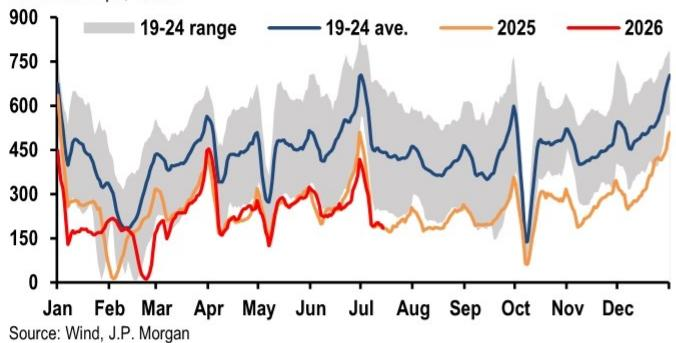
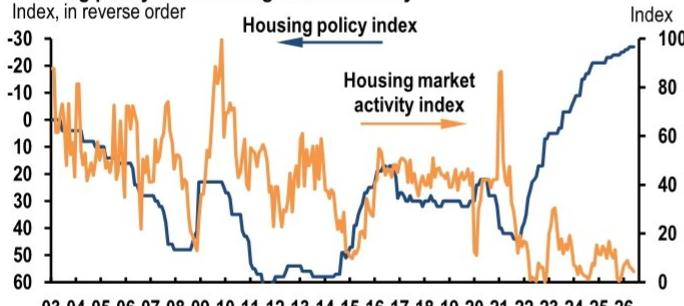
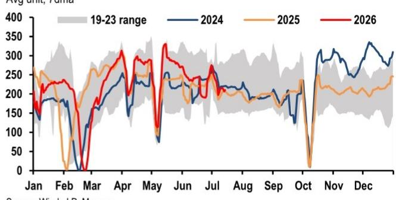

# 研究笔记：中国住房市场观察——住房在消费规划中的角色定位

中国房地产市场的政策定位正在发生一次被多数讨论低估的转变。近期发布的相关消费规划将住房明确归类为“消费促进载体”，与汽车、家电并列在居民消费篮子中。这不是一次简单的政策重申，而意味着住房从增长引擎到消费平台的职能切换——开发商不再被期待拉动增长，而是被要求提供更安全、更绿色、更智能的“好房子”，并围绕存量住宅延伸出装修、家居、物业、社区服务等消费链条。

但政策意图与市场现实之间存在明显张力。相关住房活动指数在6月继续调整，开工、竣工、销售和开发商资金来源四大指标的变动幅度同步加深。其中住宅新开工面积同比下降26.6%，较5月的22.9%进一步出现变化；商品房销售面积同比下降15.3%，降幅也较5月的12.4%扩大。价格端同样没有给出乐观信号：70城新房价格环比跌幅从5月的0.20%收窄至0.15%，但二手房价格跌幅从0.26%扩大至0.32%。一线城市新房和二手房价格涨幅均较5月节奏变化0.1个百分点，此前被视为积极信号的复苏势头正在减弱。

## 1. 政策框架已从“扩张供给”转向“提升品质”，但量价调整仍在深化

相关规划中关于住房的表述，最值得关注的变化是“满足住房需求”被拆解为三个具体方向：保障性住房、改善性需求供给、以及更成熟的租赁市场。报告认为，这标志着政策重心从“让更多人买房”转向“让住房更好地服务于消费升级”。住房被纳入“住房质量提升计划”，核心指标不再是开工面积或销售规模，而是建筑安全、绿色标准、智能化水平和适老化改造。物业管理首次被明确列为消费细分领域，要求提升服务品质并拓展社区服务。

然而，政策转向的速度远快于市场出清的速度。数据显示，新房价格较2021年峰值已累计下跌13.9%，二手房价格累计下跌22.8%。相关销售经理信心指数在7月初短暂回升后再度回落，二手房挂牌价指数则持续节奏变化。报告判断，一季度出现的积极修复空间已经非常有限。

> **研究评论：** 政策文本的转变是真实的，但市场参与者需要区分“政策意图”和“政策效果”。相关规划把住房定位为消费平台，意味着未来政策工具会更倾向于降低购房门槛、支持换房需求、发展租赁，而不是通过大规模投资拉动新开工。这对开发商的商业模式意味着根本性挑战——过去依赖高周转、高杠杆的扩张逻辑，与“好房子”导向下的品质竞争和存量服务，是两种完全不同的能力要求。

## 2. 一线城市复苏呈现“K型”分化，低能级城市仍处调整通道

报告多次使用“K-shaped stabilization”来描述当前的市场状态。一线城市二手房市场在低库存、成交量放大、转化率改善的支撑下，确实出现了局部价格企稳。但这份企稳是窄的、有选择性的，并且正在失去动力。6月一线城市二手房价格环比涨幅从5月的0.4%回落至0.3%，新房价格涨幅从0.2%回落至0.1%。低能级城市则普遍处于量价承压状态，库存去化周期仍在高位。

报告特别提到，一线城市中高端和改善型产品的价格表现相对坚挺，但这一细分市场也在降温。这意味着，即便是在最优质的城市和产品段，需求的可持续性也存在疑问。报告认为，当前更可能的情况是“在漫长的数量调整中呈现K型企稳”，而不是全国性的、自我维持的广泛复苏。

## 3. 政策的时间不一致性困境：既要降负担，又要保财富

报告提出了一个值得反复推敲的分析框架——“政策时间不一致性陷阱”。一方面，决策层希望降低居民购房负担、减少宏观环境对房地产的依赖；另一方面，对居民财富效应和地方财政收入的关注，又限制了价格调整的节奏。结果就是，调整主要通过数量而非价格来完成：开工、销售、购地、开发投资持续承压，但价格下跌的速度被刻意节奏变化。

这种模式带来的后果是调整周期被拉长。数据显示，居民信贷需求依然仍在调整，房地产开发投资持续下降，库存水平整体偏高。报告认为，这些信号表明“更广泛的调整仍未完成”。对于观察者而言，这意味着不能简单用一线城市的价格企稳来推断全国市场的底部，也不能用政策文件的措辞变化来替代对实际交易量和资金流的跟踪。

这份报告最有价值的判断，不是市场何时见底，而是政策框架正在发生不可逆的转型——住房正在从一个“增长部门”变成一个“服务部门”。对于所有围绕房地产的产业链参与者，这个转变的深远影响可能比短期价格波动更重要。

For informational purposes only. Portions may be generated,translated,summarized,or edited with AI assistance based on source materials and may contain omissions or errors. Please verify independently. This is not investment,legal,tax,accounting,or other professional advice.

For informational purposes only. Portions may be generated,translated,summarized,or edited with AI assistance based on source materials and may contain omissions or errors. Please verify independently. This is not investment,legal,tax,accounting,or other professional advice.

