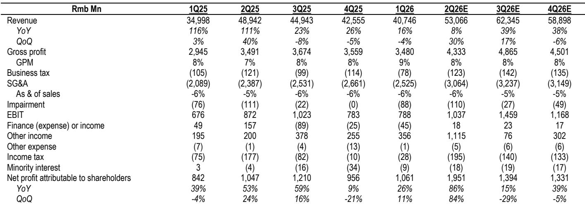
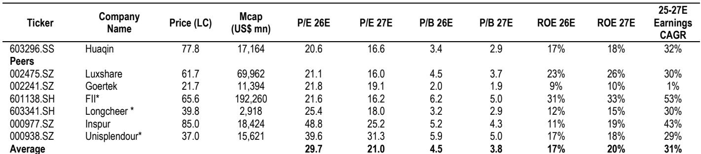
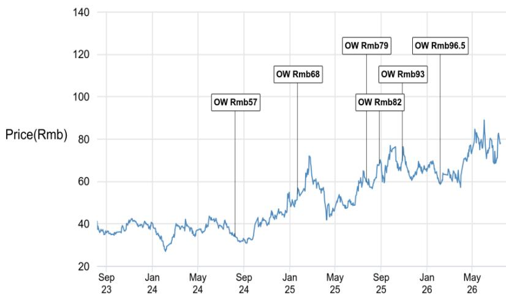

# JPM：华勤执行力与研究收益超预期

这份JPM研报的核心判断，与市场当前对华勤的普遍担忧正好相反。市场担心智能手机和PC涨价后需求变化会影响公司，但报告认为这种担忧被夸大了。华勤真正的价值，在于从2026年下半年开始加速的数据中心业务——当机柜级AI项目进入量产阶段，这家ODM的全栈能力将成为其重新定价的核心驱动力。

报告在2Q26业绩预告发布后更新了判断。华勤当季净利润中值达到19亿元，同比增长83%，环比增长81%，超出JPM预期65%。但更值得关注的不是一次性回报表现，而是扣非净利润——8.6亿元，同比增长15%，环比增长5%。在智能手机需求变化的背景下，PC、可穿戴和AIoT产品的份额持续提升，抵消了终端需求的节奏变化不确定性。

## 1. 数据中心将从2026下半年起成为利润引擎，而非只是收入故事

报告明确区分了两个阶段。当前华勤的数据中心业务更多是收入贡献，但利润率有限。转折点出现在机柜级AI项目从样品进入量产之后。JPM预计，2026年华勤数据中心收入将实现超过50%的同比增长。更重要的是，随着机柜级方案和高速网络设备出货量上升，单价和利润率都会改善。到2027年和2028年，数据中心对毛利润的贡献预计将达到33%和38%。

这意味着，华勤正在从一个消费电子ODM，逐步转向一个同时覆盖AI服务器、通用服务器和高速交换机的全栈供应商。在中国AI基础设施向机柜级架构迁移的过程中，这种能力组合是稀缺的。

> **KC评论：** 报告中的财务预测表显示，2026年营收上调5%，但2027年营收上调12%，2028年上调13%。越往后上调幅度越大，说明数据中心放量是预测上调的主要驱动力，而非当前消费电子业务的延续。

## 2. 市场对消费电子需求的担忧已经充分反映在报价中

华勤年初至今的报价表现跑输申万电子指数31个百分点。JPM认为，智能手机和PC需求走弱的担忧已经被定价，而公司通过份额提升和产品组合改善，有能力抵消终端市场的变化。从季度数据看，2Q26营收同比增长8%，环比增长30%，毛利率稳定在8%左右，说明核心运营并未出现明显变化。

报告还指出，华勤在可穿戴、AIoT和汽车电子领域的布局，正在提供额外的增长支撑。这些业务的规模虽然还不足以单独驱动整体增长，但叠加在一起，构成了一个比市场认知更稳健的收入结构。

## 3. 估值框架的核心假设是数据中心驱动的盈利增长，而非消费电子反弹

估值倍数维持在21倍12个月滚动市盈率，与同业均值持平。这个估值倍数本身并不激进，关键在于盈利预测的上修——2026年净利润预测上调10%，2027年上调4%，2028年上调10%。盈利增长的主要来源是数据中心业务的放量，而非消费电子业务的改善。

从不确定性角度看，报告列出了三个主要节奏变化因素：ODM行业竞争加剧、GPU供应意外受限、以及锁定期结束后可能出现的报价调整。这些不确定性都是行业层面的，而非公司特有。其中GPU供应问题尤其值得关注，因为它直接关系到数据中心业务的交付节奏。

这份报告的核心逻辑可以概括为一句话：华勤的再定价，取决于市场能否从消费电子ODM的旧框架切换到数据中心全栈供应商的新框架。机柜级AI的量产时间点——2026年下半年——就是验证这个切换是否成立的关键窗口。

For informational purposes only. Portions may be generated,translated,summarized,or edited with AI assistance based on source materials and may contain omissions or errors. Please verify independently. This is not investment,legal,tax,accounting,or other professional advice.

