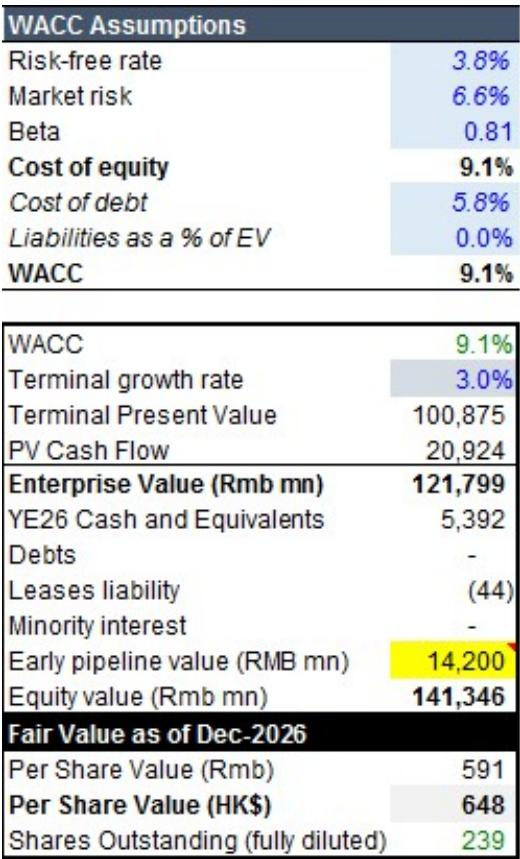
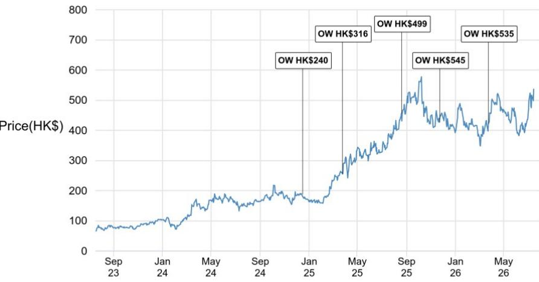
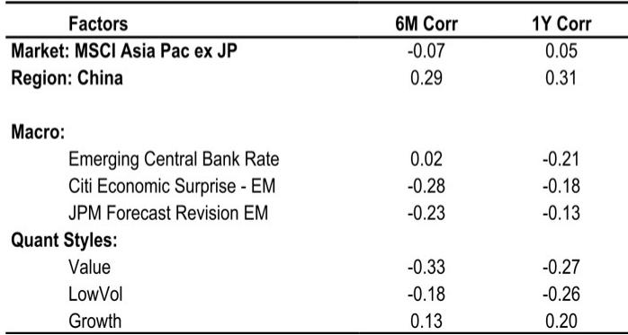

# JPM：科伦博泰ADC改写标准治疗-头对头击败Keytruda+化疗

中国生物医药板块近期经历了一轮估值修复，科伦博泰是其中反弹最坚决的标的之一。从6月初低点至今，公司报价已回升38%，跑赢恒生创新药指数约14个百分点。但真正让市场重新定价这家公司的，不是板块情绪回暖，而是一个具体的临床里程碑：其核心产品sac-TMT联合Keytruda在一项中国III期试验中，头对头击败了Keytruda联合化疗——这是ADC+PD-1组合首次在随机对照III期研究中证明自己优于当前标准治疗方案。

，从535港元升至648港元。调整的核心逻辑不是销售预测的简单上修，而是临床不确定性的实质性下降。报告认为，sac-TMT正在从“有潜力的候选药物”变成“多个适应症中可验证的标准治疗替代方案”。

## 1. 这次III期胜利覆盖的人群比上一次大得多

科伦博泰此前公布的OptiTROP-Lung05研究，针对的是PD-L1高表达的一线非小细胞肺癌患者。而这次OptiTROP-Lung06覆盖的是PD-L1阴性非鳞非小细胞肺癌患者——这是一个更大的患者群体，且对照组是Keytruda+化疗，而非Keytruda单药。

JPM指出，后者的临床意义更大。原因在于，Keytruda+化疗是多个癌种的标准治疗方案。如果sac-TMT+Keytruda能在这一对照中胜出，意味着这个组合有潜力在更多适应症中取代现有标准治疗。报告明确写道：“这让我们更有信心，Keytruda+sac-TMT可以在许多其他适应症中成功。”

> **KC评论：** 临床数据解读中，对照组的选择往往比试验组的数据本身更能决定商业价值。击败Keytruda单药和击败Keytruda+化疗，是两个完全不同的竞争叙事。

## 2. 监管信号也在加速：优先审评意味着什么

就在III期数据公布的同一天，中国国家药监局授予sac-TMT用于一线三阴性乳腺癌的补充新药申请优先审评资格。这一决定本身就是一个重要的监管去不确定性事件。

优先审评意味着监管机构认可该疗法的潜在临床价值，并承诺加速审评流程。对于科伦博泰而言，这直接提升了其最有价值的近期资产之一的商业化可见度，降低了执行不确定性。JPM将sac-TMT在中国一线三阴性乳腺癌的成功概率从60%直接上调至100%。

报告预计，OptiTROP-Lung06的数据将在今年10月的ESMO大会上公布，而一线三阴性乳腺癌的数据将在12月的SABCS上亮相。这两个学术会议将是市场验证数据质量的下一个关键节点。

## 3. 峰值销售预期上调，但更关键的是全球开发广度

JPM在模型中将多个关键适应症的成功概率上调后，对sac-TMT的峰值销售预期也随之提高：中国峰值销售从90亿元人民币升至100亿元，美国峰值销售从60亿美元升至70亿美元，全球（除中国外）峰值销售则超过90亿美元。

但比数字本身更值得关注的，是科伦博泰的全球开发广度。默沙东已获得sac-TMT的中国以外权益，并启动了14项全球III期试验，覆盖的适应症范围超过了竞争对手Dato-DXd和Trodelvy。JPM认为，sac-TMT有潜力成为全球同类最佳的TROP2 ADC。

报告还提到，科伦博泰目前在中国市场已有一款ADC获批，另有8款ADC处于临床阶段，3款非ADC抗癌药处于新药申请审评中。其OptiDC平台是支撑这一管线的基础。

## 4. 估值框架中隐含的假设值得关注

JPM对科伦博泰的估值采用DCF模型，假设无不确定性利率3.8%，市场不确定性溢价6.6%，Beta值0.81，WACC为9.1%，终端增长率3.0%。。

值得注意的是，报告在观察提示中列出了监管不确定性、地缘政治不确定性、研发失败不确定性、竞争格局变化、财务不确定性以及知识产权不确定性。对于一家仍处于亏损阶段、核心产品尚未完全商业化的生物科技公司而言，这些不确定性并非理论上的——临床数据虽然亮眼，但全球III期试验的成败、监管审批的节奏、以及竞争对手的追赶速度，都会影响最终的商业结果。

> **KC评论：** 对于关注中国创新药资产的读者，科伦博泰的案例提供了一个观察框架：当一家公司的核心产品在头对头试验中击败当前标准治疗，且监管机构给予优先审评时，市场定价的逻辑会从“概率加权”转向“确定性溢价”。但这一转变的前提是，后续数据能够持续验证早期结果。

For informational purposes only. Portions may be generated,translated,summarized,or edited with AI assistance based on source materials and may contain omissions or errors. Please verify independently. This is not investment,legal,tax,accounting,or other professional advice.

For informational purposes only. Portions may be generated,translated,summarized,or edited with AI assistance based on source materials and may contain omissions or errors. Please verify independently. This is not investment,legal,tax,accounting,or other professional advice.

