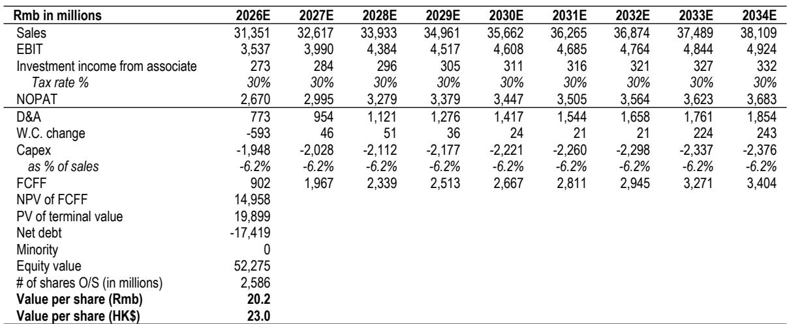
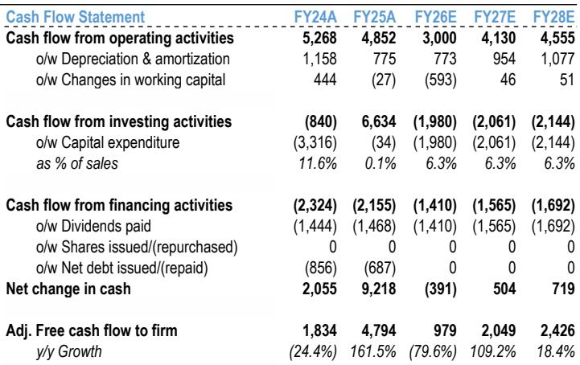
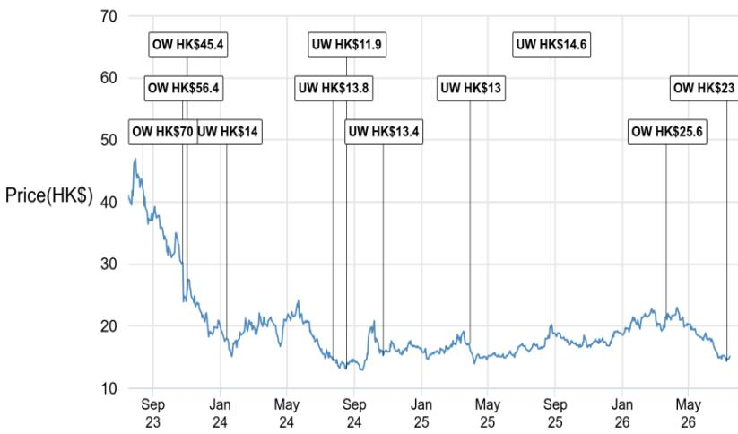

# JPM：李宁二季度零售观察-库存改善至4个月

二季度零售流水同比下滑低个位数，剔除童装后下滑幅度略大——这份来自JPM的运营更新，没有给市场带来惊喜，但也没有制造惊吓。真正值得关注的，不是短期数字本身，而是管理层在行业环境中同时做了两件事：维持全年指引不变，同时重申对研发和品牌的长线投入。这种“短期承压但不改方向”的姿态，比单季数据更能说明公司对自身节奏的判断。

报告给出的核心观察是：李宁二季度零售端面临客流偏弱和天气不利的双重影响，折扣加深（线下/线上分别加深中个位数和低个位数，整体折扣在65折左右），但库存水平反而从一季度的约5个月改善至约4个月，库龄结构健康。库存改善与折扣加深同时发生，说明公司不是在被动压货，而是在主动清理旧品、为下半年新品腾出空间。

> **KC评论：** 库存从5个月降到4个月，同时折扣加深，这两件事放在一起看，比单独看任何一个指标都更有意义。它暗示公司对渠道的控制力并未因零售环境转弱而松动。

## 1. 下半年利润的摆动因素，管理层已经提前布局

市场对李宁下半年利润率的主要担忧集中在两点：折扣不确定性可能进一步侵蚀毛利率，以及库里合作、亚运营销等带来的销售费用上升。报告详细列出了管理层的应对手段，包括供应链端提前锁定原材料价格、优化产品设计来对冲折扣影响，以及关闭低效门店、严控非必要开支。

这些措施本身并不新鲜，但值得注意的细节是：报告明确提到，库里合作相关的费用（签约费、联合品牌费、运营及营销支出）将在合作期内摊销，2026年的财务影响有限。这意味着，市场对“库里合作会一次性拉低利润”的担忧，可能被高估了。

## 2. 库里合作的产品节奏，比市场预期的更克制

关于库里品牌，报告披露了几个关键时间节点：今年下半年产品聚焦篮球品类，2027年才会拓展到生活方式和高尔夫等更广的品类。7月推出的纪念T恤已经获得消费者正面反馈，但整体产品线仍在规划阶段。

这种节奏表明，李宁没有急于把库里品牌铺成全品类，而是先在一个核心品类上验证产品和渠道的配合。对于一家正在从“修复期”进入“再加速期”的公司来说，这种克制比激进更值得关注。

## 3. 品类分化比渠道分化更值得跟踪

报告对二季度各品类的表现做了拆分：跑步和生活方式转为负增长，篮球跌幅扩大，但健身（功能性服饰驱动）保持韧性，户外和“荣耀”系列维持增长动能，分别占零售流水中个位数和低个位数。品类之间的分化，比线上（中个位数增长）和线下（低个位数下滑）之间的渠道分化更明显。

这意味着，李宁的增长修复不能简单依赖整体消费回暖，而需要在跑步、篮球等核心品类上重新建立产品力。下半年新推出的缓震跑鞋系列、亚洲运动会相关营销活动，以及库里品牌的首批产品，将是检验这一修复是否可持续的关键窗口。

> **KC评论：** 品类分化比渠道分化更值得跟踪。如果下半年跑步和篮球品类能止跌回升，那才是真正的修复信号；如果只是靠户外和荣耀系列维持增速，修复的广度仍然有限。

## 4. 一个可复用的观察框架：同时看库存、折扣和品类结构

对于跟踪李宁或同类公司的读者，这份报告提供了一个简洁但有效的观察框架：不要只看单季流水增速，而是把库存水位、折扣深度和品类结构放在一起看。库存改善但折扣加深，说明公司在主动管理渠道健康度；品类分化明显，说明增长驱动力正在切换。这三个指标的组合，比任何一个单一数字都更能反映公司的真实运营状态。

报告维持全年收入增长高个位数、净利率高个位数的指引，以及2026-2028年的盈利预测。下半年有多个催化剂（新品、库里品牌、亚运营销），但零售环境在7月初仍面临不确定性。修复的方向已经明确，节奏仍需验证。

For informational purposes only. Portions may be generated,translated,summarized,or edited with AI assistance based on source materials and may contain omissions or errors. Please verify independently. This is not investment,legal,tax,accounting,or other professional advice.

For informational purposes only. Portions may be generated,translated,summarized,or edited with AI assistance based on source materials and may contain omissions or errors. Please verify independently. This is not investment,legal,tax,accounting,or other professional advice.

