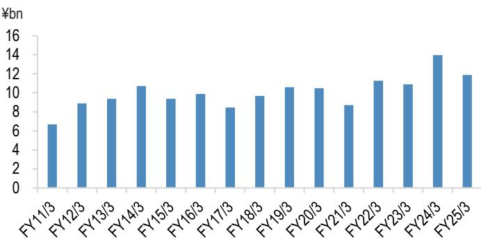
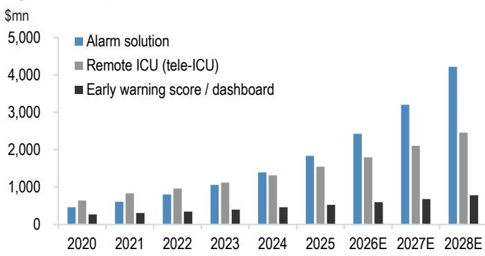
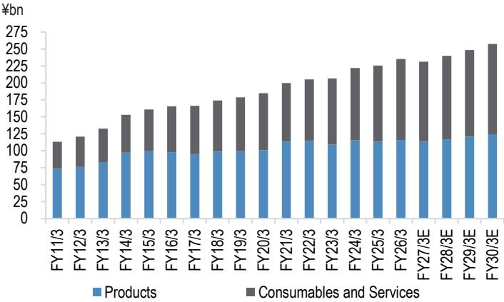
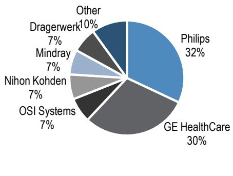
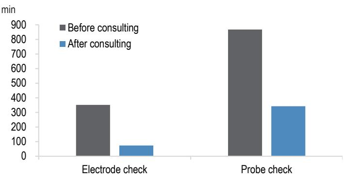
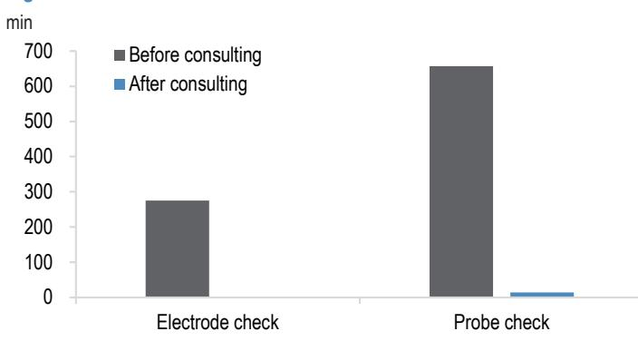
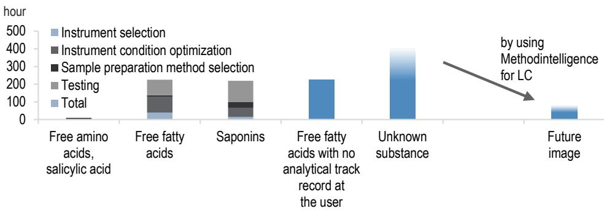
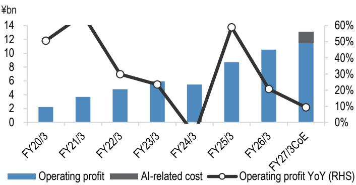
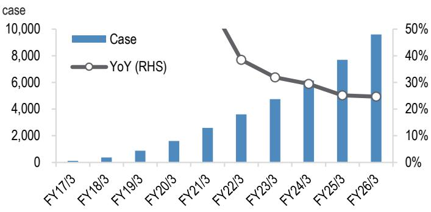

# MedTech & Healthcare Services Sector

## Impact of DX and AI Adoption in Healthcare: Initiatives That May Shape Future Market Positions

Digital transformation (DX) and AI use have been advancing in healthcare settings, and we summarize near-term observations. Within our coverage, we believe this could support longer-term market share growth for monitors and other products in Nihon Kohden's digital healthcare solutions (DHS) segment, although the scale of this business remains modest. In the healthcare services sector, M3 and JMDC are progressing with AI integration across various operations, and while we anticipate longer-term contributions to strengthening competitive advantages and improving the profitability of new services, we note higher AI-related investment in the near term (including increases in engineer hiring, AI system usage fees, and capital expenditure).

### Implications for Nihon Kohden (6849)

Nihon Kohden's medium-term business plan outlines a strategy to expand DHS sales by focusing on alarm solutions for medical staff providing inpatient care and on systems that facilitate inpatient monitoring and management. We expect the adoption of DX and AI in healthcare services to increase from July 2026 as Japanese hospitals use government subsidies to deploy ICT equipment and software to enhance operational efficiency and improve workplace environments (application submissions are scheduled to open in June 2026). At Nihon Kohden, although the scale of sales for individual DHS products is not large, we believe the gradual recognition of its DHS products at US hospitals while it builds a deployment track record in Japan could contribute to raising its US market share for patient monitors (installed basis). In fact, new DHS products contributed to monitor sales growth in the US in FY2024, and with this potentially leading to larger projects, we believe it is important from a longer-term perspective. Following the end of Covid-19-related special demand, Nihon Kohden had especially weak earnings and low valuations from FY2024 due to changing market conditions in Japan and some overseas markets and to higher wages. However, it has been discontinuing low-profit businesses and implementing structural reforms since FY2025. In addition, Nihon Kohden's monitor sales in Japan resumed double-digit (%) growth year-over-year in 4Q FY2025, and as it appears that capital expenditure at Japanese hospitals is already showing signs of recovery, we expect the share price to rise toward 2Q FY2026 (Nihon Kohden indicated that improved market conditions in Japan should fully contribute to earnings from 2H FY2026).

### Changes Needed at Medical Device Manufacturers

Healthcare facilities have been moving quickly to experiment with DX and AI since the broader launch of generative AI services, and recent examples of DX and AI use at hospitals and clinics were presented at the Eucalia Friendship Meeting on July 4 (we summarize the takeaways from page 3). Japanese hospitals have been able to apply for subsidies under a government program to enhance operational efficiency and improve workplace environments since July 2026. The program offers subsidies up to ¥80 million per hospital to support the deployment of ICT equipment and software, including for communications equipment, AI medical consultation, generative AI document creation, conveyance robots, monitoring devices, and network infrastructure. However, with medical institutions introducing advanced computer and systems infrastructure for using AI (see our report here for initiatives by NVIDIA and others to provide healthcare AI infrastructure), it appears healthcare facilities are investing more than we expected in DX and AI. We believe the effective use of limited funds is important for healthcare facilities. Before Covid-19, there were a number of challenges in applying DX and AI to healthcare, including divergence with the actual needs of healthcare facilities, and issues related to precision, safety, ethics, and operations (Figure 15). Recently, however, the number of approved medical devices that use DX and AI has increased, and while we do not see problems with the products themselves, it appears to us that competing medical device manufacturers have released a growing number of similar AI products. In this environment, we believe a key issue now is whether products have the competitive advantages and unique features needed to make them the preferred choice of healthcare facilities. For example, Fukuda Denshi's electrocardiographs with AI analysis capabilities can perform AI diagnosis similar to competing products, but the ability to use this system with lower-performance computers is a unique advantage compared with competing products. With a recent focus on the risk of higher fixed costs for DX and AI deployment at healthcare facilities, we think medical device manufacturers, when developing products that use DX and AI, need to consider not only improving diagnostic and treatment capabilities, but also the capital expenditure burden for healthcare facilities.

## Rapidly Accelerating Adoption of DX and AI on the Medical Front

## Takeaways from Meeting on DX and AI Use on the Medical Front

The Eucalia Friendship Meeting on July 4 showcased many recent examples of the use of digital technologies and AI on the medical front from the perspective that hospital and clinic management should essentially maximize the time medical professionals spend with patients, leading to wide-ranging discussions. We summarize the main points below.

**Figure 1: Clinical workflow support systems Japan market size**  
  
Source: Medley estimates, JPM  
Note: Historical data are Medley estimates.

### (1) AI Significantly Reduces Documentation Time in Medical Practices

In one example at a hospital, use of AI enabled the generation of electronic medical records in less than sixty seconds by capturing the conversation between the patient and the medical professional through voice recognition and generating the text in the SOAP format (with subjective information, objective information, assessment, and plan of care). In addition, the use of Claude allowed medical professionals to compose routine emails and informational materials 1.8 times faster.

### (2) Some Hospitals Use Proprietary Data

The meeting showcased a hospital that created a dashboard for analyzing data in response to the medical fee revision in June 2026. Electronic medical records in particular are connected to various departmental systems, so the hospital plans to collect data from these systems and use them to improve operations and business efficiency.

### (3) Automation of Medical Paperwork Not Only Reduces Hospital Business Hours but Also Leads to Retroactive Billing for Compensation

The future direction of medical administration was discussed. Hospitals and clinics have faced the issues of increased specialized work related to medical reimbursement claims and chronic labor shortages in recent years. The meeting highlighted an example of a hospital that reduced man-hours by 550 hours a month, the equivalent of 3.6 employees, by using robotic process automation (RPA) and automating medical administrative operations. This enabled all staff members to focus on reception and patient-facing work during the day rather than internal administrative tasks. By using RPA, the hospital also identified tens of millions of yen in medical claims that had previously been overlooked due to dependence on human skills, and was able to request retroactive reimbursements.

### (4) AI Agents Could Replace Some of Hospitals' Reception Operations and Specialist Classifications, Possibly Causing Hospital and Clinic Capex to Rise for AI Use

The meeting showcased an AI agent co-developed by Fujitsu and NVIDIA for healthcare providers that helps receptionists assign specialists to patients. The product enables AI to take over tasks such as patient intake and interviews by standardizing previous intake interviews and letting patients speak with an AI avatar on a screen when arriving at the hospital. AI can also take over the task of assigning patients to appropriate specialists, automating a series of intake tasks previously performed by medical professionals. Going forward, the companies plan to screen patients on their smartphones by conducting interviews tailored to patients ahead of time, proposing a specialist to see, and advising whether an online visit is an option. These initiatives aim to facilitate a hospital's first contact with a patient. Because hospitals need computers with a certain level of sophistication to safely handle confidential medical data internally and use generative AI, we believe demand for desktop AI supercomputers might increase.

### (5) Prevalence of Online Medical Visits

Online medical visits are currently the most widespread in China and India. In Japan, the majority of online visits are used at clinics, but hospitals often use doctor-to-doctor online service to allow cardiac surgeons and other physicians to collaborate with specialists at remote locations. The use of products such as Join, DeNA's app for communication between medical professionals, is increasing.

## The Key Question Is Whether Digital Solutions and AI Functionality Will Be Recognized and Valued, Ultimately Driving an Increase in Device Market Share

### Nihon Kohden: DHS's Business Scale Still Small, but Focus Is on Whether It Contributes to Higher Monitor Share in North America

Nihon Kohden's medium-term plan strategy is to expand digital health solutions (DHS) sales to hospitals, and we expect new products including alarm solutions and next-generation central monitors to contribute to earnings from FY2026. At Japanese hospitals in particular, we expect increased use of the Japanese government's supplementary budget intended to improve operational efficiency and workplace environment on the medical front through the use of information and communications technology (ICT) equipment from July 2026 onward, increasing the use of digital technologies in medicine. We also believe the medical fee increase at hospitals from June 2026 has improved their business environment, providing some reassurance. We thus think this could provide some tailwinds to DHS product sales of Nihon Kohden's patient-monitoring business. While the scale of the company's DHS sales is still small, we believe the profit margin is better than that of equipment products. As a future focal point, while Philips and GE HealthCare now hold high shares in the US market, we believe what is important is whether Nihon Kohden's DHS is well received by hospitals and contributes to an increase in its patient monitoring systems' US share (on the basis of equipment installed).

**Figure 2: Nihon Kohden: Key New Products and Services for Improving Hospital Management Efficiency and Healthcare Economics**

| Period | Region | Business | Products / Services |
|--------|--------|----------|---------------------|
| FY3/25 | | Solutions | Patient Condition Dashboard Software (for general wards) |
| FY3/25 | | Solutions | Patient Condition Dashboard Software (for critical care wards) |
| FY3/26 | | Solutions | Integrated Dashboard for PFM Center |
| FY3/26 2Q | U.S. | Solutions | Alarm Solution "AlarmSense" |
| FY3/26 3Q | Japan | Patient Monitors | Transmitter ZS-730/720P |
| FY3/26 4Q | Japan | Solutions | On-site Alarm Analysis Software |
| FY3/26 4Q | Japan | Solutions | Admission/Discharge Workflow Support Software |
| FY3/27 | Europe | Solutions | Alarm Solution "AlarmSense" |
| FY3/27 | U.S. | Patient Monitors | Next-generation Central Monitor |

Source: Company data, company estimates, JPM  
Note: Solutions business = DHS (Digital Health Solutions) + ITS (IT Solutions); PFM (Patient Flow Management) Center: collects and analyzes in-hospital data in real time, and bed utilization and the patient intake/acceptance status are centrally managed in an integrated manner.

**Figure 3: Nihon Kohden: DHS+ITS products Japan sales**  
  
Source: Company data, JPM

**Figure 4: DHS products North America market size**  
  
Source: Nihon Kohden, Nihon Kohden estimates (from 2026), JPM

**Figure 5: Nihon Kohden: Sales by type**  
  
Source: Company data, JPM estimates

**Figure 6: Patient monitors global market shares (2024)**  
  
Source: Spherical Insights, Precedence Research, JPM

## Nihon Kohden: Solutions to Reduce Alarm Fatigue Among Healthcare Professionals at Hospital Wards

One of Nihon Kohden's strengths is its sensor technology for devices that measure patient biometrics such as blood oxygen saturation, exhaled carbon dioxide, pulse, and brainwaves. The company offers high-precision alarm management systems based on this information. When a hospitalized patient's alarm goes off now, a medical professional goes to the patient to verify the situation in person, but this has become an issue on the medical front, with some data suggesting that verification is unnecessary about 85% of the time (as of 2026, source: Nihon Kohden material). To solve this issue with alarms, Nihon Kohden provides alarm reports to the medical front (its service staff collects and analyzes alarm data offline and proposes operational improvement), launching an on-site alarm analysis software in FY2025. This software displays the occurrence and causes of alarms by patient in real time and on-site, making it easier to manage alarms on the medical front. On-site alarm analysis software QP-841N, launched in Japan in February 2026, is priced at ¥1.5 million, and the company expects to sell more than 100 sets by FY2028, mainly to Japanese healthcare providers. It plans to continue investing in R&D of high-precision alarm detection technology and provide full-scale consulting services for hospital ward alarm management (Figures 7-8).

**Figure 7: Nihon Kohden: Alarm-state duration**  
  
Source: Company data (2026), JPM

**Figure 8: Nihon Kohden: Alarm-sound duration**  
  
Source: Company data (2026), JPM

## Fukuda Denshi: AI Diagnostics Raise Detection Rates of Atrial Fibrillation Symptoms and Contribute to Prevention, Can Be Used with Non-High-End Computers

Fukuda Denshi (Not Covered), which competes with Nihon Kohden, launched CardiMax 9 Ai (FCP-9900Ai system), an electrocardiograph with AI analysis function, in 2024. This system can estimate past atrial fibrillation, which was difficult to do with conventional electrocardiographs, and we believe it can contribute to early detection of atrial fibrillation risk and prevention of attacks. Fukuda's technology was featured in the July 2, 2026 edition of Nature (see here for the article). In addition, while several overseas competitors have also launched similar AI diagnostics products, we believe the strength of Fukuda's product lies in the use of algorithms that can be used not only on high-end computers that are suitable for AI use but also on computers with standard CPUs for general use. With an increase in fixed costs for AI use viewed as a risk on the medical front, we expect a stronger need for technologies like this that can reduce hospitals' capital expenditure burden for using AI.

## Status of DX and AI Adoption Among Medical Device Manufacturers

### Use of Data Analysis and AI Is Advancing in Diagnostic Imaging

The use of AI is advancing in the diagnostic imaging field. It was recently reported that about 20% of early stage cancers were missed during past endoscopic examinations (source: AI Medical Service, 2026), and multiple AI diagnostic products have been approved. We see collecting endoscopic images is not easy for individual companies, and we think this has become a bottleneck in developing AI endoscopy products. Olympus also does not have an in-house system for collecting examination images, despite a global market share for gastrointestinal endoscopes in excess of 60% (as of 2026), and we believe this process requires cooperation with physicians and costs.

Global market shares for gastrointestinal endoscopes have fluctuated in recent years (Fujifilm's market share has recently risen), and simple initial screening tests that can replace endoscopy have also increased. We think R&D for products that can reduce the burden for patients and improve endoscopy accuracy is important over the longer term.

**Figure 9: Endoscopy AI products**

| Examination Method | Examination Site | Main AI Products |
|-------------------|-----------------|------------------|
| Upper GI Endoscopy | Oral Cavity, Pharynx, Larynx, Esophagus, Stomach, Duodenum | AI Medical Service (gastroAI model-G2), Fujifilm (CAD EYE), Olympus (esophagus only, CADU) |
| Capsule Endoscopy | Small Intestine | None |
| Lower GI Endoscopy | Colon, Anus | Fujifilm (CAD EYE), Olympus (EndoBRAIN, CADDIE), AI Medical Service (gastroAI model-EIRL), NEC (WISE VISION) |

Source: Company data, JPM

### Use of Data Analysis and AI Is Limited in Treatment Equipment and IVD Testing, but Is Gradually Advancing for New Businesses and Plants

Compared with diagnostic imaging, the use of data analysis and AI in medical devices for treatment and surgery appears limited at present. However, Terumo, which mainly handles cardiovascular products, plans to focus on the imaging business (IVUS imaging, OFDI imaging), and is pursuing R&D to use AI in this new business (Figure 10). Asahi Intecc, which similarly focuses on cardiovascular products, is experimenting with using data analysis and AI to enhance plant productivity and shorten document preparation work, including for regulatory approval (see our report here for initiatives at the Thailand factory).

**Figure 10: DX & AI utilization in vascular imaging**

| Company | Modality | Overview of Key DX & AI Utilization |
|---------|----------|-------------------------------------|
| Terumo | IVUS, OFDI | Image fusion and analysis support using OPUSWAVE, which integrates IVUS and OFDI; currently under R&D leveraging AI (stent placement recommendations, calcified plaque assessment, endpoint evaluation). |
| Philips | IVUS | Automated measurements of vessel diameter, lumen, and lesions; PCI workflow support; AI-based image analysis. |
| Boston Scientific | IVUS, OFDI | AI-driven lesion analysis (Automated Lesion Assessment), automatic extraction of vessel contours, PCI support. |
| Abbott Laboratories | OCT (related to OFDI) | AI-based image analysis via Ultreon Software, calcium detection, stent size recommendations. |
| Conavi Medical | IVUS, OCT | Hybrid image analysis and AI-enabled image processing. |
| Evident Vascular | IVUS | AI-enabled IVUS platform. |

Source: Company data, JPM

In the area of IVD testing, which is a core business at Sysmex, although the number of testing devices equipped with AI capabilities is currently limited, the use of AI in laboratories is gradually expanding overall. For example, Roche and others are using AI to forecast consumables replacement, equipment breakdowns, calibration errors, and downtimes with the aim of improving laboratory capacity utilization and reducing maintenance costs. Companies are also working to support diagnostics, including quality control via lot abnormality detection for reagents and patient risk assessment via AI analysis of test results. In addition, as part of Sysmex's long-term vision, although we think it will take considerable time to contribute to earnings, it aims to use data analysis in the APAC region, including India, to increase equipment utilization rates and become the preferred brand of governments in various regions from the standpoint of medical cost performance (see our report here).

**Figure 11: DX & AI utilization in IVD testing**

| Company | Main Products | Overview |
|---------|---------------|----------|
| Sysmex | DI-60, UN Series | AI-powered blood cell image analysis system. AI-based blood cell classification, anomaly detection, cloud-based data analytics, and development of disease risk prediction models. Global deployment, achieving both testing accuracy and efficiency. |
| Roche Diagnostics | Integration with navify | AI-driven test data analysis and automation, abnormal value detection. Disease risk prediction and testing efficiency improvement leveraging large-scale data. Deployed in hospitals and testing centers globally. |
| Siemens Healthineers | Atellica Solution | AI-based automatic test result interpretation, QC anomaly detection, reagent consumption forecasting, specimen transport optimization, and lab-wide data integration and analysis. Automation and AI utilization for large-scale laboratories. |
| Abbott Laboratories | Alinity, AlinIQ | Data analysis, AI-driven testing process optimization, QC anomaly detection, predictive equipment maintenance, and real-time analysis of test data. Improving testing accuracy and laboratory operational efficiency. |
| Mindray | MC-80, LabXpert | AI-based blood cell classification, specimen processing and image analysis, automatic test data interpretation. Automated validation. Expanding adoption in emerging markets. |

Source: Company data, JPM

## In the Life Sciences Sector, Leveraging AI Can Provide a Competitive Advantage as Well

Shimadzu introduced several new software products at its September 2025 briefing on the analytical & measuring instruments (AMI) division (see pages 22–24 of the materials). Its new AI-analysis method creation software, Methodintelligence for LC, uses a system similar to generative AI, and when a user enters text about the substances and conditions they want to analyze in Japanese or English, it instantly proposes the optimal measurement conditions, and the best measurement conditions for the user's instruments based on data from past papers and Shimadzu's proprietary analytical data. The company's AI specialist team took several years to develop the software. We believe the entry barriers are high because development depends not only on data from published papers but also Shimadzu's accumulated analytical data. The new product has not yet been released, and the company envisions offering it under a monthly subscription model. The company is ahead of rivals in developing software that saves time and effort required for analysis (it uses AI to cover tasks like analysis method creation, automatic waveform processing and abnormal peak detection), and we believe it will wield a competitive edge going forward. Also, we get the impression Shimadzu's operations generally face a small risk of substitution by AI. We think that AI cannot directly replace measuring instruments, but that measuring instrument customers (such as pharmaceutical makers) have started to use AI for some R&D processes, so measuring instrument usage frequency may fall over the long term.

**Figure 12: Example of the time required to evaluate analytical conditions in LCMS**  
  
Source: JPM estimates based on Soichiro Okita et al., Tottori University, 2023

## Impact of AI Use in Healthcare Sector

Longer term, it may strengthen companies' competitive edge and improve the profitability of new services; near term, we will keep a close watch on rising costs. JMDC operates healthcare big data analysis as a core business, and this business has long had a strong connection with digital transformation (DX) and AI use as a whole. Regarding the impact of AI evolution on the company, management said at 4Q FY2025 results that, instead of replacing its consulting service and analysis service, AI has lowered the analysis hurdle and accelerated the hypothesis verification cycle, leading to faster discussions with client companies and proposal activities. It said the seeds of its projects are indeed growing, and new business opportunities combining data from companies in other industries are widening. In addition, given the high reliability required from healthcare data, JMDC said it does not expect such data to be replaced much by synthetic data. At the same time, it announced plans to accelerate strategic investment in AI in FY2026 given the changes in the industry and AI evolution. Its FY2026 guidance calls for just 9% year-over-year growth in operating profit versus 20% growth in sales. JMDC explained that FY2026 is the time to accelerate AI-related investment including human resources and infrastructure for medium-term business growth (nearly 50% of the strategic investment will be infrastructure investment for AI use and to increase AI engineers, while slightly more than 50% will be investment to increase data consultants). While the company wants to essentially finish hiring engineers and data consultants in FY2026, we are concerned about the possibility of this being delayed into FY2027.

M3 showcased various products and services incorporating AI at 4Q FY2025 results. It said AI is increasingly replacing operations in its core pharma marketing support business, leading to a 20% productivity improvement versus FY2019, and also said it plans a significant productivity improvement going forward. It said AI has also made the targeting of physicians for marketing new drugs more efficient than before. However, we think that M3 appears to believe that AI products themselves could become commoditized over the long term. We believe its competitive advantage lies in its ability to obtain large amounts of proprietary healthcare industry data from its own platform. In particular, it has M3 DigiKar, the cloud-based electronic medical records app with the top market share in Japan (as of 2026), so we believe it is easy to obtain a wide range of the latest data. Since M3 estimates the number of patients and drug prescriptions using these proprietary data, we see little likelihood of its pharma marketing support business being replaced by other companies. However, in the near term, we see the possibility of intensifying competition with rivals in the Japanese market for cloud-based electronic medical records including Medley. With the Japanese government targeting a 100% penetration rate for electronic medical records, we believe the environment for the cloud-based electronic medical records industry is changing. WEMEX (a PHC Holdings subsidiary), which originally held the top share in on-premise electronic medical records for Japanese clinics (as of 2022), is now growing hybrid medical records, which offer the advantages of both on-premise and cloud-based electronic medical records, as well as 100% cloud-based electronic medical records. We will watch the impact of increased industry competition on M3, including a one-off increase in SG&A expenses.

**Figure 13: JMDC: Operating profit & AI-related investment**  
  
Source: Company data, JPM

**Figure 14: Cumulative number of medical institutions using M3 DigiKar**  
  
Source: Historical data are JPM estimates based on company data

**Figure 15: Cases of challenges in DX & AI utilization in healthcare before Covid-19**

| Company | Period | Case |
|---------|--------|------|
| IBM Watson for Oncology | 2015~ | Accuracy issues with cancer treatment AI: Deployed at globally renowned cancer research centers, but concerns were raised about the accuracy of treatment recommendations and discrepancies with actual clinical practice, leading to discontinuation of adoption. |
| Google Health | 2016~ | Difficulty in practical application of AI breast cancer diagnosis: Although the AI's diagnostic accuracy for breast cancer was high, operational deployment in actual clinical settings proved difficult, and parts of the project were suspended. |
| Google DeepMind Health | 2016~ | Patient data privacy issues: In an AI project with the Royal Free Hospital in the UK, the handling of patient data became problematic, and the organization received warnings from regulatory authorities. |
| Babylon Health | 2017~ | AI misdiagnosis issues: The AI chatbot produced misdiagnoses for certain symptoms. Cases arose where its scope of use within the UK's NHS was restricted. |

Source: Company data, JPM

---

*Analyst Certification: The Research Analyst(s) denoted by an "AC" on the cover of this report certifies (or, where multiple Research Analysts are primarily responsible for this report, the Research Analyst denoted by an "AC" on the cover or within the document individually certifies, with respect to each security or issuer that the Research Analyst covers in this research) that: (1) all of the views expressed in this report accurately reflect the Research Analyst's personal views about any and all of the subject securities or issuers; and (2) no part of any of the Research Analyst's compensation was, is, or will be directly or indirectly related to the specific recommendations or views expressed by the Research Analyst(s) in this report. For all Korea-based Research Analysts listed on the front cover, if applicable, they also certify, as per KOFIA requirements, that the Research Analyst's analysis was made in good faith and that the views reflect the Research Analyst's own opinion, without undue influence or intervention.*

*All authors named within this report are Research Analysts who produce independent research unless otherwise specified. In Europe, Sector Specialists (Sales and Trading) may be shown on this report as contacts but are not authors of the report or part of the Research Department.*

## Important Disclosures

*Company-Specific Disclosures: JPM does and seeks to do business with companies covered in its research reports. As a result, investors should be aware that the firm may have a conflict of interest that could affect the objectivity of this report. Investors should consider this report as only a single factor in making their investment decision. Important disclosures, including price charts and credit opinion history tables (if applicable), are available for compendium reports and all JPM-covered companies, and certain non-covered companies, by visiting https://www.jpmm.com/research/disclosures, calling 1-800-477-0406, or e-mailing research.disclosure.inquiries@JPM.com with your request.*

## Explanation of Equity Research Ratings, Designations and Analyst(s) Coverage Universe

*JPM uses the following rating system: Overweight (over the duration of the price target indicated in this report, we expect this stock will outperform the average total return of the stocks in the Research Analyst's, or the Research Analyst's team's, coverage universe); Neutral (over the duration of the price target indicated in this report, we expect this stock will perform in line with the average total return of the stocks in the Research Analyst's, or the Research Analyst's team's, coverage universe); and Underweight (over the duration of the price target indicated in this report, we expect this stock will underperform the average total return of the stocks in the Research Analyst's, or the Research Analyst's team's, coverage universe. NR is Not Rated. In this case, JPM has removed the rating and, if applicable, the price target, for this stock because of either a lack of a sufficient fundamental basis or for legal, regulatory or policy reasons. The previous rating and, if applicable, the price target, no longer should be relied upon. An NR designation is not a recommendation or a rating. Some stocks under coverage have a rating but no price target; in these cases, we expect the stock will outperform/perform in line/underperform the average total return of the stocks in the Research Analyst's, or the Research Analyst's team's, coverage universe of the relevant duration of the region. In our Asia (ex-Australia and ex-India) and U.K. small- and mid-cap Equity Research, each stock's expected total return is compared to the expected total return of a benchmark country market index, not to those Research Analysts' coverage universe. If it does not appear in the Important Disclosures section of this report, the certifying Research Analyst's coverage universe can be found on JPM's Research website, https://www.JPMmarkets.com.*

*Coverage Universe: Saito, Naoko : Asahi Intecc (7747) (7747.T), H.U. Group Holdings (4544) (4544.T), JMDC (4483) (4483.T), Konica Minolta (4902) (4902.T), M3 (2413) (2413.T), Nihon Kohden (6849) (6849.T), Nipro (8086) (8086.T), Olympus (7733) (7733.T), Shimadzu Corporation (7701) (7701.T), Sysmex (6869) (6869.T), Terumo (4543) (4543.T)*

## JPM Equity Research Ratings Distribution, as of July 04, 2026

| | Overweight (buy) | Neutral (hold) | Underweight (sell) |
|---|---|---|---|
| JPM Global Equity Research Coverage* | 53% | 36% | 12% |
| IB clients** | 83% | 80% | 73% |
| JPMS Equity Research Coverage* | 51% | 37% | 12% |
| IB clients** | 95% | 92% | 87% |

*\*Please note that the percentages may not add to 100% because of rounding.*

*\*\*Percentage of subject companies within each of the "buy," "hold" and "sell" categories for which JPM has provided investment banking services within the previous 12 months.*

*For purposes of FINRA ratings distribution rules only, our Overweight rating falls into a buy rating category; our Neutral rating falls into a hold rating category; and our Underweight rating falls into a sell rating category. Please note that stocks with an NR designation are not included in the table above. This information is current as of the end of the most recent calendar quarter.*

*Equity Valuation and Risks: For valuation methodology and risks associated with covered companies or price targets for covered companies, please see the most recent company-specific research report at http://www.JPMmarkets.com, contact the primary analyst or your JPM representative, or email research.disclosure.inquiries@JPM.com. For material information about the proprietary models used, please see the Summary of Financials in company-specific research reports and the Company Tearsheets, which are available to download on the company pages of our client website, http://www.JPMmarkets.com. This report also sets out within it the material underlying assumptions used.*

## History of Investment Recommendations

*A history of JPM investment recommendations disseminated during the preceding 12 months can be accessed on the Research & Commentary page of http://www.JPMmarkets.com where you can also search by analyst name, sector or financial instrument.*

*Analysts' Compensation: The research analysts responsible for the preparation of this report receive compensation based upon various factors, including the quality and accuracy of research, client feedback, competitive factors, and overall firm revenues.*

*Registration of non-US Analysts: Unless otherwise noted, the non-US analysts listed on the front of this report are employees of non-US affiliates of JPM Securities LLC, may not be registered as research analysts under FINRA rules, may not be associated persons of JPM Securities LLC, and may not be subject to FINRA Rule 2241 or 2242 restrictions on communications with covered companies, public appearances, and trading securities held by a research analyst account.*

## Other Disclosures

*JPM is a marketing name for investment banking businesses of JPM Chase & Co. and its subsidiaries and affiliates worldwide.*

*UK MIFID FICC research unbundling exemption: UK clients should refer to UK MIFID Research Unbundling exemption for details of JPM's implementation of the FICC research exemption and guidance on relevant FICC research categorisation.*

*All research material made available to clients are simultaneously available on our client website, JPM Markets, unless specifically permitted by relevant laws. Not all research content is redistributed, e-mailed or made available to third-party aggregators. For all research material available on a particular stock, please contact your sales representative.*

*Any long form nomenclature for references to China; Hong Kong; Taiwan; and Macau within this research material are Mainland China; Hong Kong SAR (China); Taiwan (China); and Macau SAR (China).*

*JPM may, from time to time, write on issuers or securities targeted by economic or financial sanctions imposed or administered by the governmental authorities of the U.S., EU, UK or other relevant jurisdictions (Sanctioned Securities). Nothing in this report is intended to be read or construed as encouraging, facilitating, promoting or otherwise approving investment or dealing in such Sanctioned Securities. Clients should be aware of their own legal and compliance obligations when making investment decisions.*

*Any digital or crypto assets discussed in this research report are subject to a rapidly changing regulatory landscape. For relevant regulatory advisories on crypto assets, including bitcoin and ether, please see https://www.JPM.com/disclosures/cryptoasset-disclosure.*

*The author(s) of this research report may not be licensed to carry on regulated activities in your jurisdiction and, if not licensed, do not hold themselves out as being able to do so.*

*Exchange-Traded Funds (ETFs): JPM Securities LLC ("JPMS") acts as authorized participant for substantially all U.S.-listed ETFs. To the extent that any ETFs are mentioned in this report, JPMS may earn commissions and transaction-based compensation in connection with the distribution of those ETF shares and may earn fees for performing other trade-related services, such as securities lending to short sellers of the ETF shares. JPMS may also perform services for the ETFs themselves, including acting as a broker or dealer to the ETFs. In addition, affiliates of JPMS may perform services for the ETFs, including trust, custodial, administration, lending, index calculation and/or maintenance and other services.*

*Options and Futures related research: If the information contained herein regards options- or futures-related research, such information is available only to persons who have received the proper options or futures risk disclosure documents. Please contact your JPM Representative or visit https://www.theocc.com/components/docs/riskstoc.pdf for a copy of the Option Clearing Corporation's Characteristics and Risks of Standardized Options or https://www.finra.org/sites/default/files/2020-08/Security_Futures_Risk_Disclosure_Statement_2020.pdf for a copy of the Security Futures Risk Disclosure Statement.*

*Changes to Interbank Offered Rates (IBORs) and other benchmark rates: Certain interest rate benchmarks are, or may in the future become, subject to ongoing international, national and other regulatory guidance, reform and proposals for reform. For more information, please consult: https://www.JPM.com/global/disclosures/interbank_offered_rates*

*Notification for Credit Ratings: If this material includes credit ratings, such credit ratings provided by Japan Credit Rating Agency, Ltd. (JCR) and Rating and Investment Information, Inc. (R&I), are credit ratings provided by Registered Credit Rating Agencies (credit rating agencies registered under the Financial
