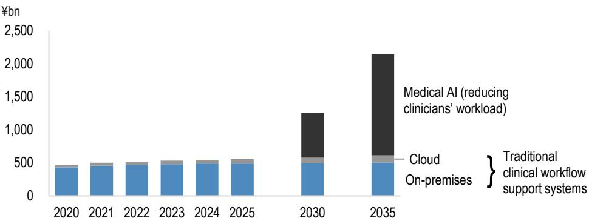
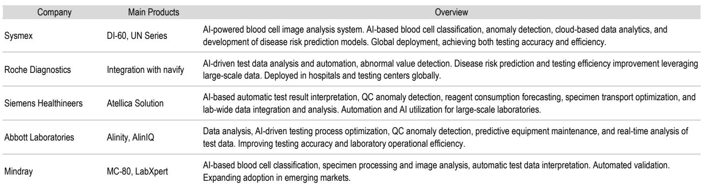
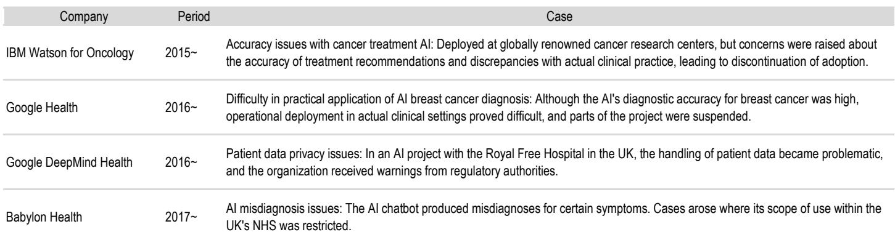

# Japanese Hospitals Are Quietly Accelerating DX and AI Adoption, Creating a Window for Medical Device Manufacturers to Gain Share

The most significant strategic shift in Japanese healthcare today is not a policy change or a blockbuster drug approval. It is the quiet, behind-the-scenes acceleration of digital transformation and AI adoption at hospitals and clinics, driven by a specific government subsidy program opening in July 2026. For medical device manufacturers like Nihon Kohden, this creates a concrete pathway to convert years of R&D into market share gains, particularly in the US patient monitor market. The opportunity, however, comes with a condition: products must not only work but must also reduce the capital expenditure burden on cash-constrained hospitals.

The urgency of this moment stems from a convergence of factors. Japanese hospitals, which have historically been slow to adopt digital tools due to cost concerns and workflow integration challenges, are now facing a labor crisis that makes DX no longer optional. The government has responded with subsidies of up to ¥80 million per hospital for ICT equipment and software deployment. At the same time, generative AI services have matured to the point where they can meaningfully reduce administrative burdens. One hospital featured at a recent industry meeting reduced man-hours by 550 hours per month—the equivalent of 3.6 full-time employees—simply by automating medical administrative operations with robotic process automation. The same hospital identified tens of millions of yen in previously overlooked medical claims, enabling retroactive reimbursements.

This is not a speculative future. The report documents that Nihon Kohden's monitor sales in Japan resumed double-digit year-over-year growth in the fourth quarter of fiscal 2025, suggesting that hospital capital expenditure is already showing signs of recovery ahead of the official subsidy launch. The question for observers and strategists is which companies are positioned to capture this wave, and what specific product attributes will determine outcomes.

## The Government Subsidy Program Creates a Fixed Timeline for Hospital DX Investment, Not Just a Possibility

The most concrete catalyst in the report is the Japanese government's program to enhance operational efficiency and improve workplace environments at healthcare facilities. Application submissions open in June 2026, with deployment expected to begin in July 2026. The subsidies cover up to ¥80 million per hospital for ICT equipment and software, including communications equipment, AI medical consultation tools, generative AI document creation systems, conveyance robots, monitoring devices, and network infrastructure. This is not a vague tailwind; it is a scheduled injection of capital into a sector that has been underinvesting in digital infrastructure for years.

For Nihon Kohden, the timing aligns precisely with its product roadmap. The company plans to launch its on-site alarm analysis software in Japan in the fourth quarter of fiscal 2025, priced at ¥1.5 million per set, with a target of selling more than 100 units by fiscal 2028. The next-generation central monitor is scheduled for the US market in fiscal 2027. The company's medium-term plan explicitly focuses on expanding digital health solutions (DHS) sales through alarm solutions for inpatient care and systems that facilitate monitoring and management. The subsidy timeline means that Japanese hospitals will be making purchasing decisions for precisely these categories in the second half of 2026.

The strategic implication is clear: Nihon Kohden's DHS segment, while still small in absolute scale, is entering a period where demand is supported by government policy, not just by organic hospital interest. The company expects improved market conditions in Japan to fully contribute to earnings from the second half of fiscal 2026. For a company that had "especially weak earnings" following the end of COVID-19-related special demand, this represents a structural turning point.

## Nihon Kohden's US Market Share in Patient Monitors Could Rise If Its Digital Solutions Are Recognized as Differentiators

The report's most consequential argument for long-term observers concerns Nihon Kohden's position in the US patient monitor market. The US market is dominated by Philips and GE HealthCare, which together hold the majority of the installed base. Nihon Kohden has historically been a smaller player. However, the report identifies a specific mechanism by which DHS products could change this dynamic.

In fiscal 2024, new DHS products contributed to monitor sales growth in the US. The logic is that when hospitals evaluate patient monitoring systems, they are increasingly looking not just at the hardware specifications but at the ecosystem of digital tools that integrate with the monitors. Nihon Kohden's alarm management solutions, including the alarm analysis software and the upcoming AlarmSense product, address a specific and well-documented pain point: alarm fatigue. The report cites data suggesting that verification is unnecessary for approximately 85% of alarms in hospital wards. Nihon Kohden's software analyzes alarm patterns in real time, reducing false alarms and enabling medical staff to focus on genuine emergencies.

This is a competitive advantage that goes beyond hardware performance. Philips and GE HealthCare also offer monitoring systems, but Nihon Kohden's strength in sensor technology—measuring blood oxygen saturation, exhaled carbon dioxide, pulse, and brainwaves—gives it a data-quality edge that becomes more valuable when combined with AI-powered alarm analysis. The report emphasizes that the profit margin on DHS products is better than on equipment products, meaning that even if DHS sales remain small in absolute terms, they can meaningfully improve overall profitability.

The key question is whether US hospitals will recognize this value. Nihon Kohden is building a deployment track record in Japan, which serves as a reference for US buyers. The subsidy program in Japan will accelerate this track record, giving Nihon Kohden a growing list of domestic case studies to present to US hospital administrators. If even a modest percentage of US hospitals choose Nihon Kohden's monitoring systems because of the integrated DHS capabilities, the company could gain share in a market that has been difficult to penetrate.

## Medical Device Manufacturers Must Solve Hospitals' Capital Expenditure Burden, Not Just Clinical Problems

The report introduces a critical filter for evaluating DX and AI products in healthcare: the total cost of ownership for the hospital. While the number of approved AI medical devices has increased, and while the technology itself is now mature enough to be clinically useful, a new bottleneck has emerged. Competing manufacturers are releasing similar AI products, making differentiation harder. At the same time, hospitals are becoming acutely aware that deploying AI requires investment in computing infrastructure, network upgrades, and ongoing maintenance.

The report uses Fukuda Denshi's electrocardiograph with AI analysis as an example of a product that addresses this concern directly. The CardiMax 9 Ai system can estimate past atrial fibrillation, a capability that was previously difficult to achieve with conventional electrocardiographs. But the product's unique advantage is not just its diagnostic accuracy; it is that the AI algorithms can run on computers with standard CPUs rather than requiring high-end AI-specific hardware. This reduces the capital expenditure burden for hospitals, which is increasingly seen as a risk factor in DX adoption.

The implication for all medical device manufacturers is clear: developing a clinically superior AI product is no longer sufficient. The product must also be deployable on the existing IT infrastructure of the average hospital, or at least on infrastructure that can be upgraded at reasonable cost. Manufacturers that force hospitals to purchase expensive new computers alongside their AI software will face adoption resistance, even if the clinical benefits are compelling. This is a strategic consideration that should influence product architecture decisions from the outset.

## A Decision Framework for Evaluating DX and AI Opportunities in Medical Devices

For observers and strategists evaluating companies in this space, the report provides the basis for a structured decision framework with four criteria.

First, does the product address a specific, measurable operational pain point that hospitals are already trying to solve? The most compelling examples in the report are alarm fatigue, documentation burden, and medical claims management. Each of these has quantifiable impact: 85% of alarms are unnecessary, AI can generate medical records in under sixty seconds, and RPA can recover tens of millions of yen in overlooked claims. Products that solve abstract or diffuse problems will struggle to gain traction.

Second, does the product reduce or increase the hospital's capital expenditure burden? Products that can run on existing hardware, like Fukuda Denshi's electrocardiograph, have a structural advantage. Products that require new computing infrastructure, such as the AI agents being developed by Fujitsu and NVIDIA for patient intake, may face slower adoption unless the clinical value is compelling.

Third, does the product create a switching cost or ecosystem lock-in? Nihon Kohden's DHS products are designed to integrate with its patient monitors, creating a reason for hospitals to choose Nihon Kohden over Philips or GE HealthCare. Similarly, Olympus's endoscopy AI products are tied to its endoscope systems, but the report notes that Olympus does not have an in-house system for collecting examination images, which limits its ability to train AI models. Companies that can create data flywheels—where more usage generates better AI models, which in turn attract more users—will have sustainable advantages.

Fourth, is the product aligned with government subsidy timelines and regulatory changes? The Japanese subsidy program creates a specific window from July 2026. Companies that have products ready for that window, with proven case studies from early adopters, will capture a disproportionate share of the investment. Companies that are still in development or that lack a domestic track record will miss the cycle.

## The AI Agent Frontier Will Reshape Hospital Front-Office Operations, Creating New Infrastructure Demands

The report's discussion of AI agents for patient intake and specialist classification points to a longer-term transformation that goes beyond medical devices. The AI agent co-developed by Fujitsu and NVIDIA can take over patient interviews, assign patients to appropriate specialists, and even screen patients on their smartphones before they arrive at the hospital. This automates a series of tasks that currently require dedicated reception staff.

The strategic implication is that hospitals will need to invest in computing infrastructure to run these AI agents securely. Because hospitals must handle confidential medical data internally, they cannot rely solely on cloud-based AI services. The report suggests that demand for desktop AI supercomputers might increase as a result. This creates an opportunity for companies that provide secure, on-premises computing solutions for healthcare, as well as for device manufacturers that integrate AI processing capabilities into their hardware.

For the medical device manufacturers covered in the report, the rise of AI agents represents both a challenge and an opportunity. The challenge is that hospitals may prioritize investment in front-office AI over back-office equipment upgrades, shifting budget allocation. The opportunity is that device manufacturers can position their products as part of a broader digital ecosystem, rather than as standalone hardware. Nihon Kohden's DHS products, for example, could be integrated with AI agents to provide a seamless workflow from patient intake through monitoring and discharge.

## The Diagnostic Imaging AI Market Faces a Data Bottleneck That Favors Incumbents with Clinical Partnerships

The report highlights a specific structural challenge in AI for endoscopy: collecting endoscopic images is not easy for individual companies. Despite holding a global market share in gastrointestinal endoscopes exceeding 60%, Olympus does not have an in-house system for collecting examination images. This means that developing AI for endoscopy requires cooperation with physicians and involves significant costs.

This data bottleneck creates a competitive dynamic that favors companies with established clinical relationships and data-sharing agreements. Fujifilm, which has recently gained market share in gastrointestinal endoscopes, has been more aggressive in developing AI products like CAD EYE. The report notes that simple initial screening tests that can replace endoscopy have also increased, putting pressure on endoscope manufacturers to improve accuracy and reduce patient burden.

For observers, the key insight is that AI in diagnostic imaging is not just a technology race; it is a data race. Companies that can build proprietary datasets through clinical partnerships will have an advantage that is difficult for new entrants to replicate. This reinforces the value of incumbency in this segment, even as market shares fluctuate.

## The Path Forward: Structural Reforms and Market Recovery Position Nihon Kohden for a Valuation Re-rating

The report concludes with a specific thesis for Nihon Kohden that is grounded in the DX and AI adoption trends. The company has been implementing structural reforms since fiscal 2025, discontinuing low-profit businesses and addressing the earnings weakness that followed the end of COVID-19-related special demand. These reforms, combined with the recovery in Japanese hospital capital expenditure and the upcoming subsidy program, create a path to earnings improvement from the second half of fiscal 2026.

The report's observation that the share price may rise toward the second quarter of fiscal 2026 is based on the observation that Japanese hospital capex is already showing signs of recovery, ahead of the subsidy launch. This suggests that the market has not yet fully priced in the DX-driven demand cycle. For a company with low valuations following a period of weak earnings, the combination of structural cost improvements and revenue tailwinds from DX adoption creates a compelling case for a valuation re-rating.

The ultimate question for Nihon Kohden is whether its DHS products can convert the domestic DX wave into sustainable US market share gains. The report provides a clear mechanism: build a track record in Japan, use it to demonstrate value to US hospitals, and leverage the higher-margin DHS products to improve overall profitability. The next two years will determine whether this strategy succeeds, but the direction of travel is unmistakable. Japanese healthcare is digitizing, and the companies that understand this shift will be the ones that capture its value.

*For informational purposes only. Portions may be generated, translated, summarized, or edited with AI assistance based on source materials and may contain omissions or errors. Please verify independently. This is not professional advice.*

For informational purposes only. Portions may be generated, translated, summarized, or edited with AI assistance based on source materials and may contain omissions or errors. Please verify independently. This is not professional advice.

