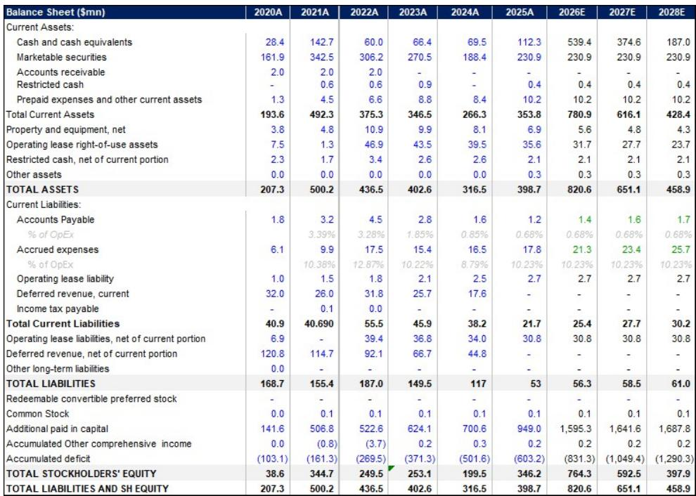
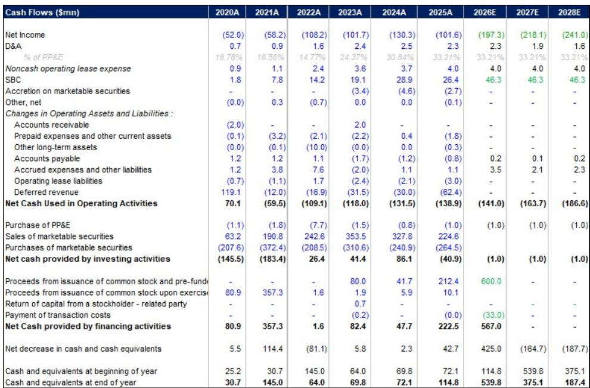
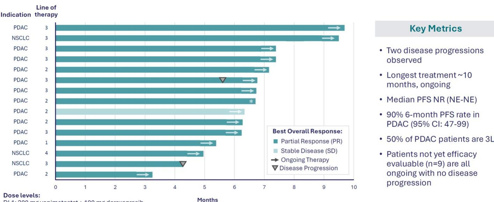

# JPM：Tango组合疗法，92%客观缓解率突破胰腺癌治疗

胰腺导管腺癌（PDAC）长期以来是实体瘤中最难攻克的适应症之一。二线治疗的中位总生存期徘徊在6个月左右，客观缓解率仅10%-15%。JPM最新覆盖报告指出，这一格局正在被一种“PRMT5抑制剂+RAS抑制剂”的组合疗法打破。

Tango Therapeutics的vopimetostat联合Revolution Medicines的daraxonrasib，在2L+ PDAC患者中取得了92%的客观缓解率和90%的6个月无进展生存率。作为参照，daraxonrasib单药在同类患者中的ORR为30%-35%，已被视为里程碑式突破。组合数据将疗效天花板再次大幅抬高。

报告认为，这一组合之所以关键，不仅在于数字本身，更在于它指向了一个可规模化的治疗逻辑：约22%的美国PDAC患者存在MTAP缺失，而vopimetostat正是针对这一生物标志物设计的MTA协同PRMT5抑制剂。它能在肿瘤细胞中高浓度MTA环境下选择性结合PRMT5，在健康细胞中几乎无活性，从而获得足够宽的治疗窗口来支持联合用药。

## 1. Tango正在用“非整理版合作”对冲竞争不确定性

组合疗法的领先地位并不稳固。Revolution Medicines同时与百时美施贵宝合作，后者也在开发自己的PRMT5抑制剂navlimetostat。这意味着Tango的vopimetostat虽然目前数据领先，但未来可能面临来自同一RAS抑制剂平台的竞争不确定性。

Tango的应对策略是分散合作。它近期宣布与ERAS（Revolution Medicines的直接竞争对手）达成合作，将vopimetostat与ERAS-0015联用。JPM认为，这种“不把所有鸡蛋放在一个篮子里”的做法，使Tango在RAS抑制剂组合格局尚未定型时，保留了多条战线上的领先机会。

> **KC评论：** 组合疗法领域的竞争，核心不是单一药物的优劣，而是谁能最快在关键适应症上完成确证性试验。Tango计划在2026年下半年启动1L PDAC的3期试验，时间窗口非常紧。如果竞争对手先读出数据，Tango的先发优势可能被压缩。

## 2. 管线精简后，TNG456成为被低估的“看涨期权”

Tango今年初做出了一个关键战略决定：放弃PRMT5以外的所有管线，包括HBS1L抑制剂TNG961和CoREST抑制剂TNG260，将全部资源集中在vopimetostat和TNG456上。

TNG456是Tango的脑渗透性PRMT5抑制剂，目前处于1/2期临床，针对胶质母细胞瘤。约45%的GBM患者存在MTAP缺失，而这一适应症目前几乎没有有效的靶向治疗选择。单药概念验证数据预计今年读出。如果数据积极，Tango将启动第二部分研究：TNG456联合礼来的CDK4/6抑制剂abemaciclib。

JPM在估值模型中仅给TNG456贡献了每股0.4美元的价值，远低于vopimetostat在PDAC中的39美元。报告认为，市场目前尚未对这一资产充分定价——如果单药数据验证了其活性，TNG456可能打开一个全新的组合治疗方向。

## 3. 估值依赖一个关键假设：vopimetostat能否在1L PDAC复制2L的成功

基于DCF-SOTP模型。其中vopimetostat在1L PDAC的峰值销售额假设为54亿美元，在2L NSCLC为约6亿美元。这一估值隐含的前提是：组合疗法能从2L推进到1L，并且疗效优势在更大样本中得以维持。

不确定性同样清晰。竞争方面，BMY的navlimetostat同样与Revolution Medicines合作，可能在同一适应症上形成直接竞争。资金方面，Tango目前仍处于亏损阶段，2026年预计调整后每股亏损1.30美元，运营现金流为负1.41亿美元。公司需要在现金耗尽前完成关键数据读出或达成新的合作。

JPM也指出，Tango目前有11个公司观点、1个公司观点、0个公司观点，市场共识已较为集中。这意味着后续报价的边际变化，将高度依赖临床数据的实际读出质量，而非预期的进一步上调。

For informational purposes only. Portions may be generated,translated,summarized,or edited with AI assistance based on source materials and may contain omissions or errors. Please verify independently. This is not investment,legal,tax,accounting,or other professional advice.

