# Technology – Electronic Components Industry data

Technology – Electronic Components
Akinori Kanemoto AC
+813-6736-8628
akinori.kanemoto@JPM.com
JPM Securities Japan Co., Ltd.

Technology – Consumer/Industrial/Precision
Junya Ayada
+813-6736-8631
junya.ayada@JPM.com
JPM Securities Japan Co., Ltd.

See the end pages of this presentation for analyst certification and important disclosures, including non-US analyst disclosures.

## End demand assumptions

<table><tr><td>FY(mn units)</td></tr><tr><td>End demand volume (shipment)</td></tr><tr><td>Global smartphone shipment</td></tr><tr><td>yoy % chg.</td></tr><tr><td>qoq % chg.</td></tr><tr><td>Apple</td></tr><tr><td>yoy % chg.</td></tr><tr><td>qoq % chg.</td></tr><tr><td>Samsung</td></tr><tr><td>yoy % chg.</td></tr><tr><td>qoq % chg.</td></tr><tr><td>Others</td></tr><tr><td>yoy % chg.</td></tr><tr><td>qoq % chg.</td></tr><tr><td>Global PC shipment</td></tr><tr><td>yoy % chg.</td></tr><tr><td>qoq % chg.</td></tr><tr><td>Global Notebook PC (Including Chrome)</td></tr><tr><td>yoy % chg.</td></tr><tr><td>qoq % chg.</td></tr><tr><td>Global Desktop PC</td></tr><tr><td>yoy % chg.</td></tr><tr><td>qoq % chg.</td></tr><tr><td>Global Server shipment</td></tr><tr><td>yoy % chg.</td></tr><tr><td>qoq % chg.</td></tr><tr><td>General Server</td></tr><tr><td>yoy % chg.</td></tr><tr><td>qoq % chg.</td></tr><tr><td>AI server</td></tr><tr><td>yoy % chg.</td></tr><tr><td>qoq % chg.</td></tr><tr><td>IHS-Global Auto Production</td></tr><tr><td>yoy % chg.</td></tr><tr><td>qoq % chg.</td></tr><tr><td>Global Vehicle Sales</td></tr><tr><td>yoy % chg.</td></tr><tr><td>qoq % chg.</td></tr><tr><td>ICE</td></tr><tr><td>yoy % chg.</td></tr><tr><td>qoq % chg.</td></tr><tr><td>xEV</td></tr><tr><td>yoy % chg.</td></tr><tr><td>qoq % chg.</td></tr><tr><td>HEV</td></tr><tr><td>yoy % chg.</td></tr><tr><td>qoq % chg.</td></tr><tr><td>PHEV</td></tr><tr><td>yoy % chg.</td></tr><tr><td>qoq % chg.</td></tr><tr><td>BEV</td></tr><tr><td>yoy % chg.</td></tr><tr><td>qoq % chg.</td></tr><tr><td>FCV</td></tr><tr><td>yoy % chg.</td></tr><tr><td>qoq % chg.</td></tr></table>

<table><tr><td>CY2020</td><td>CY2021</td><td>CY2022</td><td>CY2023</td><td>CY2024</td><td>CY2025</td><td>CY2026E</td><td>CY2027E</td></tr><tr><td>1,264.74</td><td>1,351.40</td><td>1,193.43</td><td>1,141.86</td><td>1,223.18</td><td>1,245.45</td><td>1,104.26</td><td>1,075.13</td></tr><tr><td>-</td><td>6.85%</td><td>-11.69%</td><td>-4.32%</td><td>7.12%</td><td>1.82%</td><td>-11.34%</td><td>-2.64%</td></tr><tr><td>-</td><td>-</td><td>-</td><td>-</td><td>-</td><td>-</td><td>-</td><td>-</td></tr><tr><td>207.15</td><td>230.06</td><td>232.16</td><td>229.14</td><td>225.85</td><td>240.64</td><td>238.55</td><td>252.50</td></tr><tr><td>-</td><td>11.06%</td><td>0.91%</td><td>-1.30%</td><td>-1.44%</td><td>6.55%</td><td>-0.87%</td><td>5.85%</td></tr><tr><td>-</td><td>-</td><td>-</td><td>-</td><td>-</td><td>-</td><td>-</td><td>-</td></tr><tr><td>255.52</td><td>274.50</td><td>257.95</td><td>225.46</td><td>222.91</td><td>239.13</td><td>230.93</td><td>228.50</td></tr><tr><td>-</td><td>7.43%</td><td>-6.03%</td><td>-12.59%</td><td>-1.13%</td><td>7.28%</td><td>-3.43%</td><td>-1.05%</td></tr><tr><td>-</td><td>-</td><td>-</td><td>-</td><td>-</td><td>-</td><td>-</td><td>-</td></tr><tr><td>802.08</td><td>846.73</td><td>703.31</td><td>687.27</td><td>774.44</td><td>765.62</td><td>634.79</td><td>594.08</td></tr><tr><td>-</td><td>5.57%</td><td>-16.94%</td><td>-2.28%</td><td>12.68%</td><td>-1.14%</td><td>-17.09%</td><td>-6.41%</td></tr><tr><td>-</td><td>-</td><td>-</td><td>-</td><td>-</td><td>-</td><td>-</td><td>-</td></tr><tr><td>308.17</td><td>341.73</td><td>284.20</td><td>242.28</td><td>247.65</td><td>268.63</td><td>245.71</td><td>249.53</td></tr><tr><td>-</td><td>10.89%</td><td>-16.83%</td><td>-14.75%</td><td>2.21%</td><td>8.47%</td><td>-8.53%</td><td>1.55%</td></tr><tr><td>-</td><td>-</td><td>-</td><td>-</td><td>-</td><td>-</td><td>-</td><td>-</td></tr><tr><td>228.33</td><td>256.38</td><td>208.12</td><td>179.83</td><td>186.54</td><td>201.52</td><td>183.79</td><td>186.35</td></tr><tr><td>-</td><td>12.29%</td><td>-18.82%</td><td>-13.59%</td><td>3.73%</td><td>8.03%</td><td>-8.80%</td><td>1.39%</td></tr><tr><td>-</td><td>-</td><td>-</td><td>-</td><td>-</td><td>-</td><td>-</td><td>-</td></tr><tr><td>79.84</td><td>85.34</td><td>76.08</td><td>62.45</td><td>61.11</td><td>67.11</td><td>61.93</td><td>63.18</td></tr><tr><td>-</td><td>6.89%</td><td>-10.85%</td><td>-17.91%</td><td>-2.15%</td><td>9.82%</td><td>-7.72%</td><td>2.03%</td></tr><tr><td>-</td><td>-</td><td>-</td><td>-</td><td>-</td><td>-</td><td>-</td><td>-</td></tr><tr><td>12.67</td><td>12.92</td><td>13.83</td><td>11.35</td><td>12.09</td><td>12.12</td><td>13.88</td><td>15.03</td></tr><tr><td>-</td><td>1.94%</td><td>7.04%</td><td>-17.90%</td><td>6.46%</td><td>0.25%</td><td>14.57%</td><td>8.27%</td></tr><tr><td>-</td><td>-</td><td>-</td><td>-</td><td>-</td><td>-</td><td>-</td><td>-</td></tr><tr><td>12.67</td><td>12.92</td><td>13.43</td><td>10.78</td><td>11.02</td><td>10.30</td><td>11.68</td><td>12.44</td></tr><tr><td>-</td><td>1.94%</td><td>3.94%</td><td>-19.75%</td><td>2.27%</td><td>-6.49%</td><td>13.39%</td><td>6.51%</td></tr><tr><td>-</td><td>-</td><td>-</td><td>-</td><td>-</td><td>-</td><td>-</td><td>-</td></tr><tr><td>-</td><td>-</td><td>0.40</td><td>0.58</td><td>1.07</td><td>1.81</td><td>2.20</td><td>2.58</td></tr><tr><td>-</td><td>-</td><td>-</td><td>44.08%</td><td>84.66%</td><td>69.87%</td><td>21.28%</td><td>17.63%</td></tr><tr><td>-</td><td>-</td><td>-</td><td>-</td><td>-</td><td>-</td><td>-</td><td>-</td></tr><tr><td>74.59</td><td>77.19</td><td>82.34</td><td>90.49</td><td>89.59</td><td>93.10</td><td>90.88</td><td>91.58</td></tr><tr><td>-</td><td>3.49%</td><td>6.66%</td><td>9.90%</td><td>-0.99%</td><td>3.92%</td><td>-2.38%</td><td>0.77%</td></tr><tr><td>-</td><td>-</td><td>-</td><td>-</td><td>-</td><td>-</td><td>-</td><td>-</td></tr><tr><td>77.18</td><td>80.27</td><td>78.98</td><td>86.70</td><td>88.69</td><td>91.74</td><td>87.69</td><td>88.55</td></tr><tr><td>-</td><td>3.99%</td><td>-1.60%</td><td>9.76%</td><td>2.30%</td><td>3.44%</td><td>-4.42%</td><td>0.99%</td></tr><tr><td>-</td><td>-</td><td>-</td><td>-</td><td>-</td><td>-</td><td>-</td><td>-</td></tr><tr><td>71.52</td><td>68.12</td><td>62.17</td><td>64.15</td><td>60.90</td><td>58.04</td><td>52.93</td><td>51.29</td></tr><tr><td>-</td><td>-4.77%</td><td>-8.73%</td><td>3.20%</td><td>-5.07%</td><td>-4.70%</td><td>-8.80%</td><td>-3.10%</td></tr><tr><td>-</td><td>-</td><td>-</td><td>-</td><td>-</td><td>-</td><td>-</td><td>-</td></tr><tr><td>5.66</td><td>12.15</td><td>16.82</td><td>22.54</td><td>27.79</td><td>33.70</td><td>34.76</td><td>37.26</td></tr><tr><td>-</td><td>114.69%</td><td>38.42%</td><td>34.04%</td><td>23.27%</td><td>21.28%</td><td>3.13%</td><td>7.21%</td></tr><tr><td>-</td><td>-</td><td>-</td><td>-</td><td>-</td><td>-</td><td>-</td><td>-</td></tr><tr><td>2.72</td><td>5.71</td><td>6.22</td><td>8.16</td><td>9.84</td><td>11.07</td><td>12.39</td><td>13.92</td></tr><tr><td>-</td><td>110.01%</td><td>9.00%</td><td>31.17%</td><td>20.52%</td><td>12.57%</td><td>11.92%</td><td>12.33%</td></tr><tr><td>-</td><td>-</td><td>-</td><td>-</td><td>-</td><td>-</td><td>-</td><td>-</td></tr><tr><td>0.89</td><td>1.82</td><td>2.74</td><td>4.08</td><td>6.47</td><td>7.61</td><td>6.95</td><td>7.36</td></tr><tr><td>-</td><td>104.61%</td><td>51.14%</td><td>48.70%</td><td>58.63%</td><td>17.48%</td><td>-8.62%</td><td>5.91%</td></tr><tr><td>-</td><td>-</td><td>-</td><td>-</td><td>-</td><td>-</td><td>-</td><td>-</td></tr><tr><td>2.04</td><td>4.61</td><td>7.83</td><td>10.29</td><td>11.47</td><td>15.01</td><td>15.40</td><td>15.96</td></tr><tr><td>-</td><td>125.40%</td><td>69.98%</td><td>31.32%</td><td>11.48%</td><td>30.89%</td><td>2.58%</td><td>3.66%</td></tr><tr><td>-</td><td>-</td><td>-</td><td>-</td><td>-</td><td>-</td><td>-</td><td>-</td></tr><tr><td>0.01</td><td>0.02</td><td>0.02</td><td>0.01</td><td>0.01</td><td>0.01</td><td>0.01</td><td>0.02</td></tr><tr><td>-</td><td>86.31%</td><td>-0.36%</td><td>-40.88%</td><td>-36.62%</td><td>41.82%</td><td>35.00%</td><td>40.00%</td></tr></table>

<table><tr><td colspan="4">CY2025</td><td colspan="4">CY2026</td></tr><tr><td></td><td>1Q</td><td>2Q</td><td>3Q</td><td>4Q</td><td>1QE</td><td>2QE</td><td>3QE</td></tr><tr><td></td><td></td><td></td><td></td><td></td><td></td><td></td><td></td></tr><tr><td>296.94</td><td>288.92</td><td>320.06</td><td>339.53</td><td>292.13</td><td>262.70</td><td>272.45</td><td>276.97</td></tr><tr><td>0.24%</td><td>-0.01%</td><td>3.26%</td><td>3.49%</td><td>-1.62%</td><td>-9.07%</td><td>-14.87%</td><td>-18.43%</td></tr><tr><td>-9.49%</td><td>-2.70%</td><td>10.78%</td><td>6.09%</td><td>-13.96%</td><td>-10.08%</td><td>3.71%</td><td>1.66%</td></tr><tr><td>55.01</td><td>44.79</td><td>56.50</td><td>84.33</td><td>60.41</td><td>49.69</td><td>56.79</td><td>71.66</td></tr><tr><td>12.95%</td><td>-1.77%</td><td>3.76%</td><td>9.39%</td><td>9.81%</td><td>10.93%</td><td>0.51%</td><td>-15.02%</td></tr><tr><td>-28.64%</td><td>-18.58%</td><td>26.15%</td><td>49.24%</td><td>-28.36%</td><td>-17.75%</td><td>14.29%</td><td>26.18%</td></tr><tr><td>60.55</td><td>57.50</td><td>60.64</td><td>60.45</td><td>59.00</td><td>57.37</td><td>59.10</td><td>55.46</td></tr><tr><td>0.95%</td><td>7.40%</td><td>5.54%</td><td>16.38%</td><td>-2.55%</td><td>-0.22%</td><td>-2.55%</td><td>-8.25%</td></tr><tr><td>16.57%</td><td>-5.03%</td><td>5.46%</td><td>-0.32%</td><td>-2.39%</td><td>-2.76%</td><td>3.00%</td><td>-6.15%</td></tr><tr><td>181.54</td><td>186.83</td><td>202.62</td><td>194.17</td><td>172.91</td><td>155.70</td><td>156.42</td><td>149.74</td></tr><tr><td>-3.48%</td><td>-1.56%</td><td>2.46%</td><td>-2.25%</td><td>-4.75%</td><td>-16.66%</td><td>-22.80%</td><td>-22.88%</td></tr><tr><td>-8.61%</td><td>2.92%</td><td>8.45%</td><td>-4.17%</td><td>-10.95%</td><td>-9.95%</td><td>0.46%</td><td>-4.27%</td></tr><tr><td>60.32</td><td>65.94</td><td>72.46</td><td>69.91</td><td>65.68</td><td>59.50</td><td>60.00</td><td>60.53</td></tr><tr><td>6.58%</td><td>8.05%</td><td>12.15%</td><td>6.88%</td><td>8.89%</td><td>-9.77%</td><td>-17.19%</td><td>-13.42%</td></tr><tr><td>-7.78%</td><td>9.33%</td><td>9.88%</td><td>-3.52%</td><td>-6.05%</td><td>-9.41%</td><td>0.85%</td><td>0.88%</td></tr><tr><td>44.96</td><td>49.60</td><td>54.64</td><td>52.32</td><td>49.16</td><td>44.39</td><td>44.92</td><td>45.32</td></tr><tr><td>7.14%</td><td>7.72%</td><td>11.19%</td><td>5.95%</td><td>9.33%</td><td>-10.50%</td><td>-17.78%</td><td>-13.39%</td></tr><tr><td>-8.97%</td><td>10.32%</td><td>10.16%</td><td>-4.23%</td><td>-6.06%</td><td>-9.69%</td><td>1.19%</td><td>0.88%</td></tr><tr><td>15.36</td><td>16.34</td><td>17.82</td><td>17.59</td><td>16.52</td><td>15.11</td><td>15.08</td><td>15.21</td></tr><tr><td>4.96%</td><td>9.07%</td><td>15.19%</td><td>9.75%</td><td>7.59%</td><td>-7.55%</td><td>-15.38%</td><td>-13.49%</td></tr><tr><td>-4.14%</td><td>6.40%</td><td>9.06%</td><td>-1.33%</td><td>-6.04%</td><td>-8.57%</td><td>-0.17%</td><td>0.87%</td></tr><tr><td>2.94</td><td>2.94</td><td>2.86</td><td>3.38</td><td>3.26</td><td>3.40</td><td>3.44</td><td>3.78</td></tr><tr><td>2.94%</td><td>-1.53%</td><td>-5.62%</td><td>5.05%</td><td>11.13%</td><td>15.63%</td><td>20.17%</td><td>11.88%</td></tr><tr><td>-8.68%</td><td>0.15%</td><td>-2.68%</td><td>18.03%</td><td>-3.39%</td><td>4.20%</td><td>1.14%</td><td>9.88%</td></tr><tr><td></td><td></td><td></td><td></td><td></td><td></td><td></td><td></td></tr><tr><td></td><td></td><td></td><td></td><td></td><td></td><td></td><td></td></tr><tr><td></td><td></td><td></td><td></td><td></td><td></td><td></td><td></td></tr><tr><td></td><td></td><td></td><td></td><td></td><td></td><td></td><td></td></tr><tr><td></td><td></td><td></td><td></td><td></td><td></td><td></td><td></td></tr><tr><td></td><td></td><td></td><td></td><td></td><td></td><td></td><td></td></tr><tr><td></td><td></td><td></td><td></td><td></td><td></td><td></td><td></td></tr><tr><td></td><td></td><td></td><td></td><td></td><td></td><td></td><td></td></tr><tr><td></td><td></td><td></td><td></td><td></td><td></td><td></td><td></td></tr><tr><td></td><td></td><td></td><td></td><td></td><td></td><td></td><td>-</td></tr><tr><td></td><td></td><td></td><td></td><td></td><td></td><td></td><td></td></tr><tr><td></td><td></td><td></td><td></td><td></td><td></td><td></td><td></td></tr><tr><td></td><td></td><td></td><td></td><td></td><td></td><td></td><td></td></tr><tr><td></td><td></td><td></td><td></td><td></td><td></td><td></td><td></td></tr><tr><td></td><td></td><td></td><td></td><td></td><td></td><td></td><td></td></tr><tr><td></td><td></td><td></td><td></td><td></td><td></td><td></td><td></td></tr><tr><td></td><td></td><td></td><td></td><td></td><td></td><td></td><td></td></tr><tr><td></td><td></td><td></td><td></td><td></td><td></td><td></td><td></td></tr><tr><td></td><td></td><td></td><td></td><td></td><td></td><td></td><td rowspan="2"></td></tr><tr><td></td><td></td><td></td><td></td><td></td><td></td><td></td></tr></table>

## Electronic components Sales index by application

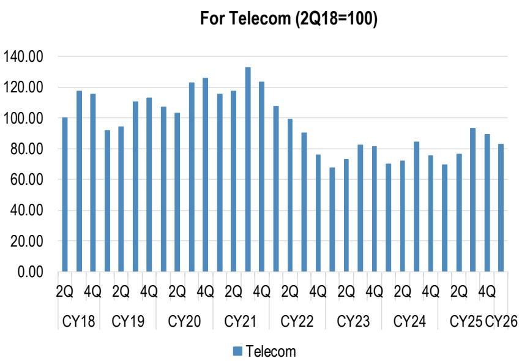

For PC & Servers (including FCBGA, HDD related, 2Q18=100)  
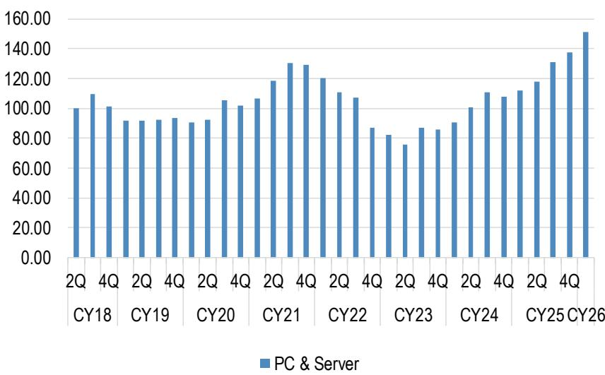

For Industrial Applications (2Q18=100)  
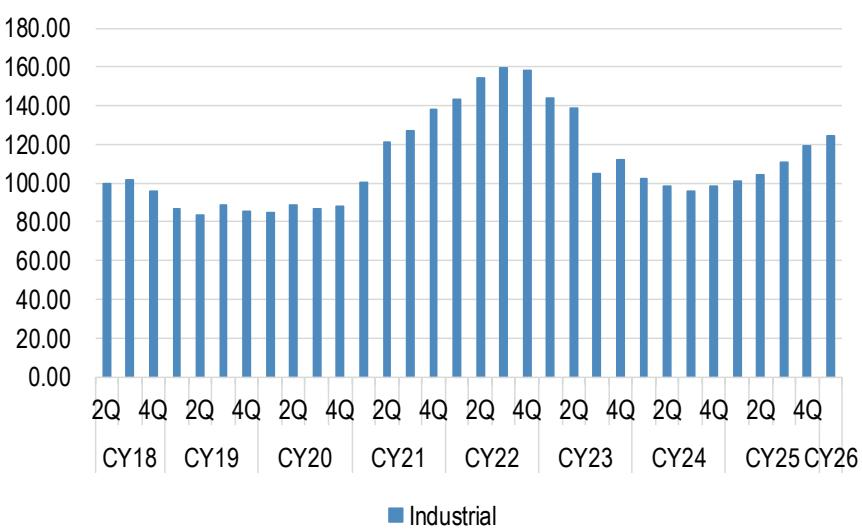

For Automotive (2Q18=100)  
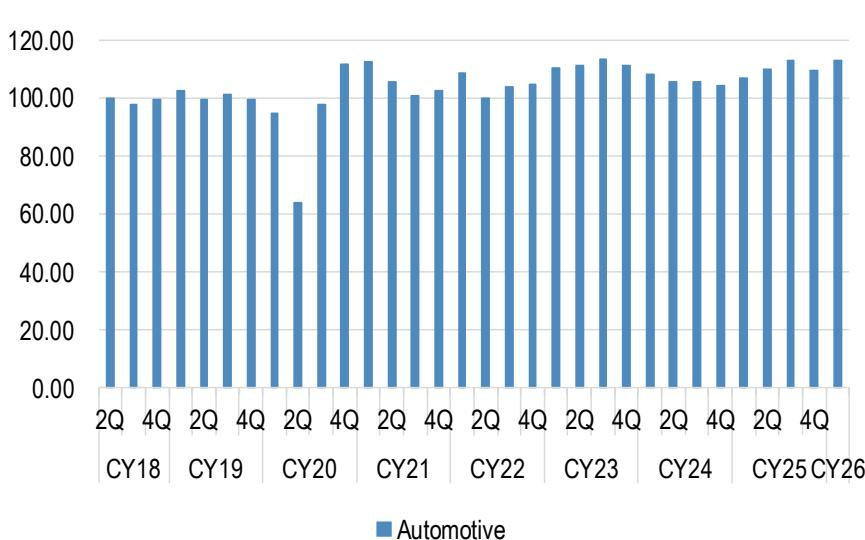

## Quarterly automotive component revenues and \$ contents per car, comparison with theoretical contents growth

Automotive component revenues for 14 Japanese component makers  
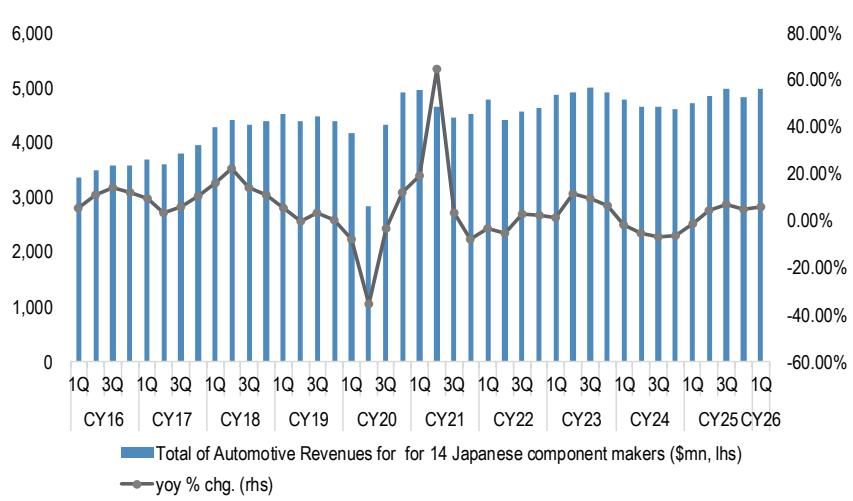

\$ contents per car for 14 Japanese component makers  
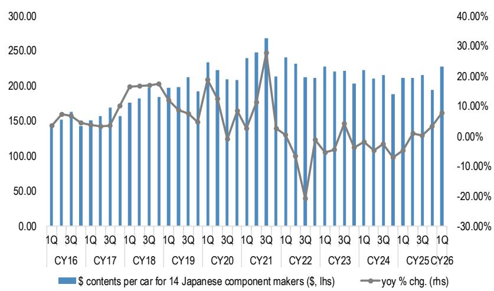

Comparison between \$ contents per car for 14 Japanese component makers and theoretical \$ contents trend  
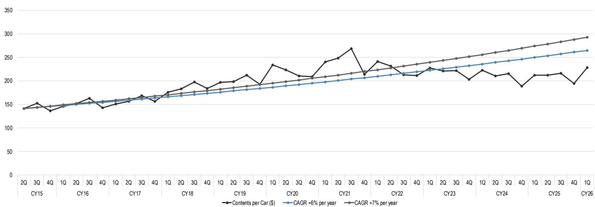  
Source: Company data from Ibiden, Niterra, Mabuchi Motor, Murata Mfg., TDK, Taiyo Yuden, Nichicon, Nippon Chemi-con, Nippon Denpa Kogyo, Alps Alpine, Hirose Electric, JAE, Yokowo, Rohm, JPM

## Comparison of automotive semiconductors and electronic components

Automotive SEMI revenues for major analog/discrete/MCU makers  
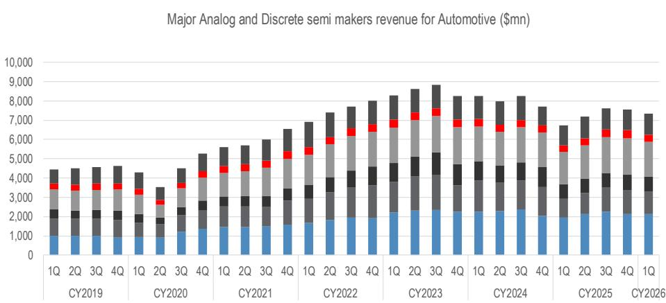  
■ Renesas (Automotive) ■ ROHM (Automotive) ■ NXP (Automotive) ■ ON (Automotive) ■ STM (ADG) ■ IFX(ATV)

Note: For semiconductors, it is the total of IFX, STM, ON Semiconductor, NXP, Rohm, and Renesas Electronics; for Japanese electronic components, it is the total of Ibiden, Niterra, Mabuchi Motor, Murata Mfg., TDK, Taiyo Yuden, Nichicon, Nippon Chemicon, Nippon Denpa Kogyo, Alps Alpine, Hirose Electric, JAE, and Yokowo.

## \$ contents comparison for major analog/discrete/MCU makers and 14 Japanese component makers

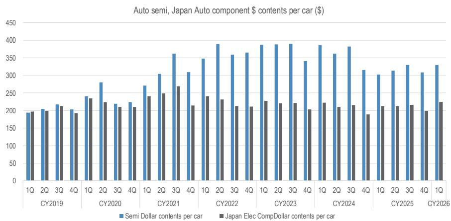

YoY % change of \$ contents for major analog/discrete/MCU makers and 14 Japanese component makers  
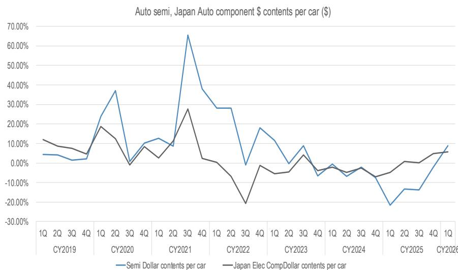

## FA makers sales/orders vs. industrial component sales

FA makers sales and industrial component sales index (2Q18=100)  
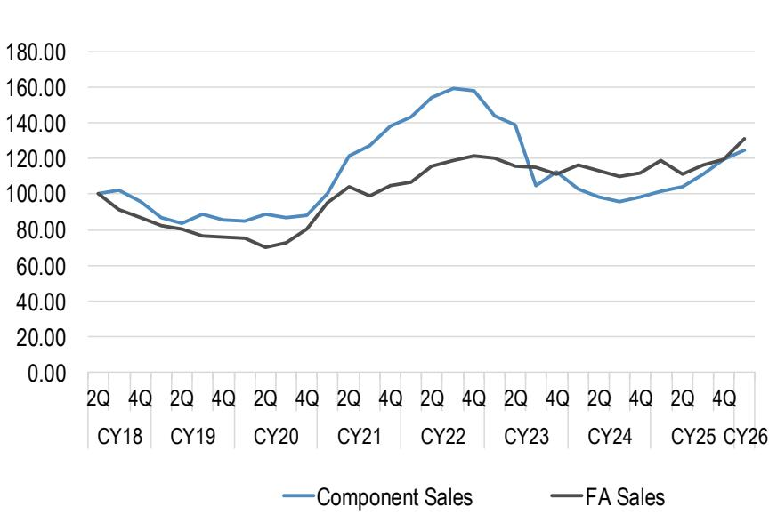  
FA makers orders and industrial component sales index (2Q18=100)

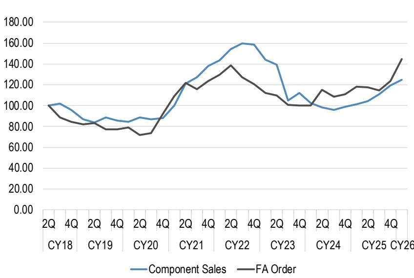

## BB ratio and order index for Murata, Taiyo Yuden, Hirose, Rohm

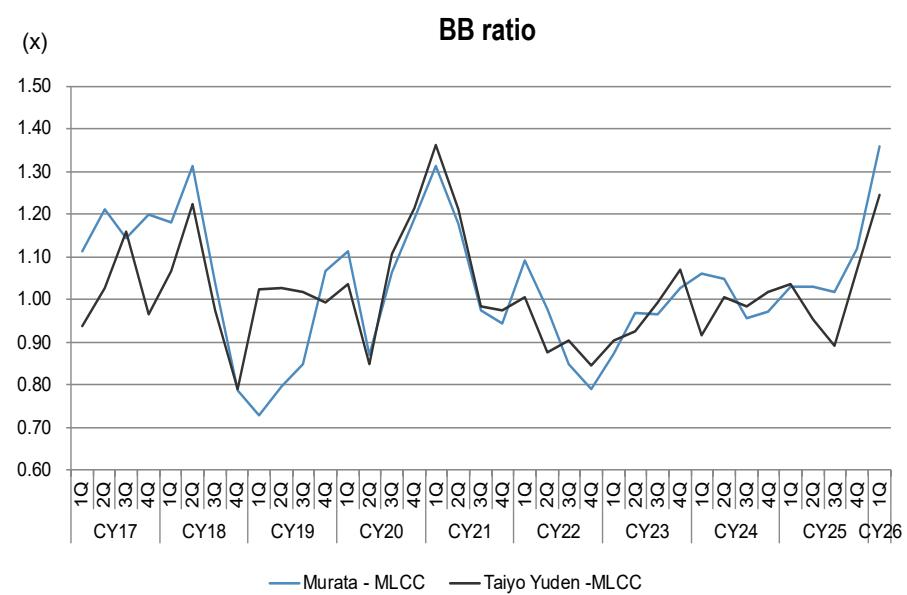

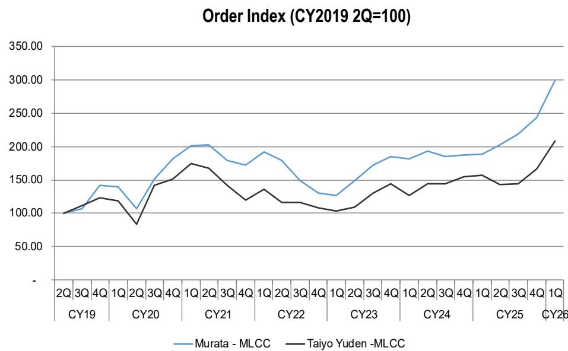

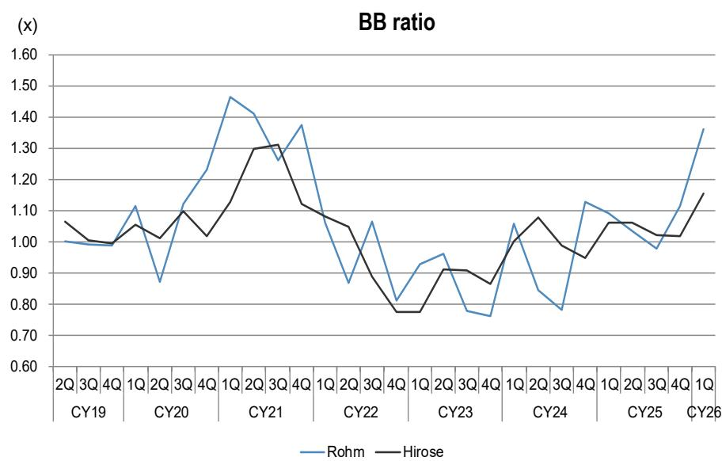  
Source: Company data, JPM.

Order Index (CY2019 2Q=100)  
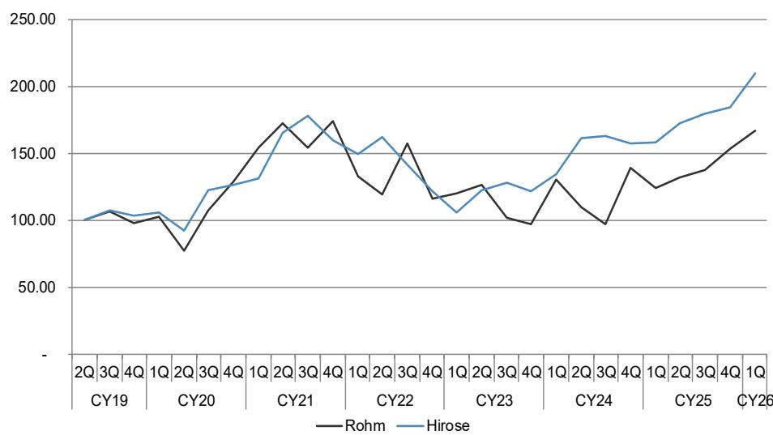

## Inventory and DIO for Japanese components sector

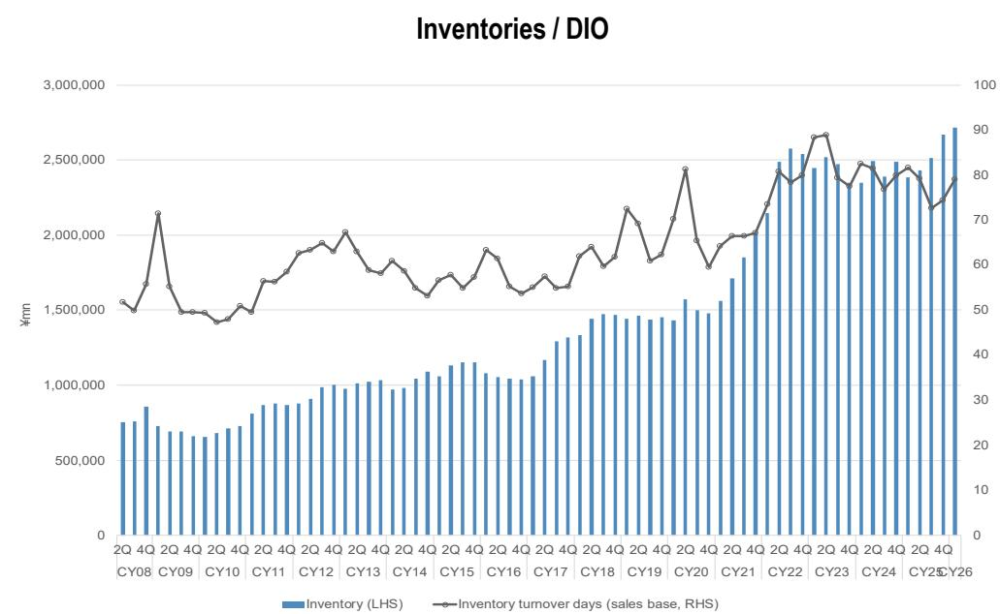

Inventories and sales yoy % chg.  
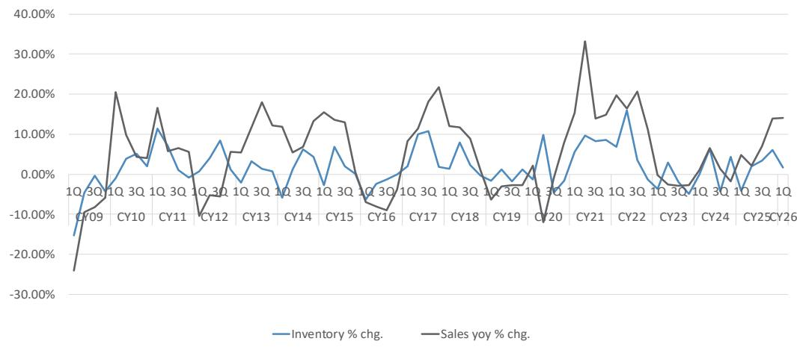

Inventories yoy % chg.  
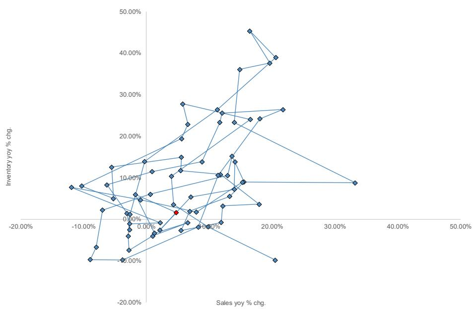  
Note: Inventory and Sales include Murata Mfg., Taiyo Yuden, TDK, Kyocera, Rohm, Nichicon, Nippon Chemi-Con, MinebeaMitsumi, Ibiden, Hirose Electric, JAE, Alps Alpine, Niterra, Wacom, NISSHA. Source: Bloomberg Finance L.P., JEITA, JPM
