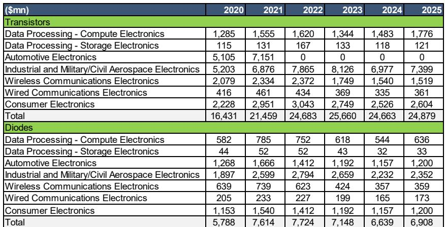
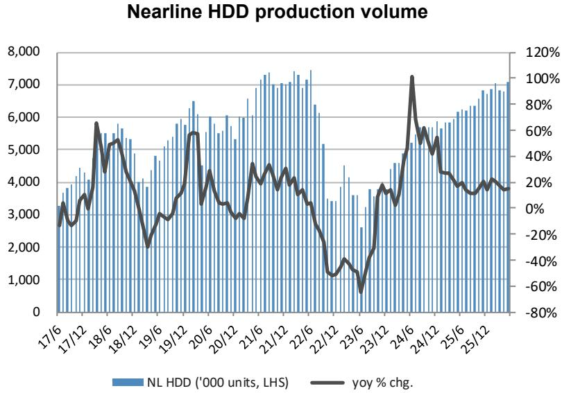
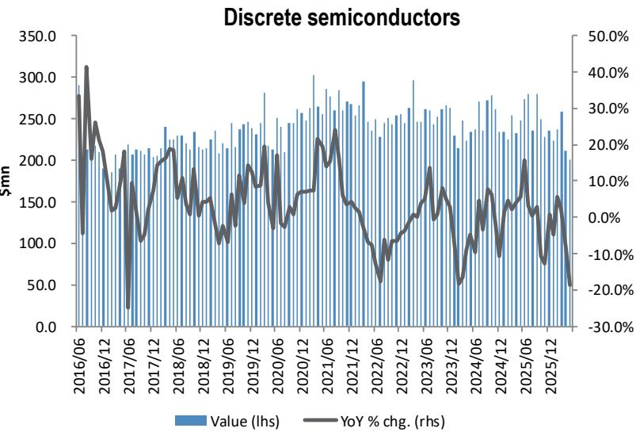

# The Electronic Components Cycle Is Entering a Divergence Phase: Smartphones and PCs Will Decline While Automotive and AI Servers Sustain Demand

The global electronic components industry is approaching a critical inflection point, and the pattern taking shape is not a uniform recovery but a structural divergence across end markets. According to a detailed demand forecast from a major research institution, global smartphone shipments are projected to decline by 11.34% year-over-year in calendar 2026, reaching 1.104 billion units, and contract further by 2.64% in 2027 to 1.075 billion units. Meanwhile, global PC shipments are expected to fall by 8.53% in 2026, to 245.71 million units. These declines stand in stark contrast to the trajectory of AI server shipments, which are forecast to grow by 21.28% in 2026 and another 17.63% in 2027, and the xEV market, which is expected to expand by 3.13% and 7.21% over the same period. The era of across-the-board cyclical uplift is over. The next phase of the components cycle will reward companies that are positioned in structurally growing pockets of demand—automotive electrification, AI infrastructure, and industrial automation—while presenting challenges for those overly reliant on consumer electronics volumes.

The current moment matters because the data shows that the post-pandemic normalization phase is ending. Smartphone shipments peaked at 1.35 billion units in 2021 and have been in structural decline ever since, with the 2026 forecast representing a 22% drop from that peak. PC shipments tell a similar story, with 2021's 341.73 million units now a distant memory. The recovery in 2024 and early 2025 was largely a restocking event, not a demand renaissance. The real question for observers and corporate strategists is not whether the cycle will turn, but which end markets will provide genuine growth in a world where consumer electronics volumes are shrinking. The answer lies in the data that shows automotive and server demand are on fundamentally different trajectories.

## Smartphone and PC Volume Decline Is Structural, Not Cyclical, and Will Reshape Component Supplier Strategies

The forecast data makes a compelling case that the smartphone market has entered a structural contraction phase. After a brief 7.12% recovery in 2024, global smartphone shipments are expected to grow only 1.82% in 2025 before entering a two-year decline of 11.34% in 2026 and 2.64% in 2027. The composition of this decline is revealing. Apple's shipments are projected to remain relatively stable, declining only 0.87% in 2026 and then growing 5.85% in 2027, suggesting a premium-market resilience. Samsung is forecast to decline 3.43% in 2026 and 1.05% in 2027. The real contraction is in the "Others" category—non-Apple, non-Samsung brands—which are projected to fall by 17.09% in 2026 and 6.41% in 2027, from 774 million units to 594 million units over two years. This means the volume impact will be concentrated in the mid-range and budget segments, precisely where component suppliers face the most pricing pressure and the least differentiation.

For electronic component makers, this structural shift demands a reallocation of engineering resources and capital expenditure. Companies that have built capacity around high-volume, low-margin smartphone components will face utilization rate declines and margin compression. The implication is clear: suppliers must pivot their product roadmaps toward higher-value components for automotive and server applications, where content per device is higher and demand growth is positive. Those that fail to make this pivot risk being left with stranded assets and declining return on invested capital.

## AI Server and Automotive Electrification Provide the Only Sustained Volume Growth in the Components Landscape

The divergence between consumer electronics and industrial/automotive demand is stark when examining the server and automotive forecasts. AI server shipments are projected to grow from 1.07 million units in 2024 to 2.58 million units in 2027, a compound annual growth rate of approximately 34%. General server shipments, while more volatile, are also expected to grow from 11.02 million units in 2024 to 12.44 million units in 2027, with a notable 13.39% increase in 2026. This growth is not just about volume; it is about value. AI servers require significantly more electronic components per unit, including high-end capacitors, advanced printed circuit boards, thermal management solutions, and power management ICs. The content per server for Japanese component makers is substantially higher than for a smartphone or PC.

On the automotive side, the data reveals a more nuanced picture. Global vehicle sales are forecast to decline 4.42% in 2026, but this top-line figure masks a dramatic shift in powertrain mix. Internal combustion engine vehicle sales are projected to decline 8.80% in 2026 and 3.10% in 2027, while xEV sales—including hybrids, plug-in hybrids, and battery electric vehicles—are forecast to grow 3.13% in 2026 and 7.21% in 2027. Within the xEV category, battery electric vehicles are expected to grow 2.58% in 2026 and 3.66% in 2027, but the most interesting dynamic is in hybrids. HEVs are forecast to grow 11.92% in 2026 and 12.33% in 2027, while PHEVs are expected to decline 8.62% in 2026 before recovering 5.91% in 2027. This suggests that the transition to electrification is proceeding, but with a strong intermediate step through hybrids, which require a high number of electronic components per vehicle.

## The Automotive Components Market Is Experiencing a Content Growth Deceleration That Demands a New Analytical Framework

The most critical insight for those evaluating Japanese electronic component makers lies in the comparison between actual dollar content per car and theoretical content growth. The data shows that the dollar content per car for 14 major Japanese component makers has been growing, but the rate of growth has decelerated significantly. When comparing the actual content trend to the theoretical trend—which assumes that component content grows in line with the increasing electrification and sophistication of vehicles—a gap has emerged. This gap suggests that either the rate of component adoption per vehicle is slowing, or that pricing pressure from automakers is compressing the value that component suppliers can capture.

The implication is that the automotive components cycle is maturing. The easy gains from electrification—adding capacitors, inductors, connectors, and sensors to every new vehicle—are being offset by competitive dynamics and automaker cost-reduction programs. Component suppliers can no longer rely on volume growth alone to drive revenue; they must innovate to increase the value of their content per vehicle, or they must gain market share. The comparison with automotive semiconductor makers is instructive. The report shows that the year-over-year change in dollar content for major analog, discrete, and microcontroller makers has been more volatile but generally higher than for passive component makers. This suggests that semiconductor content is growing faster than passive component content, reflecting the increasing intelligence and connectivity of vehicles.

## Industrial Component Demand Is Correlated with Factory Automation Orders, Creating a Leading Indicator for the Cycle

The relationship between industrial component sales and factory automation (FA) orders provides a useful framework for anticipating turning points in the components cycle. The data shows that industrial component sales and FA orders have moved in close correlation since 2018, with FA orders typically leading component sales by one to two quarters. This leading indicator relationship means that observers can monitor FA order data from major automation companies to forecast demand for industrial capacitors, connectors, and sensors. The current trajectory suggests that industrial component demand is in a recovery phase, but the pace of recovery is moderate. The FA makers' orders index has been improving from the trough, but has not yet reached the levels seen in the 2021-2022 period.

For strategic decision-makers, this correlation has practical implications. If a company's industrial component sales are diverging from the FA order trend, it suggests either a loss of market share or a product mix issue. Conversely, if a company's sales are outperforming the FA trend, it may indicate successful new product introductions or share gains. The BB ratio—book-to-bill ratio—for major component makers such as Murata, Taiyo Yuden, Hirose, and Rohm provides an additional layer of insight. The report shows that the BB ratio has been fluctuating around parity, indicating that orders are roughly matching shipments. This is consistent with a market that is neither in a dramatic upturn nor a sharp downturn, but rather in a period of normalization following the post-pandemic boom and bust.

## A Decision Framework for Navigating the Diverging Components Cycle

For corporate strategists and research professionals, the data points to a clear decision framework with three dimensions: end-market exposure, product value migration, and inventory cycle positioning.

First, end-market exposure is the primary determinant of near-term revenue trajectory. Companies with more than 40% of revenue exposed to smartphones and PCs face headwinds from structural volume decline. Those with significant exposure to AI servers and automotive electrification have a more favorable demand backdrop. The key metric to track is not just revenue share by end market, but the growth rate of those end markets relative to a company's product portfolio. A company that supplies passive components to the smartphone market may see revenue decline even if it maintains market share, simply because the total addressable market is shrinking.

Second, product value migration is the key to margin performance. The data shows that dollar content per car is growing, but at a decelerating rate. This means that component suppliers must focus on products that command higher prices per unit—such as high-capacity multilayer ceramic capacitors for xEV inverters, or high-frequency components for 5G infrastructure—rather than on commodity products. The comparison with semiconductor content growth suggests that component suppliers should invest in products that combine passive and active functionality, or that address specific technical challenges such as thermal management in high-power applications.

Third, inventory cycle positioning is critical for timing. The report shows that inventory levels for Japanese component makers have been declining, and the year-over-year change in inventories has been negative, indicating a destocking phase. When destocking ends and restocking begins, it provides a temporary boost to orders and shipments. The timing of this transition depends on end-market demand. In the smartphone and PC markets, where demand is declining, restocking may be muted. In the automotive and server markets, where demand is growing, restocking could provide an additional tailwind. The strategic question is whether a company has the balance sheet flexibility to build inventory ahead of a restocking cycle, or whether it is constrained by working capital targets.

The most important conclusion from this analysis is that the electronic components cycle is no longer a single cycle. It is a collection of cycles that are moving in different directions based on structural demand trends. The companies that can align their product portfolios, manufacturing capacity, and inventory strategies with the end markets that are growing will be well-positioned. Those that treat all end markets as interchangeable and wait for a general recovery that may never come will face challenges.

*For informational purposes only. Portions may be generated, translated, summarized, or edited with AI assistance based on source materials and may contain omissions or errors. Please verify independently. This is not professional advice.*

For informational purposes only. Portions may be generated, translated, summarized, or edited with AI assistance based on source materials and may contain omissions or errors. Please verify independently. This is not professional advice.

